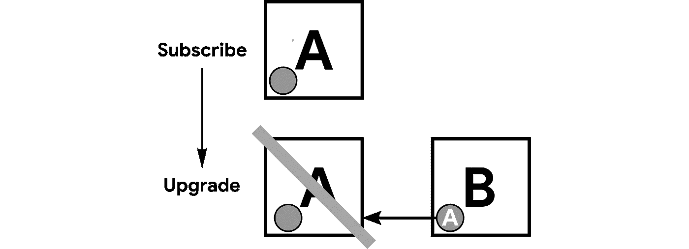

# 正确实现 linkedPurchaseToken 以防止重复订阅

> 原文：<https://medium.com/androiddevelopers/implementing-linkedpurchasetoken-correctly-to-prevent-duplicate-subscriptions-82dfbf7167da?source=collection_archive---------4----------------------->

你使用 Google Play 订阅吗？确保您的后端服务器正确地实现了它们。

订阅 REST APIs 是管理用户订阅的真实来源。[purchases . subscriptions API](https://developers.google.com/android-publisher/api-ref/purchases/subscriptions#resource)响应包含一个名为 **linkedPurchaseToken 的重要字段。**正确处理该字段对于确保正确的用户访问您的内容至关重要。


# 它是如何工作的？

正如在[订阅文档](https://developer.android.com/google/play/billing/billing_subscriptions#Allow-upgrade)中所概述的，每一个新的 Google Play 购买流程——初始购买、升级、降级和[重新注册](#eb81)——都会生成一个新的购买令牌。 **linkedPurchaseToken** 字段可以识别多个购买令牌何时属于同一个订阅。

***【更新，2021 年 3 月。*** *注意:随着 Google Play 计费中* [*重新订阅*](https://developer.android.com/google/play/billing/subscriptions#restore) *功能的推出，所有用户都可以使用“重新订阅”操作。linkedPurchaseToken 对于“升级”和“降级”流仍然很重要。*

*例如，用户购买订阅并收到购买令牌 a。由于购买令牌属于全新的订阅，因此不会在 API 响应中设置 **linkedPurchaseToken** 字段(灰色圆圈)。*

**

*如果用户升级他们的订阅，将生成新的购买令牌 B。由于升级将替换购买令牌 A 中的订阅，令牌 B 的 **linkedPurchaseToken** 字段(显示在灰色圆圈中)将被设置为指向令牌 A。请注意，它在时间上向后指向原始购买令牌。*

**

*购买令牌 B 将是唯一更新的令牌。购买令牌 A 不应用于授权用户访问您的内容。*

***注意:**在升级时，如果您查询 Google Play 计费服务器，购买令牌 A 和 B 都会显示它们处于活动状态。我们将在下一节的[中详细讨论这一点。](#14e4)*

*现在，让我们假设一个不同的用户执行以下操作:订阅、升级、降级。原始订阅将创建购买令牌 C，升级将创建购买令牌 D，降级将创建购买令牌 e。每个新令牌将向后链接到前一个令牌。*

**

*让我们向示例中添加第三个用户。这个用户一直在改变主意。在初次订阅后，用户连续三次取消并重新订阅(做一个[重签](#eb81))。初始订阅将创建购买令牌 F，重新订阅将创建 G、H 和 I。购买令牌 I 是最新的令牌。*

**

*最新的令牌 B、E 和 I 分别代表用户 1、2 和 3 有权获得并支付的订阅。只有这些最新的令牌对权利有效。然而，就 Google Play 而言，如果初始到期日期尚未过去，链中的所有令牌都是“有效的”。*

*换句话说，如果您在[订阅获取 API](https://developers.google.com/android-publisher/api-ref/purchases/subscriptions/get#response) 中查询任何令牌，包括上图中的 A、C、D、F、G 或 H，您将获得一个[订阅资源响应](https://developers.google.com/android-publisher/api-ref/purchases/subscriptions#resource)，表明订阅尚未过期且已收到付款，尽管您应该只授予最新令牌的权利。*

*乍一看，这似乎很奇怪:为什么原始令牌在升级后看起来仍然有效？简而言之，这种实现在向用户提供内容和服务时为开发者提供了更大的灵活性，并有助于 Google 保护用户隐私。然而，它确实需要您在后端服务器上做一些重要的簿记工作。*

# *处理 linkedPurchaseToken*

*每次验证订阅时，您的后端都应该检查是否设置了 **linkedPurchaseToken** 字段。如果是，则该字段中的值表示现在已被替换的前一个令牌。您应该立即将以前的令牌标记为无效，这样用户就无法使用它来访问您的内容。*

*因此，对于上面示例中的用户 1，当后端接收到初始购买的购买令牌 A，并且带有一个空的 **linkedPurchaseToken** 字段时，它会启用该令牌的授权。稍后，当后端在升级后接收到新的购买令牌 B 时，它检查 **linkedPurchaseToken** 字段，看到它被设置为 A，并禁用购买令牌 A 的权利。*

**

*通过这种方式，后端数据库始终保持最新，其中购买令牌对权利有效。在用户 3 的情况下，数据库的状态将演变如下:*

**

*用于检查 **linkedPurchaseToken** 的伪代码:*

*你可以在 [Classy Taxi](https://github.com/android/play-billing-samples/tree/master/ClassyTaxiAppKotlin) 的 Firebase 后端看到这样的例子，这是一个开源的端到端订阅应用程序。具体参见[purchase manager . ts](https://github.com/googlesamples/android-play-billing/blob/5415f5563d5aeaf3f0e7e4457f826de9bf12a590/ClassyTaxi/firebase/server/src/play-billing/PurchasesManager.ts#L163)中的**disableReplacedSubscription**方法。*

# *清理现有数据库*

*现在，您的后端将保持最新的新的、传入的购买令牌，您将检查每个新购买的 **linkedPurchaseToken** 字段，并且对应于被替换订阅的任何令牌将被正确禁用。厉害！*

*但是，如果您有一个现有的订阅数据库，它没有考虑到 **linkedPurchaseToken** 字段，该怎么办呢？您需要在现有数据库上运行一次性清理算法。*

*在许多情况下，清理数据库时最重要的事情是给定的令牌是否有权使用内容/服务。换句话说:可能没有必要为每个订阅重新创建升级/降级/重签购买历史，只需确定每个单独令牌的正确权利。对数据库进行一次性清理将使事情变得有条不紊，接下来，只需按照上一节所述处理新的订阅即可。*

*假设我们上面三个用户的购买令牌存储在一个数据库中。这些购买可能随着时间的推移而发生，并且可能以任何顺序出现。如果清理功能做得正确，令牌 B、E 和 I 应该最终被标记为对授权有效，并且所有其他令牌应该被禁用。*

*遍历数据库一次，检查每个元素。如果设置了 **linkedPurchaseToken** 字段，则禁用该字段中包含的令牌。对于下图，我们从上到下依次进行:*

**

```
*Element A: linkedPurchaseToken not set, move to next
Element D: linkedPurchaseToken == C, disable C
Element G: linkedPurchaseToken == F, disable F
Element E: linkedPurchaseToken == D, disable D
Element F: linkedPurchaseToken not set, move to next
Etc.*
```

*用于清理现有数据库的伪代码:*

*在运行这个一次性清理之后，所有旧的令牌都将被禁用，您的数据库将准备就绪。*

# *额外保险*

*为了进一步帮助防范可疑活动，使用 BillingFlowParams 设置应用程序中的 **accountId** 字段也是一个好主意。构建器的 [setAccountId](https://developer.android.com/reference/com/android/billingclient/api/BillingFlowParams.Builder#setAccountId(java.lang.String)) 方法。您应该将其设置为一个可查询的值，该值对于每个用户都是唯一的，但是会混淆任何用户数据，比如用户帐户名的单向安全散列。*

# *简单但重要*

*既然您已经理解了 **linkedPurchaseToken** 字段是如何工作的，那么请确保在您的后端正确处理它。每个订阅的应用程序都应该检查这个字段。正确跟踪授权对于确保正确的用户在正确的时间获得正确的授权至关重要。*

# *资源*

*   *谷歌[播放计费库](https://developer.android.com/google/play/billing/billing_library_overview)*
*   *订阅[升级和降级](https://developer.android.com/google/play/billing/billing_subscriptions#Allow-upgrade)*
*   *[订阅 API](https://developers.google.com/android-publisher/api-ref/purchases/subscriptions#resource)*
*   *端到端订阅示例应用程序*

*[***sign up***](#895f)*是指当用户订阅后，取消其订阅，然后在原订阅到期前重新订阅。尽管他们没有失去权利，新的订购将与以前的相同，但他们将经历另一个购买流程，因为他们承诺未来付款。他们将收到一个新的购买令牌，并将设置 linkedPurchaseToken 字段，就像升级或降级的情况一样。更新:请注意，这仅发生在应用程序内的辞职。如果用户从谷歌 Play 商店订阅中心重新订阅，将不会颁发新的购买令牌，也不会设置此字段，将使用原始令牌。**

> **这里找到的所有代码都是在* [*Apache 2.0 许可*](https://www.apache.org/licenses/LICENSE-2.0) *下授权的。这里没有任何内容是谷歌官方产品的一部分，仅供参考。**
> 
> *文章开头的令牌图像是从[这个 url](https://commons.wikimedia.org/wiki/File:French_revolutionary_shop_token_(FindID_530752).jpg) 复制的。归因:可移动古物计划/大英博物馆受托人。根据[知识共享](https://en.wikipedia.org/wiki/en:Creative_Commons) [署名-共享 2.0 通用](https://creativecommons.org/licenses/by-sa/2.0/deed.en)许可协议进行许可。*