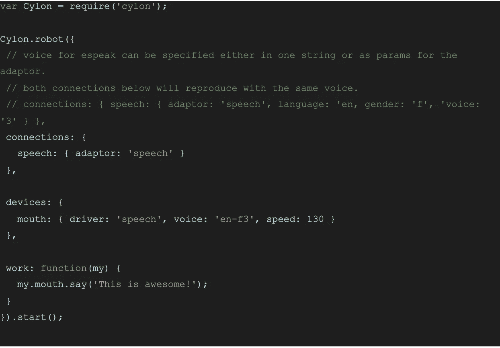
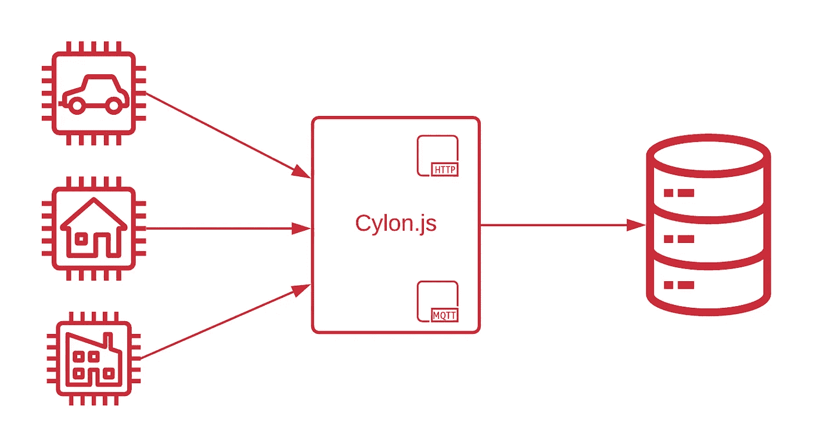
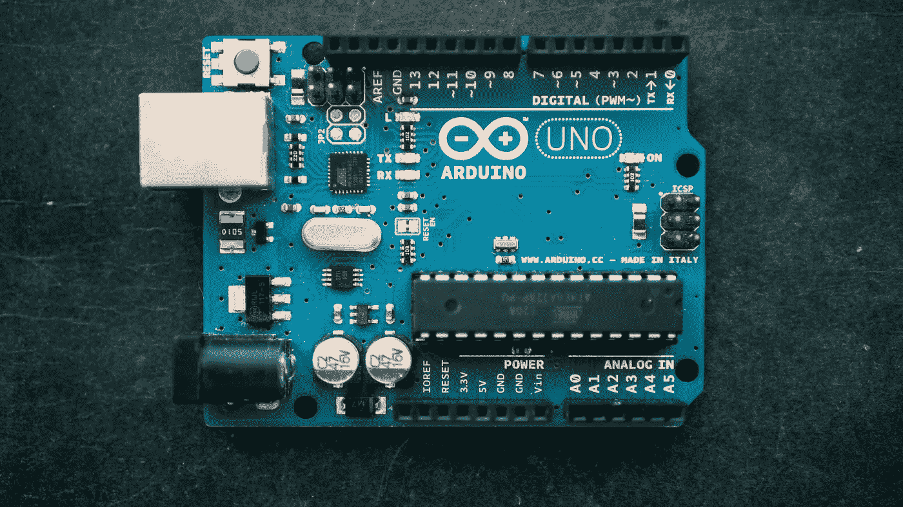

# 实施机器人——JS 您的潜力是无限的！

> 原文：<https://medium.com/globant/implementing-robotics-js-your-potential-is-endless-cff64691b95f?source=collection_archive---------0----------------------->

## 未来掌握在你的手中！

**什么是机器人？嗯，它是研究机器人的设计、建造、操作和应用的技术分支。好吧！那么这和 JavaScript 有什么关系呢？这与 web 应用程序有什么明显的联系？坚持住！我知道你一定很困惑，但是，让我告诉你——机器人现在也可以用 JavaScript 实现了！需要对 C、C++和 Go 等机器语言有详细的理解才能根据命令启动伺服电机的日子已经一去不复返了。**

不服气？让我向您展示使用 JavaScript 的机器人的真实交易！
来了 **Cylon.js🚀**

Credits — cylonjs.com

一个惊人的 Javascript 框架，支持 43 个不同的平台，GPIO，I2C 与 JavaScript 的容易

# 炒作够了——cylon . js 是做什么的？

一如既往——JavaScript 开发者——给你更多的力量。

Cylon.js 是一个 JavaScript 框架，具有很酷的集成特性来支持机器人平台，然而，使用 JavaScript 最隐藏的方面是与这些平台交互并桥接它们！

想象一个场景，其中多个机器人板想要相互通信以共享一些数据。

你现在能想到的唯一可能的解决方案是写一个桥接软件/固件来让它们通信。

不再有了！！让一个机器人用 Cylon.js 编程，并在设备中添加电路板，就大功告成了！

# **Woah！似乎很有趣。这是如何工作的？**

**我们开始吧！**

Cylon.js 可以利用本地硬件资源。为了证明我的观点，我们将使用本地安装的“espeak”软件语音合成器让你的计算机说话。

让我们先安装 **espeak**

对于 Linux
**sudo apt-get install espeak**

对于 OSX
brew 安装 espeak

安装强大的**赛昂. js** 现在
NPM 安装赛昂赛昂-演讲

*让我们准备好第一个 Cylon.js 代码*

用保存文件。js 扩展，并通过运行以下命令在终端/命令提示符下运行

**节点<文件名>。js**

# 令人兴奋的东西，不是吗？

# 你问在哪里可以使用它？让我们看看...

## **物联网**

> *“Gartner 称 2020 年将有 58 亿个企业和汽车物联网终端投入使用”*

不，不是因为 Gartner 公布了事实，而是我们都必须接受物联网将成为下一个强制性的东西，我们将见证设备使用自己的语言进行通信(我们称之为协议😉)

***“让您的 JavaScript 应用程序脱离浏览器，与设备对话。”***

使用 Cylon.js 你可以使用标准协议控制和读取多个设备，Cylon 还支持 Socket.io、MQTT 和 HTTP API 来发送和接收数据。所以连接多个设备，获取数据，推送到云端！

## 无限的机会

想象一下，如果你周围所有的手动电气/电子物体都开始用语音命令工作？！

是的，仅仅通过创建一个好的可实现的设计，然后用 Cylon.js 对其进行编码，这是可能实现的

实现可以从你的家开始，到你的日常通勤结束，你可以使用这个强大的节点实现任何想法。基于 JS 的机器人框架。

让我们举一个例子，看看我们如何使用 Cylon.js 实现家庭自动化

arduino——开源电子原型平台，支持用户创建交互式电子对象。

Credits — [https://www.arduino.cc/](https://www.arduino.cc/)

阿杜伊诺可以🦾

1.  记录冰箱的温度数据— [观察它的运行](https://www.youtube.com/watch?v=RkxqKmEyWRI)
2.  打开或关闭你家的灯— [看它在行动](https://www.youtube.com/watch?v=F-yk4Tyc44g)
3.  打开车库门— [观看它的行动](https://www.youtube.com/watch?v=3BCqe2CjT1o)
4.  在家中控制摄像机(IP cam 点播)——[观看它的运行](https://www.youtube.com/watch?v=q-KIpFIbRMk)
5.  让您的空调变得智能— [观看它的运行](https://www.youtube.com/watch?v=vV8WBMC2EEs)

如果你在家里使用这么多 Arduino，Cylon.js 可以远程控制它们！

只要把它们全部连接到一个赛昂机器人下面，你就大功告成了！

大多数负担得起的家庭自动化是在没有机器人核心专业知识和较少学习曲线的情况下完成的！

# 结束语

如果你是一个 JavaScript 爱好者，并且想做一些开箱即用的东西，Cylon.js 就是你要的东西。Node 正在压倒和挑战每一项已知的技术，为什么机器人不呢？

值得一试！你准备好了吗？

渴望探索，创造机会不断学习新东西，这将使你的心永远年轻，直到最后一次跳动！