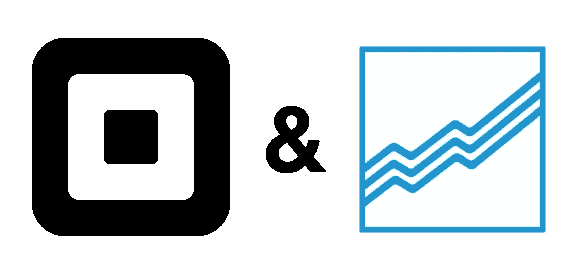
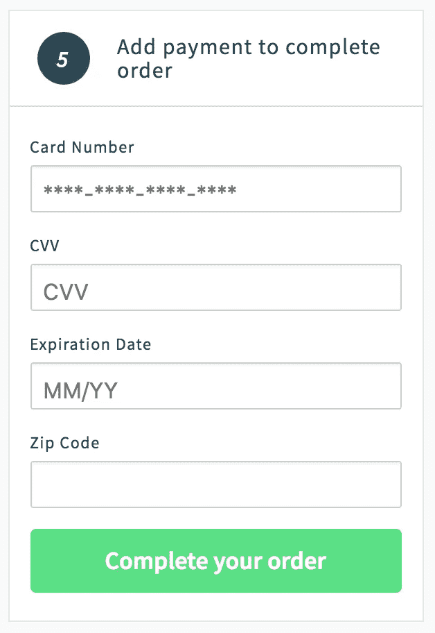

# 在互动商务中实现广场支付形式

> 原文：<https://medium.com/square-corner-blog/implementing-sqpaymentform-in-reaction-commerce-31cfdb737ee2?source=collection_archive---------1----------------------->

> 注意，我们已经行动了！如果您想继续了解 Square 的最新技术内容，请访问我们在 https://developer.squareup.com/blog[的新家](https://developer.squareup.com/blog)

根据支付卡行业数据安全标准( [PCI-DSS](https://squareup.com/guides/pci-compliance) )，为了安全地处理支付，您必须最大限度地减少您处理的敏感持卡人数据量。如果您不这样做，您可能会受到攻击，失去处理支付的能力，或者招致处理者的罚款。

> ***不付款=没钱&没钱=没生意*** 。

一旦您接受、处理、存储或传输敏感的持卡人数据，您就有责任保护这些数据。那么，您如何确保客户的数据是安全的呢？[我们知道](https://hackernoon.com/im-harvesting-credit-card-numbers-and-passwords-from-your-site-here-s-how-9a8cb347c5b5)黑客在不断创新窃取敏感信息的新方法。在 Square，我们提供符合 PCI 的产品和服务，因此您不需要单独验证您的合规状态。

Square 通过提供[SqPaymentForm](https://docs.connect.squareup.com/payments/sqpaymentform/sqpaymentform-overview)JavaScript 库来安全处理客户支付信息，从而帮助您完全避免处理敏感的支付信息。`SqPaymentForm`是一个托管的 JavaScript 库，您可以加载到您的页面上，它有助于生成一个 iframe 表单，该表单可以安全地捕获客户的支付信息。处理表单时，它将生成一个 nonce，用一个替代令牌替换持卡人的敏感信息。您可以引用这个令牌来处理客户的付款，并使用 Square 的 API 执行其他操作。

为了演示如何实现一个安全的支付表单，我使用 [Reaction Commerce](https://reactioncommerce.com/) 实现了一个。对于那些不熟悉的人来说， [Reaction Commerce](https://reactioncommerce.com/) 是一个使用 Meteor 构建的开源电子商务平台。这让我们展示了在更复杂的环境中加载支付表单的方法，这迫使我们使用不太简单的实现。

因此，在所有这些描述结束后，让我们实际上深入研究一些示例，并通过一种方法在 Reaction Commerce 内部实现`SqPaymentForm`。

通常，您需要在想要使用脚本标签处理客户付款的页面上包含`SqPaymentForm`(通常这是在结帐页面上)。

You need to include the hosted version, otherwise your attempts to process the form will fail.

只要您可以简单地使用 HTML 标签来包含您的脚本，上述方法就会非常有效。不幸的是，我们不能使用这种方法来实现，因为 Meteor 有一个独特的模板系统( [Blaze](http://blazejs.org/) )，这使得包含外部脚本很困难。为了保证在结帐时可以访问`SqPaymentForm`对象，我们可以将 script 标签添加到主 HTML 模板的标题中。这样做的问题是，在主 HTML 模板中包含这个脚本，并在应用程序的每个页面上加载它，而实际上我们只是在结账时才需要它，这看起来很笨拙。

试图将脚本包含在结帐模板中的主要问题是，我们不能保证在我们试图实例化`SqPaymentForm`对象时，Square 的支付表单脚本已经被加载。我们可以使用 jQuery 的`getScript()`方法来规避这个问题，因为 Reaction Commerce 为我们提供了这个方法，并且当我们试图在客户端脚本中使用`SqPaymentForm`对象时，我们可以保证我们已经加载了脚本。

您可以看到我们现在正在访问`getScript()`方法的承诺链中的`SqPaymentForm`对象。在我的 fork of Reaction Commerce 中，我实际上已经将这一切打包在一个函数中，以便在我们需要销毁支付表单并重新创建它的情况下可以再次调用它(在我们的教程[的故障排除部分中可以看到更多这方面的内容](https://docs.connect.squareup.com/payments/sqpaymentform/sqpaymentform-setup#troubleshooting))。

这应该足够让我们加载支付表单，并拥有我们想要的样式，但是我们仍然缺少生成用于处理支付的`nonce`的功能。第一步是触发`paymentForm`为我们请求一张卡`nonce`。

createPaymentForm() is just a function wrapping our .getScript() method from earlier.

所以我们在 submit 按钮上添加了一个监听器来拦截提交，这样我们就可以先触发`requestCardNonce()`方法。一旦我们有了`nonce`，我们就可以触发表单实际提交，返回的`nonce`放在一个隐藏的输入字段中。`SqPaymentForm`为我们提供了一个回调函数，用于知道我们何时收到了卡`nonce`的响应，称为`cardNonceResponseReceived()`。

我们在这里有非常基本的错误日志，以防生成或接收`nonce`时出现问题，但是在将`nonce`注入到我们隐藏的 nonce 输入字段后，我们继续通常的表单提交过程。

Lines 7, 15, and 37 are the places to make note of changes on the form’s lifecycle

由于 Reaction Commerce 使用`AutoForm`来处理所有的表单处理，我认为最好尝试利用它来更加符合平台的配置方式。`AutoForm`有一些处理表单提交的生命周期方法，我们将在这里处理我们的`nonce`,并将其传递回服务器进行处理。在`AutoForm`中，有一个`onSubmit`钩子，我们可以用它来处理任何事情。

表单值通过 doc 变量传递给`onSubmit`函数，我们可以用它来取出我们的`nonce`发送给服务器。我们还在成功处理后添加了`paymentForm.destroy()`,这样，如果他们在下订单后决定继续购物，就不会有任何问题。

Here is our final form loaded on the checkout page.

现在我们已经使用`SqPaymentForm`成功地生成并处理了付款表单！剩下要做的就是实现处理支付的后端流程。这只是在非正常环境中实现支付处理前端的快速演练，以便您可以生成卡`nonce`并将其发送到您的后端服务器。

你可以在[https://github.com/mootrichard/reaction](https://github.com/mootrichard/reaction)查看我的 fork 来了解全部内容(它仍然只有前端表单设置在工作，仍然有一些不必要的日志记录)。请自己尝试一下，给我留下评论，让我知道你对它的看法。您可以在 https://connect.squareup.com/apps[的](https://connect.squareup.com/apps)注册自己的 Square 开发者账户，如果您有兴趣了解更多关于 Square 开发者平台的信息，请注册订阅我们的时事通讯。