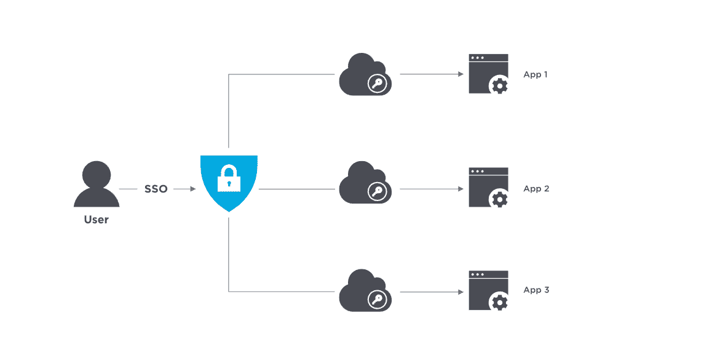

# 用于本地移动设备的 Azure AD SSO

> 原文：<https://medium.com/mendix/implementing-sso-through-azure-ad-mendix-and-oidc-cb74eed77d53?source=collection_archive---------0----------------------->

## 使用 OIDC 模块

Azure AD SSO for Native Mobile

企业中的单点登录(SSO)是指员工只需使用一组凭据登录一次，就可以访问他们有权访问的所有企业应用程序、网站和数据。SSO 通过提供以下功能来解决企业的关键问题:

*   更高的安全性和合规性。
*   提高可用性和员工满意度。
*   降低 IT 成本。

企业中云应用和服务的激增——通常是本地应用和服务的补充——产生了一个严重的**碎片化**问题。企业中的碎片化对 IT 和用户来说都是一个挑战。它必须管理企业中的众多应用程序，以及处理 [*影子 IT*](https://en.wikipedia.org/wiki/Shadow_IT) 。员工每天不得不使用越来越多的应用程序来完成工作，这意味着要登录并在多个应用程序和网站之间切换。

> SSO 解决了企业碎片化问题。

我们将在本地应用程序中实现 SSO，

因此，让我们首先通过几个简单的步骤来创建我们的本机应用程序:

## 第一步

打开 Mendix Studio Pro，选择“创建新应用程序”。

## 第二步

选择'[空白原生手机](https://marketplace.mendix.com/link/component/109511)'模板，然后创建您的应用程序。

## 第三步

现在我们的应用程序已经创建，我们可以继续下载 [OIDC SSO](https://marketplace.mendix.com/link/component/117529) 模块。请务必下载这些预先要求的模块:

*   [本地移动资源](https://marketplace.mendix.com/link/component/109513)(已包含在模板中)
*   [纳流共用](https://marketplace.mendix.com/link/component/109515)(已包含在模板中)
*   [社区公共资源](https://marketplace.mendix.com/link/component/170)
*   [加密](https://marketplace.mendix.com/link/component/1011)

现在，我们的应用程序的所有依赖项都已导入到我们的应用程序中，现在让我们下载 [OIDC SSO](https://marketplace.mendix.com/link/component/117529) 模块，并将其导入到我们的应用程序中。

## 第四步

现在，让我们继续打开并配置我们的安全性！

双击“安全”，将安全模式切换到生产模式。

## 第五步

打开你的模块安全，你会注意到没有'**管理员**角色出现。继续操作，**创建一个**。

## 第六步

到了**用户角色管理**的时候了，只需从 app security 打开用户角色页签，将“**管理员**角色分配给 OIDC 和 MyfirstModule 即可。对“**无名氏**的角色做同样的事情。

## 第七步

将页面添加到您的模块，以便我们可以设置我们的 OIDC 配置页面并将其添加到导航:

右键点击**my first module**->-**添加页面**->-**OIDC 概述**

现在，在项目浏览器中搜索' **Snip_Configuration** '，在您新创建的页面上使用该代码片段，并将该页面添加到导航中。记得给页面管理员访问权限。

## 第八步

是时候设置我们的**加密密钥**和**回调 app 名称**了。继续从您的 OIDC 模块打开常量' **MobileURLScheme** '，您可以在以下位置找到它:

市场模块-> OIDC-> _ 使用我->配置-> MobileURLScheme

> *注意:相同的 URL 方案将被用作深度链接应用方案[同时构建本机应用]并在 OIDC 提供者中定义回调 URL[在我们的情况下为 Azure]和在我们的应用中定义 OIDC 配置。*

**设置加密密钥**常量，在加密模块中找到(可以提供任意 32 个字符的字符串)

由于我们试图建立一个本地应用程序，我们需要建立一个匿名用户主页作为用户登录的地方。

# 设置 Azure

登录 Azure AD，进入 **Azure Active Directory 应用程序注册，**并寻找标记为**新注册的按钮。**

 [## Azure 活动目录

### 管理中心

aad.portal.azure.com](https://aad.portal.azure.com/) 

接下来，您将看到一个在 Azure AD 上注册应用的表单。通过为您的应用程序提供名称、选择帐户类型并设置您的重定向 URL 来完成表单。

转到证书和密码以**创建一个密码 ID。**

现在，您需要为我们的应用程序添加回调 URL。您可以直接将它们添加到清单中:

这里，我们为我们的每个环境添加了一个回调 URL:对于 web、Make it Native 应用程序和我们的定制构建。

> ***这仅推荐用于开发，在其他生产环境中只保留您将要使用的 URL！***

现在转到应用程序概述，并单击端点

复制已知的配置 URL。

现在我们有了

*   应用 id
*   秘密 id
*   著名的 URL
*   回拨 URL

这是我们完成设置所需的一切。让我们在 Mendix 应用程序运行时将它们输入其中。

启动应用程序，进入 OIDC 配置页面，填写 details🡪

只有当配置被保存一次，然后再次打开时，选择的范围列表才会被填充——所以让我们开始吧

> 现在一切就绪。

为了测试自定义构建，我们需要为自己构建一个自定义应用程序。我不会带你经历整个过程，但这里重要的是要确保在应用程序功能下启用深度链接，并提供应用程序方案。这个方案将和我们早先制定的方案一样。

就是这样！一旦 APK 建立并安装在您的移动设备上，您可以启动它，并尝试它。

## **奖金网络实施**

如果你已经做到这一步，那么我想说谢谢你的阅读！为了表达我的感激之情，下面是在同一个项目中为 web 实现相同功能的步骤:

为匿名用户添加登录页面

对于回调，您可以创建一个新的配置(使用 web 的唯一 URL ),也可以改变回调微流本身。这里我们需要改变的是，回调 URL 的 web 计算是基于应用程序 URL 而不是从 OIDC 配置完成的。

这样，您也可以让 web 部件正常工作。现在，您的应用程序在编译时应该是这样的:

感谢您的阅读，请在这里留下您的评论，以便我回复！

## 阅读更多

 [## OIDC SSO

### 描述了 OIDC SSO 模块的配置和用法，该模块可在 Mendix 市场中获得。

docs.mendix.com](https://docs.mendix.com/appstore/modules/oidc/)  [## 使用 OIDC 模块将 Google SSO 添加到您的 Mendix 应用程序中

### 这些天没有最终用户有时间来完成一个漫长的注册过程，我们都填写了足够的“确认您的…

medium.com](/mendix/add-google-sso-to-your-mendix-app-using-the-oidc-module-a76784b2690f)  [## Azure AD SSO 使用 Mendix 中的 OIDC 模块

### 在这篇博客中，我将向你展示如何用 Azure AD SSO 实现用户认证，使用 OIDC Mendix…

medium.com](/mendix/azure-ad-sso-using-oidc-module-6b5eeff4be56) 

*来自发布者-*

*如果你喜欢这篇文章，你可以在我们的* [*中页*](https://medium.com/mendix) *找到更多喜欢的。对于精彩的视频和直播会话，您可以前往*[*MxLive*](https://www.mendix.com/live/)*或我们的社区*[*Youtube PAG*](https://www.youtube.com/c/MendixCommunity/community)*e .*

*希望入门的创客，可以注册一个* [*免费账号*](https://signup.mendix.com/link/signup/?source=direct) *，通过我们的* [*学苑*](https://academy.mendix.com/link/home) *获得即时学习权限。*

有兴趣更多地参与我们的社区吗？加入我们的 [*闲散社区频道*](https://join.slack.com/t/mendixcommunity/shared_invite/zt-hwhwkcxu-~59ywyjqHlUHXmrw5heqpQ) *。*