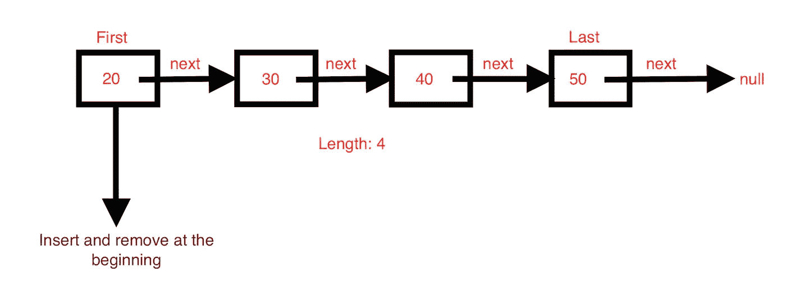
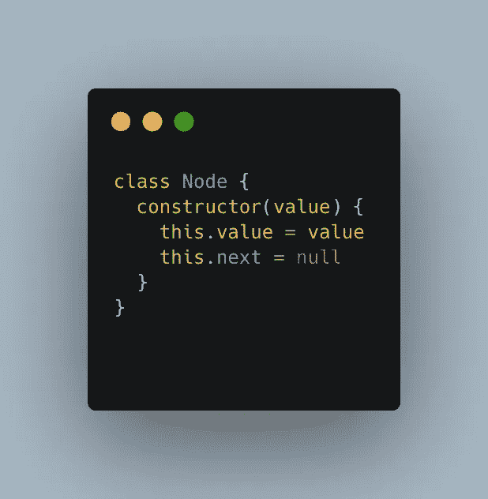
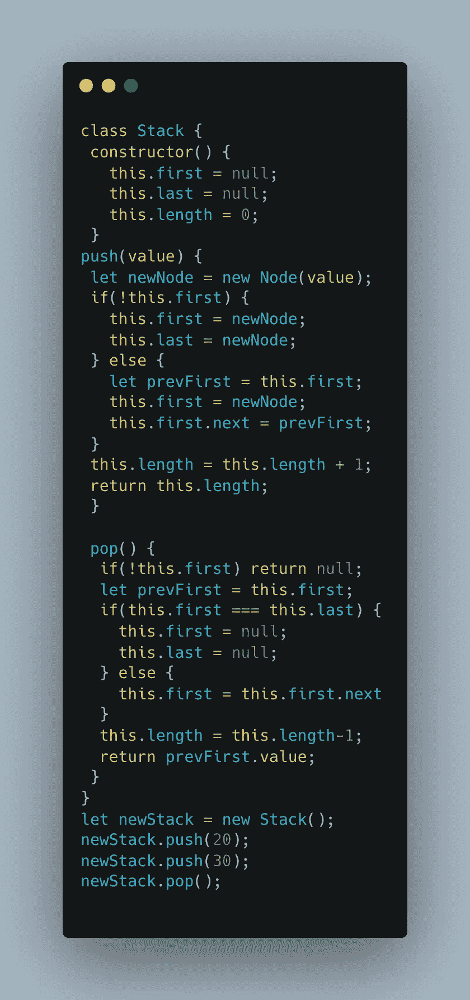
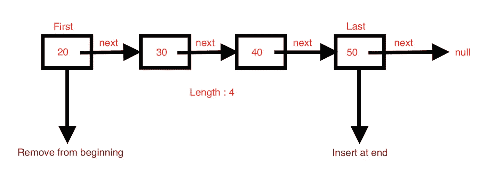
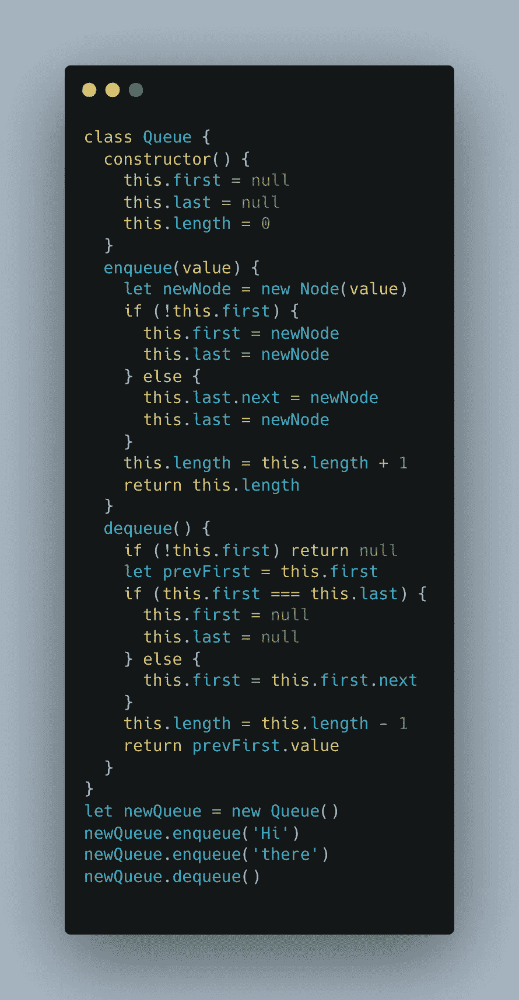

# 在 JS 中实现堆栈和队列

> 原文：<https://medium.com/globant/implementing-stack-and-queue-in-js-600c81a92120?source=collection_archive---------0----------------------->

Photo by [Adolfo Félix](https://unsplash.com/@adolfofelix?utm_source=medium&utm_medium=referral) on [Unsplash](https://unsplash.com?utm_source=medium&utm_medium=referral)

在 JavaScript 中，堆栈和队列不是内置在数据结构中的。因此，在本文中，我们将看到如何使用数组和单链表实现堆栈和队列。

# **什么是栈？**

堆栈是一种数据结构，其中最后添加的元素首先被删除。它遵循后进先出(LIFO)原则。

Credit: [https://giphy.com/](https://giphy.com/)

**实现堆栈**

对于堆栈实现，我们将编写下面的方法。

1.  `push(value)` —该方法将在堆栈的一端插入`value`
2.  `pop()` —此方法将从堆栈插入值的同一端移除值。

我们将看到如何使用数组和单链表实现堆栈。

**使用数组**

在 JavaScript 中，Array 有一些内置的方法，我们可以利用它们来实现 Stack。

1.  使用`push(value)`和`pop()`方法分别在栈尾插入和删除。
2.  使用`unshift(value)`和`shift()`方法从堆栈开始插入和删除。

> 注意:因为`unshift()`和`shift()`方法将在堆栈的开始插入和删除，所以它们需要重新索引整个数组。因此，这不是一个好方法。

**使用单链表**

像数组一样，也有两种使用链表实现堆栈的方法。

一种方法是从末端插入和取出。但是当从末尾移除时，我们将不得不遍历整个列表，到达倒数第二个元素，将其`next`设置为 null。因此这个操作的复杂度是 O(n)。

另一种方法是在开始时插入和删除，我们将在这里实现。插入和删除都具有 O(1)复杂度。

每当我们将一些值压入堆栈时，我们必须创建一个节点。下面是用于创建节点的节点类。

现在我们将使用`push(value)`和`pop()`方法实现 Stack 类。

# **什么是队列？**

队列是一种数据结构，其中首先添加的元素首先被移除。它遵循先进先出(FIFO)原则。

Credit: [https://giphy.com/](https://giphy.com/)

**实现队列**

对于队列实现，我们将编写下面的方法。

1.  `enqueue(value)` —该方法将在队列的一端插入`value`
2.  `dequeue()` —此方法将从队列的另一端移除值。

**使用数组**

1.  使用`unshift(value)`方法在开头插入，使用`pop()`方法从结尾删除。
2.  使用`push(value)`方法在末尾插入，使用`shift()`方法从开头删除。

这两种方法都使用了`shift()`或`unshift(value)` 方法，因此使用数组来实现队列不是一个好方法。

**使用单链表**

如上所述，在单链表中，从末尾移除 item 的复杂度为 O(n ),因此我们将避免在开头插入和从末尾移除。

对于我们的实现，我们将在末尾插入并从开头移除，以具有恒定的时间复杂度。

现在我们将使用`enqueue(value)`和`dequeue()`方法实现队列类。

# **我们来总结一下！！**

*   栈是 LIFO 数据结构，而队列是 FIFO 数据结构。
*   为了实现常量时间的堆栈，可以使用数组的`push(value)` / `pop()`方法进行插入/删除，也可以使用链表在开始时进行插入和删除。
*   为了实现常数时间队列，可以使用链表在末尾插入，在开头删除。

请在这里找到完整的源代码。对于本文内容改进的任何疑问或建议，请留下评论。

快乐学习！！！

Credit: [https://giphy.com/](https://giphy.com/)