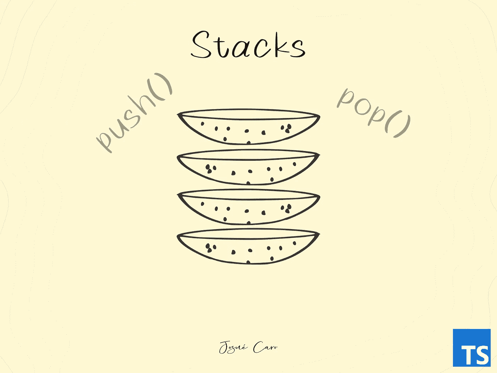
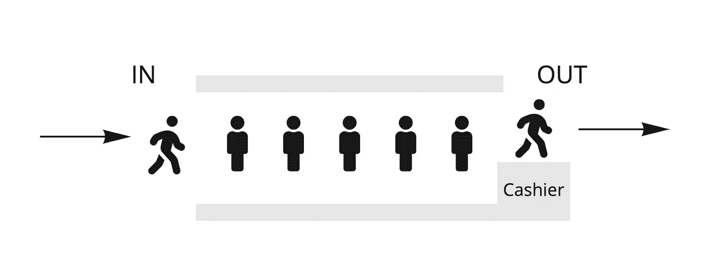
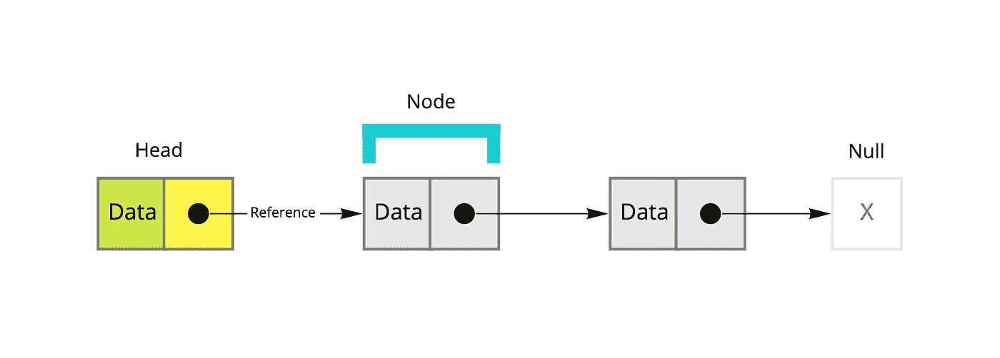
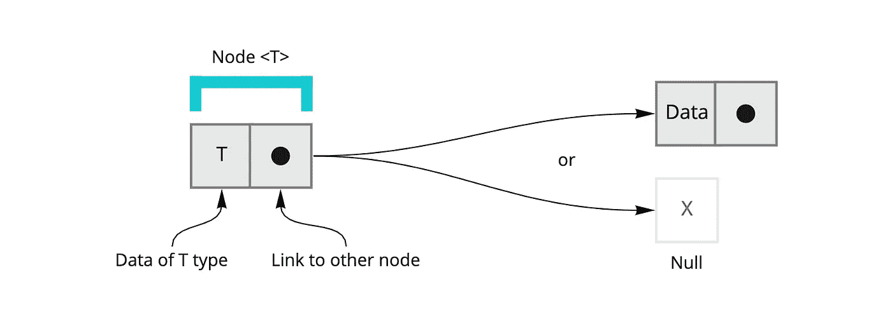
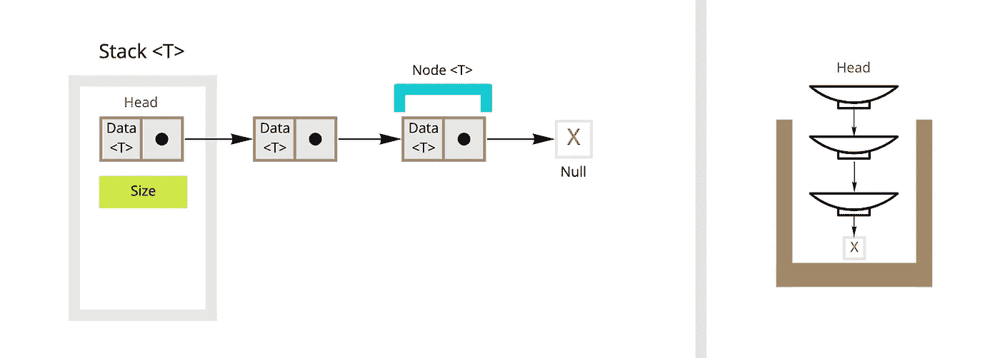
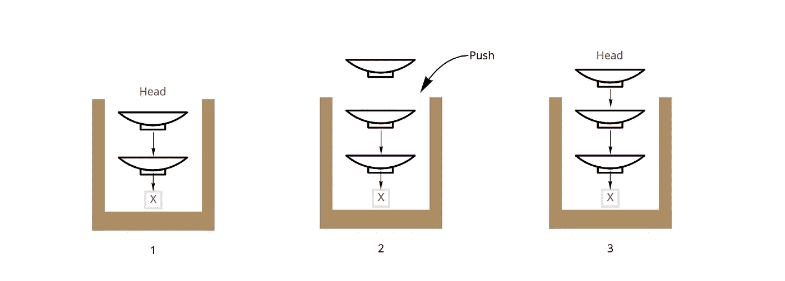
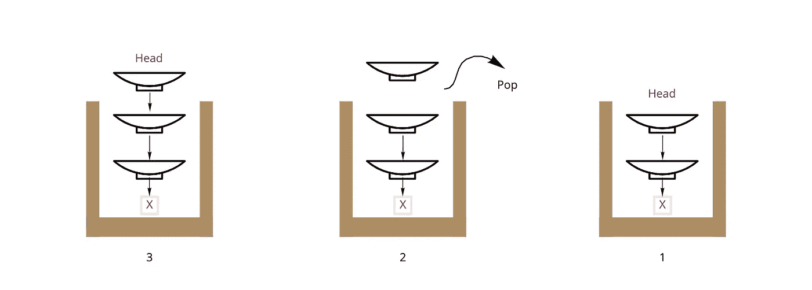

# 链表:创建堆栈的初学者指南

> 原文：<https://medium.com/quick-code/implementing-stacks-using-linked-lists-in-typescript-b39bd6540be1?source=collection_archive---------0----------------------->



数据结构用于表示和管理数据。无论数据结构是数组、链表、堆栈、队列、树还是其他，它都提供了一种有效存储和检索数据的方法。

链表是一个非常重要和基本的数据结构，它在编程中被广泛使用，它们是一个简单的概念，但却是程序员工具箱中一个非常强大的工具。

# 什么是堆栈、队列和链表？

堆栈是一种数据结构，提供对其元素的后进先出(LIFO)访问。也就是说，访问或修改堆栈元素的操作通常以元素插入堆栈的相反顺序进行


Stack example — Figure by Josué Caro

解释堆栈概念的一个非常好的、众所周知的例子是餐馆里的盘子。当一个新的盘子被添加到堆叠中时，它被放置在先前盘子的顶部。

一个**队列**是项目的线性集合，其中第一个项目总是下一个要处理的，先进先出(FIFO)。



Queue example — Figure by Josué Caro

把队列想象成银行或邮局的一排人，第一个到达的人是第一个被服务的人。

**链表**是一种以连续有序的方式存储数据的方式。它由一组“节点”组成。列表的每个节点都包含一段数据和对序列中下一个节点的引用(指针)。



Simple Linked List Concept — Figure by Josué Caro

此外，每个节点可能包含有关其在序列中的位置、大小或其他有用信息(例如，时间戳)的信息。

## 如何用链表实现栈？

我将使用 **Typescript** 进行解释，但是很容易将其翻译成其他语言。

让我们开始用链表实现堆栈。

我们将创建我们的节点类，这将允许我们链接到其他节点。为了方便起见，我们将使该类成为泛型，这将允许我们使用我们想要存储的任何类型的数据。

如前所述，节点有两个基本属性，信息(数据、元数据)和引用。



Simple Linked List Concept — Figure by Josué Caro

在引用中有两种可能性，如果没有链接的节点，它将为空，如果有另一个节点，引用将指向该节点。

让我们向节点类添加必要的属性。

我们添加 _data 和 _next，并在构造函数中初始化它们。我们只需要添加 setters 和 getters 就可以访问这些属性。

我们将继续创建我们的堆栈类。



Stack Concept — Figure by Josué Caro

如果我们以餐馆为例，每个盘子将是一个“节点”，它将有一个对下一个盘子的引用，直到我们到达最后一个盘子，其中，由于没有其他后续盘子，它是空的。

在堆栈数据结构中，除了对我们有用的其他信息，如堆栈的大小，我们总是对知道哪个节点是“头”中的节点感兴趣。

让我们添加必要的属性，在这个例子中，除了头部，我们将只包括大小。

> 如果节点和堆栈类在不同的文件中，记得导入它们。

```
#example
import { Node } from '{{your_path}}';
```

我们将节点“head”初始化为 null，因为我们没有初始元素。我们还将大小设置为 0。

让我们不要忘记创建大小的吸气剂。

现在我们将创建类的重要方法，它将允许我们在列表中添加和删除节点。

让我们从添加到我们的列表开始。



Stack Push Concept — Figure by Josué Caro

我们通过检查属性“head”的值来验证我们的列表是否为空。如果为空，则表示列表中没有元素，否则，有一个或多个元素。(也可以使用 size 属性来确定元素的数量)。

如果条件中没有其他元素，我们将我们的新节点指定为列表的**头。如果有更多的元素，我们必须访问新节点的属性“next ”,我们将**引用**分配给列表的头，然后我们将我们的新节点分配为列表的头。**

不管条件如何，我们增加我们的尺寸**计数器**。



Stack Pop Concept — Figure by Josué Caro

**最后**我们添加了从列表中移除节点的方法，并返回它们的数据。

我们创建“pop”方法，在这里我们验证列表中有元素，否则我们返回空值，因为我们不能返回一个不存在的节点的值。

如果我们至少有一个元素，我们创建一个临时变量，在那里我们将分配节点“head ”,稍后我们必须分配下一个节点的引用作为“head ”,或者如果没有更多的元素，将它分配为 null。

我们递减计数器的大小，并返回数据。

我们只需要测试我们的堆栈类。

就这样，我们希望您喜欢这篇关于在 Typescript 中使用链表实现堆栈的文章。如果你对这篇文章有任何疑问，请在评论中告诉我们。谢谢！。