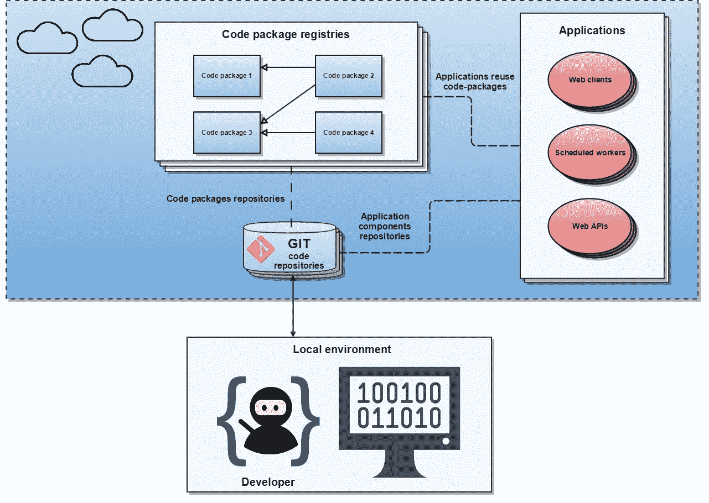

# 实现您自己的代码共享平台

> 原文：<https://medium.com/compendium/implementing-your-own-code-sharing-platform-bbd4c37e88ce?source=collection_archive---------0----------------------->

首席工程师 Magnus Stuhr

# 背景

*当你发现自己在同一个领域开发不同的应用程序时，你很可能会遇到使用已经在另一个应用程序中实现的相同功能的需求。然而，在一个有许多不同的应用程序、代码库、微服务和开发人员的项目中，采用一种灵活高效的代码共享策略绝不是直截了当的。在 Fortum Oslo Varme(我在那里担任技术主管),我们有一个代码共享政策，总是为多个组件需要的功能构建可重用的代码包。通过这种方式，很容易控制代码的位置，提高可维护性，减少错误和编码时间，并且更容易使用相同的功能向所有组件推送新的特性和修复。我们有自己的私有代码注册中心。NET 核心和 Angular 代码包，这意味着我们有一个 NuGet 注册表和一个 NPM 注册表。*

让我们开始看看下图中代码共享平台的概况:

# 开发和发布流程

所有的代码包都放在它们自己的代码库中(如果几个包紧密耦合，它们可以放在同一个库中)，并且在开发期间，所有的包在它们的版本号中都有一个 beta 后缀。beta 后缀之所以存在，是因为大多数代码包管理系统支持对代码包的通配符引用，这意味着您可以将代码包依赖关系声明为 1.0。*，每次恢复依赖项时，您都将获得 1.0.0 版的最新测试包。beta 后缀是为了确保在开发过程中我们的代码包中没有重大更改，因为这将在我们每夜的持续集成构建中发现，所有应用程序组件都将在该构建中进行恢复、构建和测试。使用 beta 后缀，我们总是确保最新的代码包是有效的，并且不会破坏现有的功能。

当新的功能被合并到我们的代码包的 GIT 存储库中的开发分支时，我们已经自动安排了代码包的构建和发布到我们的代码注册中心，这意味着新的测试版包总是在新的功能被合并到开发分支后立即发布。对于最终版本，我们总是手动将库中的新发布标签打包发布到我们的代码注册中心。

当应用程序准备好发布到生产时，我们总是制作该应用程序所依赖的代码包的最终版本，并将这些包的依赖关系更新到它们的最终发布版本，例如 1.0.0，而不是之前的 beta-reference 1.0。* .

# 命名规格

我们所有的代码包名称都以我们的域名开始，然后是代码包所属的应用程序，最后是包中功能的名称。这种包装的一个例子是加热。域，这是在与客户门户数据库通信的服务层上执行操作的可重用功能。我们还共享了适用于不同应用的代码包，例如加热。这是我们的共享 utils 库。

在下一篇博文中，我将给出一个具体的例子，说明如何快速构建和发布自己的 NPM 包。

# 马格努斯·斯托尔

*首席工程师 Computas 数据科学社区的负责人，meetup.com 语义技术小组的组织者。最重要的是热爱编码。*