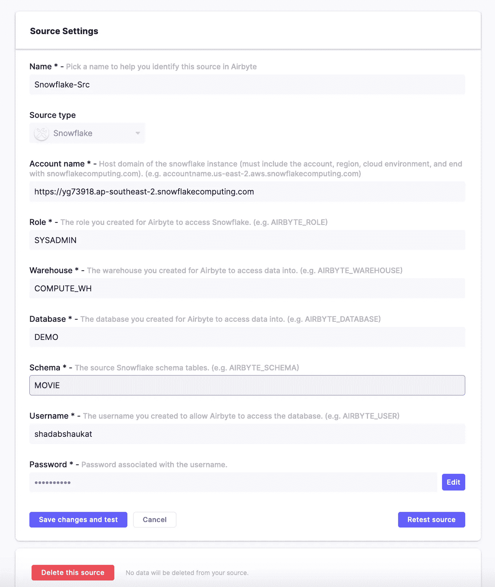
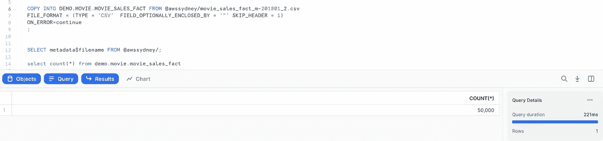

# 使用 Airbyte 将数据从雪花近乎实时地导入 Oracle 云数据库

> 原文：<https://medium.com/oracledevs/import-data-in-near-real-time-from-snowflake-to-oracle-cloud-database-using-airbyte-85f5de96991c?source=collection_archive---------1----------------------->

# 索引

## **简介**

## **建筑**

## **方案部署**

— A .为 Nginx 和 Airbyte 部署虚拟机

— B .配置 HTTP 基本身份验证并部署 Nginx

— C .启用 HTTPS 并让加密 SSL 证书

— D .创建从雪花到 Oracle 数据库的复制

## **总结**

## **参考文献**

# 介绍

在本文中，我们将使用 [Airbyte](https://airbyte.io/) ，它是现代数据工程中最令人兴奋的开源 ELT 工具之一，通过将数据从雪花中提取到 OCI 上的 2 节点 Oracle RAC 数据库来创建近乎实时的复制。请注意，Airbyte 是一个提取-加载和转换(ELT)工具，而不是可以执行 DAG(有向无环图)的 ETL 工具。ETL 和 ELT 之间有很大的区别。

这是一个正在进行的关于部署和使用 Airbyte 进行数据工程用例的系列文章。Airbyte 在 OCI 的部署指南已经在这里[提供](/oracledevs/deploy-airbyte-on-oracle-cloud-infrastructure-and-replicate-a-postgresql-table-to-mysql-f07cf3cbe19c)。该设置是一个生产级设置，用于将用作上游源的雪花数据发送到作为下游系统的 Oracle DB。

Airbyte 仍在 Alpha 版本中，目前没有身份验证方案，也不支持 HTTPS 和 TLS/SSL 证书。但该工具对于现代数据工程用例来说是惊人的，但如果缺少这些功能，企业将很难采用，因为 HTTPS 和 SSL 证书对于任何想要在其关键数据上创建数据管道的组织来说都是必不可少的。为了克服这些限制，我们决定确保 Airbyte 的这种架构可以在生产环境中使用。我们必须使用 let 加密 SSL 证书和充当反向代理的 Nginx 来强化 Airbyte 实例。Airbyte 实例使用私有 IP 运行，不直接暴露于互联网。一旦强化完成，我们将使用 Airbyte 构建雪花到 Oracle 的复制。

Airbyte 可以用于多个[源](https://docs.airbyte.io/integrations/sources)和[接收器](https://docs.airbyte.io/integrations/destinations)，因此您可以在不同的云上或从一个云到另一个云为各种不同的数据流构建类似的近实时复制。

# 体系结构

该堆栈包含以下重要组件，它是将托管 Nginx 和 Airbyte 的 Oracle 云基础架构上的网络和 IaaS 组件的混合。对于 Nginx 部署，我们将使用[基于 OCI ARM 的 A1 实例](https://www.oracle.com/au/cloud/compute/arm/)，对于 Airbyte，我们将使用 [AMD E4 Flex](https://blogs.oracle.com/cloud-infrastructure/post/announcing-oracle-cloud-compute-e4-platform-on-third-gen-amd-epyc-processors) 实例。这两个实例都在始终空闲层中可用。接收器将是 OCI 上的一个 2 节点 Oracle RAC 集群，从雪花中获取数据作为源。

1.  OCI ARM A1 实例— Nginx 和 SSL 证书
2.  OCI AMD E4 Flex 实例 Docker 上的 Airbyte
3.  此处添加了 OCI DNS 公共区域，该区域具有域名管理和 A 记录
4.  VCN(虚拟云网络)— 2 个子网，1 个托管 Nginx 虚拟机的公共子网，1 个运行 Airbyte Docker 容器的私有子网
5.  Oracle RAC 数据库—部署在同一专用子网中的双节点 Oracle RAC 数据库
6.  雪花—雪花 30 天试用帐户，可自动提供演示数据库


Snowflake to Oracle

# 解决方案部署

# A.分别在公共和私有子网中部署 Nginx 和 Airbyte 的虚拟机

1.  **在公共子网部署 OCI ARM 实例，安装 nginx。确保公共子网的安全列表中允许端口 80 作为无状态规则**

Nginx 实例的私有 IP:10 . 10 . 1 . 138

a.在 OCI ARM 虚拟机上启用此标志 SELinux

```
sudo setsebool -P httpd_can_network_connect 1
```

b.通过创建名为/etc/yum.repos.d/nginx.repo 的文件来安装 nginx，并粘贴以下配置之一:

```
[nginx]
name=nginx repo
baseurl=[https://nginx.org/packages/rhel/$releasever/$basearch/](https://nginx.org/packages/rhel/$releasever/$basearch/)
gpgcheck=0
enabled=1## Install nginxsudo yum install nginx
sudo systemctl start nginx
sudo systemctl status nginx
sudo systemctl enable nginx## Whitelist HTTP Port 80 on the Instance for External Acessssudo firewall-cmd -zone=public -permanent -add-port=80/tcp
sudo firewall-cmd -zone=public -permanent -add-service=http
sudo firewall-cmd -reload
sudo firewall-cmd -zone=public -permanent -list-ports
```

关于 Ngnix 在 OCI ARM 虚拟机上的完整部署指南，请参考:[https://medium . com/Oracle devs/deploy-nginx-on-the-new-OCI-ARM-a1-instance-in-under-2-mins-977 f68a 7984d](/oracledevs/deploy-nginx-on-the-new-oci-arm-a1-instance-in-under-2-mins-977f68a7984d)

**2。在专用子网中的 OCI 虚拟机上部署 Airbyte 实例。确保私有子网的安全列表允许端口 8000 作为无状态规则**

托管 Airbyte 的虚拟机的私有 IP:10 . 10 . 1 . 147

有关 Airbyte 在 OCI 上的完整部署指南，请参考:[https://medium . com/Oracle devs/deploy-Airbyte-on-Oracle-cloud-infra structure-and-replicate-a-PostgreSQL-table-to-MySQL-f 07 cf 3c be 19 c](/oracledevs/deploy-airbyte-on-oracle-cloud-infrastructure-and-replicate-a-postgresql-table-to-mysql-f07cf3cbe19c)

# B.配置 HTTP 基本认证并安装 Nginx

**1。将 nginx 配置为具有基本 http 认证的 Airbyte 的反向代理**

a.在 ARM 实例上安装 httpd-tools

```
sudo mkdir -p /etc/apache2/
sudo htpasswd -c /etc/apache2/.htpasswd adminsudo vim /etc/nginx/nginx.conf
```

在 nginx.conf 文件中添加以下内容，保存并重新加载 nginx

—

```
user root;events {
 worker_connections 4096; ## Default: 1024
}
http {
 server {
 listen 80;
 listen [::]:80;server_name 10.10.1.138;location / {
 proxy_pass [http://10.10.1.147:8000](http://10.10.1.147:8000);
 proxy_set_header X-Forwarded-User $http_authorization;
 auth_basic “Administrator’s Area”;
 auth_basic_user_file /etc/apache2/.htpasswd;
 proxy_set_header X-Real-IP $remote_addr;
 proxy_set_header Host $host;
 proxy_set_header X-Forward-For $proxy_add_x_forwarded_for;
 proxy_pass_header Accept;
 proxy_pass_header Server;
 proxy_http_version 1.1;
 proxy_set_header Authorization $http_authorization;
 proxy_pass_header Authorization;
 proxy_set_header ns_server-ui yes;
 }
 }
}
```

b.检查配置是否正常

```
sudo nginx -t
```

c.重启 nginx

```
sudo systemctl restart nginx
```

**4。连接到 nginx 运行的公共 IP，它将提示输入基本 http 认证的密码，并充当反向代理，转发到使用 PrivateIP 运行的 Airbyte 实例的连接**

```
http://<public-ip>/
```

用于检查任何问题的假脱机错误日志##

```
sudo tail -30f /var/log/nginx/error.log
```

# **C .启用 HTTPS 并为您的域/子域获取加密 SSL 证书**

在我们开始之前，请在您的 DNS 域管理中添加 2 个 A 记录。它可以在任何第三方提供商如疯狂域名或 Go Daddy 上完成，但在我的情况下，我使用 OCI 来管理我的域名。例如:airbyte.yourdomainname.com 的[和 www.airbyte.yourdomain.com 的](http://airbyte.yourdomainname.com)[使用你的 ARM 实例的公共 IP](http://www.airbyte.yourdomain.com)


**1。在 Oracle Linux 上启用 EPEL Repo 并安装 certbot**

```
sudo yum install -y yum-utils
sudo yum-config-manager — enable ol7_optional_latest
sudo yum-config-manager — enable ol7_developer_EPEL
cd /tmp
sudo rpm -Uvh /tmp/epel-release-latest-7.noarch.rpm
cd /tmp
sudo wget [https://dl.eff.org/certbot-auto](https://dl.eff.org/certbot-auto)
sudo yum install certbot
sudo yum install python-certbot-nginx
```

**2。编辑 nginx.conf 并做一些修改，添加您在步骤 5** 中创建的新域名

```
sudo vi /etc/nginx/nginx.conf
```

—

```
user root;events {
 worker_connections 4096; ## Default: 1024
}
http {
 server {
 listen 80;
 listen [::]:80;server_name airbyte.yourdomain.com [www.airbyte.yourdomain.com;](http://www.airbyte.yourdomain.com;)location / {
 proxy_pass [http://10.10.1.147:8000](http://10.10.1.147:8000);
 proxy_set_header X-Forwarded-User $http_authorization;
 auth_basic “Administrators Area”;
 auth_basic_user_file /etc/apache2/.htpasswd;
 proxy_set_header X-Real-IP $remote_addr;
 proxy_set_header Host $host;
 proxy_set_header X-Forward-For $proxy_add_x_forwarded_for;
 proxy_pass_header Accept;
 proxy_pass_header Server;
 proxy_http_version 1.1;
 proxy_set_header Authorization $http_authorization;
 proxy_pass_header Authorization;
 proxy_set_header ns_server-ui yes;
 }
 }
}
```

**3。重新加载 Nginx**

```
sudo nginx -s reload
```

**4。运行 Certbot 以获取新子域的加密 SSL 证书**

```
sudo certbot — nginx -d airbyte.yourdomain.com -d [www.airbyte.yourdomain.com](http://www.airbyte.yourdomain.com)
```

*要检查配置文件中是否有任何无效的特殊字符，请运行下面的命令并避免错误> > >"出现意外错误:UnicodeDecodeError 错误:“ascii”编解码器无法解码位置 35 处的字节 0xe2:序号不在范围(128)内" ##*

```
sudo grep -r -P ‘[^\x00-\x7f]’ /etc/apache2 /etc/letsencrypt /etc/nginx
```

修复 nginx.conf 文件中的特殊字符后，再次运行

```
sudo certbot — nginx -d airbyte.yourdomain.com -d [www.airbyte.yourdomain.com](http://www.airbyte.awscloudserver.com)
```

选择选项 2 将所有流量的 HTTP 重定向到 HTTPS。确保将端口 443 作为无状态规则添加到公共子网的安全列表中

**5。将 HTTPS 443 端口添加到 Nginx 虚拟机上的 firewall-cmd**

```
sudo firewall-cmd -zone=public -permanent -add-port=443/tcp
sudo firewall-cmd -zone=public -permanent -add-service=httpssudo firewall-cmd -reload
sudo firewall-cmd -zone=public -permanent -list-ports
```

登录到[https://airbyte.yourdomain.com](https://airbyte.yourdomain.com)# #

使用之前在步骤 1 中创建的用户名“Admin”和密码

# D.使用 Airbyte 创建从雪花到 Oracle 的复制

在雪花上提供一个 30 天的免费试用帐户。在我的例子中，我使用 AWS ap-southeast-2 区域作为部署。

1.  **计提雪花** [**试算账**](https://signup.snowflake.com/)
2.  **在雪花内部创建一个演示数据库‘Demo’和模式‘Movie’**


Schema


**3。在雪花中创建表格**

在本次演示中，我们将使用 Oracle 的电影销售数据集。[使用 DDL](https://github.com/shadabshaukat/snowflake-to-oracle/blob/main/Snowflake_Table_Ddl.sql) 创建表格


**表 DDL :**

```
create or replace TABLE DEMO.MOVIE.MOVIE_SALES_FACT (
	ORDER_NUM NUMBER(38,0) NOT NULL,
	DAY DATE,
	DAY_NUM_OF_WEEK NUMBER(38,0),
	DAY_NAME VARCHAR(26),
	MONTH VARCHAR(12),
	MONTH_NUM_OF_YEAR NUMBER(38,0),
	MONTH_NAME VARCHAR(26),
	QUARTER_NAME VARCHAR(26),
	QUARTER_NUM_OF_YEAR NUMBER(38,0),
	YEAR NUMBER(38,0),
	CUSTOMER_ID NUMBER(38,0),
	USERNAME VARCHAR(26),
	CUSTOMER_NAME VARCHAR(250),
	STREET_ADDRESS VARCHAR(250),
	POSTAL_CODE VARCHAR(26),
	CITY_ID NUMBER(38,0),
	CITY VARCHAR(128),
	STATE_PROVINCE_ID NUMBER(38,0),
	STATE_PROVINCE VARCHAR(128),
	COUNTRY_ID NUMBER(38,0),
	COUNTRY VARCHAR(126),
	COUNTRY_CODE VARCHAR(26),
	CONTINENT VARCHAR(128),
	SEGMENT_NAME VARCHAR(26),
	SEGMENT_DESCRIPTION VARCHAR(128),
	CREDIT_BALANCE NUMBER(38,0),
	EDUCATION VARCHAR(128),
	EMAIL VARCHAR(128),
	FULL_TIME VARCHAR(26),
	GENDER VARCHAR(26),
	HOUSEHOLD_SIZE NUMBER(38,0),
	HOUSEHOLD_SIZE_BAND VARCHAR(26),
	WORK_EXPERIENCE NUMBER(38,0),
	WORK_EXPERIENCE_BAND VARCHAR(26),
	INSUFF_FUNDS_INCIDENTS NUMBER(38,0),
	JOB_TYPE VARCHAR(26),
	LATE_MORT_RENT_PMTS NUMBER(38,0),
	MARITAL_STATUS VARCHAR(26),
	MORTGAGE_AMT NUMBER(38,0),
	NUM_CARS NUMBER(38,0),
	NUM_MORTGAGES NUMBER(38,0),
	PET VARCHAR(26),
	PROMOTION_RESPONSE NUMBER(38,0),
	RENT_OWN VARCHAR(26),
	YEARS_CURRENT_EMPLOYER NUMBER(38,0),
	YEARS_CURRENT_EMPLOYER_BAND VARCHAR(26),
	YEARS_CUSTOMER NUMBER(38,0),
	YEARS_CUSTOMER_BAND VARCHAR(26),
	YEARS_RESIDENCE NUMBER(38,0),
	YEARS_RESIDENCE_BAND VARCHAR(26),
	AGE NUMBER(38,0),
	AGE_BAND VARCHAR(26),
	COMMUTE_DISTANCE NUMBER(38,0),
	COMMUTE_DISTANCE_BAND VARCHAR(26),
	INCOME NUMBER(38,0),
	INCOME_BAND VARCHAR(26),
	MOVIE_ID NUMBER(38,0),
	SEARCH_GENRE VARCHAR(26),
	TITLE VARCHAR(4000),
	GENRE VARCHAR(26),
	SKU NUMBER(38,0),
	LIST_PRICE NUMBER(38,2),
	APP VARCHAR(26),
	DEVICE VARCHAR(26),
	OS VARCHAR(26),
	PAYMENT_METHOD VARCHAR(26),
	DISCOUNT_TYPE VARCHAR(26),
	DISCOUNT_PERCENT NUMBER(38,1),
	ACTUAL_PRICE NUMBER(38,2),
	QUANTITY_SOLD NUMBER(38,0)
);
```


**4。从 S3 桶加载电影 _ 销售 _ 事实表** [**中的数据。**](https://docs.snowflake.com/en/user-guide/data-load-s3.html)

你可以从[这里](https://github.com/shadabshaukat/snowflake-to-oracle)下载演示 csv 文件'*movie _ sales _ fact _ m-2018 01 _ 1 . CSV*'并上传到你的 S3 桶

为您的 S3 存储桶创建一个阶段，指定您的 AWS 凭据

```
create or replace stage awssydney
    url = 's3://dwhload/'
    credentials = (aws_secret_key = 'K********m' aws_key_id = 'A*********S');SELECT metadata$filename FROM [@awssydney](http://twitter.com/awssydney)/;
```

使用复制命令从 S3 大容量加载数据

```
COPY INTO DEMO.MOVIE.MOVIE_SALES_FACT FROM [@awssydney/movie_sales_fact_m-201801](http://twitter.com/awssydney/movie_sales_fact_m-201801)_1.csv
FILE_FORMAT = (TYPE = 'CSV'  FIELD_OPTIONALLY_ENCLOSED_BY = '"' SKIP_HEADER = 1)
ON_ERROR=continue
;
```

检查记录

```
select count(*) from DEMO.USER.MOVIE_SALES_FACT
```


**5。在 OCI 的专用子网中创建 Oracle RAC 数据库**

a.为数据库系统设置 OCI VCN—[https://docs . Oracle . com/en-us/iaas/Content/Database/Tasks/network . htm](https://docs.oracle.com/en-us/iaas/Content/Database/Tasks/network.htm)

b.创建数据库系统—[https://docs . Oracle . com/en-us/iaas/Content/Database/Tasks/creating DB System . htm](https://docs.oracle.com/en-us/iaas/Content/Database/Tasks/creatingDBsystem.htm)


**Airbyte 中使用的主机 IP:**10 . 10 . 2 . 6

**pdb1.sub06291303221.databasevcn.oraclevcn.com PDB 服务名称:**

**港口:** 1521


6。登录 Airbyte 实例并将雪花定义为源

转到 Airbyte URL >源>新源>选择源类型为“雪花”>根据您的雪花帐户添加参数



7.**登录 Airbyte 实例，并将 Oracle 数据库定义为目的地**

转到 Airbyte URL >目标>新目标>选择目标类型为“Oracle”>根据您的 Oracle RAC 数据库详细信息添加参数


8。创建从雪花到 Oracle 的复制

转到 Airbyte URL >源>选择以前定义的雪花源'雪花-src ' >添加目标>添加 Oracle 数据库目标' Oracle-Tgt '

*您不需要在 Oracle 中创建模式或表。Airbyte 会自动为您创建模式和表。*


选择“MOVIE_SALES_FACT”表，并将同步频率定义为 5 分钟(雪花作为源目前不支持 Airbyte 上的“Append”模式)


检查连接状态，它应该显示一个绿色图标，表示成功加载并设置了同步。你可以进入“同步历史”并实时查看同步日志。


检查 Oracle 数据库中的记录

```
sqlplus “/as sysdba”SQL> show pdbsSQL> alter session set container=PDB1;SQL> select TABLE_NAME,OWNER from DBA_TABLES where OWNER=’MOVIE’;TABLE_NAME
 — — — — — — — — — — — — — — — — — — — — — — — — — — — — — — — — — — — — — — — — 
OWNER
 — — — — — — — — — — — — — — — — — — — — — — — — — — — — — — — — — — — — — — — — 
AIRBYTE_TMP_MOVIE_SALES_FACT_26436382F498415DB280E318710585EF
MOVIEAIRBYTE_RAW_MOVIE_SALES_FACT
MOVIESQL> select count(*) from MOVIE.AIRBYTE_RAW_MOVIE_SALES_FACT;COUNT(*)
 — — — — — 
 24999
```

数据以 JSON 的形式作为 NCLOB 字段进入 Oracle

```
SQL> desc movie.AIRBYTE_RAW_MOVIE_SALES_FACT;
 Name Null? Type
 — — — — — — — — — — — — — — — — — — — — — — — — — — — — — — — — — — — — — — — 
 AIRBYTE_AB_ID NOT NULL VARCHAR2(64)
 AIRBYTE_DATA NCLOB
 AIRBYTE_EMITTED_AT TIMESTAMP(6) WITH TIME ZONE
```

您可以使用 Oracle DB 中的各种 JSON 函数进一步解析 JSON

```
set termout off
set verify off
set trimspool on
set linesize 200
set longchunksize 20000000
set long 20000000
set pages 0
column txt format a120
 select 
        json_object
        (
           'body' value AIRBYTE_DATA
         FORMAT JSON)
    from
        movie.AIRBYTE_RAW_MOVIE_SALES_FACT
Where rownum<=10;-- Aggregated JSON --select json_arrayagg(AIRBYTE_DATA format json) from movie.AIRBYTE_RAW_MOVIE_SALES_FACT where rownum<=2;-- Pretty JSON from 19c Onwards --
select 
    json_serialize (AIRBYTE_DATA returning varchar2 pretty)
from  movie.AIRBYTE_RAW_MOVIE_SALES_FACT where rownum<=2;
```

为了测试正在进行的复制，使用第二个 CSV 文件向雪花表[添加更多记录，并从 Oracle 再次检查..](https://github.com/shadabshaukat/snowflake-to-oracle)

在雪花中:

```
COPY INTO DEMO.MOVIE.MOVIE_SALES_FACT FROM [@awssydney/movie_sales_fact_m-201801](http://twitter.com/awssydney/movie_sales_fact_m-201801)_2.csv
FILE_FORMAT = (TYPE = 'CSV'  FIELD_OPTIONALLY_ENCLOSED_BY = '"' SKIP_HEADER = 1)
ON_ERROR=continue
;
```



在 Oracle 中:

```
SQL> select count(*) from MOVIE.AIRBYTE_RAW_MOVIE_SALES_FACT;COUNT(*)
 — — — — — 
 50000
```

# 摘要

我们已经看到，在 Oracle 云基础架构上创建生产级 Airbyte 部署并近乎实时地将数据从雪花集群复制到 OCI 上的 Oracle RAC 集群是多么容易。

# 参考资料:

[1]甲骨文云计算 e4 平台—[https://blogs . Oracle . com/Cloud-infra structure/post/announcing-甲骨文云计算 E4 平台第三代 amd-epyc 处理器](https://blogs.oracle.com/cloud-infrastructure/post/announcing-oracle-cloud-compute-e4-platform-on-third-gen-amd-epyc-processors)

[2]甲骨文安培 A1 计算—【https://www.oracle.com/au/cloud/compute/arm/ 

[3] Oracle 云始终免费层—[https://www.oracle.com/au/cloud/free/](https://www.oracle.com/au/cloud/free/)

[4]在 https://docs.airbyte.io/deploying-airbyte/on-oci-vm[的 OCI 虚拟机上部署 Airbyte](https://docs.airbyte.io/deploying-airbyte/on-oci-vm)

[5]OCI ARM 上的 Nginx—[https://medium . com/Oracle devs/deploy-Nginx-on-the-new-OCI-ARM-a1-instance-in-under-2-mins-977 f68a 7984d](/oracledevs/deploy-nginx-on-the-new-oci-arm-a1-instance-in-under-2-mins-977f68a7984d)

[6] Nginx 反向代理—[https://docs . Nginx . com/Nginx/admin-guide/we B- server/Reverse-Proxy/](https://docs.nginx.com/nginx/admin-guide/web-server/reverse-proxy/)

[7]让我们加密证书机器人—[https://certbot.eff.org/](https://certbot.eff.org/)

[8] Nginx 使用 HTTP 基本认证限制访问—[https://docs . Nginx . com/Nginx/admin-guide/security-controls/configuring-HTTP-Basic-authentic ation/](https://docs.nginx.com/nginx/admin-guide/security-controls/configuring-http-basic-authentication/)

[9]雪花免费试用报名—[https://signup.snowflake.com/](https://signup.snowflake.com/)

[10]如何在 Oracle 数据库中存储、查询和创建 JSON 文档—[https://blogs . Oracle . com/SQL/How-to-Store-Query-and-Create-JSON-Documents-in-Oracle-Database](https://blogs.oracle.com/sql/how-to-store-query-and-create-json-documents-in-oracle-database)

