# 使用 CSV 模块在 Mendix 中导入和导出数据

> 原文：<https://medium.com/mendix/import-export-data-in-mendix-using-csv-module-d3eba261ae49?source=collection_archive---------0----------------------->

# **Mendix 支持将数据导入应用程序的多种选项，根据源类型的要求，所有这些选项都被证明是非常好的。**

在这篇博客中，我将重点介绍其中一种方法，即借助 Mendix 提供的 CSV 模块导入和导出 CSV 格式的数据。当我们有大量数据要导入时，当数据来自 Excel 文档时，CSV 是一个很好的选择。

**CSV 模块在这里提供了一些很酷的优势，这些优势在市场上有所提及:**

1.  该模块为导入和导出提供了连接器风格的 CSV 用法。
2.  这种连接器类型的优点:

*   模型反映 CSV 结构。
*   微流可以针对导入/导出进行优化(例如，通过缓存)。
*   适用于高容量(从 100K 到 M)。d)用于更高性能和更少内存消耗的流方法。

哇哦。听起来已经很棒了，对吧？那我们还等什么，让我们开始吧

# 设置

在我们的 Mendix 项目中，我们需要从市场下载以下与您的 Studio Pro 版本兼容的模块:

*   [CSV 模块](https://marketplace.mendix.com/link/component/108605)
*   [OQL 模块](https://marketplace.mendix.com/link/component/66876)(因为 CSV 模块提供 OQL 模块支持的动作。)

[https://bit.ly/MXW21](https://bit.ly/MXW21)

# 导入 CSV 数据

## 方法

我们将遵循的导入方法是在我们的应用程序中上传一个 CSV 格式的文件，并利用 CSV 模块中的 java 操作来帮助在我们的应用程序中导入数据。

CSV-formatted Data as Input

## **领域模型**

我们需要创建一个 FileDocument 类型的实体来存储我们的 CSV 文件，一个主实体来存储处理过的数据(这里是 Employee 实体)和一个非持久实体。

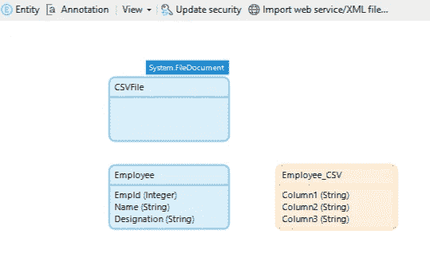

Domain Model Setup

这里我们使用非持久实体有两个原因:

1.  通过 CSV 支持的传入数据仅为字符串类型
2.  数据在按字母顺序重新排列后被输入到属性中

示例:如果我们直接将数据映射到 Employee 实体，CSV 模块操作将在按字母顺序将属性重新排列为' **Designation: 2，EmpId: Jorg，Name: TechAdmin '，**后映射输入数据' 2，Jorg，TechAdmin '，因此错误地映射数据，并且我们将' EmpId '作为整数，而 CSV 仅支持字符串。

但是选择真的是你的，如果你有一个实体有按字母顺序排列的所有字符串值的列，那么创建一个非持久的实体可以跳过。

## 微流和页面

首先，我们需要创建一个页面来接受文件上传并触发我们的导入操作。(这个页面是通过一个微流调用的，微流创建一个新的 CSVFile 实体对象，并将其作为页面参数传递给 This)

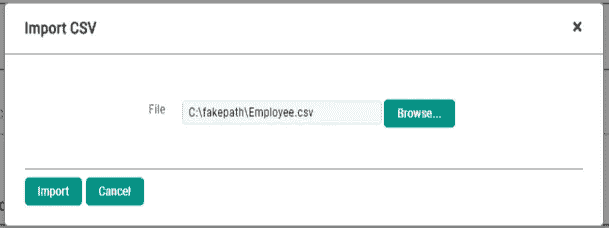

Page to upload CSV file

当我们点击“导入”按钮时，我们调用我们的微流来导入文件。让我们来看看:

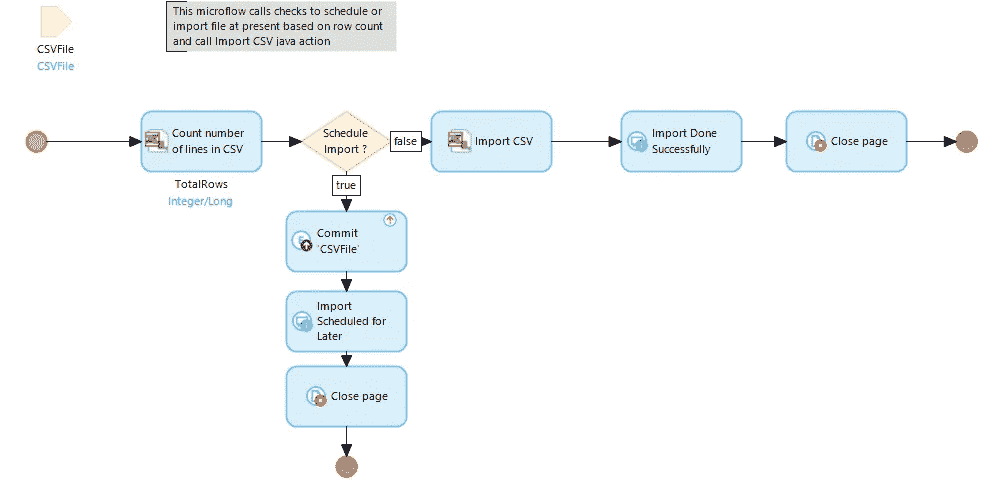

Microflow to Import Data

这个微流将上传的 CSV 文件作为输入参数，这里所做的主要工作是从 CSV 模块调用“导入 CSV”动作并对其进行配置。此操作采用的参数是:

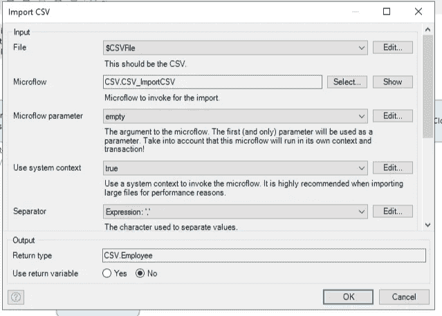

1.  传递从中读取数据的 CSV 文件(在本例中，我们传递输入参数 CSV 文件)
2.  分隔符值不应为空，需要指定，否则我们将遇到空指针错误
3.  作为整数值跳过行
4.  亮点是为执行主要处理的导入调用的微流。截图中选择的微流是 CSV 模块提供的重用的示例微流。我们可以根据我们的要求修改它，让我们看看我做的修改。

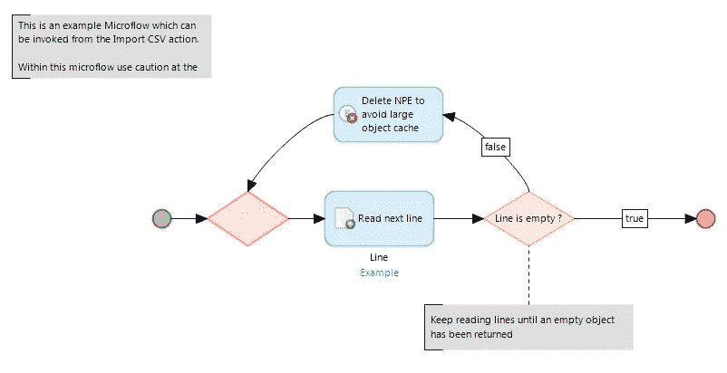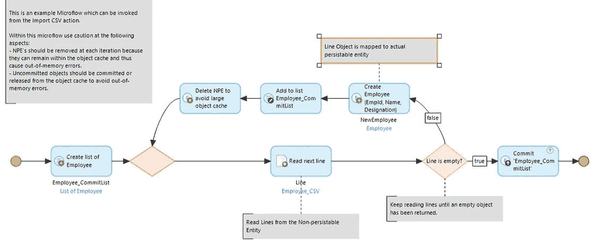

Left : Original Example Microflow, Right : Modified Example Microflow

我已经创建了一个员工对象列表，继续执行 java 操作“读取下一行”,该操作从 CSV 文件中读取数据并将其映射到非持久实体“Employee_CSV”

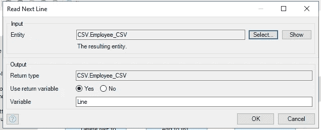

Parameter to Read Next Line action

对于每一行读取，我们创建一个 Employee 对象，并将读取下一行操作返回的对象映射到其属性。

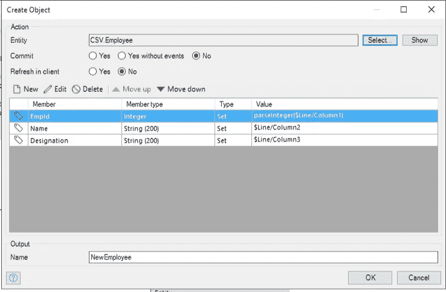

Parsing and Mapping returned object in Employee attributes

一旦完成，Employee 对象的列表就被提交，我们返回到主微流，导入就完成了。

## **结果**

CSV formatted data successfully imported in application

# **导出 CSV 数据**

将数据导出到 CSV 格式的文件与导入一样简单，并且可以用类似的方式完成。

假设我们想要导出雇员数据，我们需要创建一个微流，如下所示:

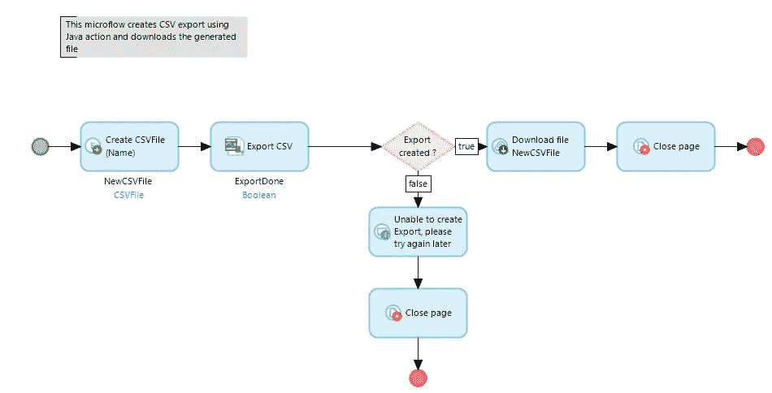

Microflow created for Exporting data

考虑到导入中使用的相同域模型，创建一个 CSV 文件实体对象，调用 CSV 模块中的“导出 CSV”Java 操作，它采用与“导入 CSV”操作相似的参数。但是在这种情况下，要调用的微流需要由我们创建，最后，一个下载活动为用户提供文件。

## 导出 CSV 操作参数

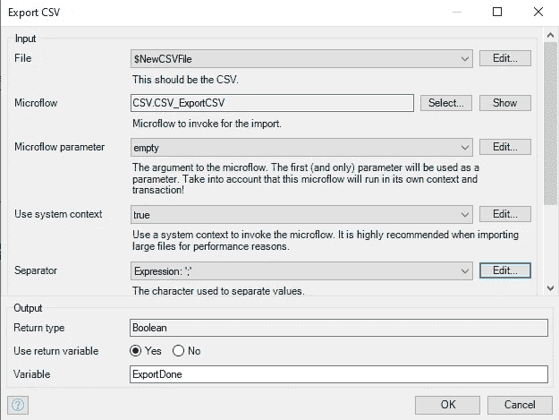

Parameters to be passed in Export action

1.  传递新创建的对象的 CSV 文件
2.  根据需要的分隔符值，在本例中为“；”
3.  这个动作的返回类型是 Boolean，我们将使用它来决定导出是否完成
4.  在这种情况下，要调用的微流是我们自己创建的，如下所示

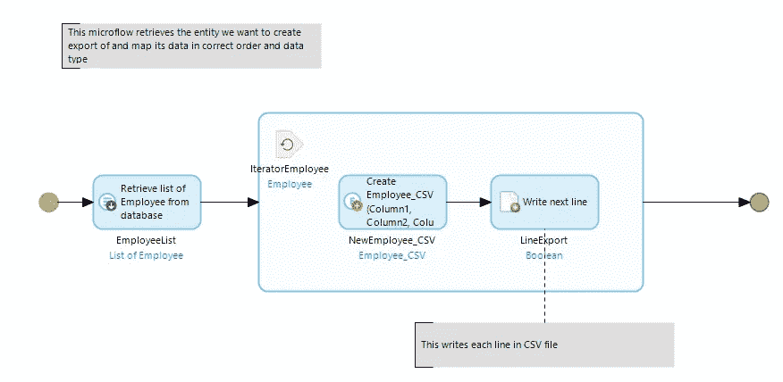

Microflow to be invoked in Export action

在这种情况下，我们检索雇员数据并对其进行迭代，首先将其映射到临时实体，以将数据类型处理为字符串，同时避免重新排列，然后通过下一个 java 操作“写入下一行”映射列，它用于以正确的列顺序将数据逐行写入 CSV 文件。

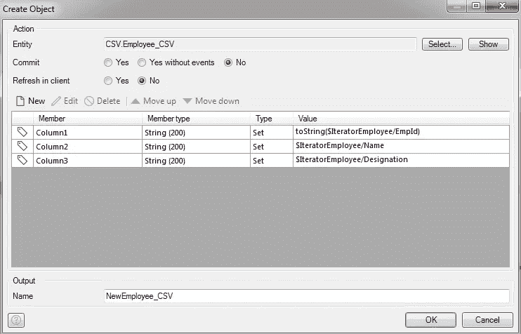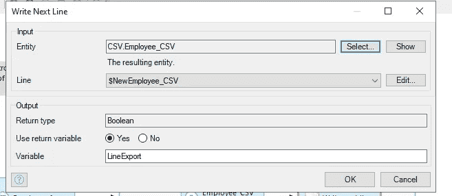

Left : Parsing and Mapping of Employee data to Temp entity, Right : Parameters taken by ‘Write Next Line’ action

一旦处理完成，我们根据“导出 CSV”动作的返回值返回到主微流，CSV 文件将为用户下载。

(注意:再次将数据映射到临时实体，而导出是您的选择，这里这样做是为了避免通过“写下一行”操作进行重新排列)

## 结果

Successful data export in CSV format

# 摘要

CSV 模块是 Mendix 提供的一个高效模块，具有更多功能，如“ExportOQLtoCSV”、“EportSQLtoCSV”、“CountNumberofLines”，可以利用这些功能以高性能和低内存消耗实现大量数据的导入/导出。

## 阅读更多

 [## Mendix World 2021 |召集您的应用开发团队 2021 年 9 月 7 日至 9 日

### 好像你需要说服…在一个全球制造商社区，他们想通过探索什么来相互学习…

bit.ly](https://bit.ly/MXW21)  [## 曲目|门迪克斯世界 2021

### 在今年 Mendix World 开幕之前，手工制作您的议程。浏览专为您量身定制的 8 个专题讲座中的 85 个以上专题讲座…

www.mendix.com](https://www.mendix.com/mendix-world/tracks/) 

*   [https://marketplace.mendix.com/link/component/108605](https://marketplace.mendix.com/link/component/108605)
*   https://docs.mendix.com/appstore/modules/excel-exporter
*   【https://docs.mendix.com/refguide/oql 

*来自发布者-*

*如果你喜欢这篇文章，你可以在我们的* [*媒体页面*](https://medium.com/mendix) *或我们自己的* [*社区博客网站*](https://developers.mendix.com/community-blog/) *找到更多类似的内容。*

*希望入门的创客，可以注册一个* [*免费账号*](https://signup.mendix.com/link/signup/?source=direct) *，通过我们的* [*学苑*](https://academy.mendix.com/link/home) *获得即时学习。*

有兴趣加入我们的社区吗？你可以加入我们的 [*Slack 社区频道*](https://join.slack.com/t/mendixcommunity/shared_invite/zt-hwhwkcxu-~59ywyjqHlUHXmrw5heqpQ) *或者想更多参与的人，看看加入我们的*[*Meet ups*](https://developers.mendix.com/meetups/#meetupsNearYou)*。*