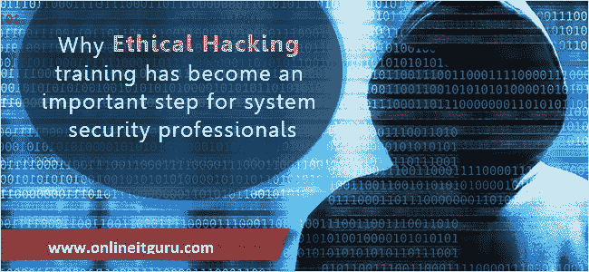
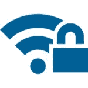
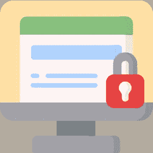

# 道德黑客的重要性:为什么道德黑客是必要的？

> 原文：<https://medium.com/quick-code/importance-of-ethical-hacking-why-is-ethical-hacking-necessary-2d7bd29e0806?source=collection_archive---------1----------------------->

*黑客攻击*被定义为非法使用他人或组织的计算机系统或其资源。*黑客*指的是一个对理解和深入研究计算机系统的细节感兴趣的人，以最大限度地提高其能力。尽管如此，如果得到许可，黑客行为可能是合法的。经过许可，没有任何恶意地侵入系统的人被称为 **e *道德黑客*** ，这个过程被称为*道德黑客。*在本文中，让我们来看看道德黑客在当今世界的重要性更多关于 [**道德黑客培训的信息**](https://onlineitguru.com/ethical-hacking-course.html)

本文讨论的主题有:

*   道德黑客的重要性
*   道德黑客提供的服务
*   道德黑客的需求

# 道德黑客的重要性

黑客的手段指的是编码目的所需的程序的演变，这反过来又让位于更有前途的安全性和更高的效率。另一方面，对特定兴趣的过度和痴迷会导致问题。

**黑客攻击有不同的类型，即:**

*   后门黑客
*   网站黑客
*   道德黑客
*   网络黑客
*   密码黑客
*   道德黑客

最常见和最广泛使用的形式之一是道德黑客。*它被定义为有助于承诺和增强客户系统的各种级别的安全网络的资源和系统。*此外，这种黑客行为得益于更好的基础设施质量，并强化了客户的系统。

# 道德黑客提供的服务

道德黑客提供以下服务

*   无线安全
*   应用程序安全性
*   网络安全性

让我们详细探讨一下这些服务。

# 无线安全

这些服务提供并评估现有基础设施和网络中的安全级别，以提供承诺系统可访问性的指令，同时维护其完整性。无线安全分为三个步骤，即:

*   识别漏洞
*   采取安全措施
*   部署威胁

# 应用程序安全性

这用于深入挖掘和处理胖客户端(Java)和瘦客户端(web 浏览器)所面临的挑战的重要性和范围。应用程序安全性由客户端测试和 web 应用程序测试等服务组成。

# 网络安全性

它提供有关网络、服务、系统设备及其协议的信息。它还检查和调查了在组织环境中互联网电话会议的应用。网络安全的主要目标是便于呈现对其自身发展的政治影响。

# 道德黑客的需求

如今，道德黑客被用作分析一个组织的安全系统和程序的常见和受欢迎的过程。它与安全判断、红队、入侵测试和漏洞并行运行。这里有一些要点可以帮助你更好地理解道德黑客及其必要性。

*   一个道德黑客在入侵计算机系统时通常倾向于扮演安全专家的角色。它们渗透到系统中，以便检测风险和对风险的非法访问。他们不断要面对两个坎——***威胁*** 和 ***脆弱性*** 。
*   道德黑客遵循安全黑客的指导方针，以确保系统的高效运行。这是一个复杂的过程，因此与 ***渗透测试*** 相比，一个有道德的黑客需要很高的技能。
*   道德黑客在企业部门和组织中很方便，可以打击破坏系统的非法行为，并对黑客采取预防措施。
*   特洛伊木马、病毒和垃圾邮件等危险软件会对系统和存储空间造成破坏和干扰。道德黑客在这里很有用，因为它有助于发现这些针对系统的病毒攻击，此外，还提供了 ***高级别的安全性*** 。
*   道德黑客的主要目标是 ***承诺无线基础设施的安全*** ，这是当前大多数商业公司的目标。
*   道德黑客拥有 ***搜集访问*** 一家公司的网络和信息系统的特权。这自动为智力攻击和威胁(如病毒)提供了安全性。结果，道德黑客也测试了程序和软件的安全等级。

# 结论

由于安全威胁的复杂性成倍增加，对道德黑客的需求及其在世界范围内的重要性也在迅速增加。采用主动的方法和安全观可以帮助组织有效地保护自己的声誉。好了，就是这样，伙计们！这就把我们带到了本文的结尾。