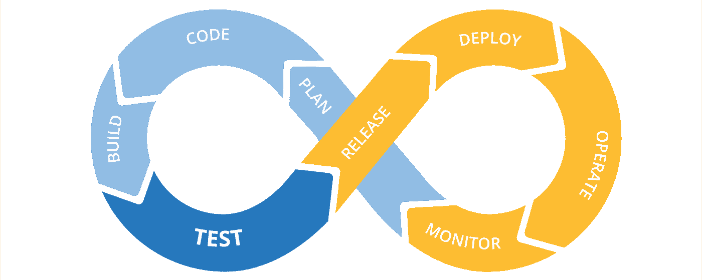
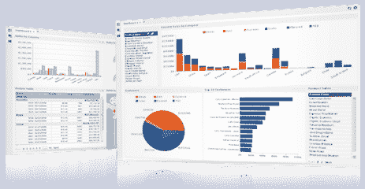

# 选择正确的自动化测试工具的重要性

> 原文：<https://medium.com/globant/importance-of-selecting-right-automation-testing-tool-f0c7c59c2fa4?source=collection_archive---------1----------------------->

如果你想有一个成功实现的自动化项目，那么为它确定合适的工具是至关重要的。这是获得预期结果的最佳方式之一。

让我们举一个 web 应用程序开发的例子来更好地理解自动化测试工具的重要性。想象你正在为你的企业开发一个网站。现在，在开始时，您不需要任何自动化，所有的测试都可以手动完成。但是，当您的业务开始增长并得到更多受众的认可时，例如，您可能需要自动化一些支持跨浏览器测试的功能流程，以确保您的 web 应用程序为所有用户提供相同的体验。将来，您可能需要在移动设备上做同样的事情，或者调用 REST API 来执行一些验证。

过一段时间后，回归测试时间将会增长，自动化将会是你的业务保持增长的关键部分。这就是为什么从一开始就选择一个能够支持所有你想要的功能的自动化工具是至关重要的。

# 测试工具的类型

有三种主要类型的自动化测试工具，团队在选择时可以考虑。

# 开源工具

开源工具是指源代码**公开**发布以供使用或从其原始设计**修改后免费使用的工具。**

开源工具几乎可以用于测试过程的任何阶段，从测试用例管理到缺陷跟踪。与商业工具相比，开源工具的功能可能更少。

# 商业工具

商业工具是为销售或服务于商业目的而生产的软件。与开源工具相比，商业工具从供应商那里获得了更多的支持和更多的特性。

# 自定义工具

在一些测试项目中，被测试的软件、环境和过程可能有特殊的特征。有时开源或商业工具不能满足需求。因此，团队必须考虑定制工具的开发，这可能包括合并其他几个工具，开源的或商业的。

# 团队配合

谁将负责自动化？，如果测试自动化将由程序员或程序员/测试员来完成，那么工具可能应该是代码库或包。同样，如果工具有一个记录/回放前端，一群非技术测试人员会更舒服。

一些工具记录动作，然后创建代码，或者创建一个可视化前端，允许程序员“顺便”查看可视化背后的代码。这些提供了最好的两个世界。

这里的主要问题是，希望学习该工具的人需要愿意并且能够这样做，并且有时间这样做。如果测试过程落后，指派测试人员学习新工具将会增加工作量，进一步减慢软件交付过程。

如果回归测试过程需要几天或几周的时间来运行，那么自动化它，尤其是从前端开始，将会减少测试时间，创建一个工作的积累直到一些平衡点。即使在盈亏平衡点之后，工具不再减慢测试人员的速度，旧的积压也需要被清除。

当然，如果项目是新的，或者如果公司打算雇用一个新人来做测试工具的工作，这些反对意见可能不适用。因此，要分析该工具将如何添加到团队中，它会破坏什么，谁来做这项工作，以及这些人是否有能力和时间来做这项工作。

# 编程语言和开发环境

如果这个工具有一种编程语言，有两种方法:使用一种非常强大且容易学习的高级语言，比如 Ruby，或者用与生产程序员相同的语言编写。

如果测试是用与生产代码相同的语言编写的，并且在持续集成(CI)周期中运行，那么提交失败并让程序员修复错误是可能的。更好的是，该工具可以作为开发人员集成开发环境(ide)中的插件运行，从而最大限度地减少程序员需要进行的切换。

如果该工具在 ide 之外运行，并且使用不同的编程语言，那么当该工具报告“失败”时，程序员不太可能学习新的工具或者做支持该工具的工作

# 版本控制和 CI

大多数想要避免自动化延迟的团队最终会将工具运行包含到 CI 流程中。也就是说，CI 系统检查代码，执行构建，运行单元测试，并创建一个实际的服务器(如果需要的话)和一个客户机，可能将软件放在一个移动设备上。然后，CI 系统使用功能工具开始一轮端到端测试。

在 CI 下运行测试产生了一个新的需求:测试需要用代码进行版本控制。当新的分支被创建时，我们将想要创建一个新的测试分支。这样，多个配置项管道可以同时运行，具有多个“正确”的定义

这意味着该工具需要从命令行运行，并产生 CI 系统可以解释的输出。或者至少需要能够捕获输出，并将其转换为 CI 系统可以读取的内容。许多 CI 系统有漂亮的仪表板和饼状图，可以向利益相关者展示结果。要使用它们，数据需要从工具中出来，进入 CI 系统。

一旦该工具在 CI 下运行，就能让它向团队报告失败。这是通过跟踪谁提交了导致失败的提交，然后让程序员调试并“绿化”测试或修复代码来实现的。如果程序员知道并支持这种语言，并且测试以纯文本的形式存储，那么这就容易多了。即使存储在版本控制中，也很难区分二进制格式的文件之间的差异。

# 报告

如果没有可以使用的有意义的输出，测试工具就是一个糟糕的投资。仪表板和图表可能是强大的功能——除非团队计划将结果推送到另一个具有更好报告的系统中。

随着时间的推移跟踪测试运行也是一个强大的特性。不同层次的利益相关者关心不同类型的结果。级别足够高的高管可能甚至不想像了解趋势一样了解通过率/失败率。中层管理人员希望了解流程的流向。技术人员希望深入了解给定测试中到底出了什么问题，如果可能的话，观看执行视频。

# 数据源

如果我们使用一个自动化框架，比如关键字驱动或数据驱动，我们需要能够将我们的工具连接到任何数据源。如果该工具能够很容易地提供与不同数据源的连接，那将是非常有益的。

查看对常见数据源的支持，如 CSV 文件、Excel 文件、XML 文件和多种类型的数据库。如果这些都存在于一个工具中，那么你就可以开始了。

# 与 bug 管理工具集成

很有可能你的组织已经在使用任何测试用例或者 bug 管理工具了。显然，公司可能希望他们的自动化工具与他们现有的测试用例管理工具相集成，以便他们的整个应用程序生命周期得到适当的管理。在选择测试自动化工具时，也应该看到这个方面。

# 易于测试用例的创建和维护

并不是每个工具都能处理各种情况。因此，为了确保您选择的工具满足您的需求，尝试自动化您的应用程序的几个测试用例，以了解该工具是否满足您的需求。如果您的搜索范围缩小到高级工具，那么可以使用工具的试用版来完成。

此外，为了避免在测试用例维护上花费比测试用例创建更多的时间，请确保选择一个适合您的预算(包括维护成本)的工具。有一些工具能够在应用程序发生微小变化的情况下自我修复测试用例。

这样的工具有助于降低测试用例维护的成本。此外，如果工具支持测试用例执行的暂停和恢复，将有助于获得更好的调试体验。

# 可重用性

为了避免在多个测试用例中多次编写相同的代码，并避免重复工作，请寻找允许在不同的测试用例及项目中重用已经创建的测试步骤的工具。

# 将您现有的自动化工具作为基准进行比较

如果您正在使用像 Selenium test automation 这样的开源自动化工具，那么可以考虑将它作为一个基准来评估和确定您的项目的最佳自动化测试工具。为此，您需要了解 Selenium 自动化工具的优缺点。

例如，Selenium 是一个开源的免费工具，允许用户测试他们的 web 应用程序和站点。并且它为自动化测试提供了独特的特性，例如记录回放以创建记录回放测试脚本，以及对多种语言的语言支持，如 C#、Ruby、JavaScript、Python、Java 等。但是，使用 Selenium WebDriver，您无法获得良好的客户支持。

Selenium 是那些熟悉编码技术并通过用户界面测试网站的测试人员的首选。此外，Selenium Suite 的维护并不容易，尤其是对于经常监督手动和自动化测试的测试人员来说。

因此，选择您当前的测试工具作为基准并将其与您决定购买的自动化测试工具进行比较是至关重要的。

# 在购买工具之前考虑你的预算

在根据上述标准比较了不同的自动化工具之后，您最不想检查的就是您的预算。预算是购买自动化测试工具时最重要的考虑因素之一，因为根据您的需求，如果工具太贵，那么您应该避免购买它。

但是，如果您和您的组织已经最终决定购买该工具，那么建议下载并使用该工具的试用版，以分析其性能以及是否值得投入这么多资金。

在使用试用版之后，如果您发现该工具有任何问题，那么不要在它上面花太多时间，寻找另一个自动化测试工具。只有当你确定工具的功能和性能时，才购买它。

# 验证项目的适当标准

在为您的项目决定最佳自动化工具之前，您应该考虑以下要点:

*   测试的执行对于任何项目成员来说都必须是简单的，这样他们就可以在需要的时候有效地运行测试。此外，对于没有多少技术知识的非技术用户来说，这应该很容易。
*   由该工具生成的测试报告对于管理团队来说必须是直观和简单的，以便他们能够理解测试过程。
*   自动化测试工具应该支持所有三个平台，包括 web、桌面和移动应用程序。
*   测试脚本的开发和维护必须减少人力和时间资源管理。
*   当进行 web 应用程序的跨浏览器测试时，自动化工具必须支持各种各样的浏览器和平台。
*   支持关键字驱动测试，因为它是数据驱动测试框架的扩展。
*   在一些场景中，测试人员需要编写代码。因此，自动化工具必须支持所需的语言，以便测试人员可以轻松地编写代码。
*   当选择一个自动化测试工具时，技术支持和帮助是最重要的，所以确保你的工具得到持续的技术支持。
*   附加功能，如屏幕截图测试、视觉外观测试、实时测试等。必须包含在自动化工具中。

比较不同自动化工具的这些关键因素，然后从中选择最佳因素。