# 升级的重要性以及如何升级 OMC 代理

> 原文：<https://medium.com/oracledevs/importance-of-upgrades-and-how-to-upgrade-omc-agent-30dab28a1b4f?source=collection_archive---------2----------------------->

## 作者:[mono war Mukul](https://medium.com/u/3757393c69bd?source=post_page-----30dab28a1b4f--------------------------------)(OCM)[NASS yam Basha](https://medium.com/u/ba3f0a72ff81?source=post_page-----30dab28a1b4f--------------------------------)(甲骨文王牌总监，OCM)

## **简介**

在本文中，我们将介绍如何在特定目标上升级代理软件。要升级代理软件，我们将从 Oracle Management Cloud 控制台启动该过程，该控制台提供简单的导航和逐步说明。

**为什么要升级代理？**

升级或修补对于任务关键型系统非常重要，在我们的案例中，我们正在处理目标上 OMC 代理的升级，这也非常重要，因为代理收集重要数据并发送到 OMC。例如，数据库由于严重问题而没有运行，代理将定期收集数据并作为通知推送到 OMC。

因此，代理规则至关重要，应该全天候可用，并且在发送数据时应该透明。然而，在大多数情况下应该有一个解决方法，在某些情况下，打补丁/升级有助于永久修复 bug。例如，在我们以前的文章中，如果我们看到代理报告了以下致命警报，并且除了将代理版本升级到 1.33 和更多详细信息之外没有解决方法，请遵循以下错误相关文档。

> " ***Oracle 管理云:FetchletException:结果有重复键值(文档 ID 2478679.1)*** "

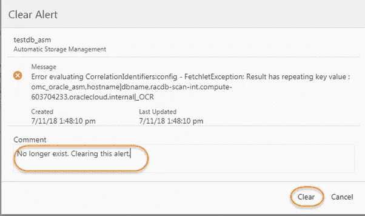

Example ofAgent Fatal Alert

**如何升级代理**

要升级代理软件，请连接到 Oracle 管理云控制台，然后按照导航“管理云→管理→代理”进行操作

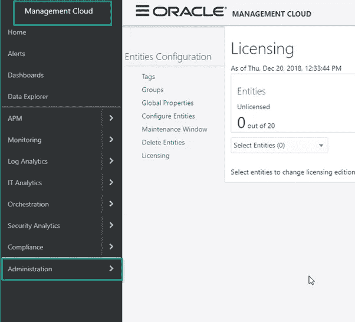

Navigation to Agents — I

在下一页，单击代理

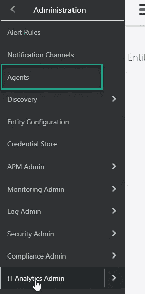

Navigation to Agents — II

我们可以看到所有与 OMC 相关的云代理。好的方面是，如果有任何新的代理版本可用，它会在版本列显示通知。

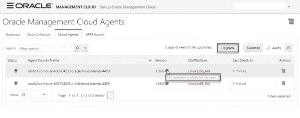

New version Info from OMC

在我们的示例中，我们可以看到单个 RAC 群集的两台主机。这里没有规定我们必须一次性升级两个代理，我们也可以执行代理的滚动升级。

要执行单主机代理升级，我们可以在每个代理上看到“Action”按钮。单击“操作”按钮，然后我们可以看到“升级”选项。但是，我们将为两个节点执行代理升级。因此，点击升级按钮，如下图所示

> ***注意:当我们升级代理时，它将升级到 OMC 提供的更高版本。***

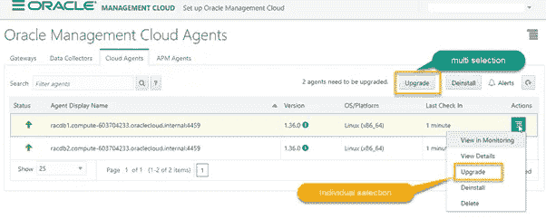

Upgrade choices with agents

现在，让我们继续升级多个节点的代理。

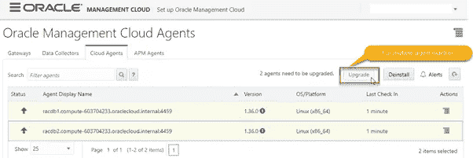

Upgrade of all the agents

单击“升级”按钮后，将列出要升级的代理，然后单击“是”进行最终确认。

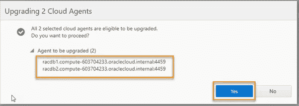

Agents to be upgraded — Confirmation

提交代理升级请求后，我们可以看到作业处于“已提交”状态。

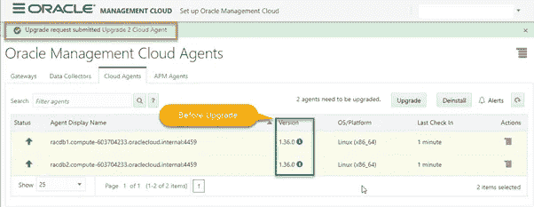

Job Submitted

观察屏幕上方和下方的“版本”列，我们可以看到时钟符号，这意味着代理的升级当前正在进行中。

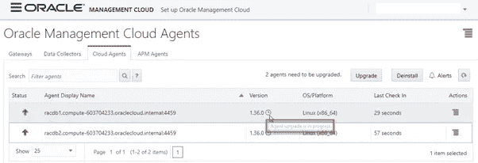

Agent upgrade is in progress

对于作业的交互式监控，我们可以查看特定代理的更多详细信息，如下所示。

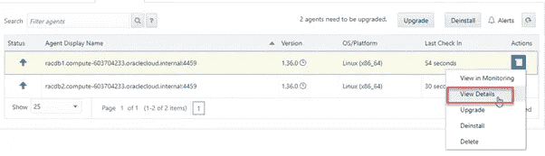

View upgrade details of the agent

该目标控制台显示状态的完整详细信息，包括升级的日志文件和当前状态。

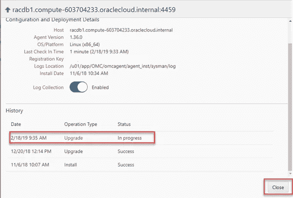

Outstanding status of the Agent Upgrade

现在我们可以看到代理升级到了最新版本。要再次查看整体状态，请从特定代理的“操作”菜单中选择“查看详细信息”。

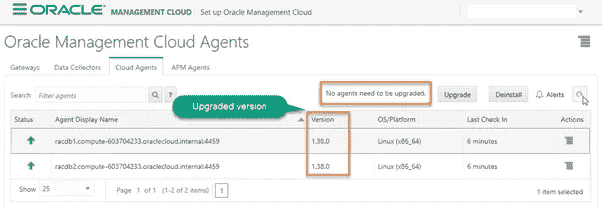

The new version of the agent

## **总结**

我们已经通过其中一个示例了解了升级/修补基础架构的重要性，还了解了如何通过对代理升级过程进行故障排除来升级 Oracle RAC 节点的代理。

## **作者简介**

**Nassyam Basha** 是一名数据库管理员。他有大约十年的 Oracle 数据库管理员工作经验，目前是 eprosed KSA 公司的数据库专家。他拥有马德拉斯大学的计算机应用硕士学位。他是 Oracle 11g 认证大师和 Oracle ACE 总监。他以超级英雄的身份积极参与甲骨文相关论坛，如 OTN，甲骨文支持被授予“大师”称号，并担任 OTN 版主，与 OTN 一起撰写了大量关于 Toad World 的文章。他维护着一个与甲骨文技术相关的博客，[www.oracle-ckpt.com](http://www.oracle-ckpt.com/)，可以通过[https://www.linkedin.com/in/nassyambasha/](https://www.linkedin.com/in/nassyambasha/)找到他

**Monowar Mukul** 目前担任首席 Oracle 数据库专家。我是 Oracle 认证大师(Oracle 12c 认证大师管理、Oracle 12c 认证大师 MAA 和 Oracle 11g 认证大师管理)。他在 Oracle MAA 空间担任了 17 年的 Oracle 数据库管理员顾问，负责数据库云服务器和非数据库云服务器系统、Oracle 云空间和 SOA 中间件。他曾在澳大利亚的多个商业领域工作，包括高等教育、能源、政府、采矿和运输。作为一名首席 Oracle 数据库专家，他展示了高度发展的批判性思维和分析技能。你可以在[https://www.linkedin.com/in/monowarmukul/](https://www.linkedin.com/in/monowarmukul/)找到关于他和他的工作成就的更多细节