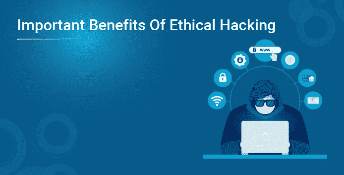
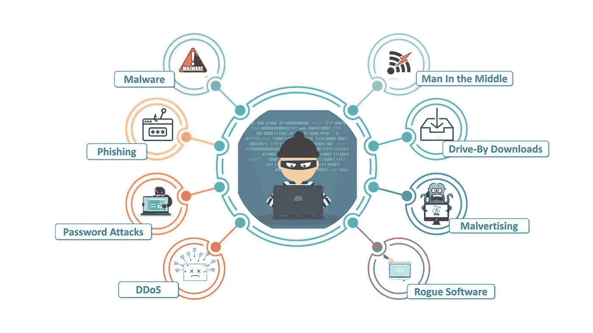
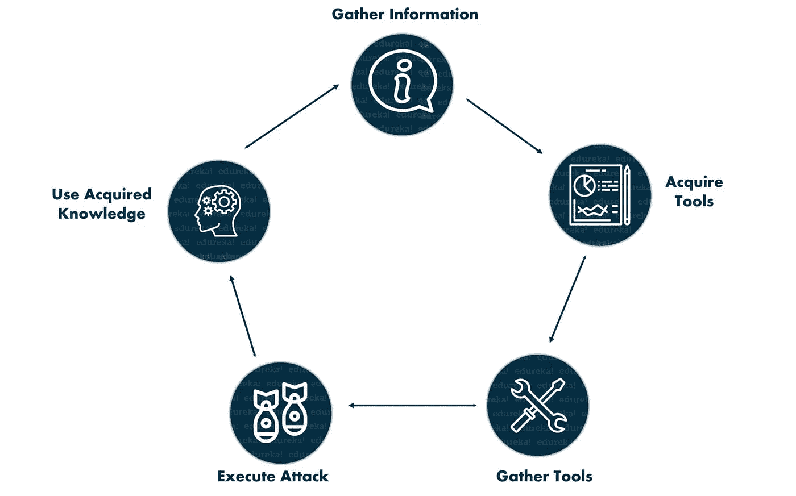

# 道德黑客的重要好处

> 原文：<https://medium.com/edureka/important-benefits-of-ethical-hacking-2b39f711feeb?source=collection_archive---------2----------------------->

道德黑客是时代的需要。主要原因是这些天产生的数据量和随之而来的安全风险。在本文中，我们将讨论道德黑客的好处。本文将涉及以下几点:

*   遭受网络攻击的组织
*   解开黑客心态
*   开发和质量保证
*   专业发展
*   向云过渡
*   雇用

那么让我们开始吧，

# 道德黑客的好处

人们注意到，对道德黑客行为的需求突然增加，这是技术进步导致全球技术领域出现许多威胁的结果。随着网络攻击和网络恐怖主义的发展，道德黑客作为一个组织，保护他们的系统和信息免受非法黑客的攻击。

理解和习惯道德黑客包括深入研究黑客的心理和技术，从而学习如何通过识别和评估软件和计算机网络中的漏洞来渗透到系统中。如果有效和正确地实施和运用，追求道德黑客可以为组织增加巨大的价值。

继续这篇关于道德黑客的好处的文章

# 遭受网络攻击的组织

银行很容易受到网络威胁，因为它们是黑客持续攻击的目标。世界各地的银行花费了数十亿美元来保护自己免受此类攻击并提高数字安全性。由于世界各地每天都在发生大量的数据攻击和信息泄露事件，安全性在当今时代是一项重要的要求。为了抓住一个黑客，需要有一个黑客的心态，这是道德黑客的根本。道德黑客几乎总是在组织同意的情况下保护他们的计算机和网络系统。

以下是一些常见的威胁类型

继续这篇关于道德黑客的好处的文章

# 解开黑客心态

道德黑客的首要好处是它有能力升级企业组织的网络，并彻底保护它免受网络空间的威胁。网络安全的主要威胁总是黑客。因此，判断黑客是如何工作和操作的非常重要。从一个系统中完全消除所有的威胁是不可能的，因此一个人必须把自己放在黑客的位置上，以便能够作为一个黑客来执行他们的工作。

继续这篇关于道德黑客的好处的文章

# 开发和质量保证

安全测试需要更多的关注，因为它经常被忽视，这使得软件非常容易受到攻击和威胁。一个训练有素的有道德的黑客可以帮助团队高效成功地进行安全测试，而不是依赖需要更多时间和精力的内部实践，从而为团队提供主要动力。

黑客的概念导致了某些工具的开发，以消除突出和常见的漏洞。这使得开发人员更容易了解可以避免的编码错误。

继续这篇关于道德黑客的好处的文章

# 专业发展

对拥有网络安全技能的工人的需求与巨大的未开发人才数量之间存在巨大差距。美国网络安全领域约有 35 万个职位空缺，预计到 2021 年将进一步增加 10 倍。

虽然对于那些希望将黑客和网络安全人才留在公司内部的公司来说，这可能不是一个令人兴奋的消息，但对于潜在的黑客和对这一特定领域感兴趣的人来说，这是一个充满希望的机会。研究道德黑客可以为突破网络安全领域提供方法，并从中获益。

继续这篇关于道德黑客的好处的文章

# 向云过渡

在虚拟化和 IT 外包扮演着重要角色的信息技术世界中，云技术的发展势头越来越猛。这段话引起了威胁，并增加了这些威胁的强度，这证明了对道德黑客的需求。云计算经常见证许多安全漏洞，并对许多数据泄露和黑客攻击负责。这是个人和组织关心的主要问题。

应该雇用有道德的黑客来控制这种日益增长的担忧，并享受云的好处，而不让它对系统及其安全性产生负面影响。企业永远需要跟上发展趋势，因此需要加强他们的安全网络以跟上网络世界的步伐。

继续这篇关于道德黑客的好处的文章

# 雇用

随着求职竞争的加剧，任何让你与众不同的优势都会受到重视，因为它能证明你的能力，并能帮助你得到这份工作。这一点在初级职位上尤为突出，在这些职位上，雇主和组织不太注重实际经验，而是寻找让候选人脱颖而出的特殊技能。

进入网络安全领域的一个非常有前途的方法是收集相关的认证。最负盛名的网络安全认证之一是 EC-Council 提供的认证道德黑客。如果申请人追求这一认证，它展示了他对该科目的渴望，并且通过考试成功地证明了申请人对于期望角色的能力和技能。

为什么要雇佣一个道德黑客？

*   构建一个计算机系统，防止系统受到黑客和恶意威胁，同时保护它们。
*   采取预防措施以避免违反安全规定。
*   保护业务往来中的客户数据和信息。
*   在组织的所有层级建立和促进安全意识。

网络防御人员和风险管理专家可以很容易地理解和判断黑客的心态，这有利于确定和检查网络系统中可能存在的潜在威胁。安全测试程序和过程可以在渗透测试工具和实践的帮助下得到增强和改进。为了更好地保护数据，员工可以接受道德黑客培训，以进一步建立网络防御。如果你想查看更多关于人工智能、DevOps、道德黑客等市场最热门技术的文章，你可以参考 Edureka 的官方网站。

请留意本系列中解释网络安全其他方面的其他文章。

> *1。* [*什么是网络安全？*](/edureka/what-is-cybersecurity-778feb0da72)
> 
> *2。* [*网络安全框架*](/edureka/cybersecurity-framework-89bbab5aaf17)
> 
> *3。* [*隐写术教程*](/edureka/steganography-tutorial-1a3c5214a00f)
> 
> *4。* [*什么是网络安全？*](/edureka/what-is-network-security-1f659407dcc)
> 
> *5。* [*什么是计算机安全？*](/edureka/what-is-computer-security-c8eb1b38de5)
> 
> *6。* [*什么是应用安全？*](/edureka/application-security-tutorial-e6a0dda25f5c)
> 
> *7。* [*渗透检测*](/edureka/what-is-penetration-testing-f91668e2291a)
> 
> *8。* [*伦理黑客教程*](/edureka/ethical-hacking-tutorial-1081f4aacc53)
> 
> *9。* [*关于 Kali Linux 你需要知道的一切*](/edureka/ethical-hacking-using-kali-linux-fc140eff3300)
> 
> *10。* [*道德黑客利用 Python*](/edureka/ethical-hacking-using-python-c489dfe77340)
> 
> *11。* [*DDOS 攻击*](/edureka/what-is-ddos-attack-9b73bd7b9ba1)
> 
> *12。* [*MacChanger 与 Python*](/edureka/macchanger-with-python-ethical-hacking-7551f12da315)
> 
> *13*[ARP 欺骗 ](/edureka/python-arp-spoofer-for-ethical-hacking-58b0bbd81272)
> 
> 14。 [*Proxychains，anon surf&MAC change*](/edureka/proxychains-anonsurf-macchanger-ethical-hacking-53fe663b734)
> 
> *15。* [*足迹*](/edureka/footprinting-in-ethical-hacking-6bea07de4362)
> 
> *16。* [*网络安全 50 强面试问答*](/edureka/cybersecurity-interview-questions-233fbdb928d3)

*原载于 2019 年 8 月 8 日*[*https://www.edureka.co*](https://www.edureka.co/blog/benefits-of-ethical-hacking/)*。*