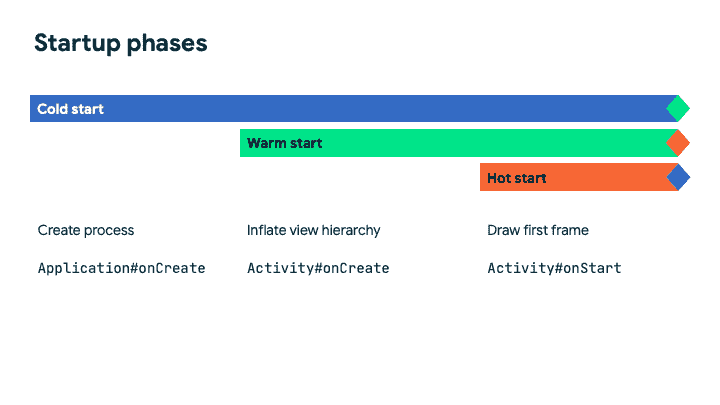

# 重要的绩效指标

> 原文：<https://medium.com/androiddevelopers/important-performance-metrics-c7dacf018eb3?source=collection_archive---------0----------------------->

Illustration by Claudia Sanchez

在您开始有效地处理性能之前，我们建议您熟悉关键性能指标。通过了解应该查看哪些指标，您将更容易检查、改进和监控性能。

这篇关于**重要性能指标**的 MAD Skills 文章将向您介绍**初创公司**和**帧速率指标**，并为本系列其余部分的性能带来重要数据点。应用程序启动和创建流畅的用户体验对用户满意度和应用程序的单个业务指标有着持久的影响，这就是为什么我们选择这些领域作为本文的重点。

在本系列的后面，我们准备了工具和库，使您可以更容易地检查、改进和监控性能。

你可以在这里观看这篇文章的视频。

# 启动阶段

应用启动是与用户互动的第一点。留下持久而积极的第一印象在规模上甚至更重要。所以你的目标是让 app 启动尽可能的快，无缝，流畅。

> App 启动可以分三个阶段来衡量:冷启动、暖启动、热启动。

启动阶段由应用程序的当前状态决定。

App startup phases

## 冷启动

创建应用程序的进程时，冷启动开始。这是用户在安装您的应用程序后第一次启动它、在重启设备后启动应用程序或在系统因某种原因完全停止应用程序后重启应用程序时的体验。

在冷启动期间，`Application.onCreate()`被调用。你的应用程序启动所需的一切都是从磁盘加载的。当冷启动开始时，内存缓存也是空的。冷启动是最慢的启动类型，因为它们在进程创建时开始，在热启动完成的同时结束。若要体验应用程序的冷启动，请强制关闭它，然后从启动器再次打开它。

> 冷启动应该快于 500 毫秒。

当冷启动时间超过 500 毫秒时，你的用户会注意到，可能会变得越来越不耐烦，可能会决定离开你的应用。所以保持冷启动尽可能快是极其重要的。

## 热启动

热启动是从调用`Activity.onCreate()`时开始测量的，就在视图层次膨胀之前。

此时，一些资源已经膨胀，内存缓存已经预热。

> *热启动通常发生在活动被销毁后打开应用程序，但应用程序的进程仍在运行时。*

如果一个应用程序已经在后台运行了一段时间，但还没有长到让系统终止整个进程，这种情况就会发生。此外，每当方向改变迫使活动被破坏和重新创建，这是一个温暖的开始。

## 热起动

最后也是最短的 app 启动类型叫做热启动。在热启动期间，正在运行的应用程序(例如暂停的活动)变得对用户可见，并进入已启动状态。

这里第一帧准备好绘制，调用`Activity.onStart()`。当你在应用程序之间来回切换时，可能会发生热启动。

由于启动类型的性质，冷启动需要的时间最多。暖启动和热启动时间会更短。

> 所有三种启动类型，冷、暖、热，都是从它们相应的起始点到两个结束状态中的至少一个来测量的。

# 启动结束状态

## 初始显示时间

默认的应用程序启动结束状态称为初始显示时间。简称 **TTID** 。当您的应用程序的第一个框架准备好绘制时，它会自动报告。

您也可以通过打开 logcat 并查找值为`Displayed`的`ActivityTaskManager`标签来查看 TTID。它会告诉你显示一个特定的活动花了多少时间。因为这是自动报告的，所以不需要您进行任何配置。默认情况下，每个应用程序都会报告这一情况。

## 完全显示的时间

虽然初始显示时间是自动报告的，但下一个状态可以自定义。这就是所谓的充分展示时间，或 TTFD。完全显示时间是一个可选指标，Android 可以使用它来进一步优化应用程序的启动时间。在应用程序上运行启动基准时也会用到它。

在 logcat 中也可以看到带有`ActivityTaskManager`标签的 TTFD。寻找`ActivityTaskManager: Fully drawn`。

当所有东西都画在屏幕上，并且用户与应用程序交互所需的数据可用时，您应该报告完全显示的时间。

> 要使用的 API 是 Activity 的 reportFullyDrawn()

`reportFullyDrawn`不依赖于活动生命周期方法，您必须选择合适的时间调用对您的应用有意义的 API。

虽然在应用程序准备就绪时调用该方法很重要，但不要求在帧级别上绝对精确*。*

Android 示例应用程序中的[现在被认为是在兴趣和提要都已加载的情况下被完全绘制。](http://github.com/android/nowinandroid)

一旦满足这两个状态，当当前局部视图准备好被绘制时，我们调用`reportFullyDrawn`。你可以在 GitHub 的[中查看代码的更多细节。](https://github.com/android/nowinandroid/blob/bc2fc8bb5e07139562a523fa33509d405b98d2b6/feature-foryou/src/main/java/com/google/samples/apps/nowinandroid/feature/foryou/ForYouScreen.kt#L168)

# 帧时序度量

确保不丢帧对于流畅的用户体验非常重要。大多数帧在静态下不会被丢弃，但是当用户滚动或者你以其他方式制作动画内容时会被丢弃。如果一个应用程序在主线程上做了太多的工作来满足帧计时窗口，就会导致缓慢和冻结的帧。

我们称这种行为为邱建。邱建非常令人沮丧，所以知道如何避免它是很重要的。

## 帧速率

每秒钟可以画很多次屏幕。每秒重新绘制的数量称为帧速率。

历史上，Android 设备的刷新率为每秒 60 帧。这给了你的应用程序 1/60 秒的时间在主线程上执行工作，然后一个帧就会被延迟或者最终不得不被丢弃。最近，帧速率已经增加到每秒 90 帧甚至 120 帧。

此外，设备还可以根据用户的选择、开发人员的决定，甚至设备的电源或散热状态，在不同的帧速率之间切换。

在我们的现代 Android 开发指南中，我们建议您优化至少每秒 90 帧的帧速率。这意味着两帧之间的所有工作必须在小于 11.1 毫秒的窗口内完成。*时间非常非常少。*

> 实现高帧速率的一个很好的方法是让尽可能多的工作远离主线程。

Different frame rates for an Android device

# 当你等待的时候

在下一篇文章中，我们将向您详细介绍检查性能问题。

此外，请务必查看我们关于性能调试的完整 MAD 技能系列，了解如何检查代码中正在发生的事情。

去看看我们改进的开发者[文档](http://d.android.com/performance)，我们已经用 MAD 指南更新了它。

要获得更多的实践经验，请查看 GitHub 上的[示例](http://github.com/android/performance-samples)。

或者参加[宏观基准测试代码实验室](https://goo.gle/baseline-profiles-codelab)或[基准配置文件代码实验室](https://goo.gle/baseline-profiles-codelab)以获得主题的实际指导。

此外，确保在视频评论或 Twitter 上提出你的问题，使用 [#MADPerfQA](https://twitter.com/search?q=%23MADPerfQA) 直接从致力于 Android 性能的工程师那里获得答案。