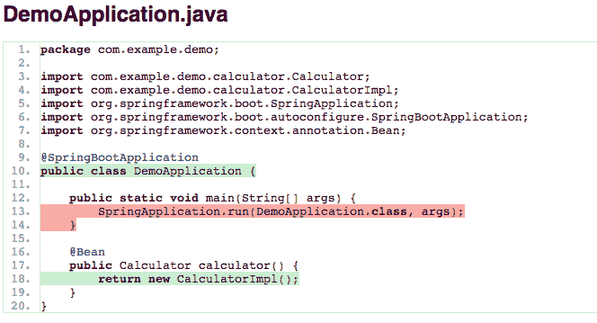
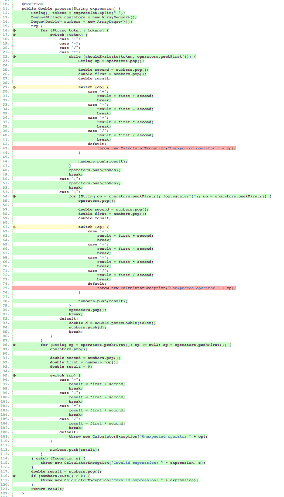

# 利用单元测试和 JaCoCo 提高 Java 代码覆盖率和质量

> 原文：<https://medium.com/capital-one-tech/improve-java-code-with-unit-tests-and-jacoco-b342643736ed?source=collection_archive---------0----------------------->


作为一家技术公司，快速生产可靠的技术是其一部分。与此同时，我们不能牺牲代码质量来稍微提高交付速度。在保持快速发布进度的同时确保代码质量的主要工具之一是编写测试。像任何其他技能一样，测试写作必须通过实践和经验来发展。

在这篇文章中，我们将使用一个示例程序来探索代码覆盖率和圈复杂度计算对于确保代码被正确测试是如何有用的。我们将学习如何使用 JaCoCo 获得关于代码覆盖范围的快速反馈。最后，我们还将看看代码覆盖率的限制，以及即使有 100%的代码覆盖率，bug 是如何逃脱的。

让我们从一个简单的应用程序开始，这是一个计算数学表达式的 Spring Boot web 应用程序。

计算器的界面是:

业务逻辑是:

这段代码有一个简单的 HTTP 端点:

该应用程序是从 Spring Boot 的一个主界面启动的:

应用程序的构建由一个简单的 POM 文件控制:

我们也有一个简单的单元测试文件，但是它不做任何事情:

这段代码的问题是它没有有用的测试。我们如何解决这个问题？我们如何知道我们写的测试值得写呢？

编写测试时需要考虑一些标准:

*   我们希望确保最好测试的代码部分是最有可能包含 bug 的部分。
*   我们希望将测试集中在应用程序的关键部分，这些部分的错误最有可能给我们的客户带来不好的结果。
*   我们不希望编写重复覆盖代码相同区域的测试，而忽略代码的其他部分。

让我们从试图找出代码的哪些部分最有可能包含 bug 开始。如果我们必须对错误隐藏在代码中的位置做出一个一般性的假设，我们会查看最复杂的代码。但是我们如何找出哪个代码是最复杂的呢？

# 圈复杂度

一种常见的启发式算法叫做圈复杂度。它已经存在很久了；托马斯·麦凯布在 1976 年发明了它。算法的简单描述可以在[这里](https://www.theserverside.com/feature/How-to-calculate-McCabe-cyclomatic-complexity-in-Java)找到。

*   为该方法的开始指定一个点。
*   为每个条件结构增加一个点，比如一个`if`条件。
*   每个迭代结构加一分。
*   在`switch`语句中，为每个 case 或缺省块添加一个点。
*   任何附加布尔条件加一分，如使用`&&`或`||`。

分数越高，方法越复杂。麦凯布为国家标准和技术研究所撰写的一篇论文建议[你应该把分数保持在 10 分或更低](http://www.mccabe.com/pdf/mccabe-nist235r.pdf%3E)。当处理圈复杂度时，请记住，最终，一个人必须声明一段代码是否是关键的；任何算法计算出的数字都只是一个决策指南。

*注意——你要知道* [*有些人不喜欢用圈复杂度*](https://www.cqse.eu/en/blog/mccabe-cyclomatic-complexity/) *。*

许多公司正在使用 SonarQube 为他们的软件提供代码质量度量。SonarQube 提供的度量之一是圈复杂度。然而，在我看来，这一过程来得太晚了。SonarQube 通常运行在已经推送到 git 的代码上。它可以监控一个特性分支，但是在这种情况下，您需要一个快速的反馈周期，一个不涉及推送 git 然后等待服务器处理您的分支的周期。这就是贾科科的用武之地。

# 介绍 JaCoCo

JaCoCo 是一个开源的 Java 软件质量工具，用于测量代码覆盖率，向您展示您编写的单元测试已经测试了您代码中的哪些行。除了覆盖率，JaCoCo 还报告了每个方法的复杂性，并告诉您一个方法中还有多少复杂性没有被测试。

让我们看看如何将 JaCoCo 支持添加到我们的计算器服务中。我们需要做的就是在 POM 文件中添加几行。在`projects/build/plugins`下，添加以下 XML:

在`projects`下，添加这个 XML:

现在你需要做的就是运行命令`mvn test jacoco:report`。这将运行项目中的所有单元测试，并创建代码覆盖率信息的 HTML 报告。您可以在项目的`target/site/jacoco`目录中找到这个报告。

如果我们看一下报告，我们会发现我们遗漏了相当多的内容:


红色太多了。在我们继续之前，让我们看一下表格中的列，以便了解我们在看什么以及我们需要改进什么。

元素列给出了当前应用程序中的包。您可以使用本专栏深入研究代码，以确切了解哪些内容被覆盖，哪些内容没有被覆盖。我们一会儿就会谈到这一点，但首先我们将看看其他列。

*   **遗漏指令和 Cov。** —这给出了测试中已经覆盖的 Java 字节码指令数量的图形和百分比度量。红色表示未覆盖，绿色表示覆盖。
*   **缺枝漏盖。—** 这给出了测试中已经覆盖的 _ branch _ 数量的图形和百分比度量。一个分支是你代码中的一个决策点，你需要为一个决策的每一种可能的方式提供一个测试，以获得完整的覆盖。
*   **Missed 和 Cxty** —在这里我们可以找到源代码的圈复杂度分数。在包级别，这是包中所有类的所有方法的得分总和。在类级别，它是类中所有方法的分数总和，在方法级别，它是方法的分数。
*   **遗漏和行数** —这是代码行数和没有完全覆盖的行数。
*   **遗漏和方法** —这是方法的数量和没有完全覆盖的方法的数量。
*   **遗漏类和类** —这是类的数量，包括内部类，以及没有至少一些代码覆盖率的类的数量。

让我们回到元素列。如果您点击一个包名，您将会看到一个类似的屏幕，在 Element 列中有一个包中的类。如果你点击`com.example.demo`链接，看起来是这样的:


如果您单击一个类名，您将看到该类中的方法:


最后，如果你点击一个方法的名字，你会看到这个类的源代码，滚动到这个方法:



代码用红色、黄色或绿色来表示每一行代码是没有覆盖、部分覆盖还是完全覆盖。类名以绿色突出显示，表明默认构造函数已经被 Spring 应用程序上下文的空测试调用。还调用了`calculator`方法，因为它的`@Bean`注释也将`CalculatorImpl`的实例放入应用程序上下文中。

我们看到，在产品包级别，我们有:

*   `com.example.demo.calculator`套餐的 0%覆盖率
*   `com.example.demo.controller`封装中 37%的覆盖率，
*   `com.example.demo`中 58%的覆盖率

我们有任何覆盖的唯一原因是`DemoApplicationTests`中的`@SpringBootTest`注释启动了一个 Spring 应用程序上下文，它加载了用`@Bean`注释的构造函数和方法。这证明了一个重要的观点；你可以在没有任何测试的情况下触发代码覆盖，但是你不应该这么做。从测试中调用代码而不确认调用代码所导致的更改是无效的测试。您可以欺骗 Sonar 和 JaCoCo，但是代码审查人员应该验证代码覆盖率反映了实际验证的值。

> 这证明了一个重要的观点；您可以在没有任何测试的情况下触发代码覆盖率，但是您不应该这样做。从测试中调用代码而不确认调用代码所导致的更改是无效的测试。您可以欺骗 Sonar 和 JaCoCo，但是代码审查人员应该验证代码覆盖率反映了实际验证的值。

# 查看 JaCoCo 中的单元测试覆盖率

现在我们应该写一些测试。我们可以从已经有的测试`DemoApplicationTests`开始。这里没有太多要验证的，但是我们可以确保加载了我们业务逻辑的正确实现。在我们的小程序中，很清楚哪个实现被加载到应用程序上下文中，但是对于包含其他人编写的库的较大程序，您可能会意外地依赖于错误的接口实现。使用类路径扫描，您也可能会错过您认为正在加载的类或 REST 端点。

这里有一个测试来验证我们正在实例化正确的东西:

如果我们用`mvn test jacoco:report`再次运行我们的测试覆盖，然后在`DemoApplication`上向下钻取到方法级别，我们现在看到:


嗯，报道里什么都没变。我们不打算为`main`添加测试，因为这会启动应用程序，我们不想在单元测试中这样做。但是现在我们实际上正在测试，以确保我们的应用程序加载了正确的类。记住，像圈复杂度和代码覆盖报告这样的东西是帮助人们理解测试和代码质量的工具。最后，一个人必须判断测试是否有效。

让我们为 REST 端点添加一个测试。如果查看代码，您会注意到，虽然有 Spring 注释将其标记为 REST 端点，将方法映射到 URI，并从请求中提取数据，但您不需要 Spring 或应用程序上下文来测试该类的业务逻辑。

让我们在不使用 Spring 的情况下编写我们的单元测试:

因为这是一个单元测试，我们只测试类中的功能；类之外的一切都可以(也应该)用模拟实现来替换。我们有一个简单的`Calculator`实现，然后有两个测试，覆盖了通过控制器方法的两个可能路径(正常返回值和异常)。

如果我们现在查看我们的代码覆盖率，我们会得到:


进步！我们的控制器包现在有 100%的代码覆盖率。

现在我们必须为业务逻辑编写测试。显然，这是应用程序中最复杂的代码。这个包的总复杂度为 31，其中 21 个复杂度点来自一个方法，即`CalculatorImpl`中的`process`。这是我们应该集中努力的地方。


# 初始单元测试结果

在这些测试中有一些事情需要注意。首先，在这些测试中再次没有关于春天的内容。一般来说，您应该避免为您的测试加载 Spring 应用程序上下文，因为这会大大降低测试速度。

接下来是我们处理测试用例的方式。这个业务逻辑为不同的输入返回不同的输出。不要一遍又一遍地重复自己，使用数据驱动的测试来指定预期的输入和预期的输出。JUnit 具有内置的参数化支持，易于使用，并为每个数据条目输出不同的测试结果。你可以在[这里](https://github.com/junit-team/junit4/wiki/Parameterized-tests)了解更多。

最后，还有对阴性病例的测试。我们希望确保我们测试的不仅仅是代码中的“黄金路径”。我们还需要了解是什么触发了异常，以及会触发什么异常。

在添加了这些测试并看到它们通过之后，让我们看看我们的代码覆盖率是什么样的。


仅仅几个测试用例就覆盖了很多内容，但是让我们做得更好。让我们看看类级别，这样我们就可以看到方法级别的覆盖率是什么样的:


我们可以深入代码，看看`process`中还有哪些部分没有测试:


而在`shouldEvaluate`:


尽管我们已经达到了相当好的测试覆盖率，但是代码中还有很多分支没有被测试。看起来我们需要在测试集中添加一些表达式来触发这些分支。

通过这些新的测试，我们可以重新检查我们的代码覆盖率，并看到我们的改进:


我们再次深入代码，看看哪些部分在`process`中仍未测试:



并且在`shouldEvaluate`中:


看起来不错。在`process`中唯一没有测试的是两个引发异常的`default`开关条件。(该代码目前实际上是不可实现的，但是包含一个`default`条款是一个好的做法，以防将来的变化触发意外情况。)

# 修复 bug

所以，我们结束了，对吗？事实上，我们不是。尽管已经通过了测试，并且拥有接近 100%的代码覆盖率。这个程序有两个错误。你见过他们吗？花点时间试着找到它们。

这里有几个暴露漏洞的测试案例:

```
{"6 / 3", 2, null},{"1 – 1 * 2", -1, null}
```

运行这些测试会产生:

```
[INFO] Running com.example.demo.calculator.CalculatorTest[ERROR] Tests run: 16, Failures: 2, Errors: 0, Skipped: 0, Time elapsed: 0.169 s <<< FAILURE! — in com.example.demo.calculator.CalculatorTest[ERROR] testProcess[14: CalculatorTest(6 / 3)=2, throws null](com.example.demo.calculator.CalculatorTest) Time elapsed: 0.013 s <<< FAILURE!java.lang.AssertionError: expected:<2.0> but was:<18.0>at com.example.demo.calculator.CalculatorTest.testProcess(CalculatorTest.java:60)[ERROR] testProcess[15: CalculatorTest(1–1 * 2)=-1, throws null](com.example.demo.calculator.CalculatorTest) Time elapsed: 0.001 s <<< FAILURE!java.lang.AssertionError: expected:<-1.0> but was:<0.0>at com.example.demo.calculator.CalculatorTest.testProcess(CalculatorTest.java:60)
```

如果你在`CalculatorImpl`的第 137 行查看，在函数`shouldEvaluate`中，在`if`语句的条件中有一个`=`而不是`-`。此外，在`CalculatorImpl`的第 106 行，在`process`函数中，当计算`/`时，代码乘而不是除。如果您能找到这些问题，那么修复它们是很容易的，但是为了找到它们，您需要提供真正代表代码的所有可能输入的数据。这就是为什么开发人员最好自己编写测试的原因之一；开发人员通常最清楚要传入哪种数据。代码覆盖率数字是不够的。

一旦我们修复了错误，我们重新运行我们的测试，它们通过了，我们的代码覆盖率实际上稍微好了一些。


# 重构

我们可以在这里停下来，但是`process`方法确实应该被重构。它的复杂度分数 21 远远高于我们对单一方法的要求。一个简单的重构就是删除重复的代码。将运算符应用于数字的代码出现了三次。应该分解成自己的方法。既然我们已经有了代码覆盖率良好的单元测试，那么在做这些改变的时候就更容易有信心了。

我们的代码现在看起来像这样:

当我们用`mvn test jacoco:report`重新运行我们的测试和代码覆盖时，我们现在看到了这个:


# 绿色的

那好多了。我们已经降低了复杂性，增加了代码覆盖率，同时确保我们的程序仍然工作，即使在做出更改之后。既然我们已经验证了该功能可以在本地工作，我们就可以确信它已经为拉请求中的代码审查做好了准备。

测试是许多开发人员避免做的事情。但是通过一些简单的工具和对过程的一些理解，测试帮助你花更少的时间跟踪错误，花更多的时间解决有趣的问题。请记住这些提示:

*   JaCoCo 可以帮助您在本地获得代码覆盖度量。
*   一定要为代码库的复杂部分编写测试。
*   代码覆盖率不是一切；100%覆盖率的代码中仍然可能存在 bug。
*   重构代码的复杂部分，使它们不那么复杂。

这些是作者的观点。除非本帖中另有说明，否则 Capital One 不隶属于所提及的任何公司，也不被其认可。使用或展示的所有商标和其他知识产权均为其各自所有者所有。本文为 2019 首都一。