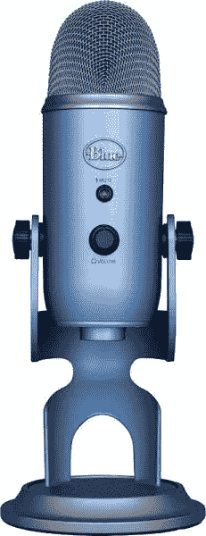
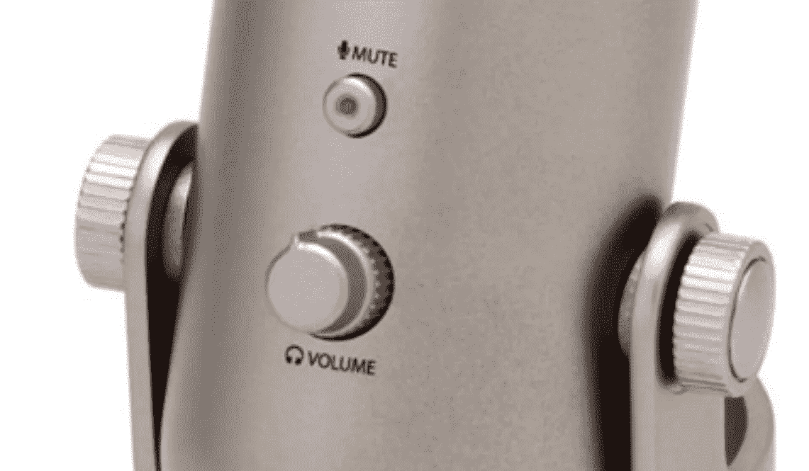
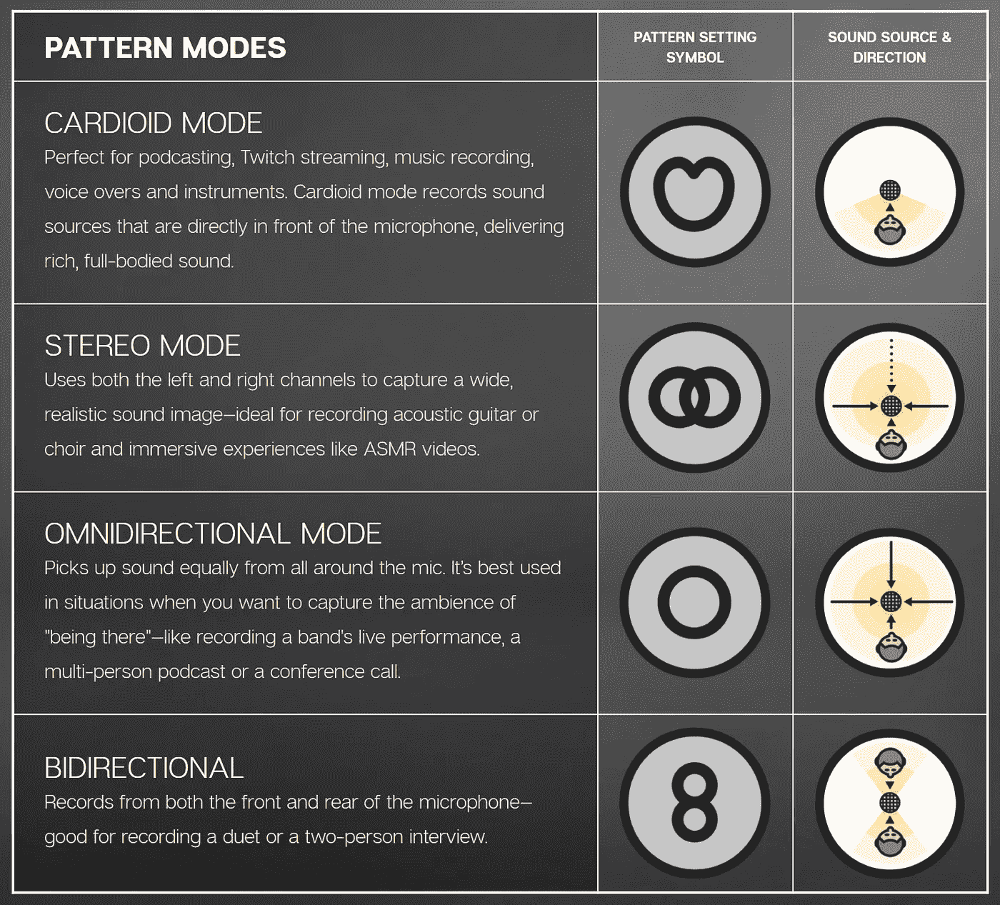
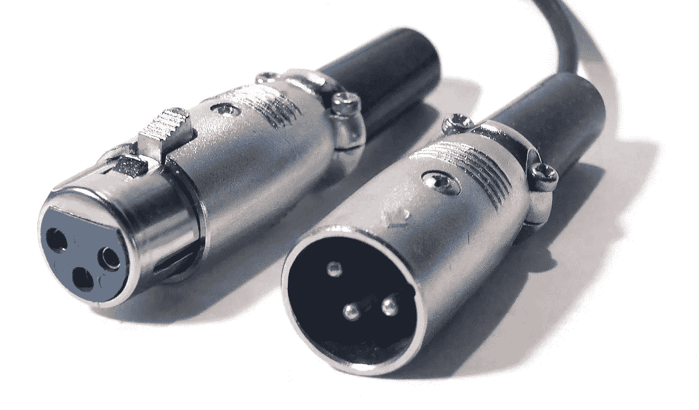
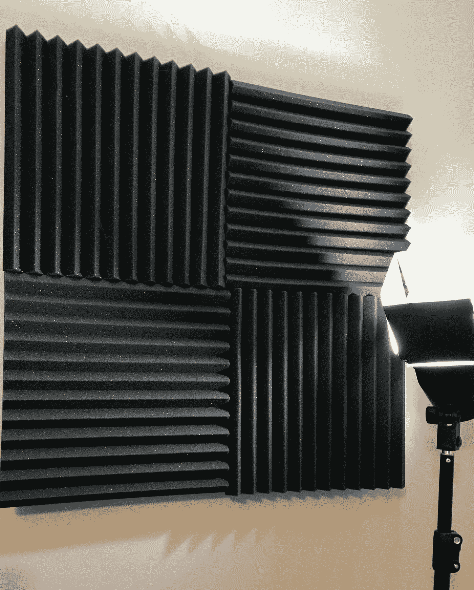
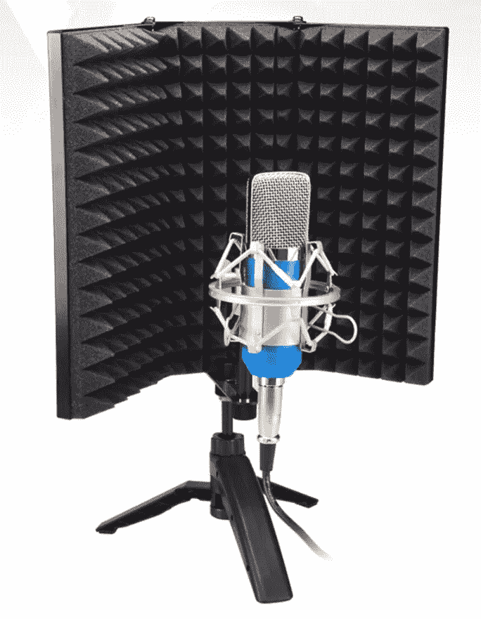
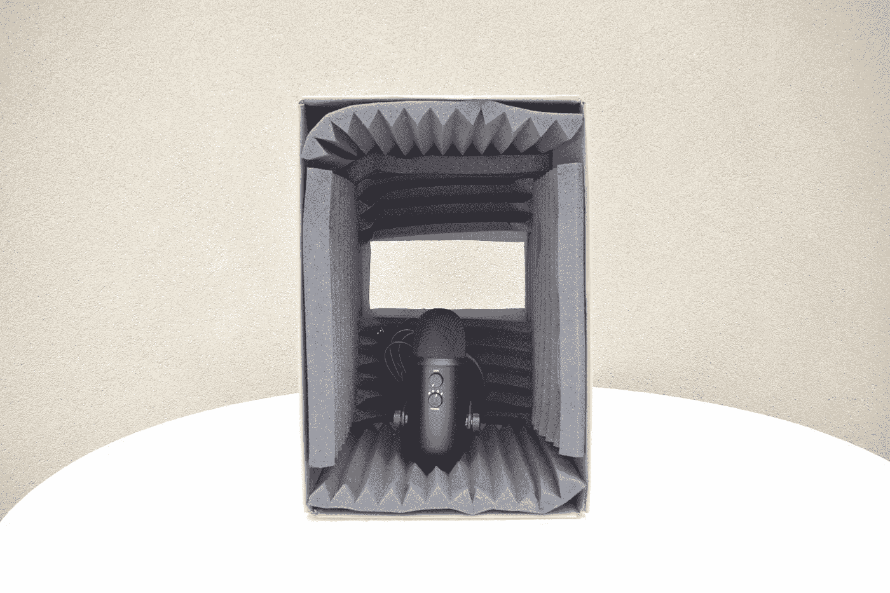
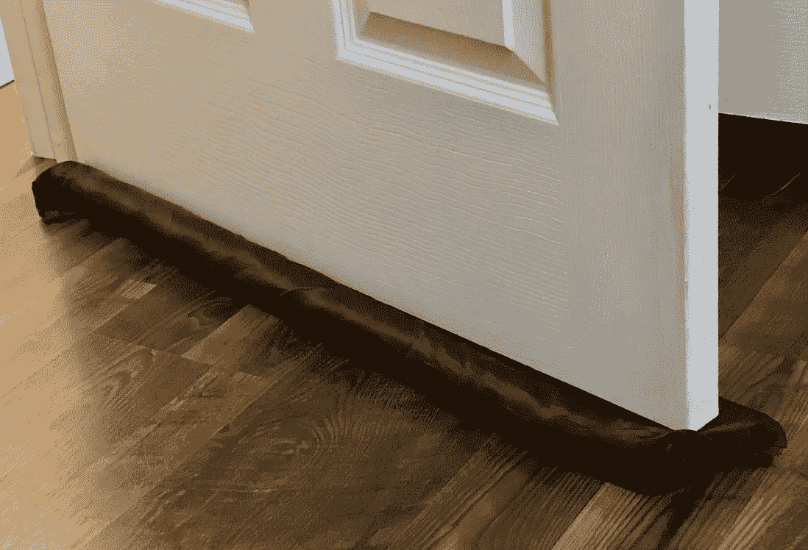

# 改善您的虚拟设置—声音

> 原文：<https://medium.com/google-developer-experts/improve-your-virtual-setup-sound-eee8c22036fc?source=collection_archive---------2----------------------->

## 在虚拟会议的爆炸式增长中，你应该做些什么来优化你的音频

你有没有在一个电话或网上聊天中说**“哇！那个声音好清晰！你听起来像是在演播室里。”**

> **现在翻转它**

你有没有发誓说你刚刚和一个人通了电话，他的音响设备就像一个有背景音乐的壁球场地？

🎸🎵🎹🎷🎺‼⁉

只需一点点调查时间和努力，我们就可以让你的虚拟存在进入高速运转，这样你每次联系都是高质量的。你可能不知道要寻找什么，但是根据这些建议，我们可以找到一些特征，把你的虚拟自我从一个弦乐罐提升到声乐品牌。

> 如果您对提高视频质量感兴趣，🎥📺[在这里看我的另一篇博文！](/google-developer-experts/improve-your-virtual-setup-video-3b0b9dc15833)

# 概观

你的网上谈话或会议的声音质量看起来像是那些你会发现自己在财务上后悔的兔子洞之一。就像那些拥有 500 美元耳机但似乎唱不出任何歌曲的正确音符的音响发烧友一样，存在收益递减点。

虽然音频质量的上层确实像美酒一样有争议，但大多数人的声音和高质量的声音之间也有很大的质量差距。放弃默认设置！

在本帖中，我们将讨论改善音质的三个关键方面:

1.  **麦克风**
2.  **消音**
3.  **软件去噪**

# 1.麦克风🎙

默认麦克风正在大幅改进，但仍然很糟糕。如果您的麦克风挂在电脑和耳朵之间的电线上，您需要升级。

## **1 级:USB 麦克风**

USB 麦克风可以让你达到 80%的效果。一些最流行的播客麦克风是友好和有用的。为此，我推荐蓝色雪人麦克风。

[https://www.bluedesigns.com/products/yeti/](https://www.bluedesigns.com/products/yeti/)

> 自 2009 年以来，全球数百万音乐人、播客、YouTubers 和游戏流使用 Yeti 来提高他们的声音，分享他们的故事和创造惊人的内容。

这款 USB 麦克风让你一次购买就领先群雄。这款话筒标价 130 美元，只需少量但有效的投资就能实现卓越音质。

**值得讨论的特性:
易用性:**只需将这个 USB 麦克风插到电脑上，就可以开始使用了。不需要培训或复杂的设置。
**耳机监听通道:**当你把耳机插到麦克风底部，麦克风听到的一切你都能听到。这有助于您捕捉背景噪音、粗重的呼吸声，以及麦克风应该有多远。
**静音/咳嗽键:**无数次录音或聊天时，您可能需要快速静音。虽然有无数种方法可以通过应用程序做到这一点，但在你面前有一个物理按钮还是不错的。

**心形模式:**有些话筒，如猎枪式话筒，旨在拾取特定方向的声音，而其他话筒则拾取房间内的所有声音。这个麦克风有很多很酷的模式，你可以设置，这将有助于你阻挡任何恼人的背景噪音或混响。将您的设备设置为心形模式，意味着您的设备只听您的声音！

Supported patterns on the Blue Yeti

我要说我对蓝色雪人最大的问题是，它太动态了。这是一个[电容话筒](https://www.neumann.com/homestudio/en/what-is-a-condenser-microphone)(不要担心这对你来说毫无意义)，它非常适合上面列出的所有模式模式。也就是说，如果你只是想看演示，如果你错误地配置了你的设置，你有很多方法可以搬起石头砸自己的脚。

使用这款 USB 麦克风，您可以获得出色的音质，耳机插头可以听到自己的声音，静音/咳嗽按钮和心形模式可以阻挡回声。你不一定要用蓝色雪人，但这是我通常推荐给初学者的。值得一年又一年的研究顶级 USB 麦克风是什么！

## X 级:录音室话筒

如果你不喜欢自己的声音，或者你对自己的音质投入很大，那么买一个能让你超越他人的麦克风是值得的。你可以买一个专门的麦克风来捕捉你的声音。世界各地的录音室都使用动态语音专用麦克风来专注于你的演讲，并保护你的观众免受那些爆破音的影响。你可能见过专业话筒没有 USB，因为它们用 XLR 线连接。

乍一看，你可能会认为“我需要一个 XLR 到 USB 转换器”，虽然你可以抓住其中的一个，但你没有得到你的新麦克风的好处。

这些高品质麦克风是模拟的，需要使用 DAC(数模转换器)进行返混。是的，“嘿，这就是模拟到数字的转换！”但是 DAC 双向转换。这些高质量 DAC 可以处理和降低人类能够听到和关心的“抖动”,以及音频带滤波。一个好的 DAC 可以让您从高保真麦克风获得高保真音频。

> 价格标签警告！📈💸

一个质量明显高于蓝色雪人的高品质麦克风要 250 美元以上，还需要你买一个 150 美元左右的像样的 DAC。如果你对你的虚拟存在是认真的，这是一个了不起的，但投资显著上升！

如果你想知道买什么样的 DAC/Mic，在 youtube 上有很多很棒的视频，但是，如果你只是想被告知什么会是一个好的选择，我使用的是带有雅马哈 AG03 USB 混频器/DAC 的电子语音 RE 320。总共大约 500 美元，而且物有所值。

我暂时把麦克风的工作留在这里，但如果你想知道如何工作你的 DAC 和好处，它可以做你和蓝色雪人的一切，甚至更多！在 [me](https://twitter.com/gantlaborde) 或 [Todd Werth](https://twitter.com/twerth) 发推特了解更多信息。一个 USB 麦克风可以让你完成 80%的工作，但最后的 20%需要指数级的时间和金钱。幸运的是，你可以一部分一部分地慢慢爬向昂贵的工作室。

# 2.声音衰减

你*可能*需要消音。尝试麦克风与嘴的距离，以最大限度地减少回声问题，但我在这些虚拟会议中看到的几乎所有演讲者都在房间里传输他们的音频。

在真正的对话中很难保持恒定的距离，所以，你需要给房间泼冷水。如果您能听到房间内的声音，则您没有发送高质量的音频。一些主持人甚至有风扇、外部车辆和低沉的 HVACs 与他们的音频竞争。

**回声/混响“听到房间里的声音”**
这里有一点你可能从未想过:回声是特定于你所站的地方的——同一个房间里的两个人可以感知到不同的回声！

要确定是否需要消音，请将耳朵靠近麦克风(或通过耳机听到麦克风听到的声音)，然后打响指。如果它短/脆，你很好，但每微秒超过这一点，你的音频指数可怕。

**外界声音**
你办公室里运行的空气净化器是你多年前就不想用的东西，但每次你在那个在线面板上发言，每个人都第一次听到它。声音衰减可以帮助你扩散和阻挡意外的外部声音，如果你幸运的话，可以完全消除它们。

**如果真的不好**就该做决定了。你的办公室/展示场所会看起来很酷吗？还是要传输优秀的声音？你愿意贴一些难看的消音板吗(不是针对你的相机，而是针对你自己的个人视角)？如果你有硬木地板和可怕的回声/背景噪音，是时候认真考虑添加重要的隔音面板了。

这是我的！

但是，如果你非常在意自己在镜头之外的办公室形象，你也可以花数百美元来打扮自己。阻尼板不一定要难看。

You so fancy

你能反弹和吸收的声音越多越好。然而！你应该考虑一些战略位置。如果你对着一面平墙说话，那可能是你最大的罪魁祸首！

**坏消息:** 你发声投射锥的平面比你背后和侧面的平面更糟糕。是的，这包括你的显示器。

**好消息:** 这意味着给你的墙壁和麦克风添加降噪功能通常可以 100%脱离你的网络摄像头！

将你的消声器朝向你，这样它们可以在你的声音在房间里反弹之前吸收你的声音。

如果你在做配音工作，拉出一个折叠式隔离罩来真正抑制声音投射锥中最危险的部分是不错的。一些用猎枪麦克风开会的人可以在你的摄像机上方放一个这样的保护罩，这样就可以一直不用手了！*好花哨！*

Folding Isolation shield to cut out echo

画外音工作是它自己的专长。我见过人们直接对着一个装满衣服的壁橱说话，甚至用一个纸板盒和一个裁剪好的遮阳板来搭建他们自己的迷你音箱来阅读屏幕。

是的，有些人变得富有创造性和愚蠢，在糟糕的房间里录制完美的声音。

Photo thanks to Frank von Hoven ([https://twitter.com/infinite_frank](https://twitter.com/infinite_frank))

在你处理完你的声锥后，考虑使用阻尼来阻挡外面的噪音，分散注意力。我个人在办公室的窗户上安装了嵌板，在办公室的门上安装了通风塞和隔热材料。

2 dogs and a 10 month old are constantly testing my noise dampening

在“不那么难看”的噪音抑制方面，窗帘、地毯、艺术画布和[纤维墙板](https://www.wayfair.com/keyword.php?keyword=fiber+wall+paneling&class_id=)都是视觉上改善的好方法，同时也抑制了你的回声房间。

所有这些助手都很容易在网站上找到，但就像任何房间一样，获得外观+用途的正确组合有点像个人旅程。

# 3.软件噪声消除

通过高通/低通滤波器消除噪音，在 post 中并不新鲜，我们已经讨论过麦克风如何在所有背景噪音中专注于你的声音。然而，我们正处于一个惊人的时代，噪声消除正在成为人工智能实时降噪的一部分。

在撰写本文时，有两个令人印象深刻的噪声消除软件包可用。

## **选项一:** [**Krisp.ai**](https://krisp.ai/)

使用一些额外的软件处理，你可以说话，从你自己，甚至从其他人那里删除哭泣的婴儿，大声的嗡嗡声和随机的背景聊天！

价格很合理。在这里登记:[https://krisp.ai/pricing/](https://krisp.ai/pricing/)

## 选项二:[英伟达 RTX 语音](https://www.nvidia.com/en-us/geforce/guides/nvidia-rtx-voice-setup-guide/)

这是我在 Twitch 上看到的最新一个带有狂野演示的竞争对手。准备好大吃一惊吧。

 [## RTX 滤音-藤壶夹-抽动夹

### Barnacules 玩聊天的剪辑-由 deFrisselle 剪辑

clips.twitch.tv](https://clips.twitch.tv/HeadstrongCleanDugongKappaPride) 

如果你有一个 NVIDIA 显卡，这可能是最酷最省钱的选择。这是相当新的，所以上车有点粗糙。我不确定它与 Krsip.ai 相比如何，但从那个演示来看，它相当令人兴奋！

**这是安装指南**

 [## 英伟达 RTX 语音:安装指南

### 英伟达 RTX 语音是一个新的插件，利用英伟达 RTX 图形处理器及其人工智能能力来消除分心…

www.nvidia.com](https://www.nvidia.com/en-us/geforce/guides/nvidia-rtx-voice-setup-guide/) 

# 总结一下

**关于沟通**。

不要在你的音频明显最差的座谈会或虚拟会议中。*做一个优秀的演讲者、播客嘉宾和沟通者。经过一些时间和组织，你可以显著提高自己的水平。*

仅仅几年前，我还不知道如何改进我的音频设置，现在我很高兴成为任何会议最清晰的音频输入之一。*声音*好听？让我们一起摇滚吧！

[Gant Laborde](https://medium.com/u/6ca0fe37eac1?source=post_page-----a1d0ab879cb9----------------------) 是 [Infinite Red](http://infinite.red/) 的共同所有者兼首席创新官，出版作家，兼职教授，全球公共演说家，以及培训中的疯狂科学家。他是网络和大联盟的 GDE。关注，[发推特](https://twitter.com/GantLaborde)或者在会议上拜访他[。](http://gantlaborde.com/)

# 有时间吗？看这些！

 [## 建立强大的远程公司文化的六种方法

### 人们普遍认为，远程公司比通勤公司更难建立文化。但仅此而已…

红色](https://shift.infinite.red/six-ways-to-build-a-strong-remote-company-culture-df0a49b2f549)  [## 让您的远程团队更有效率的 3 个“要做”和“不要做”

### 确保你正在做正确的远程工作

medium.com](/remotepanda-blog/3-dos-and-don-ts-to-make-your-remote-team-more-productive-ac178c0fbd41)