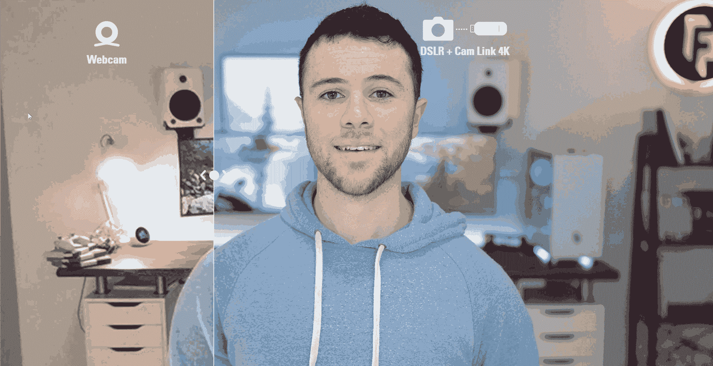

# 改善您的虚拟设置—视频

> 原文：<https://medium.com/google-developer-experts/improve-your-virtual-setup-video-3b0b9dc15833?source=collection_archive---------1----------------------->

## 在虚拟会议爆炸的情况下，你应该做些什么来优化你的视频。

你有没有在一个电话或网上聊天中说**“哇！那个办公室看起来很酷！”**或者发现自己被某人的相机质量分散了注意力？

**现在翻转那个**

你发誓过你刚刚和一个毫无生气的病态的，精神错乱的，在证人保护计划中的僵尸通了电话吗？

🧟‍♂🧟‍♀️🧟‍♂🤣

只需一点点调查时间和努力，我们就能让你的虚拟存在进入高速运转。你可能不知道要寻找什么，但是根据这些建议，我们可以找到让你的虚拟自我从贫穷变得富有的特征。

> 如果你对提高音质感兴趣，🔊 🎤[看我的另一篇博文](/google-developer-experts/improve-your-virtual-setup-sound-eee8c22036fc)！

# 概观

您的会议和在线会谈的视频质量很有说服力。说起来很难过，但是如果你有一个漂亮的视觉设置，人们会听得更久，对你要说的更感兴趣。这是众所周知的认知偏见的一部分，被称为[光环效应](https://en.wikipedia.org/wiki/Halo_effect)。那么为什么不让它对你有利呢？

我的一个好朋友杰德·巴托斯基问他如何改进他的视频，一个周末后，我们让他的视频看起来很清晰！

Before and After with a little effort! Awesome work [Jed Bartausky](https://medium.com/u/21e5e3ba7566?source=post_page-----3b0b9dc15833--------------------------------)!

为了让你的视频看起来很棒，我们将会介绍虚拟自我的三个方面。

1.  **网络摄像头**
2.  **照明**
3.  **背景**

# 1.网络摄像机

网络摄像头对我们中的一些人来说是一个痛苦的话题。一些人在 2015 年花了数百美元购买顶级网络摄像头，但笔记本电脑上的内置网络摄像头立即超过了他们。在社交距离的早期，一些人争先恐后地购买，结果又被骗了 100 美元。我们中的一些人拥有顶级的网络摄像头，但它们看起来或工作起来都不好。

网络摄像头是有缺陷的设备。

行业网络摄像头的外形因素是它们很小。如果你了解镜片，你就会知道尺寸很重要。这是问题的本质。

要获得更大的镜头，你基本上必须买一个更好的相机，并将其改装成网络摄像头。没有折中的办法。所以我们来看看 USB 和非 USB 的方案。

## 第 1 级:USB 网络摄像头

**为什么是 USB？** —很简单。有时候太简单了。虽然你只需插入 USB 并立即启动，但正确的网络摄像头会极大地提高你的存在感，而错误的摄像头则会破坏它。

并非所有的网络摄像头都有小镜头。当你在阅读评论时，你会遇到有很多评论和专利技巧的神奇相机，比如罗技 C920。但是注意那个小镜头。

Logitech C920 HD Pro — Not a fan

这款相机在几个谷歌搜索结果中被评为“最佳网络摄像头”……但是是以什么标准呢？

我个人*有过*这款相机，但我不太喜欢它，原因有几个。

你真的需要扬声器吗？根据我的经验，瑞士军刀不是一把有用的日常用刀。

另一方面，与思科 PrecisionHD 形成对比。它有一个大镜头。

拥有更大镜头的电话会议专业相机可能有糟糕的内置麦克风(LifeCam Pro 有一个很好的麦克风)，它们可能没有小扬声器或颜色选项，但它们可以完成工作。如果你预算有限，可以去易贝看看二手的。我的思科 PrecisionHD 已经有 5 年多的历史了，是在易贝上买的，现在仍能击败大多数竞争对手。

最好的 USB 摄像头是 [HuddleCamHD Pro](https://huddlecamhd.com/)

*   4K 视频
*   遥控器上的可控预设(非常适合立式办公桌)
*   对比度和照明设置

[https://huddlecamhd.com/pro/](https://huddlecamhd.com/pro/)

在我看来，HuddleCamHD Pro 是目前市场上最好的 USB 摄像头。

## 2.非 USB

**为什么非 USB？** —绝对控制、专注和最高质量。你有带视频捕捉功能的像样的相机吗？如果你真的很挑剔，你可以使用一个捕捉设备(甚至 4k？)并使其成为您的网络摄像头？

这种设置更复杂，但如果你愿意解决这个令人头疼的问题，它可以产生最高质量的视频会议。

**一些问题:** 除了价格上涨，你还会遇到一些令人头疼的景深、自动对焦和视频拍摄问题。预计会有额外的硬件来支撑你的相机(它现在对你的显示器来说太重了)和额外的硬件来进行转换/捕捉。拥有一台更先进的相机意味着你真的可以把事情拨进去，或者把事情搞砸。

像 Elgato 这样的公司有各种各样的设备用于多支架和视频采集硬件，但是经常会被抢购一空。

The GIF oversimplifies this demo but notice the blurred background/details even now.

我让你来评估你是否打算走这条路。如果你坐在办公桌前，一个好的 USB 可能就足够了。如果你在旅行或使用工作室，你可能会受益于先进相机的细节。

研究可能是一个相当棘手的问题，但如果你对远程演示/流媒体/工作很认真，那么你应该考虑研究相机，找到最符合你预算的相机。这里有一个很棒的 YouTube 频道可以进行这项研究:[https://www.youtube.com/user/EposVox/videos](https://www.youtube.com/user/EposVox/videos)

**特别提示:**你可以[用你的手机当网络摄像头](https://www.howtogeek.com/669589/how-to-use-your-iphone-as-a-webcam/)。这有点复杂，谁会有一部带着大相机的额外“新”手机呢？我想提到这一点，因为它可能符合你的需要。

> 杰德检查✅: 本文开头杰德的照片是通过思科 PrecisionHD 拍摄的。由于我们的首席执行官 Todd Werth 首先使用了它，这款相机在 Infinite Red 非常受欢迎。你可以清楚地看到细节的显著增加。

# 2.照明设备

网络摄像头喜欢尝试为你修复灯光，它通过让你的视频变得粗糙和丑陋来做到这一点。改善你的照明显著提高你的虚拟存在。

## 照明的一些规则

1.  **越多越好** 为了阻止你的网络摄像头调整 ISO，你需要一些重要的照明(在你身上，相机不应该看到强光)
2.  **自然光很危险**
    如果你把一切都布置好了，用自然光看起来清爽干净，你可以保证它甚至不会持续一个小时。虽然使用窗户很好，但日光是出了名的变化无常，你每次都必须调整。
3.  **巨型显示器可能比自然光更糟糕**
    如果你有两三个大型显示器，你屏幕上的东西会显著改变你的照明。当我做报告时，我通常会把显示器调暗以减少影响。尤其是当你戴着眼镜的时候。在你演讲之前，用你的幻灯片测试你的视频，并准备好在会议中调暗显示器。

The same meeting; two different web pages pulled up on the monitor

另一方面，如果你预算有限，你可以打开一页纸，用它作为廉价的补光灯。

4.三点灯
三点灯系统是一种众所周知的摄影棚照明技巧。在你面前有两盏灯，你的钥匙和你的填充物。

主光是直射在你脸上的明亮光线，会产生轮廓鲜明的阴影。填充光抵消了主光造成的阴影，因此它们保留了 3D 效果，但没有那么硬和无情。

你可以从上面的照片中看到，我的主灯是直射的琥珀色，而我的补光灯是纯白色的，被“谷仓门”挡住了。这两个灯分别在我相机的两边，这样可以得到清晰的视觉效果。这只是一种选择。如果你想使用摄影水平仪，你会想要购买开尔文等级(或温度)约为 5500k 的灯。

三点光源系统的第三个光源是适合你深度的发光管或边缘光源。你头顶上的“发灯”将为你的肩膀和头部提供一个不平坦的外观。为你的摄像头照亮你的房间是一种艺术。

不包括在三点光源中，但通常很重要的是，第四个背光给你的背景一个柔和的光晕。

5.**自上而下—“视角”**
不要在你的膝盖上使用你的笔记本电脑相机，并给一个向上的镜头。这不是布莱尔女巫项目。你的相机和灯光都是自上而下的。当人们自拍时，他们知道使用经典的“myspace 角度”，从那时起，一切都没有改变。你的相机和灯光一直比你高。

> **杰德检查✅:** 杰德在本文开头的照片有一个三点照明系统。向上滚动，注意到他的原始照明是平的，在他的后面，然后它从前面用温柔的自上而下的方式移动到抠像/填充。

# 3.背景

拥有一个漂亮的背景真的可以将之前所有的设置锁定到位。许多横幅和扬声器使用绿色屏幕，虽然一个漂亮的绿色屏幕比凌乱的屏幕好一点，但它远不如一个设计良好的办公室背景漂亮。

source: [https://www.youtube.com/watch?v=fuH-FZa2D-s](https://www.youtube.com/watch?v=fuH-FZa2D-s)

有一个干净但突出的背景最终确定了你的视觉存在。这听起来可能很奇怪，但是如果你有背光，深色背景比浅色背景更好。正如我们之前提到的，你可以使用背光来控制你想要的对比度。

看看这面黑色哑光墙，它有两个强大的背光。你可能永远也猜不到这是一堵暗黑色的墙。

Background props at IR Studio South

使用灯光填充你的背景。就像营销大师帕特·弗林(Pat Flynn)使用的那样，甚至一些柔光灯也可以直接对准相机。

花点时间来确定他的设置。他的钥匙灯在哪里？他的补光灯在哪里？请注意他在背景中使用了多个小灯，但从下面和后面使用了一个整体背光。他的麦克风不在画面上，所以你感觉直接被传送到了他的创作空间。这是一种高质量的虚拟存在。

让我们来看看奈杰尔·巴罗斯的设置。将他的主要照明与帕特的进行比较。比较他们在背景中使用柔和的非实用照明。

最后，让我们看看我的！我一直在努力提高我的背景，但空间很难！

你可以看到我的琥珀色/暖色键盘灯帮助我的相机饱和。此外，我把办公室的门漆成猩红色，以使背景对称。我身后的储物空间形成了有趣的对比，但我可能应该将它们换成深而丰富的深色，以提高我的对比度。一直在进步！

> 杰德检查✅: 杰德的墙壁以前是白色的，黑白的画被鱼眼弄得看起来歪歪扭扭的。从那时起，他把他的后墙涂成黑色，并像我们在工作室使用的那样使用动态渐变背光。

# 总结一下

不是每个人都可以修复他们的背景，购买高质量的相机和多种可控灯光，但每个人都可以利用他们所拥有的东西将他们的虚拟存在提升几个层次。我们的好朋友 Jed 经常参加公司间的电话会议，现在他是最强的视频参与者之一。

*对我来说，没有什么好办法截图展示我见过的最糟糕的视频会议……但是相信我，我见过一些非常糟糕的视频会议。🤪🤪🤪*

不一定非要那样。大家都可以搞定！我见过人们用刚从框架里拿出来的灯和堆在书上的便宜架子照亮他们的脸和背景。理解这些概念有助于你开始设置，如果你想有一个高质量的数字存在，你可以做到这一点！

**奖励内容:**

 [## 如何通过几个简单的步骤让你的网络摄像头看起来更体面

### 如果你以前用过网络摄像头，你就会知道在镜头前看起来像狗屎意味着什么。即使是最昂贵的消费者…

timbenniks.nl](https://timbenniks.nl/writings/how-to-get-your-webcam-to-look-decent-in-a-few-simple-steps/)  [## 如何在 Zoom(和其他视频通话应用程序)上看起来更好

### 越来越多的专业(和个人)互动正在通过 Zoom 和其他视频通话应用程序发生，而且它看起来不…

www.howtogeek.com](https://www.howtogeek.com/673264/how-to-look-better-on-zoom-and-other-video-calling-apps/) 

Gant Laborde 是 [Infinite Red](http://infinite.red/) 的共同所有者和首席创新官，出版作家，兼职教授，全球公共演说家，以及培训中的疯狂科学家。他是网络和大联盟的 GDE。关注，[发微博](https://twitter.com/GantLaborde)或者在会议上拜访他[。](http://gantlaborde.com/)

# 有时间吗？看这些！

 [## 改善您的虚拟设置—声音

### 在虚拟会议的爆炸式增长中，你应该做些什么来优化你的音频

medium.com](/google-developer-experts/improve-your-virtual-setup-sound-eee8c22036fc)  [## 建立强大的远程公司文化的六种方法

### 人们普遍认为，远程公司比通勤公司更难建立文化。但仅此而已…

红色](https://shift.infinite.red/six-ways-to-build-a-strong-remote-company-culture-df0a49b2f549)