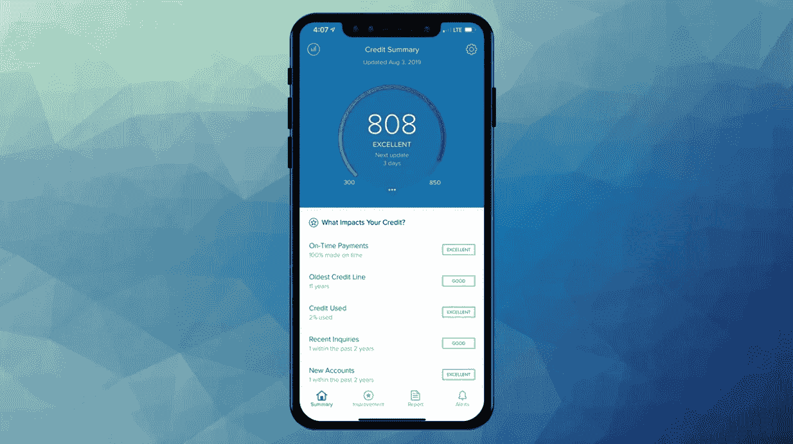
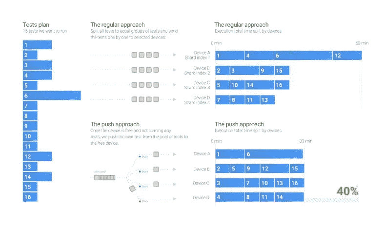

# Android 自动化测试的改进和并行化

> 原文：<https://medium.com/capital-one-tech/improvement-and-parallelization-of-android-automation-testing-capital-one-a05d10cae5b6?source=collection_archive---------9----------------------->

## Capital One 的 Android 应用程序如何将自动化测试执行提高 70%



质量保证和自动化 UI 测试是任何应用程序开发不可或缺的一部分。在移动开发中，它们甚至具有更大的意义，因为当引入用户友好、极具竞争力和成本效益的、具有多平台可用性和强大功能凭证的移动应用程序时，风险是如此之高。考虑到移动用户界面在不同设备上的不同表现，以及不同屏幕尺寸和密度的可用性如何增加了在多个设备上测试用户界面的需求，您就会明白测试和 QA 对于移动应用程序来说是多么复杂和重要。

在 Capital One 的 credit wise ⓡteam，我们采用了视觉测试来改进我们的 UI 测试。什么是信用？CreditWise 是一款免费的信用监控工具，帮助人们了解、改善和监控他们的信用和财务健康状况。因为理解信用是非常关键和复杂的，我们最不希望的就是用户界面问题影响和阻碍我们用户的应用体验。因此，我们使用视觉测试来验证应用程序 UI 的视觉方面。除了验证 UI 显示了正确的内容或数据，视觉测试还帮助我们验证 UI 的每个视觉元素的布局和外观，以及 UI 的整体。

作为 CreditWise 团队的高级工程师，我一直在寻找强化质量保证流程的方法，并开发更强大的测试机制。视觉测试帮助我们改进了测试，同时降低了人为错误的可能性。然而，我们遇到了测试执行时间的问题。随着我们测试的增加，我们发现:

1.  随着更多测试的增加，测试套件中需要更多的图像进行比较。
2.  因为图像比较定义了测试是通过还是失败，所以在测试完成之前，必须比较所有的测试图像。

因此，随着我们测试套件的增长，执行时间也在增长，直到我们达到 2 -3 小时的测试执行时间。这对敏捷开发团队不起作用。2-3 小时的测试执行时间意味着您要为每个进入存储库的变更等待 2-3 小时。这不仅使发布过程变得缓慢和乏味，而且还减缓了日常的开发工作，因为每一个引入的变更都必须通过这些测试。

在这篇博客中，我将研究 Android 上的并行测试执行，以及我的团队如何使用 Jenkins 扩展它。这种“分割和推送以释放设备”的努力帮助我们将执行时间减少到大约半小时。

# 并行执行(推入释放设备)与分片

为了改进执行时间，我们评估了加速测试执行的各种方法。自然，第一步是将测试执行分散到多个同类的设备/仿真器上。在 Android 的文档中，[分片](https://source.android.com/devices/tech/test_infra/tradefed/architecture/advanced/sharding)是将测试分发到多个设备的一种方式。但是对我们来说这不是正确的方法(我们一会儿会谈到它)。分片并不完全符合我们期望的速度增益，但是我们还有什么其他的选择呢？在我的研究中，我看到了一个名叫罗曼·库什纳连科的工程师写的关于运行 Android UI 测试的[博客](/medisafe-tech-blog/running-android-ui-tests-part-2-15ef08056d94)。他在博客中提到的想法很简单:*在测试执行期间将测试推到多设备池中的空闲设备，而不是预先决定哪个设备执行哪个测试*。

为了理解“推送至自由设备”的方法有何不同，让我们使用一个通用示例将其与分片进行比较。假设我们在两个类中有十个测试:

*   A 类有 5 个测试，每个测试执行 3 分钟(总执行时间为 15 分钟)。
*   B 类有 5 个测试，每个测试的执行时间为 1 分钟(总执行时间为 5 分钟)。

现在，从逻辑上讲，如果我们在一个模拟器上执行这些测试，我们有(5 个测试 X 每个测试 3 分钟)+ (5 个测试 X 每个测试 1 分钟)= 20 分钟的总执行时间。现在让我们研究一下，当我们使用分片和“推送至自由设备”方法来进行这些测试时会发生什么。

# 分片(标准 ADB 分片)—预先确定的设备测试方法

将分片方法应用到上面的场景中，我们有十个测试要在两个设备/仿真器之间共享。Android Instrumentation runner 支持使用 numShard 和 shardIndex 参数进行测试分片。查看[文档](https://developer.android.com/training/testing/junit-runner#sharding-tests)了解更多信息。分片的命令是:

```
adb shell am instrument -w -e numShards 2 -e shardIndex 1
```

*numShard* 表示碎片或碎片的数量，在这些碎片或碎片中，所有可用的测试都应该被破坏。 *shardIndex* 表示哪个碎片或片段将在设备上执行。在这种情况下，我们将对第一个设备使用 numShard = 2 和 shardIndex = 0，对第二个设备使用 shardIndex = 1。

上述案例中的问题是，当创建两个碎片时，第一个碎片将包含来自类 A 的所有测试，第二个碎片将包含来自类 B 的所有测试。因此，当这些碎片分布在两个设备上时，设备 1 执行来自类 A 的测试(因此运行 15 分钟)，设备 2 运行来自类 B 的所有测试(因此运行 5 分钟)。所以，现在总的执行时间是 15 分钟。考虑到我们来自 20 分钟，这不是最令人印象深刻的收获。

# 并行执行—推入释放设备模式

现在让我们看看并行执行和推送至自由设备模式。这里的想法很简单— *获取要执行的测试列表，然后简单地将列表顶部的测试推送到空闲的空闲设备*。本质上，测试列表就像一个堆栈，堆栈中最上面的测试指向空闲的设备。

将这个应用到上面的例子中，我们的期望应该是执行时间应该是 10 分钟，因为我们有五个大测试和五个小测试。在这种情况下，如果测试负载平均分布在两个模拟器上——比如设备 1 上的三个大测试和三个小测试，以及设备 2 上的两个大测试和三个小测试——我们的执行时间将是 11 分钟，大约有 45–50%的时间改进。

当这种方法应用到我们的例子中时，您将首先看到所有的大型测试都被划分到两个模拟器中。因此，它们的执行时间有效地从 15 分钟减少到 9 分钟。接下来是在两个模拟器上执行的小测试。因此，它们的执行时间减少到 3 分钟。这使我们的总执行时间达到了 11 分钟，这是意料之中的。

下图试图以一种更容易理解的形式来表达这些观点:



为了将它应用到我们的 CreditWise 应用程序中，我们编写了一个定制的[浪子](https://fastlane.tools/)动作。该操作本质上生成一个要执行的测试列表，然后使用上述方法将它们分发到系统中可用的模拟器。当使用两个模拟器运行应用程序时，我们发现我们确实如预期的那样获得了 40%的执行性能提升。自然地，我们的第一反应是简单地增加模拟器的数量来进一步提高时间。然而，那是不可能的。一旦模拟器数量增加，系统很快就会耗尽资源，导致模拟器崩溃等等。这就把我们带到了我们实现的下一步。

# 分而治之—分而治之以释放设备模式

推送免费设备给我们带来了 40%的改善。但是 3 个小时的执行有 40%的提高，但仍然不到 2 个小时。尽管这一改进意义重大，但还不够。此外，增加仿真器的数量不是一个选项。所以，我们想，如果我们增加运行模拟器的节点数量会怎么样呢？

如今，Capital One 的几乎所有项目都由持续集成(CI)系统支持。对于 CreditWise 应用程序，我们使用 Jenkins，因为 Jenkins 提供了一个很好的[管道](https://jenkins.io/doc/book/pipeline/)，允许多个任务并行执行，也允许一些轻量级脚本。因此，使用 Jenkins 管道，我们创建了以下控制流:

1.  管道从调用一个 Jenkins 作业开始，该作业运行一个定制的浪子操作，该操作创建一个要执行的测试列表。
2.  Job 编译 APK、测试 APK，并创建要执行的测试列表。然后这些工件被上传到 artifactory。
3.  管道作业然后下载这些工件并读取测试列表。
4.  然后，流水线作业从要执行的完整测试列表中同等地创建 10 个子列表。
5.  然后，Pipeline job 为自动化测试运行启动 10 个 Jenkins 作业，将 artifactory 路径和测试子列表传递给这些作业中的每一个。
6.  每个 Jenkins 作业启动两个模拟器，并使用自定义的浪子操作以 push-to-free-device 模式分发其子测试列表。

使用这种方法，我们的 150 多个测试分布在几个节点上，每个节点运行两个模拟器。根据管道中使用的节点数量，执行时间可以大幅减少到几分钟。我们发现，通过使用十个节点，每个节点有两个模拟器，我们能够将执行时间从 3 小时减少到大约 40–45 分钟。

对于这种方法，我们使用了 CI 解决方案，但我认为可以允许工程师将测试套件分成多个部分，并将它们推送到各种机器，然后收集结果的任何脚本/应用程序都可以在这里使用。

# 分割和推进到自由设备模式—可扩展和简化

有了测试执行中的这些改进，在不影响执行和发布时间的情况下，很容易向代码库添加更多的测试。由于现在的执行时间相对较短，我们也能够对每个传入的拉请求运行这些测试，从而确保每个更改的质量和彻底测试。因为这里使用的工具是浪子和詹金斯，所以也很容易将相同的方法应用和扩展到 iOS 开发中。

我希望这篇文章至少能帮助你开始一些在不牺牲测试质量的情况下提高测试执行时间的想法。毕竟，在开发的早期生命周期中的质量测试对于一个用户友好的、极具竞争力的和经济高效的移动应用程序来说是最重要的！

*最初发表于*[T5【https://www.capitalone.com】](https://www.capitalone.com/tech/software-engineering/improvement-and-parallelization-of-android-automation-testing/)*。*

*披露声明:2020 资本一。观点是作者个人的观点。除非本帖中另有说明，否则 Capital One 不隶属于所提及的任何公司，也不被这些公司认可。使用或展示的所有商标和其他知识产权是其各自所有者的财产。*