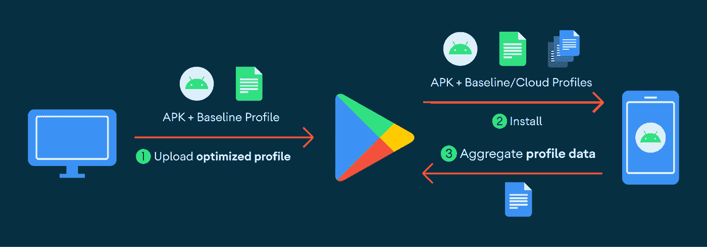

# 通过基线配置文件提高应用性能

> 原文：<https://medium.com/androiddevelopers/improving-app-performance-with-baseline-profiles-aefb909a6184?source=collection_archive---------4----------------------->

*或者如何将启动时间提高 40%*

*由 DevRel 工程师 Kateryna Semenova 发布；拉胡尔·拉维库马尔，软件工程师；克里斯·克赖克，软件工程师*


# 为什么启动时间很重要？

许多应用程序发现应用程序性能和用户参与度之间的相关性。人们期望应用程序能够**响应**和**快速**加载。[启动时间](https://support.google.com/googleplay/android-developer/answer/9844486)是应用性能和质量的主要指标之一。

我们的一些合作伙伴已经为 app 启动优化投入了大量的时间和资源。例如，看看脸书的故事。

在这篇博文中，我们将讨论**基线配置文件**以及它们如何提高应用和库的性能，包括启动时间**提高 40%** 。虽然这篇博客文章关注的是启动，但是基线配置文件也显著改善了 jank。

# 历史

Android 9 (API level 28)在 Play Cloud 中引入了 [ART 优化配置文件，以改善应用启动时间。平均而言，我们已经看到，当云配置文件可用时，应用程序在各种设备上的冷启动速度至少快 15%。](https://android-developers.googleblog.com/2019/04/improving-app-performance-with-art.html)

当应用程序在安装或更新后第一次启动时，它的代码以解释模式运行，直到它被 JIT ted。在 APK 中，Java 和 Kotlin 代码被编译为 dex 字节码，但由于存储和加载完全编译的应用程序的成本，没有完全编译为机器代码(从 Android 6 开始)。应用程序中经常使用的类和方法以及应用程序启动时使用的类和方法都记录在一个配置文件中。一旦设备进入空闲模式， [ART](https://source.android.com/devices/tech/dalvik/configure%23how_art_works) 就会根据这些配置文件编译应用程序。这加快了后续应用程序的启动。

从 Android 9(API 28 级)开始，Google Play 也提供了云概要文件。当一个应用程序在设备上运行时，ART 生成的配置文件由 Play Store 应用程序上传，并聚合到云中。一旦为某个应用程序上传了足够多的配置文件，Play 应用程序就会将汇总的配置文件用于后续安装。

# 问题

虽然云配置文件在可用时很棒，但它们并不总是在安装了应用程序后就可以使用。收集和汇总配置文件通常需要几天时间，当许多应用程序每周更新时，这是一个问题。许多用户会在云配置文件可用之前安装更新。谷歌 Android 团队开始寻找其他方法来改善档案的延迟。

# 解决办法

[基线配置文件](https://developer.android.com/studio/profile/baselineprofiles)是一种新的机制，提供可以在 Android 7 (API 级别 24)和更高版本上使用的配置文件。基线档案是由 [Android Gradle 插件](https://developer.android.com/studio/releases/gradle-plugin)使用应用程序和库提供的人类可读的档案格式生成的艺术档案。一个例子可能是这样的:

```
HSPLandroidx/compose/runtime/ComposerImpl;->updateValue(Ljava/lang/Object;)V HSPLandroidx/compose/runtime/ComposerImpl;->updatedNodeCount(I)I HLandroidx/compose/runtime/ComposerImpl;->validateNodeExpected()V PLandroidx/compose/runtime/CompositionImpl;->applyChanges()V HLandroidx/compose/runtime/ComposerKt;->findLocation(Ljava/util/List;I)I
```

二进制配置文件存储在 APK 资产目录(assets/dexopt/baseline.prof)中的特定位置。

基线配置文件在构建时创建，作为 APK 的一部分发送到 Play，然后在下载应用程序时从 Play 发送给用户。它们填补了 ART 云剖面管道中的空白，当云剖面尚不可用时，它们会自动与云剖面合并。



基线概要文件的最大好处之一是它们可以在本地[开发和评估](https://developer.android.com/studio/profile/baselineprofiles#creating-profile-rules)，因此开发人员可以看到真实的最终用户性能改进。与云配置文件相比，它们在较低版本的 Android(7 及更高版本)上也受支持，云配置文件仅从 Android 9 开始提供。

# 影响

2021 年初，谷歌地图从两周的发布周期转为一周的发布周期。更频繁的更新意味着更频繁地丢弃本地预编译，以及更多的用户在没有 Play Cloud Profiles 的情况下经历缓慢的启动。通过使用基线资料，谷歌地图**的平均启动时间缩短了 30%** ，搜索量也相应增加了 2.4%**，对于这样一个成熟的应用来说，这是一个巨大的进步。**

库中的代码就像应用程序的代码一样——默认情况下，它没有完全编译，如果它在启动的关键路径上做了大量工作，这可能会是一个问题。

[Jetpack Compose](https://developer.android.com/jetpack/compose) 是一个 UI 库，它不是 Android 系统映像的一部分，因此在安装时不会完全编译，这与 Android View toolkit 的大部分代码不同。这导致了性能问题，尤其是应用程序的前几次冷启动。

为了解决这个问题，Compose [使用了描述文件安装程序](https://developer.android.com/jetpack/compose/ergonomics#profile-inst)。它提供了基线配置文件规则，可以减少启动时间和编写应用程序的时间。

Google PlayStore 的搜索结果页面已经用 Compose 重写。在整合了 Compose 的基线配置文件规则后，**显示初始搜索结果页面的时间缩短了约 40%** 。

Android 团队还向相关的 [AndroidX](https://developer.android.com/jetpack/androidx/) 库添加了基线配置文件。这有利于所有使用这些库的 Android 应用程序。约束布局已发现[运输配置文件规则](https://github.com/androidx/constraintlayout/pull/423) **减少动画帧时间超过一毫秒**。

# 如何使用基线配置文件

**创建自定义基线配置文件**

所有的应用和库开发者都可以从基线配置文件中获益。理想情况下，开发人员为他们最关键的用户旅程创建配置文件，以确保这些旅程具有一致的快速性能，无论云配置文件是否可用。查看[详细指南](https://developer.android.com/studio/profile/baselineprofiles#creating-profile-rules)，了解如何为应用和库开发人员设置基线配置文件。

如果您现在还没有准备好为您的应用程序生成基线配置文件，您仍然可以通过更新您的依赖项来从中受益。如果你使用 Android Gradle Plugin 7.3.0 或更高版本构建，你会在你的 APK 中获得已经由库提供的基线配置文件(例如 [Jetpack](https://cs.android.com/search?q=baseline-prof.txt&ss=androidx%2Fplatform%2Fframeworks%2Fsupport) )。Google Play 会在安装时使用这些描述文件编译您的应用程序。您可以补充这些概要文件[，作为构建您的应用程序](https://developer.android.com/studio/profile/baselineprofiles#creating-profile-rules)的一部分。

不要忘记衡量改进。遵循[关于如何使用本地生成的配置文件测量启动](https://developer.android.com/studio/profile/baselineprofiles#measuring-improvements)的步骤。

**提供反馈**

请分享您的反馈，让我们知道您的体验！

*最初发表于*[*【https://android-developers.googleblog.com】*](https://android-developers.googleblog.com/2022/01/improving-app-performance-with-baseline.html)*。*