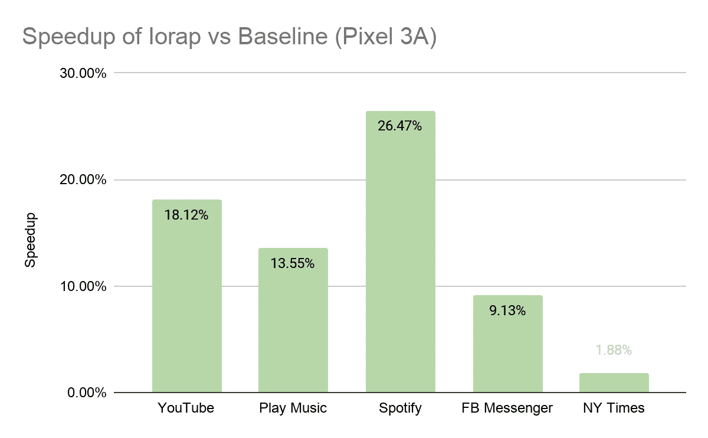
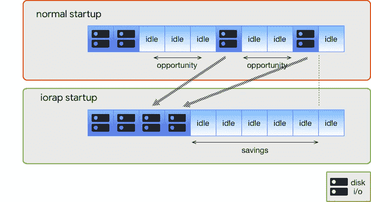
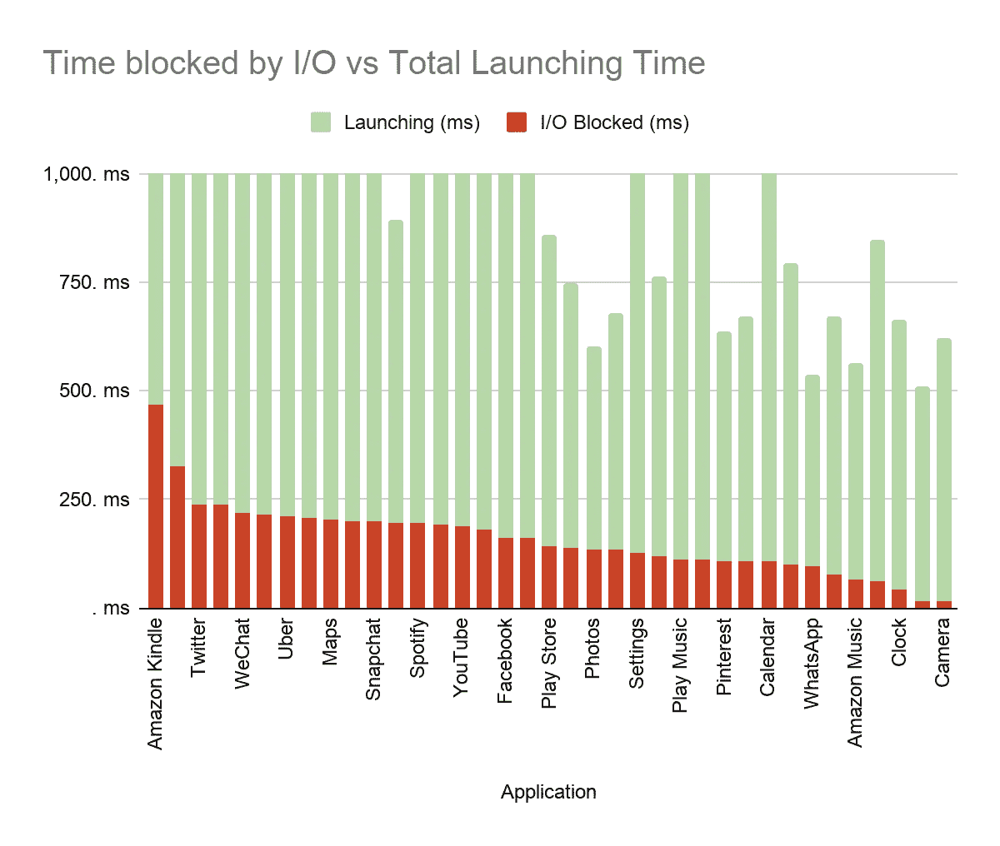
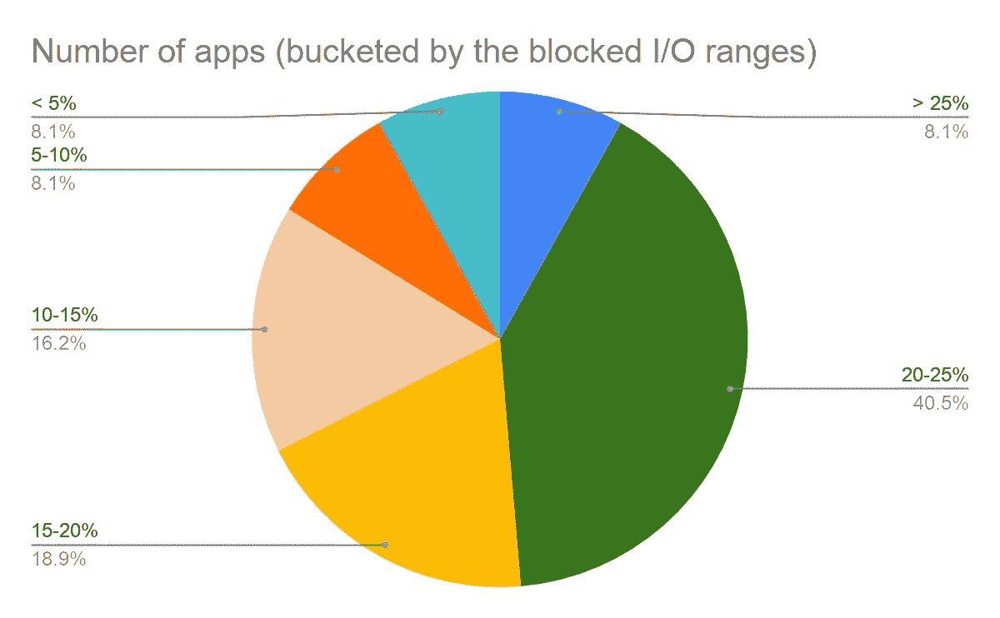
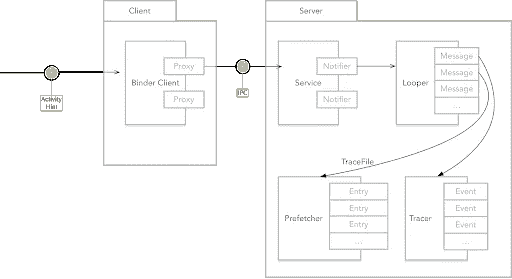
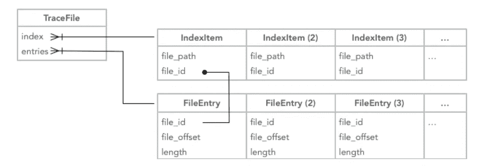
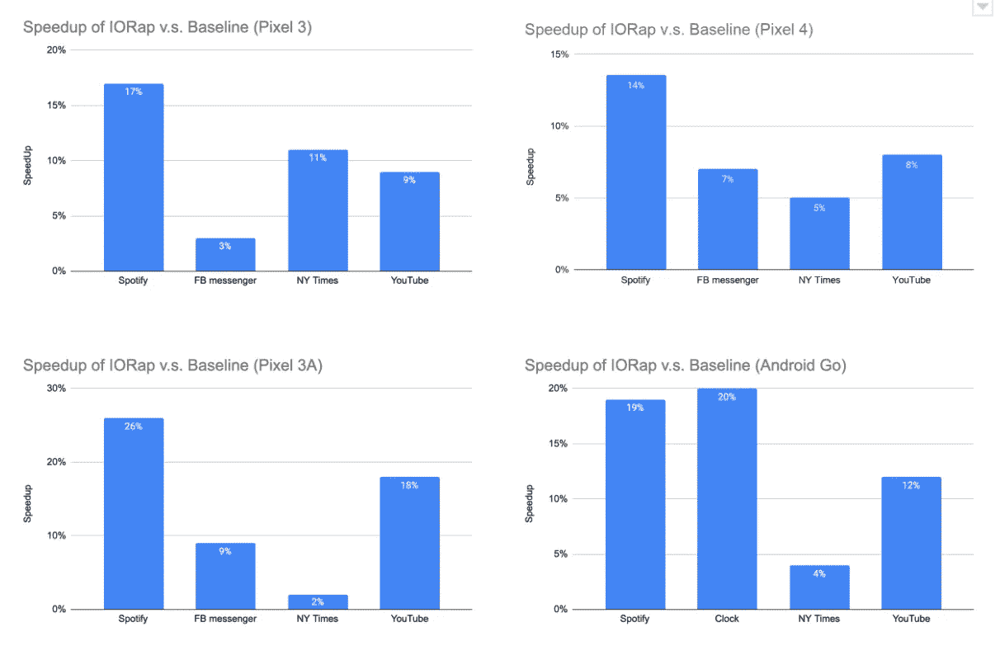

# 通过 I/O 预取改善应用启动

> 原文：<https://medium.com/androiddevelopers/improving-app-startup-with-i-o-prefetching-62fbdb9c9020?source=collection_archive---------0----------------------->

在 Android 11 中，我们引入了 IORap，这是一个新功能，可以大大缩短应用程序的启动时间。我们观察到，在各种设备上，应用程序的启动速度平均快 5%以上(冷启动)。一些英雄案例显示 **20%+** 更快的启动时间。用户无需更改任何开发人员应用程序即可获得额外的性能！

**Android 应用的 IORap 预取**

IORap 通过预测需要哪些 I/O 并提前完成来减少应用程序的启动时间。由于 I/O 阻塞，许多应用程序初创公司有很多时间 IO 请求队列没有饱和。因此，我们没有最大限度地提高 IO 延迟。预取数据并压缩 I/O 后，应用程序可以从`pagecache`开始几乎立即访问这些数据，从而显著减少应用程序启动延迟。

当我们评估来自 Play Store 的一些热门应用时，80%以上的应用在发布期间花费了 10%以上的时间来阻止 I/O。而大约 50%的应用程序甚至花费了 20%以上的时间。我们看到的大多数应用都可以从 IORap 中受益。

IORap 作为设备上的独立服务运行。它通过 IPC 与包管理器、活动管理器、`perfetto`服务等交互。IORap 的整体架构如下图所示:

**第一步:收集性能痕迹**

IORap 使用基于分析的策略来确定要预取的 I/O。这些知识来自`perfetto` trace，它记录了内核`pagecache`的页面移除/添加(来自 *ftrace* )。在应用程序的前几次冷运行中，会启动`perfetto`跟踪来获取`pagecache`丢失的事件。我们的研究表明`perfetto`跟踪在启动时的开销是可以忽略的。

**步骤 2:生成预取列表**

基于上一步获得的`perfetto`轨迹，IORap 在设备空闲期间生成一个预取列表。基本上，预取列表包含应用程序启动时访问的文件信息(名称、偏移量、长度)。IORap 分析来自`perfetto`跟踪的`mm_pagemap`事件，并通过将`inode`反转为文件名将其结果(`inode`，偏移量，长度)转换为(名称，偏移量，长度)。然后，数据存储在预取列表中，该列表是一个`protobuf`文件。

**第三步:I/O 预取**

预取列表生成后，IORap 可以为应用程序的后续运行预取相应的数据。不再需要`perfetto`追踪。用户和开发人员不需要做任何事情。当用户点击图标或通过另一个应用程序间接请求时，就会执行预取。享受加速！

**步骤 4:废弃预取列表**

预取列表不会永远存在。一些事件可能会导致预回迁列表过时。更新应用程序时，预取列表会被弃用，因为应用程序可能会更改，以前的数据可能不准确。还有，`dexopt`服务可以在安装后优化 app。应用程序优化后，布局可能会有所不同，使预取列表过时。过时的预取列表将被删除，新一轮将从`perfetto`踪迹收集开始。

**改进&观察**

对比我们实验室的几个实验结果，我们确定 IORap 的优势涵盖了从低端到高端设备的范围。平均来说，IORap 可以提供高达 **~26%** 的加速。这对于启动时有大量 I/O 的应用程序非常有帮助。例如，Spotify 显示低端设备(Go 和 Pixel 3A)和高端设备(Pixel 3 或 4)都有两位数的改善。

实验中一个有趣的发现是，IORap 的性能很大程度上受预取数据量的影响。准确的跟踪持续时间对于 IORap 来说非常重要。跟踪持续时间越短，预取的数据就越少，性能提升也越小。另一方面，较长的预取时间会导致预取过多的数据，在最坏的情况下，这可能会导致启动速度变慢。IORap 使用应用程序报告`ReportFullyDrawn`事件的时间戳来估计跟踪持续时间。对于未报告此事件的应用程序，将使用显示时间。所以在适当的时候调用`reportFullyDrawn`回调可以提高 IORap 的性能。

**未来发展**

我们对 IORap 展示的改进感到兴奋，我们计划在未来从以下两个方向进一步探索这一概念。首先，更频繁地预取。如果可以在分析期间进行预取，那就太好了。然后，我们可以通过提供预构建的预取列表，在生成预取列表之前消除一些性能差距。其次，IORap 可以预测应用程序将会更早启动并开始预取，从而进一步加快启动时间。

**结论**

当你的应用程序完成启动时，你可以通过调用`ReportFullyDrawn`回调来帮助 IORap。IORap 主要有助于减少 I/O 阻塞时间，因此考虑分析您的应用程序启动是否存在其他可能的性能问题。