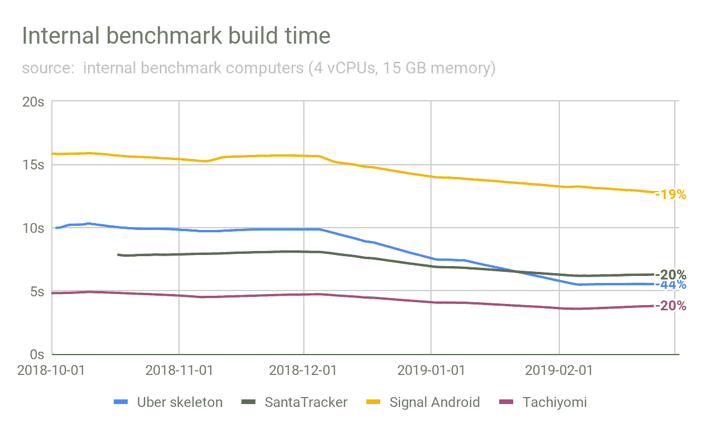
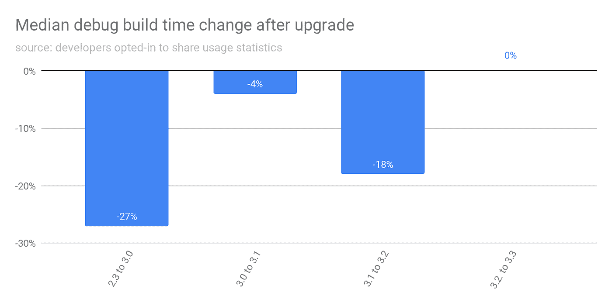
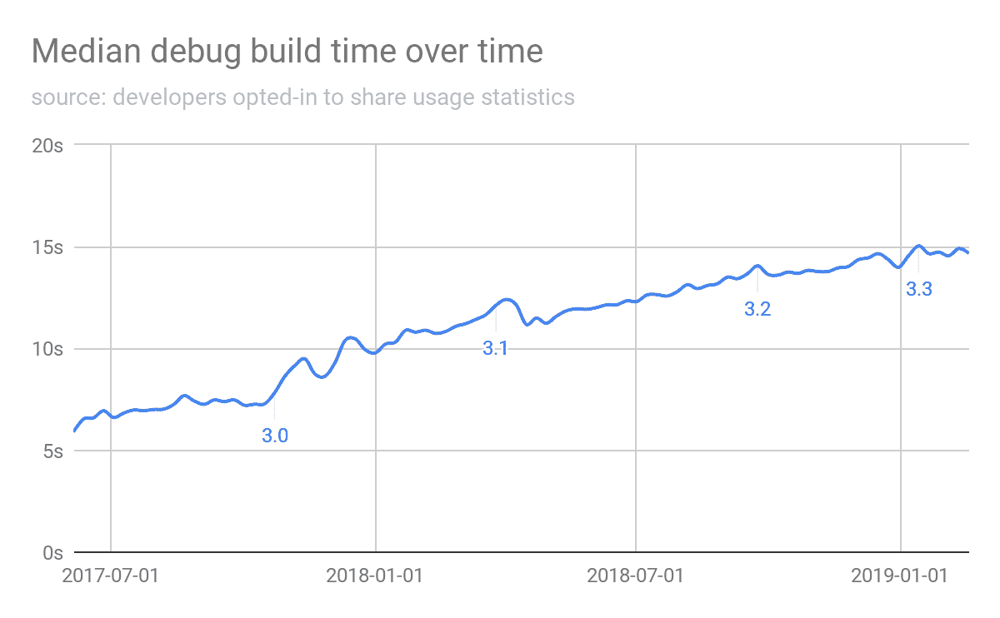
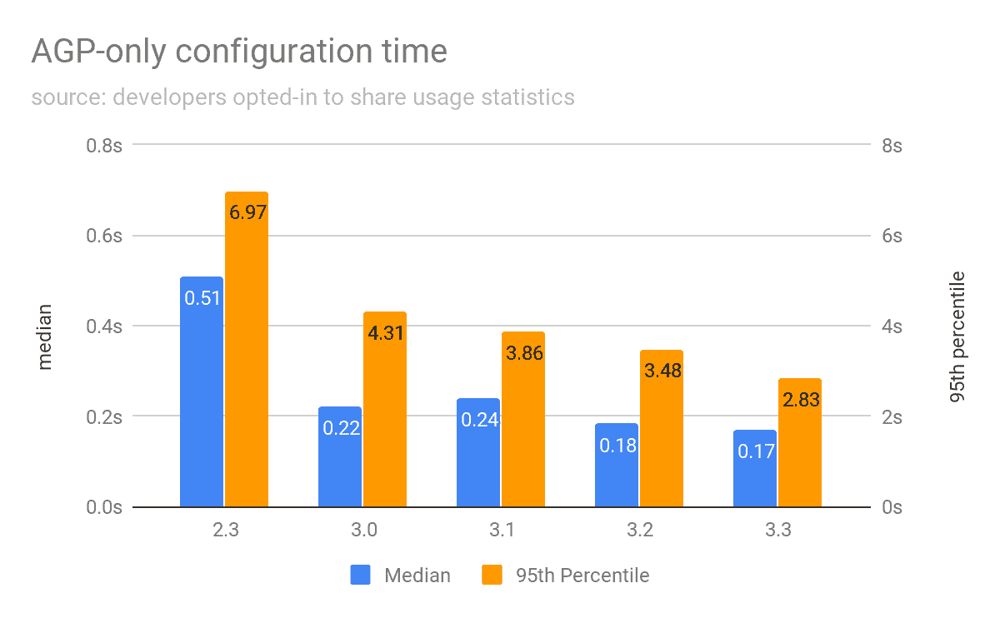

# 提高 Android Studio 的构建速度

> 原文：<https://medium.com/androiddevelopers/improving-build-speed-in-android-studio-3e1425274837?source=collection_archive---------2----------------------->

*由 Android Studio 产品经理 Leo Sei 发布*

# 提高构建速度

在 Android studio 中，我们希望让您成为最高效的开发人员。从与开发人员的各种讨论和调查中，我们知道等待缓慢的构建速度会降低生产率。

在本文中，我们将分享一些新的分析方法，以更好地找出真正影响构建速度的因素，并分享更多关于我们对此所做的工作，以及您现在可以做些什么来帮助防止您的构建速度变慢。

**这是可能的，这要感谢许多开发者选择在“首选项>数据共享”*中与我们共享他们的使用统计数据

# 以不同方式测量速度

我们做的第一件事是使用开源项目( [SignalAndroid](https://github.com/signalapp/Signal-Android/archive/v4.19.1.zip) 、 [Tachiyomi](https://github.com/inorichi/tachiyomi/archive/014bb2f42634765ae2fec487cf3b8dc779f23f7b.zip) 、 [SantaTracker](https://github.com/google/santa-tracker-android) 、[优步](https://github.com/kageiit/android-studio-gradle-test.git)的&框架)创建内部基准*来衡量项目的各种变更(代码、资源、清单等)对构建速度的影响。

例如，这是一个查看代码更改对构建速度影响的基准测试，显示出随着时间的推移有了很大的改进。

我们还查看了“真实世界”的数据，重点关注了 Android Gradle 插件升级前后的几个调试版本的构建速度。我们用它来代表新版本的实际改进。

这显示了新版本的显著改进**，**自 2.3 版本以来，帮助减少了近 50%的构建时间。**

最后，我们看了构建时间随时间的演变，不管版本如何。我们用它来代表你的实际构建速度。可悲的是，这表明构建速度正在随着时间的推移而变慢。

如果构建确实随着每个版本变得越来越快，并且我们可以在我们的数据中看到，为什么随着时间的推移它们仍然变得越来越慢？

我们挖得更深一点，意识到在我们的生态系统中发生的事情正在导致建设速度慢于我们可以改善的速度。

虽然我们知道随着时间的推移，项目的增长——更多的代码、更多的资源使用、更多的语言特性——使构建变得更慢，但我们也发现有许多其他因素超出了我们的直接控制:

1.  [**Spectre 和 Meltdown**](https://meltdownattack.com/)**2017 年末的补丁**对新进程和 I/O 产生了一些影响，将清理构建速度减慢了 50%到 140%之间。
2.  **第三方&定制 Gradle 插件** : 96%的 Android Studio 开发者使用一些额外的 Gradle 插件(其中一些可能没有使用[最新的最佳实践](https://developer.android.com/studio/build/optimize-your-build))。
3.  大多数使用的**注释处理器是非增量的**，导致每次编辑时都要重新编译代码。
4.  **使用 Java 8** 语言特性会导致去糖，这会影响构建时间。然而，我们已经减轻了 D8 的脱糖影响。
5.  **使用 Kotlin** ，尤其是 Kotlin (KAPT)中的注释处理，也会影响构建性能。我们正在继续与 JetBrains 合作，以尽量减少对这里的影响。

与现实世界的项目不同，这些项目不会随着时间的推移而增长。基准测试模拟变化，然后撤销它们，只是为了测量我们的插件随时间的影响。

*** 3.3 专注于未来改进的基础工作(例如，命名空间资源、增量注释处理器支持、分级工人)，因此实现了 0%的改进。*

# 我们在做什么？

## *修正内部流程&持续绩效改进*

我们也承认，许多问题来自谷歌拥有/推广的功能，我们已经改变了内部流程，以更好地在发布流程的早期发现构建回归。

我们也在努力使[注释处理器增加](https://developer.android.com/studio/build/optimize-your-build#annotation_processors)。在这篇文章中，Glide，Dagger 和 Auto Service 是增量服务，我们正在开发其他服务。

我们还在最近的版本中包含了 R light 类生成、lazy task 和 worker API，并继续与 Gradle inc .和 JetBrains 合作，以继续提高整体构建性能。

## *归因工具*

最近的一项调查显示，大约 60%的开发人员不分析构建影响，或者不知道如何分析。因此，我们希望改进 Android studio 中的工具，以提高社区中关于构建时间影响的意识和透明度。

我们正在探索如何更好地在 Android Studio 中直接提供关于插件和任务对构建时间的影响的信息。

# 你今天能做什么

虽然配置时间可能因变体、模块和其他因素的数量而异，但我们希望分享来自“真实世界”数据的与 **Android Gradle 插件**相关的配置时间，作为参考点

如果你发现你的配置时间很慢，你可能有自定义构建逻辑(或第三方 Gradle 插件)影响你的配置时间。

## *使用的工具*

Gradle 提供了一套**免费的** [工具](https://guides.gradle.org/performance/)来帮助分析你的构建中正在发生的事情。

我们建议您使用 [Gradle scan](https://guides.gradle.org/performance/#build_scans) ，它提供了关于您的构建的最多信息。如果将一些构建信息上传到 Gradle 服务器是一个问题，你可以使用 [Gradle profiler](https://guides.gradle.org/performance/#profile_report) ，它提供的信息比 scan 少，但是把所有东西都保存在本地。

*注意:构建扫描对调查配置延迟没有帮助。对于那些你可能想使用传统的 JVM 分析器*

## 优化您的构建配置和任务

当您研究构建速度时，这里有一些需要注意的最佳实践。您也可以随时查看我们的[最新最佳实践](https://developer.android.com/studio/build/optimize-your-build)。

配置

*   只使用配置来设置任务(用 lazy API)，避免做任何 I/O 或任何其他工作。(配置不适合查询 git、读取文件、搜索连接的设备、进行计算等)
*   在配置中设置所有任务。配置不知道实际构建了什么。

优化任务

*   确保每个任务都声明了输入/输出(即使是非文件)，并且是增量的和可缓存的。
*   将复杂的步骤分解成多个任务，以提高增量和可缓存性。
    (一些任务可以是最新的，而其他任务可以并行执行或运行)。
*   确保任务不会写入或删除其他任务输出
*   在 plugin/buildSrc 中用 Java/Kotlin 编写任务，而不是直接在 build.gradle 中用 groovy 编写。

我们关心您作为开发人员的生产力。随着我们继续努力使构建更快，希望这里的提示和指南将帮助您缩短构建时间，以便您可以更专注于开发令人惊叹的应用程序。