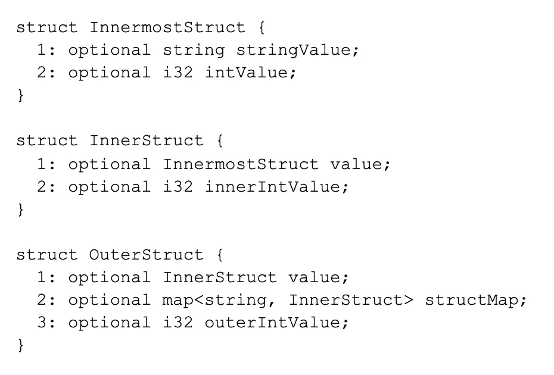
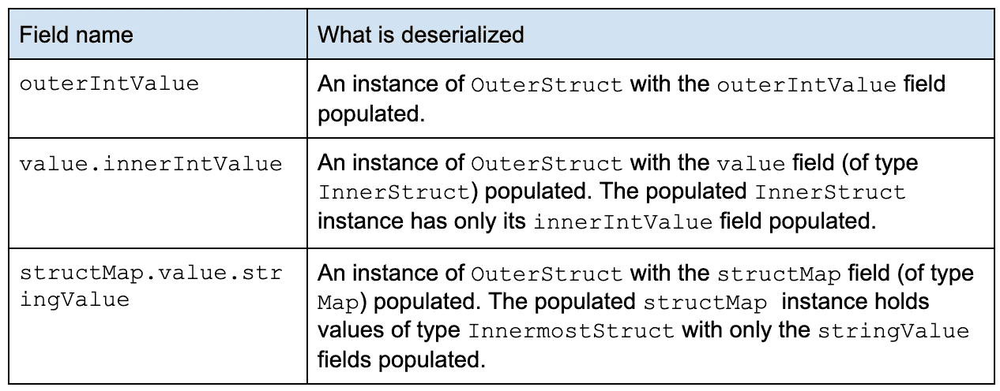
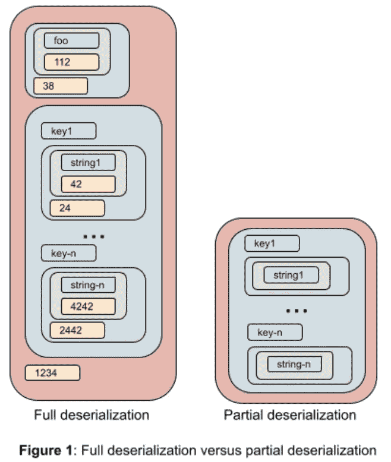
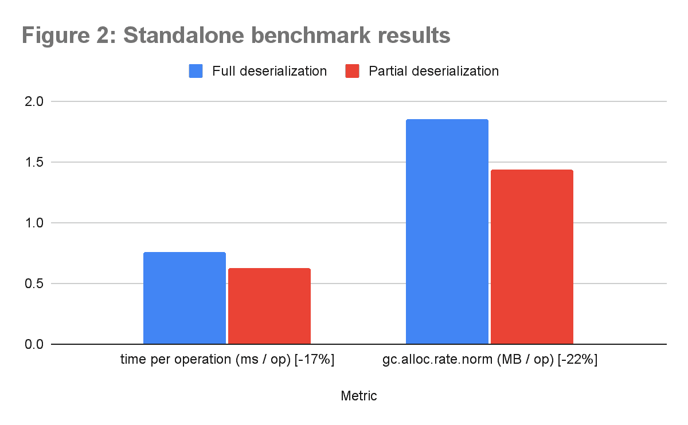
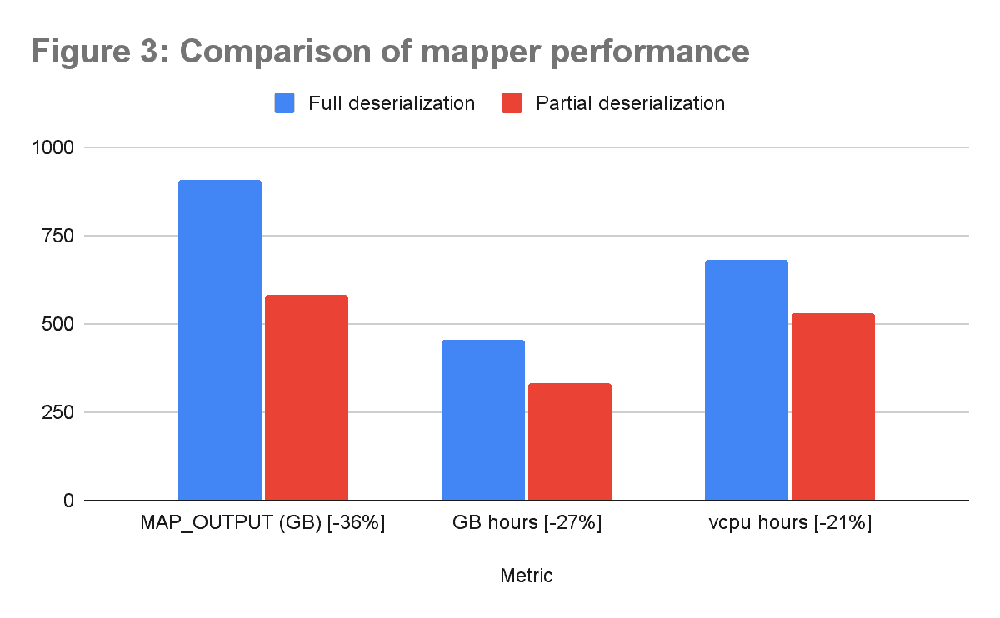

# 使用 Thrift 的部分反序列化提高数据处理效率

> 原文：<https://medium.com/pinterest-engineering/improving-data-processing-efficiency-using-partial-deserialization-of-thrift-16bc3a4a38b4?source=collection_archive---------5----------------------->

Bhalchandra Pandit |软件工程师

在 Pinterest，我们一直致力于大幅提高数据处理效率。作家安托万·德·圣·埃克苏佩里的一句话与我们独特的方法产生了共鸣:“完美的实现不是当没有更多可以添加的时候，而是当没有什么可以拿走的时候。”

最终，我们在 Pinterest 上处理数 Pb 的节俭编码数据。大多数访问这些数据的作业只需要其中的一部分。为了满足我们独特的需求，我们设计了一种方法，只高效地反序列化每个作业中所需的 Thrift 结构子集。我们的解决方案使我们能够显著减少数据处理资源的使用:vcore 使用量减少了约 20%，内存使用量减少了 27%，中间数据(映射器输出)减少了 36%。

# 动机

Pinterest 是一家数据驱动的公司。我们将数据用于对业务至关重要的一切，包括分析、机器学习和实验。

我们有许多以 [Apache Thrift](https://thrift.apache.org/) 格式编码的大型数据集，其大小为数十 Pb。我们有大量的离线数据处理工作流，每天都在处理这些数据集。该处理的很大一部分涉及从磁盘上的序列化字节中反序列化节约结构。执行这样的反序列化需要花费我们大量的时间和金钱。任何降低反序列化成本的优化都会带来可观的节约。

# 没有合适的替代品

尽管许多数据处理作业需要节约结构的字段子集，但是在访问该结构的字段之前，它们必须承担完全反序列化该结构的成本。考虑到我们有数百个这样的作业，每个作业每天都要处理数万亿字节的数据，这个成本是很大的。

避免反序列化成本的一种方法是使用像 [FlatBuffers](https://google.github.io/flatbuffers/) 这样的格式。不幸的是，这种方法有两个问题:

1.  FlatBuffer 编码比 Thrift 格式多占用大约 20%的磁盘空间。当我们处理数十亿字节的数据时，这很重要。
2.  更重要的是，编码的改变需要那些数据集的所有消费者的代码改变。当您有一个大的现有代码库时，这个成本是很大的。

Apache Thrift 实现为部分反序列化提供了基本的支持。然而，有两个缺点妨碍了它对我们的有用性。首先，它仅限于反序列化单个原语字段。第二，不支持一次反序列化任意子集。

我们为这个问题开发了一个新颖的解决方案，在 Thrift 的基础上增加了对部分反序列化的支持。

# 部分反序列化

我们需要解决三个重要问题:

1.  我们必须使定义要反序列化的字段集变得容易。
2.  我们必须在序列化的 blob 字节上一次反序列化整个子集。
3.  我们必须保持最终的实现与标准反序列化器 100%可互操作。这样，就不需要对使用反序列化对象的代码进行任何更改。

## 定义目标子集

我们需要能够选择字段的任意子集。此外，我们希望表达任何复杂的字段嵌套，而不需要复杂的约束语言或任何额外的代码。

我们想出了一个简单的方案。我们选择使用完全限定的字段名列表来定义要反序列化的字段。

例如，考虑下面的 Thrift 结构定义:

下面是要从 OuterStruct 反序列化的字段的有效定义。

定义列表可以包含这些完全限定名的任意组合。使用简单字符串列表的能力允许我们将部分反序列化作为仅配置更改来启用。

图 1 显示了 config struct map . value . string value 的完全反序列化的 OuterStruct 和部分反序列化的 OuterStruct。

在部分节约编解码器的初始化期间，字段列表被解析并编译成有效的内部表示。此后不再使用字符串形式的字段列表。

## 反序列化目标子集

我们的实现在一次传递中遍历序列化的字节，以选择性地反序列化所需的字段。每次我们遇到一个字段，我们要么反序列化它，要么跳过不反序列化它。通过提高序列化字节缓冲区内的内部偏移量，可以有效地跳过字段。以这种方式跳过的字段不会导致对象分配或垃圾收集开销。

反序列化的字段在单个外部实例(例如，前面示例中的 OuterStruct)下保留它们通常的嵌套，就像完全反序列化一样。这样，调用代码不需要为了使用返回的结果而做任何改变。

## 互用性

我们的实现 100%可以与标准的节俭解串器互操作。

# 结果

到目前为止，我们已经在各种数据处理堆栈中使用了该解决方案，包括 Hadoop MapReduce 作业和 Flink 流作业。我们发现这些工作的效率也有类似的提高。以下部分介绍了独立基准测试和各种作业运行的结果。请注意，收益取决于 Thrift 对象的大小和复杂性以及部分反序列化子集的大小。一般来说，反串行化子集的大小与所有字段的大小之比越小，整体效率增益就越大。

## 独立基准测试

我们编写了一个独立的基准，反复反序列化一组 1000 个 Thrift 对象。我们选择了一个在我们的许多生产工作中常用的节俭对象。这个结构有 11 个字段(九个原语字段、一个结构字段和一个“结构列表”字段)。我们比较了完全反序列化该对象与仅部分反序列化每个对象中的一些字段的性能。我们使用 [JMH 框架](https://openjdk.java.net/projects/code-tools/jmh/)测量吞吐量和垃圾收集指标。图 2 显示了它们之间的比较。

## MapReduce 作业

我们在大量数据处理作业中使用了这种优化。由于它的使用，我们能够获得显著的效率改进。图 3 显示了结果比较。

有两大类福利:

**运行时资源使用减少**

1.  需要更少的 CPU 周期，因为我们不会花费时间去反序列化那些永远不会用到的字段。
2.  垃圾收集的压力减少了，因为我们没有不必要的分配未使用的字段。

**持续存储减少**

1.  当初始作业使用部分反序列化并将结果按顺序传递给下一个作业时，使用的中间存储要少得多。

# 未来方向

尽管我们已经通过这种优化实现了显著的节约，但我们仍在探索其他增强功能:

1.  将这些改进回馈给社区:我们正在寻找将这些好处带给 Pinterest 之外的更大社区的方法。
2.  **拓宽应用范围:**目前我们在基于 MapReduce 的作业和 Flink 作业中使用这种优化。我们正在探索将这个范围扩大到包括 Spark、Spark SQL 和一些在线服务。
3.  **反序列化效率的进一步提高:**通过修改 scrooge 生成的 Java/Scala 代码，可以实现额外的效率，对部分反序列化更友好。因此，我们预计 CPU 的使用量还会减少 10~20%。
4.  **改进的节俭字段访问跟踪:**我们当前用于字段访问跟踪的方法有许多局限性。我们正在考虑一种全新的方法，这种方法不仅会使访问跟踪更简单，而且会更有效。
5.  **按需部分反序列化:**目前，为了初始化部分反序列化器，必须预先了解要反序列化的字段。我们正在探索一些不需要先验知识的潜在方法。也就是说，较新的实现将*动态学习*访问模式。它将利用这一知识来调整其反序列化效率。

*要在 Pinterest 了解更多工程知识，请查看我们的* [*工程博客*](https://medium.com/pinterest-engineering) *，并访问我们的*[*Pinterest Labs*](https://labs.pinterest.com/)*网站。要查看和申请空缺职位，请访问我们的* [*职业*](https://www.pinterestcareers.com/?utm_source=medium&utm_medium=blog-article&utm_campaign=pandit-july-1-2021) *页面。*