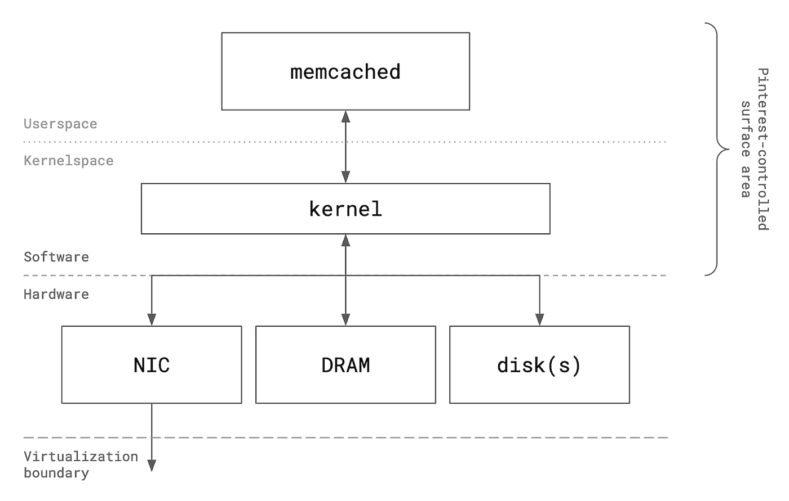
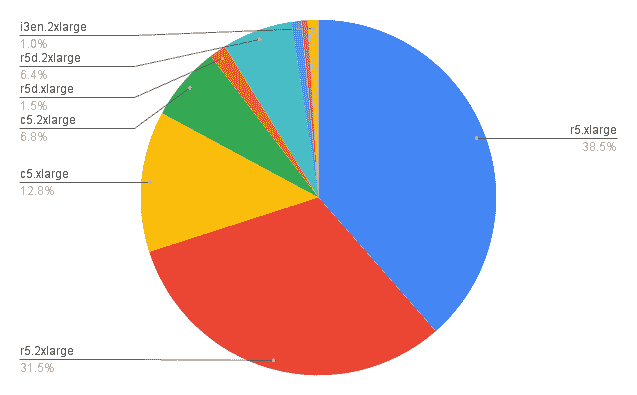
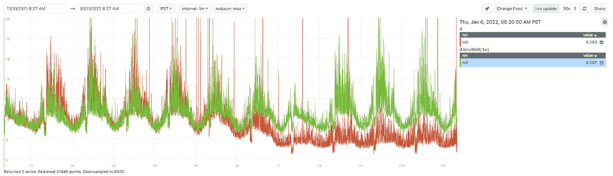
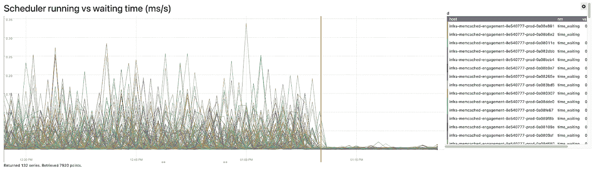
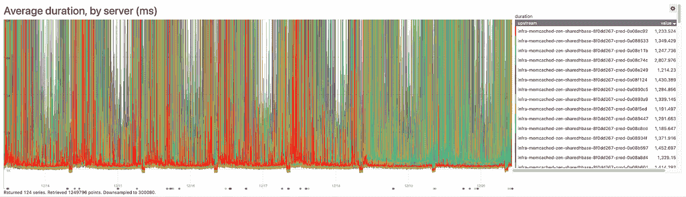
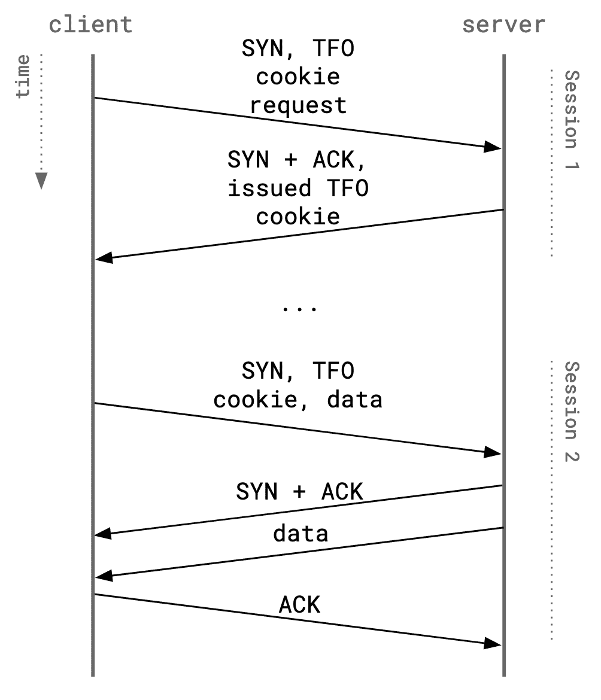

# 提高 Pinterest 的分布式缓存性能和效率

> 原文：<https://medium.com/pinterest-engineering/improving-distributed-caching-performance-and-efficiency-at-pinterest-92484b5fe39b?source=collection_archive---------0----------------------->

林义杰|软件工程师，存储和缓存

# 介绍

Pinterest 的分布式缓存系统，建立在开源技术 [memcached](https://github.com/memcached/memcached/) 和 [mcrouter](https://github.com/facebook/mcrouter) 之上，是生产基础设施栈的关键组件。Pinterest 的缓存即服务平台负责全面降低应用延迟，减少总体云成本，并确保遵守严格的站点范围可用性目标。

如今，Pinterest 的 memcached 车队跨越了超过 5000 个 EC2 实例，涵盖了各种实例类型，并在计算、内存和存储方面进行了优化。总体而言，该机群每秒可处理高达约 1.8 亿个请求，网络吞吐量约为 220 GB/s，活动内存和磁盘数据集约为 460 TB，分布在约 70 个不同的集群中。

作为降低站点范围延迟的核心驱动因素，分布式缓存层受到严格的性能和延迟要求的制约。此外，车队庞大规模的一个重要后果是，即使很小的效率优化也会对总服务成本产生巨大影响。几年来在生产中大规模运行 memcached 的操作经验为实际优化提供了独特的见解，有助于提高整个缓存堆栈的性能和效率。

在本文中，我们将分享支持优化探索工作的可观察性和性能测试工具的一些背景，然后深入探讨当前在我们的生产环境中运行的实际优化，包括硬件选择策略、计算效率和网络性能。

*对公共云环境中虚拟机上运行的 memcached 进行性能优化的可用表面积的高级描述*

# 监控、可观察性和评估

所有性能优化工作都始于精确的定量测量和一个结构化的、可重复的机制，用于生成独立评估的工作负载。

多年来进行的所有绩效评估的关键监控先决条件包括:

*   请求吞吐量、网络吞吐量、资源利用率和硬件级参数的服务器端指标(NIC 统计数据，如每个队列的数据包吞吐量和 EC2 许可耗尽、磁盘响应时间和进行中的 I/O 请求等。)
*   缓存请求百分比延迟、超时和错误率、每服务器可用性(SLIs)的客户端指标，以及顶级应用程序性能指标，如服务 RPC P99 响应时间

Pinterest 利用合成负载生成和生产影子流量来评估调优和优化的影响。从历史上看，合成基准测试有助于检测最大负载下的性能退化或改进，而影子流量评估则更能反映真实大规模工作负载下的服务器资源利用率和整体性能。

*   **合成负载生成:** memtier_benchmark 是一个开源工具，能够针对 memcached 集群生成合成负载，其参数可配置为并发客户端和线程的数量、读/写比率、数据大小和传输机制(明文或 TLS)。
*   **Production shadow traffic:**[MC router](https://github.com/facebook/mcrouter)是一个开源的 memcache-protocol 路由代理，部署为 Pinterest 车队中的客户端 sidecar。它提供构建块来设计具有可配置流量百分比和源/目标群集的透明影子流量路由策略，允许跨各种工作负载类别进行灵活的暗流量实验。

这些工具共同支持高信号性能评估，对关键路径生产流量的影响为零或极小。

# 性能和效率

## 云硬件

Pinterest 的分布式缓存服务于各种各样的工作负载。一般来说，每类工作负载都可以按照以下高级维度进行分类:

*   吞吐量(计算)
*   数据量(内存和/或磁盘容量)
*   数据带宽(网络和计算)
*   延迟要求(计算)

虽然 memcached 可以任意水平伸缩以解决特定集群的瓶颈，但垂直伸缩单个硬件维度可以为特定工作负载带来更高的成本效益。在实践中，这需要对针对每个工作负载类优化的 EC2 实例类型的固定池进行标准化。

**工作负载概况:**中等吞吐量，中等数据量

**EC2 实例族:** [r5](https://aws.amazon.com/ec2/instance-types/r5/)

**基本原理:** r5 家族实例提供的 vCPU-DRAM 比率适用于 Pinterest 的大多数普通缓存用例。此实例类型被视为评估其他实例的“基线”。

**工作负载概况:**高吞吐量，低数据量

**EC2 实例族:** [c5](https://aws.amazon.com/ec2/instance-types/c5/)

**基本原理:** c5 系列实例对于那些原本会插入 r5 类型但占用的内存少得多的用例来说更具成本效益。保持与 r5 相同的 vCPU 数量，使其能够以更低的总成本提供相同的吞吐量。

**工作负载概况:**高数据量，宽松的延迟要求

**EC2 实例族:** [r5d](https://aws.amazon.com/ec2/instance-types/r5/)

**基本原理:** r5d 系列实例在功能上等同于 r5 系列实例，但具有由 extstore 用于辅助存储的实例协同定位 NVMe SSD。r5d 对于具有高数据量的群集来说是经济高效的，因此在将数据写入磁盘时，命中率会有明显的提高。由于磁盘速度较慢(相对于 i3 系列实例)，预计尾部延迟会更高。

**工作负载概况:**海量数据量，宽松的延迟要求

**EC2 实例族:** [i3](https://aws.amazon.com/ec2/instance-types/i3/) 和 [i3en](https://aws.amazon.com/ec2/instance-types/i3en/)

**基本原理:** i3 和 i3en 系列实例配备了一个快速且可调整大小的实例协同定位磁盘，对于磁盘上的工作数据相对于 DRAM 的比率非常高的工作负载，该磁盘显著提高了 extstore 性能。此外，它们提供与 r5 系列实例相当的内存容量，通过保持合理的 DRAM 与磁盘使用率来减少 extstore 抖动。

*Pinterest memcached 车队的 EC2 实例类型分布*

特别是，使用 [extstore](https://github.com/memcached/memcached/wiki/Extstore) 将存储容量从 DRAM 扩展到本地 NVMe 闪存磁盘层，可将每个实例的存储效率提高几个数量级，并相应减少相关的集群成本。EC2 的存储优化实例类型提供了能够实现高随机 IOPS 和读/写吞吐量的本地连接固态驱动器，允许采用具有海量数据量和高请求吞吐量的 extstore 用例，而不会影响尾部延迟。

向设备群引入不同形式的存储优化 EC2 实例类型(特别是每个实例包含多个独立磁盘的 i3en 实例系列的较低层变体)进一步降低了成本，同时提高了 I/O 性能和成本效率。Pinterest 使用 RAID0 级别的 Linux 软件 RAID 配置这些实例，以便将多个硬件块设备合并到一个逻辑磁盘中，供用户空间使用。通过在两个磁盘之间公平地分条读取和写入，RAID0 将最大理论 I/O 吞吐量提高了一倍，在最佳情况下，以双倍的 MTTF 为代价，将有效磁盘响应时间减少了两倍。以增加理论故障率为代价来提高 extstore 的硬件性能是非常值得的。在公共云上运行工作负载需要将基础架构设计成短命的牲口，能够在实例故障时自我修复。用于 mcrouter 的拓扑控制平面自动并优雅地响应服务器容量的意外变化；实例丢失不是问题。

## 计算

Pinterest 上大约一半的缓存工作负载是受计算限制的(即纯粹受请求吞吐量限制)。计算效率的成功优化转化为在不影响服务能力的情况下缩小集群规模的能力。

更准确地说，memcached 的计算效率被定义为在不增加请求延迟的情况下，实例 CPU 使用率每增加一个百分点，单个实例可以处理的*额外请求率*。简而言之，提高计算效率的优化就是允许 memcached 以更低的 CPU 使用率提供更高的请求速率，而不改变请求延迟特性。

在 Pinterest，大多数工作负载(包括分布式缓存设备)都运行在专用的 EC2 虚拟机上。许多历史性的效率改进都源于硬件层本身的优化，比如迁移到不同的实例系列或升级到现有实例类型的更新版本。然而，在专用(虚拟化)机器上运行工作负载为软硬件边界的优化提供了独特的机会。

Memcached 在 Pinterest 的有状态数据系统中有些独特，因为它是唯一的主要工作负载，在部署它的每个 EC2 实例上都有一组静态的长期工作线程。这与数据库工作负载形成对比，例如，数据库工作负载可能具有多个协同定位的进程，用于分离的存储和服务层。为此，一个简单但高效的优化是调整[进程调度](https://man7.org/linux/man-pages/man7/sched.7.html)，以便请求内核优先考虑 memcached 的 CPU 时间，代价是故意扣留主机上其他进程的 CPU 时间，如监控守护进程。这涉及到在一个实时调度策略 SCHED_FIFO 下运行 memcached，该策略具有高优先级——指示内核有效地允许 memcached 在 memcached 线程变得可运行时，通过抢占(并因此故意饥饿)所有非实时进程来独占 CPU。

## $ sudo chrt--FIFO<priority>memcached…</priority>

*在 SCHED_FIFO 实时调度策略下调用 memcached 的示例*

在推广到所有计算密集型集群后，这一行代码的更改将客户端 P99 延迟降低了 10%到 40%，此外还全面消除了 P99 和 P999 延迟中的虚假峰值。此外，它还能够将稳态运行 CPU 使用率上限提高 20%，而不会引入延迟回归。最终，这将 memcached 车队的总成本降低了近 10%。

*当实时调度部署到相应的专用 memcached 集群时，一项服务的客户端 P99 缓存延迟的周与周比较*

*在启用实时调度(数据从/proc 文件系统中的 schedstat 收集)之前和之后，memcached 等待内核执行的时间与挂钟时间的比率*

*在金丝雀主机上启用实时调度后虚假延迟峰值的稳定(红色系列)*

## 建立工作关系网

考虑网络性能时，有几个关键因素:

*   **数据带宽、数据包吞吐量和 TCP 连接限制。** EC2 对每个实例的 PPS、聚合带宽和 TCP 连接施加了[硬限制](https://docs.aws.amazon.com/AWSEC2/latest/UserGuide/monitoring-network-performance-ena.html)(尽管仅当部署在具有 TCP 入口规则的安全组中时)。超过这些限制的超额使用由[弹性网络适配器(ENA)](https://docs.aws.amazon.com/AWSEC2/latest/UserGuide/enhanced-networking-ena.html) 驱动程序报告，并可通过 ethtool 访问。令人困惑的是，EC2 还根据突发负载而不是稳态负载来表示总 NIC 带宽能力，因此需要某种程度的反复试验来确定具有可预测网络特征的 memcached 等工作负载的实际带宽上限。
*   **连接延迟和可靠性。有没有一种方法可以使到 memcached 的初始 TCP 连接更快、更可靠，尤其是在成千上万个客户端同时建立连接的突发情况下？**
*   **与 TLS 等传输层特性相关的开销。有没有办法减少 TLS 的加密/解密计算开销？此外，是否有办法降低初始设置成本(即 TLS 握手)？**

从云消费者的角度来看，EC2 强制实施的网络限制可以也应该被视为固有的硬件限制。不幸的是，除了横向扩展机群以减少每个实例的使用之外，没有任何机制可以解决这些限制。

在 Pinterest 的[缓存架构](https://pin.it/scaling-cache-infrastructure)中，mcrouter 是一个通用路由代理，也是进入分布式缓存层的单一面向应用的入口点。每个 mcrouter 实例(实际上是服务集群中的每个主机)为集群中的每个 memcached 服务器创建一个静态大小的长期 TCP 连接池。连接池大小是根据主机系统上可用的逻辑核心数量确定的，对于规范的实例类型，通常在 8 到 72 之间。这导致每个服务器主机上建立了数万个以上的活动 TCP 连接，每个服务器集群的连接总数轻松超过 100 万个，因此需要一种策略来保持最少的连接延迟和大规模连接可靠性。

[TCP 快速开放(TFO)](https://datatracker.ietf.org/doc/html/rfc7413) 是一种机制，用于通过在原本成本高昂的 TCP 3WHS(三次握手)中优化掉一个 RTT 来减少建立 TCP 连接的延迟开销，同时还允许在握手期间立即传输早期数据。虽然最初是为连接到远程边缘服务器的不可靠家庭和移动网络上的最终用户设计的，但 TFO 也展示了在封闭云环境中连接可靠性的切实改进。在 memcached 中实现 TFO 支持将连续会话的平均 TCP 连接持续时间减少了约 10%,这在跨越可用性区域边界建立的连接中最为明显。

*在 TFO cookie 设置期间和随后 TFO 发起的具有早期数据的会话期间，客户端和服务器之间交换的数据包*

另外，提高 net.core.somaxconn 的 sysctl 参数值以及 memcached 中用户空间 [listen(2)](https://man7.org/linux/man-pages/man2/listen.2.html) callsite 中相关的监听积压大小，可以提高高吞吐量集群的突发连接可用性。以前，部署新的 memcached 二进制文件会导致服务器错误激增，这些错误是由来自数千个客户端 mcrouter 实例的大量同时入站连接所驱动的服务器端 TCP 接受队列耗尽而导致的。一个更大的监听积压阈值减少了每台服务器的停机时间，并修复了每当部署共享租户集群时短暂但频繁的 SLO 违规。

最后，TLS 在 memcached 和 mcrouter 之间的传输数据加密中起着重要的作用，它为 Pinterest 中 100%的缓存流量启用，以符合站点范围的身份验证、授权和审计策略。即使使用硬件加速的加密技术，TLS 也会增加不小的初始*和*稳态开销，这分别是由于网络 I/O 期间的连接后 TLS 握手和应用层加密/解密。在 memcached 中实现 TLS 会话恢复后，通过允许重用以前缓存的 TLS 会话，降低了整个车队的客户端连接超时率。解决稳态开销的一个途径是[内核 TLS](https://www.kernel.org/doc/html/latest/networking/tls.html)(kTLS)——一种将 TLS 记录层从用户空间卸载到内核的机制，可以在软件中实现，也可以卸载到支持的专用 NIC 硬件，以实现完全透明的内联数据加密/解密。TLS 会话恢复由 Pinterest 上传到 memcached，从 1.6.3 版本开始提供；kTLS 是一个正在进行的相对实验性的优化领域。

# 未来的工作

基础设施优化是 Pinterest 的一个关键目标，最终为 Pinners 带来更愉快的体验，同时减少我们自己的云成本足迹。我们期待着继续探索在堆栈的所有层提高缓存性能和效率的途径，从应用程序客户端和路由代理到服务器本身。在近期，我们打算继续评估软件内核 TLS，探索 memcached 与新一代 EC2 实例类型的兼容性，以提高性价比特征，以及应用/代理端软件优化，如动态压缩，以提高存储效率。我们希望另外建立一个端到端的自动化性能回归测试框架，以跟踪这些优化的影响。

感谢 Pinterest 的整个存储和缓存团队对这项工作的支持，特别是 Ankita Girish Wagh 和 Xu。

*要在 Pinterest 了解更多关于工程的知识，请查看我们的* [*工程博客*](https://medium.com/pinterest-engineering) *，并访问我们的*[*Pinterest Labs*](https://www.pinterestlabs.com/?utm_source=medium&utm_medium=blog-article-link&utm_campaign=lin-may-12-2022)*网站。要查看和申请空缺职位，请访问我们的* [*招聘*](https://www.pinterestcareers.com/?utm_source=medium&utm_medium=blog-article-link&utm_campaign=lin-may-12-2022) *页面*