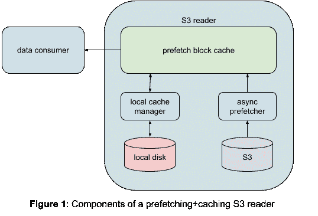

# 使用 S3 读取优化提高效率并减少运行时间

> 原文：<https://medium.com/pinterest-engineering/improving-efficiency-and-reducing-runtime-using-s3-read-optimization-b31da4b60fa0?source=collection_archive---------1----------------------->

Bhalchandra Pandit |软件工程师

# 概观

我们描述了一种我们用来提高 S3 读取吞吐量的新方法，以及我们如何使用它来提高生产作业的效率。结果非常令人鼓舞。一项独立的基准测试显示，S3 读取吞吐量提高了 12 倍(从 21 MB/s 提高到 269 MB/s)。生产量的增加使我们的生产工作能够更快完成。结果，我们看到 vcore-hours 减少了 22%,内存-hours 减少了 23%,典型生产作业的运行时间也有类似的减少。尽管我们对结果很满意，但我们仍在探索未来更多的改进。在本博客的结尾对它们进行了简要描述。

# 动机

我们每天都要处理存储在亚马逊 S3 上的数 Pb 的数据。如果我们检查 MapReduce/Cascading/burning 作业的相关指标，有一点很突出:比预期的 mapper 速度慢。在大多数情况下，观察到的映射器速度约为 5–7mb/秒。与观察到的 aws s3 cp 等命令的吞吐量相比，这个速度慢了几个数量级，在 AWS S3 CP 等命令中，大约 200+MB/秒的速度是常见的(在 EC2 中的 c5.4xlarge 实例上观察到)。如果我们能够提高作业读取数据的速度，我们的作业将会更快完成，并在此过程中为我们节省大量的时间和金钱。考虑到加工成本很高，这些节省的成本很快就会增加到一个相当大的数目。

# S3 读取优化

## 问题:S3A 中的吞吐量瓶颈

如果我们检查 S3AInputStream 的实现，很容易注意到以下潜在的改进领域:

1.  **单线程读取**:在单线程上同步读取数据，这导致作业花费大部分时间等待通过网络读取数据。
2.  **多次不必要的重新打开**:S3 输入流不可查找。每次执行寻道或遇到读取错误时，都必须重复关闭和重新打开剥离。分裂越大，它发生的几率就越大。每次这样的重新打开都进一步降低了总吞吐量。

## 解决方案:提高读取吞吐量

**建筑**

Figure 1: Components of a prefetching+caching S3 reader

我们解决上述缺点的方法包括以下内容:

1.  我们将拆分视为由固定大小的数据块组成。大小默认为 8 MB，但可以配置。
2.  每个块在被调用者访问之前都被异步读入内存。预取缓存的大小(根据块数)是可配置的。
3.  调用者只能访问已经被预取到内存中的块。这使客户端与网络碎片脱离，并允许我们有一个额外的重试层来提高整体弹性。
4.  每当我们遇到当前块之外的寻道，我们就在本地文件系统中缓存预取的块。

我们进一步增强了实现，使其成为一个基本上无锁的生产者-消费者交互。这一增强将读取吞吐量从 20mb/秒提高到了 269 MB/秒，这是由一个独立的基准测试测得的(请参见下面图 2 中的详细信息)。

**顺序读取**

任何顺序处理数据的数据消费者(例如映射器)都会从这种方法中受益匪浅。当映射器正在处理当前检索的数据时，将异步预取序列中的下一个数据。大多数情况下，当映射器准备好处理下一个数据块时，数据已经被预取。这导致映射器花费更多时间做有用的工作，而等待数据的时间更少，从而有效地提高了 CPU 利用率。

**更高效的拼花地板读数**

拼花文件要求非顺序访问，这是由其磁盘格式决定的。我们最初的实现没有使用本地缓存。每次在当前块之外进行寻道时，我们都必须丢弃任何预取的数据。当从 Parquet 文件中读取时，这导致了比股票阅读器更差的性能。

我们观察到，引入预取数据的本地缓存后，Parquet 文件的读取吞吐量有了显著提高。目前，与库存阅读器相比，我们的实现将 Parquet 文件读取吞吐量提高了 5 倍。

## 生产岗位的改善

读取吞吐量的提高带来了生产作业的多项效率提升。

**减少作业运行时间**

作业的总体运行时间减少了，因为制图者等待数据的时间减少了，而且完成得更快。

**潜在减少的映射器数量**

如果映射器花费足够少的时间来完成，我们可以通过增加分割大小来减少映射器的数量。映射器数量的这种减少导致与每个映射器的固定开销相关联的 CPU 浪费的减少。更重要的是，它可以在不增加作业运行时间的情况下完成。

**提高了 CPU 利用率**

由于映射器在更少的时间内完成相同的工作，整体 CPU 利用率增加了。

# 结果

目前，我们的实现(S3E)在一个单独的 git 存储库中，以允许对增强进行更快的迭代。我们最终会通过将它合并回 S3A 来回馈社区。

## 独立基准测试

Figure 2: Throughput of S3A vs S3E

在每种情况下，我们按顺序读取一个 3.5 GB 的 S3 文件，并将其本地写入一个临时文件。后一部分用于模拟映射器操作期间发生的 IO 重叠。基准测试是在 EC2 中的一个 c5.9xlarge 实例上运行的。我们测量了读取文件所需的总时间，并计算了每种方法的有效吞吐量。

## 生产运行

我们用 S3E 实现测试了许多大型生产作业。这些作业通常每次运行使用数万个 vcores。在图 3 中，我们给出了启用和未启用 S3E 时获得的指标之间的对比总结。

**衡量资源节约**

我们使用下面的方法来计算这种优化带来的资源节省。

**观察到的结果**

Figure 3: Comparison of MapReduce job resource consumption

考虑到不同生产作业的工作负载特征的差异，我们发现在 30 个最昂贵的作业中，vcore 降低了 6%到 45%。vcore 天数平均减少了 16%。

我们的方法吸引人的一点是，它可以在不需要对作业代码进行任何更改的情况下为作业启用。

# 未来方向

目前，我们已经将增强的实现添加到一个单独的 git 存储库中。将来，我们可能会更新现有的 S3A 实现，并回馈社区。

我们正在多个集群中推广这种优化。我们将在未来的博客中公布结果。

鉴于 S3E 输入流的核心实现不依赖于任何 Hadoop 代码，我们可以在任何其他访问大量 S3 数据的系统中使用它。目前，我们正在使用这一优化目标 MapReduce，级联，烫印工作。然而，在我们的初步评估中，我们也看到了 Spark 和 Spark SQL 非常令人鼓舞的结果。

当前的实现可以使用进一步的调整来提高其效率。同样值得探索的是，我们是否可以使用过去的执行数据来自动调整每个作业使用的块大小和预取缓存大小。

*要在 Pinterest 了解更多关于工程的知识，请查看我们的* [*工程博客*](https://medium.com/pinterest-engineering) *，并访问我们的*[*Pinterest Labs*](https://www.pinterestlabs.com/?utm_source=medium&utm_medium=blog-article&utm_campaign=pandit-august-2-2021)*网站。要查看和申请开放的机会，请访问我们的* [*职业*](https://www.pinterestcareers.com/?utm_source=medium&utm_medium=blog-article&utm_campaign=pandit-august-2-2021) *页面。*