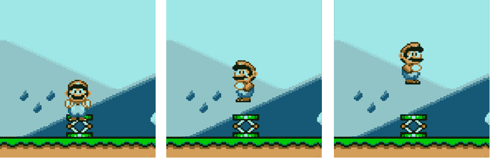
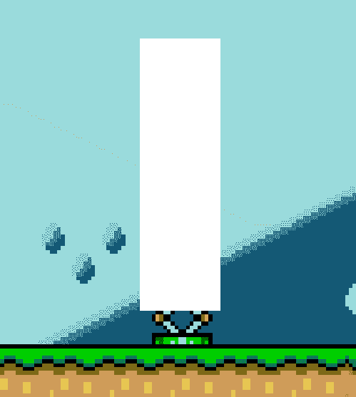
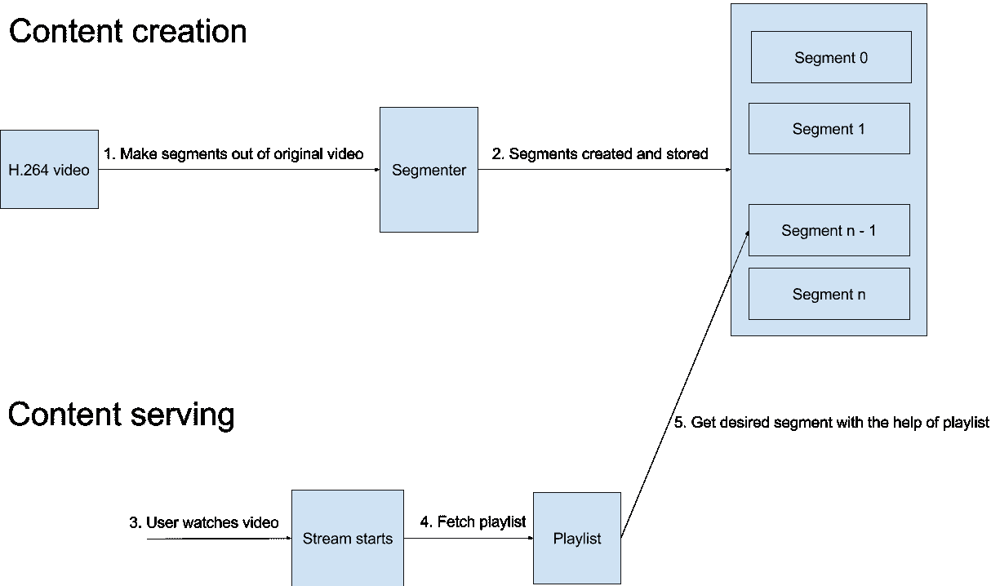
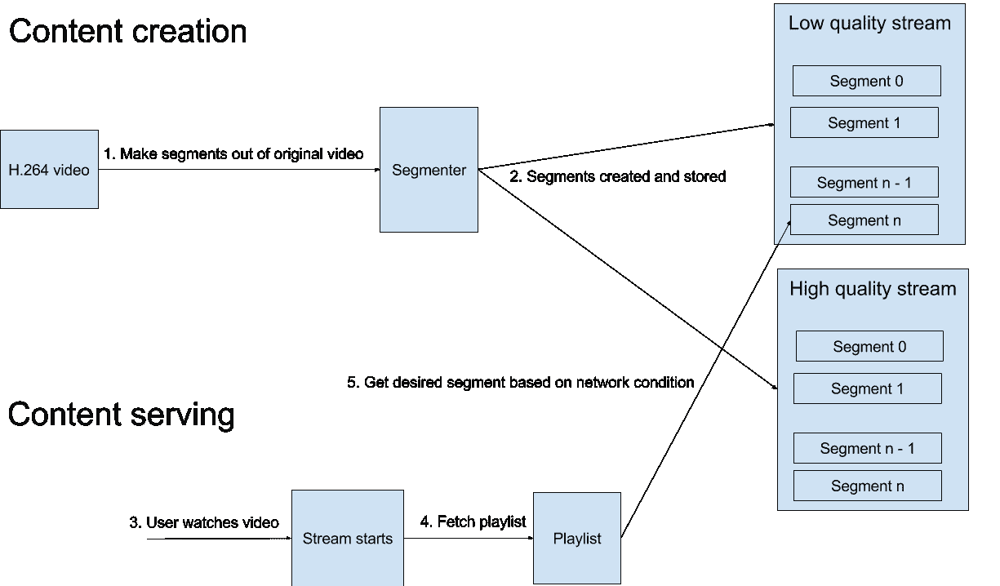
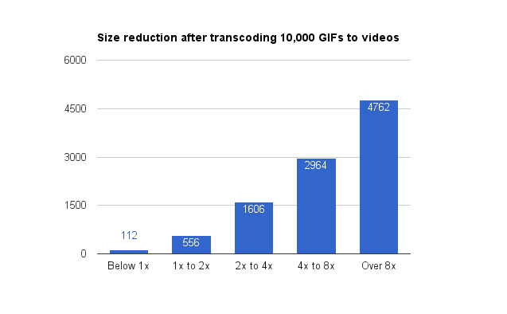
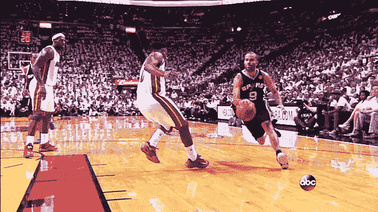

# 提高 Pinterest 上的 GIF 性能

> 原文：<https://medium.com/pinterest-engineering/improving-gif-performance-on-pinterest-8dad74bf92f1?source=collection_archive---------1----------------------->

Tianyu Lang 和 Nick DeChant| Pinterest 工程师，视频和图像平台

Pinterest 是最注重图片的在线服务之一，因此我们不断努力提高这些图片的速度和质量至关重要，无论是静态图片、GIF 图片还是视频。作为视频和图像平台团队工作的一部分，我们发现将 gif 转换为视频可以减少加载时间，提高播放流畅度并减少应用崩溃。

## 确定 gif 的改进

2014 年，一个小团队[在 Makeathon 经过一夜的黑客攻击后，建立了对 gif 的支持](/@Pinterest_Engineering/building-support-for-gifs-over-night-8909df8ef4ca)。随着时间的推移，我们努力改善加载时间，使用更少的内存来避免崩溃，这损害了用户体验和参与。

gif 比图像和视频大得多，因此下载时间更长。此外，我们的 iOS 应用程序上的 GIF 库使用大量内存来解码和显示动画。因为 gif 很大，需要一个内存密集型的库来从压缩格式解码成原始像素，我们的 iOS 应用程序会耗尽内存并崩溃。

为了解决这个问题，在 2016 年[建立了我们的原生视频平台](https://engineering.pinterest.com/blog/building-pinterest%E2%80%99s-video-platform)后，我们开始将 gif 转换为视频。

## GIF 与视频

GIF 格式创建于 1987 年，是允许慢速调制解调器下载大图像的有效格式。1995 年，Netscape Navigator 2.0 首次支持动画循环 gif。gif 动画制作非常简单，只需快速翻转一系列单独的图像。你可以看看它的[维基百科](https://en.wikipedia.org/wiki/GIF)页面了解更多历史。


比如上面的 Mario GIF，播放下面 3 张图片，中间间隔 0.54 秒，达到动画的错觉。



然而，GIF 的简单动画支持倾向于存储重复的信息并导致大文件。例如，下面的公共区域在任何帧中都没有改变，但仍然被存储。



这个缺点可以通过在创建图像时使用正确的“[处理方法](http://www.webreference.com/content/studio/disposal.html)来减少。正确的处理方法通过去除重复的信息来减小文件大小，因此只有第一帧需要存储“公共区域”,第二帧和第三帧只存储差异。然而，没有多少 GIF 创建软件利用这种优化。

H.264 视频于 2003 年首次推出，然后在 2014 年之前的每个版本中不断改进。H.264 视频不像 gif 那样存储单独的图像，而是存储完整的图像(关键帧)和增量(差分帧)。下面是 H.264 视频中帧存储方式的简化示意图。


帧 1 是“完整”图像，而帧 2 和 3 是相对于完整图像的增量。如果第 4 帧有重大变化，那么第 4 帧将是一个新的“完整”图像。

出于我们的目的，我们从影响加载速度和视频平滑度的三个特征(流、自适应比特率和大小)来比较 gif 和视频。

## 流动

流媒体会影响用户在播放开始前等待的时间。更好的流减少感知的加载时间。如果内容不是流式的，则需要完整下载。想想等待从网飞寄来的 DVD 和在你的笔记本电脑或手机上播放之间的区别。

gif 和 H.264 视频都可以流化，然而，H.264 视频可以使用苹果最近开发的 HLS (HTTP 直播流)技术。HLS 于 2009 年首次推出，现在在 web、Android 和 iOS 上得到原生支持。使用 HLS，视频需要首先分成连续的块，然后才能下载并在播放设备上逐块播放。HLS [播放列表](https://en.wikipedia.org/wiki/M3U)在流媒体会话开始时获取。它们通过向播放设备提供每个视频片段的位置来引导播放设备。下图演示了使用 HLS 播放视频的过程。



这些视频片段还允许视频更高效地缓存在我们的 CDN 中。如果只有视频的一部分被频繁访问，则只需要缓存相应的片段。然而，对于 gif，必须缓存整个文件。

## 自适应比特率流

自适应比特率流是一种通过根据网络条件降低媒体质量来增强用户体验的技术。如果网络带宽突然下降，它会切换到较低质量的视频版本，从而提高视频播放的流畅性，反之亦然。

由于 HLS 视频已经成块，自适应比特率流几乎是免费的。我们只需要为同一视频生成不同比特率的变体，然后根据网络条件在它们之间切换。下图简要说明了 HLS 如何实现自适应比特率流。



gif 可实现自适应比特率流。我们提取 GIF 中的图像，生成不同质量的备选方案，并创建一个 GIF 播放器，使用自适应技术来播放它。然而，这需要大量的工作，你需要建立自己的 GIF 播放器。相比之下，所有原生视频播放器都支持自适应比特率视频，并将自动切换质量/比特率以获得最佳体验。

## 大小

文件大小以最直接的方式影响加载速度。文件越大，下载时间越长。

H.264 视频比 GIF 视频小得多，我们通过实验证实了这一点。我们随机挑选了 1 万张 3.1KB 到 78MB 的动画 gif，转换成 H.264 视频。我们使用 FFmpeg 3.2 和下面的命令进行转换。

```
**ffmpeg -i $gifPath -movflags faststart -pix_fmt yuv420p -vf “scale=trunc(iw/2)*2:trunc(ih/2)*2” -c:v libx264 $videoPath**
```

下图展示了将这 10，000 张 gif 转换为视频后，大小缩减的分布情况。比率越大，结果越好。



大约 93%的 gif 图片比视频图片至少缩小了一半。将近 50%的 gif 图片的视频副本只有原始图片的八分之一大。此外，过程中的质量损失可以忽略不计。下面是原始大小为 4.1 MB 的 GIF 与其 1.4 MB 的视频副本的并排比较。

GIF:



## 结果

在比较了 gif 和视频之后，我们对将 gif 转换成视频的决定充满了信心。让我们看看视频的威力。我们在相同的条件下，在同一台设备上播放了两次相同的三张 gif，一次是 gif，一次是视频。视频运行流畅，在 26 秒内完成，而 gif 滞后，在 83 秒内完成。以下是对比:

## 警告

虽然结果很好，但有一个问题。gif 并不总是比视频大。如果 GIF 在帧之间有巨大的延迟，转换后的视频将明显大于原始 GIF。例如，下面的 GIF 只有 162 帧，6.6 MB，然而它的视频副本超过 130 MB。在这张 GIF 的每一帧之间，有 655.35 秒的延迟。那可是 10 多分钟啊！默认情况下，FFmpeg 每隔几秒钟创建一个“完整”图像(关键帧)。因此，这个 GIF 将导致比必要的多得多的关键帧。


我们目前正在研究构建一个解决方案来处理这些类型的图像。请关注未来的更新，并在 Pinterest 上享受改进的 GIF 体验！

*鸣谢:GIF- >视频转码项目的主要贡献者包括来自视频&图像平台团队的天宇朗、尼克·德尚、张睿和诺贝特·波托基。*