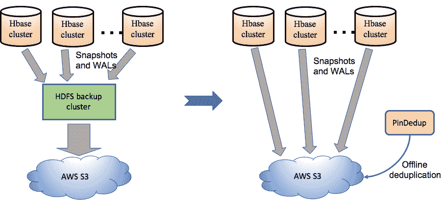
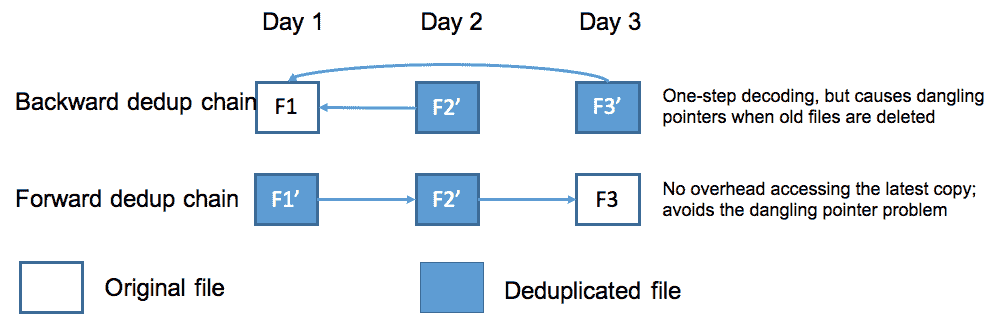

# 提高 Pinterest 的 HBase 备份效率

> 原文：<https://medium.com/pinterest-engineering/improving-hbase-backup-efficiency-at-pinterest-86159da4b954?source=collection_archive---------1----------------------->

徐|软件工程师，存储和缓存团队

Pinterest 拥有业内最大的 HBase 生产部署之一。HBase 是我们基础设施的基础构建模块之一，为我们的许多关键服务提供支持，包括我们的图形数据库(Zen)、我们的通用键值存储(UMS)、我们的时间序列数据库以及其他一些服务。尽管可用性很高，我们还是会定期将生产 HBase 集群备份到 S3 上，以用于灾难恢复目的。

在本帖中，我们将介绍如何通过从备份路径中删除中间 HDFS 集群和使用离线重复数据删除工具来消除重复的快照文件，从而显著提高 HBase 备份效率。最终，这简化了备份流程，将端到端备份时间缩短了一半，降低了运营开销，并将 S3 存储使用量减少了两个数量级。

在我们开始之前，我们想指出，由于历史原因，备份管道由两个步骤组成:

1.  将 HBase 表快照和预写日志(wal)导出到专用备份 HDFS 集群。
2.  将数据从备份群集上传到 S3。随着数据量(约为 PBs)的增长，S3 和备份集群的存储成本也在不断增加。

# 简化备份管道

## 历史

当我们第一次基于 HBase 0.94 版构建备份管道时，没有现成的工具可以将 h base 快照直接导出到 S3。唯一支持的方法是将快照导出到 HDFS 群集。这是我们最初采取两步走办法的主要原因。然而，随着系统的发展，专用的 HDFS 集群成为了单点故障，并导致了大量的操作开销。因此，我们不得不不断增加机器来容纳不断增长的数据量。

最近，我们完成了 HBase 从 0.94 版到 1.2 版的升级。除了许多错误修复和性能改进，新版本的 HBase 还提供了直接将表快照导出到 S3 的原生支持。借此机会，我们通过从备份路径中删除 HDFS 集群来优化我们的备份渠道。此外，我们创建了一个名为 PinDedup 的工具，该工具可以跨备份周期(稍后描述)对 S3 上的冗余快照文件进行异步重复数据删除，以减少我们的 S3 占用空间。

## 挑战和方法

我们在迁移中遇到的一个主要挑战是最大限度地减少对生产 HBase 集群的影响，因为它们服务于在线请求。使用类似于 [distcp](https://hadoop.apache.org/docs/current/hadoop-distcp/DistCp.html) 的 MapReduce 作业完成表导出。为了增加上传吞吐量，我们使用带有快速上传选项的 S3A 客户端。在实验过程中，我们观察到，直接 S3 上传往往是非常 CPU 密集型的，特别是对于传输大文件，如 HFiles。当一个大文件被分解成多个块时就会发生这种情况，每个块在上传之前都需要被散列和签名。如果我们使用的线程数量超过了机器上的内核数量，执行上传的 regionserver 将会饱和并可能崩溃。为了缓解这个问题，我们限制了每台主机的并发线程和纱线容器的最大数量，以便备份导致的最大 CPU 开销低于 30%。

# 删除 S3 上的重复文件

## 大文件很少改变

对 HBase 快照进行重复数据消除的想法是受观察到的大型 HFiles 在整个备份周期中通常保持不变的启发。虽然增量更新与小压缩合并，但占存储使用量最大的大型 HFiles 仅在大压缩期间合并。因此，相邻的备份日期通常包含许多重复的大型 HFiles，尤其是对于读取量大的 HBase 集群。

基于这一观察，我们提出并实现了一个简单的文件级重复数据删除工具，称为 PinDedup。它跨相邻备份周期异步检查重复的 S3 文件，并用引用替换较旧的文件。为了提高重复数据删除的效率，我们调整了主要的压缩策略，使其不那么激进，只在必要时触发。

## 设计选择

尽管 PinDedup 很简单，但我们必须考虑一些设计选择。

**文件级与区块级重复数据删除**。PinDedup 中使用的文件级重复数据消除方法提供了足够好的压缩率。也实现了可变大小的分块，但是它只带来了边际效益，增加了系统的复杂性。这主要是因为在主要的压缩过程中，合并的更改(尽管总数据量很小)会遍布整个文件，并修改大多数块。

**在线与离线重复数据删除。**在线重复数据删除是指在数据上传到 S3 之前进行重复数据删除。当存在重复时，这可能会避免将大文件传输到 S3。我们选择离线重复数据消除，因为它允许我们控制何时进行重复数据消除。由于客户端团队经常使用最新的快照进行离线分析，我们可以将重复数据消除延迟到分析作业完成之后。

**保持最新副本不变。**当识别两个重复文件时，一个重要的问题是是否用引用替换旧的或新的文件。我们选择了前者，因为最新的文件更有可能被访问。我们将这种方法称为“正向重复数据消除链”与其对应的方法相比，这种方法在访问最新数据时不会产生开销，同时避免了由于保留而删除旧快照时的悬空指针问题。

# 结果

备份管道顺利升级，没有造成任何事故(谢天谢地！).移除 HDFS 备份群集减少了运营开销，并将端到端备份时间缩短了大约 50%。PinDedup 推广到 S3 上的所有 HBase 备份，并实现了从 1/3 到 1/137 的存储缩减。这两者相结合，大大节省了基础设施成本。

*鸣谢:非常感谢张天英和 Chiyoung Seo 的支持和技术指导，感谢梁成进和劳拉·比斯特的知识转移和代码审查，感谢安德鲁·邓勒普帮助建立测试环境，感谢存储和缓存团队的其他成员在设计和实现过程中提供的宝贵反馈。*