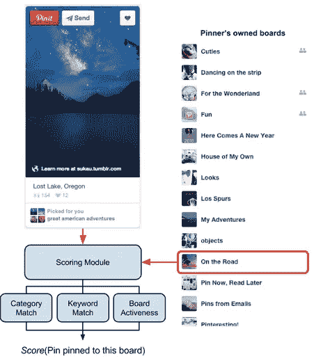
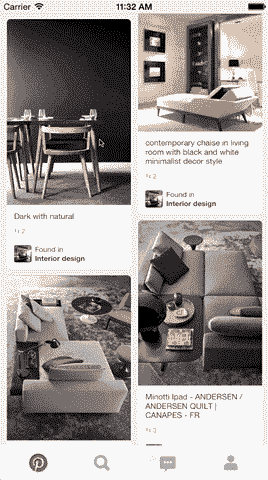

# 使用预测板拾取器改进钉扎

> 原文：<https://medium.com/pinterest-engineering/improving-pinning-with-a-predictive-board-picker-243903dea9be?source=collection_archive---------3----------------------->

刘宇辰|发现网站 Pinterest 工程师

每天都有数千万人在 Pinterest 上发现并保存图钉，使图钉流量成为最重要的功能之一。它如此重要，以至于我们一直在小心翼翼地对它进行更新，以确保易用性和快速加载时间。

作为一名活跃的图钉爱好者，我在 20 多个图板上收藏了很多图钉。以前，我经常发现自己在我的许多电路板的下拉列表中滚动，试图为每个引脚找到正确的电路板。这在手机上尤其具有挑战性，因为一次只有几块板子出现在屏幕上。数据显示，我不是唯一一个有这种沮丧经历的人，因为活跃的 Pinners 平均有 24 块板。

作为一名前 Pinterest 实习生(2013 届)，我开始在 Make-a-thon(我们版本的 hack-a-thon)期间的 Pinning 流程中为 iOS 和 Android 构建一个智能选板器。目标是根据 Pin 内容和 Pinner 板的匹配提供建议的板，以使 Pin 更容易。

## 魔力

我们的服务内容有丰富的元数据集合。对于大多数 pin 来说，我们确切地知道它们是关于什么的，比如类别(比如旅游)，以及基于成千上万 Pinners 写的描述，哪些关键词是最重要的。这同样适用于董事会。使用我们维护的这些丰富的数据，我们得出结论，我们可以预测 Pinner 打算保存到哪个板。

当一个 Pinner 重新发布时，我们使用该 Pin 对该 Pinner 的所有板运行评分算法，并基于内容匹配返回得分最高的板。评分算法使用以下特征的线性组合:

*   类别匹配:引脚的类别是否与板卡的类别匹配。引脚和电路板的类别信息表示为一个单位向量，其中每个维度表示引脚或电路板属于该类别的概率。匹配被表示为两个类别向量的点积。
*   关键字匹配:我们使用关键字来描述一个引脚或电路板。这些文本术语将每个对象置于高维空间中。我们通过来自 Pin 和 board 关键字的两个稀疏向量的内积来测量该空间中的接近度。
*   板的活跃性:在计分算法中也考虑了新管脚被添加到板的频率。一个被抛弃了很长时间的董事会应该受到惩罚，以利于更活跃的董事会。

*图 1:幕后的智能电路板拾取器*

## 调整用户体验

准确性不是预测功能成功的唯一因素。获得正确的用户体验甚至更重要，尤其是对于嵌入在基本锁定流程中的功能。一个小小的错误可能会毁掉数百万人的钉书经历。鉴于我们在固定流程中引入了获取电路板建议的小延迟，我们需要尽可能降低额外延迟的影响，以使 repin 体验更好。

不幸的是，我们第一次没有做对。我们在 iOS 上的第一个版本在获取电路板建议时首先显示原始电路板拾取器(在快速拾取部分显示最近拾取的三块电路板)，然后在快速拾取部分交换它们。尽管数字显示 Pinners 在 repin 流上花费的时间更少，并且很快学会了这个功能，但我们注意到编辑或删除 pin 的 Pinners 数量出现了奇怪的增长。我们了解到在快速选择中交换主板提供了糟糕的用户体验(参见下面的动画)。当交换发生在他们敲击板子之前时，那些试图固定到最近板子上的人会意外地保存到错误的板子上。

*图 2:智能板拾取器的首次尝试*

为了获得更好的用户体验，我们添加了一个小旋转圈，在获取建议板时阻止了为建议板保留的区域，并保持固定流活动。我们仍然在两个预测之前的第一个位置显示最近选择的电路板，如果 Pinners 不想等待建议，他们可以向下滚动所有电路板的列表。将引脚放在第一位始终是我们的首要任务，这种设计成功地减少了意外固定到错误电路板的情况，同时仍然实现了我们的目标。

*图 3:智能取板器的改进版*

## 洞察力

实验中有几个有趣的发现:

*   使钉扎流程更易于使用增加了重复钉扎和重复钉扎:我们的测试显示，智能板拾取器减少了 4%的钉扎流程废弃，增加了 1%的总重复钉扎。
*   在插针流程中建议正确的插针减少了以后重新组织插针的工作量:我们的数据证实，智能插卡工减少了 2%的插卡工、4%的编辑插针和 3%的删除插针。换句话说，插针卡在正确的板上！
*   智能板拾取器有助于核心钉扎流程:该功能将快速拾取中使用板的钉扎器数量增加了 15 %,并将钉扎流程的平均时间减少了 10%。

如果你还没有在最新的 [iOS](https://itunes.apple.com/en/app/pinterest/id429047995?mt=8) 或 [Android](https://play.google.com/store/apps/details?id=com.pinterest&hl=en) 应用程序上试用智能选板器！

*刘宇辰是 Pinterest 推荐团队的软件工程师。*

*鸣谢:Smart board picker 是与 iOS 平台上的柳斌和 Android 平台上的尼基·沙阿合作开发的。*

*获取 Pinterest 工程新闻和更新，关注我们的工程*[*Pinterest*](https://www.pinterest.com/malorie/pinterest-engineering-news/)*，* [*脸书*](https://www.facebook.com/pinterestengineering) *和* [*推特*](https://twitter.com/PinterestEng) *。有兴趣加入团队吗？查看我们的* [*招聘网站*](https://about.pinterest.com/en/careers/engineering-product) *。*