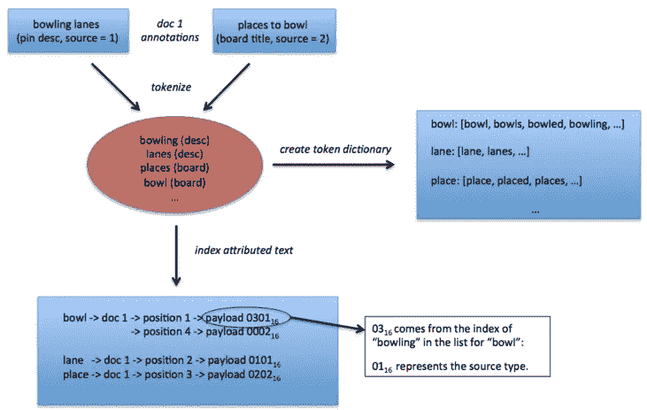

# 提高搜索相关性和文本属性的参与度

> 原文：<https://medium.com/pinterest-engineering/improving-search-relevance-and-engagement-with-text-attributes-452047853967?source=collection_archive---------1----------------------->

Matthew Fong |发现网站 Pinterest 工程师

大约两年前，我们推出了[引导搜索](https://blog.pinterest.com/en/guided-search-new-way-find-what-you%E2%80%99re-looking)，这是一种搜索有不止一个正确答案的问题的方法，从那以后我们一直在进行改进。Pinterest 搜索建立在 [Lucene](https://lucene.apache.org/) 之上，利用了基本的功能，比如普通的文本字段和有效载荷字段，没有太多的定制。然而，我们了解到，为了更准确地对检索到的 pin 进行排序，存储和区分来自各种来源的文本变得越来越重要。在迭代了许多可能的解决方案后，我们设计并实现了一个新的字段， *attributed_text* ，它允许我们存储每段文本的属性，如源类型和形态学形式。

## 动机

任何搜索引擎的目标都是在可接受的等待时间内具有高精度和高召回率。随着时间的推移，我们对索引进行了显著的修改，以解决延迟和召回问题。

当搜索索引很小时，添加一个新的文本源是很容易的，但是随着文本源数量的增加，我们需要找到一个可扩展的解决方案。我们创建了一个名为 *merged_text* 的字段，它存储所有的文本注释，但是它不能在评分时区分注释源，并且很难试验新的文本源。我们还使用了词干，这极大地帮助了回忆，但损害了准确性。例如，搜索“animals”的 Pinner 也可以匹配只有标记“animal”的文档，但是搜索“bowling”和“bowl”将检索同一组文档。因为我们希望最大化召回率和精确度，我们的目标是设计一个解决方案，为我们提供更好的文本排序信号和相似的召回率。

## 对解决方案的探索

第一个想法是评估将我们的 *merged_text* 分成几个字段的成本，为某些源或形态变换设置不同的字段。我们尝试了最简单的情况，比较了搜索两个字段和只搜索一个字段的性能。当我们在没有任何优化的情况下测试一台机器时，我们发现两个字段的中值延迟是一个字段的 2.5 倍，而平均延迟的比率是 1.5 倍。因为使用两个字段时存在如此大的差异，所以我们认为这不是最佳方法，无论我们可以进行什么优化。

另一个想法是只使用一个字段，但是在该字段中存储同一标记的不同形态形式。例如，对于标记“animals”，我们将存储“animals”(精确)、“animal”(词汇化)和“anim”(词干化)。然后，我们可以指出令牌在其有效负载中匹配类型。尽管这种解决方案相对容易实现，但它也有缺点。例如，搜索和评分变得更加复杂，因为我们必须查看多个发布列表和位置索引，计算成本可能会翻倍。

第三个解决方案是我们的实际设计。我们也将有效负载用于匹配类型。虽然看起来有太多可能的形态变换来在有效载荷中有效地表示它们，但是我们通过使用完美散列来解决这个问题。对于每个词干标记，我们为每个可能的未词干标记分配一个哈希值，这样就不会有冲突。在建立索引之前，我们创建一个字典，其中包含如下条目:

然后，我们在索引时使用这个字典来存储哈希值(它是这个词在适当的词干标记列表中的索引)。我们在服务时访问同一个字典，这样我们就可以将匹配标记的精确形式与查询标记的精确形式进行比较。因为最大的非结构化令牌列表不到 150 个条目，所以我们可以将该值存储在一个字节中，并且能够将源和确切形式存储在两个字节中。(有趣的事实:最长的 5 个符号列表是*装饰、时尚、设计、灵感*和*颜色*。)

您可以在下面的图 1 中看到一个完整的索引流程示例，包括实际有效负载的样子。使用定制的 SpanQuery 和 Scorer，我们能够对匹配特定类型的注释源以及查询标记的词干匹配或无词干匹配的文档应用任何类型的倍增。

*图一。我们如何为一个文档填充属性文本的示例流程*

## 展望未来

这些升级也有相当多的障碍。我们遇到的第一个问题涉及计算延迟。由于我们现在为每个搜索做了更多的工作，我们的服务机器不得不更加努力地工作，并努力处理我们的高峰流量时间的负载。我们正在继续使后端 Lucene 代码在我们专门使用有效负载时更加高效，例如，为多项查询实现惰性评分。我们不是在扫描发布列表时对每个有效负载进行评分，而是等到最后对匹配所有查询条件的文档的有效负载进行评分。通过这种优化，我们看到 p99 延迟提高了 28%。

这些变化也为提供更好、更准确的搜索服务打开了更多的可能性。我们可以实现额外的优化，比如要求所有的查询标记来自同一个注释源，或者相互之间保持一定的距离。我们还可以对每个标记的精确匹配和词干匹配进行更细致的评分。对于一些单词，比如“bowling”，它和它的词根“bowl”有很大的区别对于其他人来说，如“男人”，与“男人”几乎没有任何区别。

## 活动中的属性化文本

我们仍在尝试这种方法，我们已经在早期测试中看到了相关性和参与度的强大收益。随着每次搜索的重复次数显著增加，我们也看到了相关性的提高，如下文的并排比较所示。

*图二。使用属性文本对搜索查询“动漫艺术创意”的改进。*

如果你有兴趣解决搜索基础设施、搜索排名或查询理解方面的类似问题，[快来加入我们吧](https://careers.pinterest.com)！

*鸣谢:王栋、刘鑫和芮江，感谢他们的技术指导和反馈。*