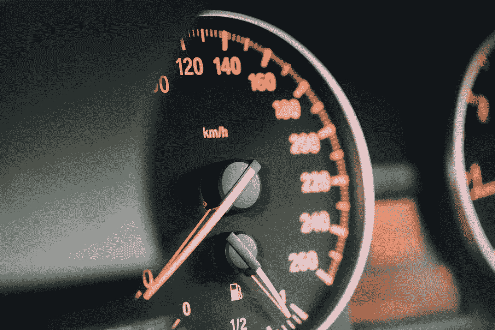
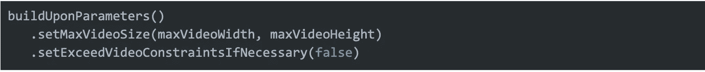
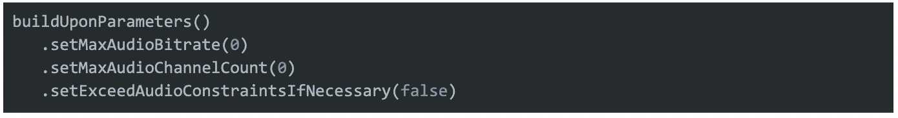

# 改进 Android 上的播放器

> 原文：<https://medium.com/pinterest-engineering/improving-the-player-on-android-8b7faf9009cf?source=collection_archive---------0----------------------->

Grey Skold |(前安卓视频工程师)；王麟|安卓性能工程师；刘胜|安卓性能工程师

Pinterest Android 应用程序在两列网格上混合了图像和视频，提供了一种罕见的体验。为了在 Android 设备上保持高性能的视频体验，我们专注于:

*   预热
*   配置
*   汇集球员

# 预热

为了减少启动延迟，我们通过在应用程序启动早期发送一个虚拟 HTTP HEAD 请求来建立一个视频网络连接。同样的连接可以用来播放未来的视频。这甚至在我们的服务器返回任何视频 URL 之前就已经完成了。

同样的策略也适用于 UI 渲染。我们发现 [Exoplayer](https://github.com/google/ExoPlayer) 倾向于在解析来自视频 url 的信息后做大量的工作。它:

*   计算纵横比
*   调用[上的 oncontentasperationchanged()](https://exoplayer.dev/doc/reference/com/google/android/exoplayer2/ui/StyledPlayerView.html#onContentAspectRatioChanged(com.google.android.exoplayer2.ui.AspectRatioFrameLayout,float))
*   通知 [AspectRatioFrameLayout](https://exoplayer.dev/doc/reference/com/google/android/exoplayer2/ui/AspectRatioFrameLayout.html) 宽高比

由于我们大多数视频的长宽比是预先确定的，我们可以通过以下方式防止上述工作:

*   通过[aspectatiformalelayout . setaspectatio()](https://exoplayer.dev/doc/reference/com/google/android/exoplayer2/ui/AspectRatioFrameLayout.html#setAspectRatio(float))设置视频宽高比
*   用空体覆盖[player view . oncontentasperationchanged()](https://exoplayer.dev/doc/reference/com/google/android/exoplayer2/ui/PlayerView.html#onContentAspectRatioChanged(com.google.android.exoplayer2.ui.AspectRatioFrameLayout,float))方法

后者防止玩家试图重新计算长宽比。

# 配置

## [默认加载控制](https://exoplayer.dev/doc/reference/com/google/android/exoplayer2/DefaultLoadControl.html)

ExoPlayer 为我们提供了 [setBufferDurationsMs()](https://exoplayer.dev/doc/reference/com/google/android/exoplayer2/DefaultLoadControl.Builder.html#setBufferDurationsMs(int,int,int,int)) 来定制各种缓冲持续时间，用于延迟播放，直到我们有足够的数据。由于 Pinterest 的大部分媒体内容都是短格式的，我们可以使用更短的缓冲时间，从而减少等待数据加载的时间。

通过这样做，我们看到了视频启动延迟的显著减少。虽然再缓冲速率增加了一点，但整体视频 UX 仍有所改善。

## [默认跟踪选择器](https://exoplayer.dev/doc/reference/com/google/android/exoplayer2/trackselection/DefaultTrackSelector.html)

使用以下两个参数，我们可以有效地确保在 feed 中加载的视频受到其视口大小的限制(即，避免在小的 360 像素视口中加载大的 1080p 视频)。

Pinterest 应用程序同时在网格中播放多个静音视频。使用以下参数，我们可以禁用音频渲染以节省下载音频的网络带宽和处理音频的内存消耗。

## [简单缓存](https://exoplayer.dev/doc/reference/com/google/android/exoplayer2/upstream/cache/SimpleCache.html)

Exoplayer 提供了一个缓存接口，将下载的媒体数据保存在磁盘上。然而，在我们遇到由后端错误引起的致命错误的情况下，坏的内容也会滞留在缓存中。这可能导致应用程序继续遇到相同的回放错误，即使后端已经修复。

当从[播放器返回以下致命 IO 错误时，我们使用](https://exoplayer.dev/doc/reference/com/google/android/exoplayer2/Player.Listener.html#onPlayerError(com.google.android.exoplayer2.PlaybackException))[simple cache . remove resource()](https://exoplayer.dev/doc/reference/com/google/android/exoplayer2/upstream/cache/SimpleCache.html#removeResource(java.lang.String))来清除脏缓存。Listener.onPlayerError() :

*   错误代码 IO 未指定 2000
*   错误代码 IO 无效 HTTP 内容类型 2003
*   错误代码 IO 错误 HTTP 状态 2004
*   错误代码 IO 文件未找到 2005
*   错误代码 IO 读取位置超出范围 2008

# 汇集球员

最后，我们建立了自己的缓存，在需要的时候将玩家集中起来。从历史上看，我们在运行中实例化新的播放器实例，这导致了内存和带宽的巨大开销。以下是一些高层次的学习:

## 通过编码分离

播放器实例基于最后呈现的媒体的编码类型有效地保持对底层解码器的引用。玩家在不同的解码器之间切换上下文需要做大量的工作。因此，我们根据最初的解码格式汇集我们的球员。通过确保回收的播放器具有匹配媒体编码的解码器，我们消除了切换编码格式时引起的任何延迟开销。

## 智能调整大小

池大小本身经历了多次迭代，以找到容纳多个视频播放所需的理想空间，同时避免内存不足(OOM)和 [ANR](https://developer.android.com/topic/performance/vitals/anr) 。以下两个 API 用于防止系统过载:

[ontrimremory(int)](https://developer.android.com/reference/android/content/ComponentCallbacks2.html#onTrimMemory(int))

这是我们的关键回调用来通知我们，我们应该清除我们的球员缓存池，因为我们开始危险地接近发送 OOMs。

[setForegroundMode(true)](https://exoplayer.dev/doc/reference/com/google/android/exoplayer2/ExoPlayer.html#setForegroundMode(boolean))

设置该标志将允许 Exoplayer 保留对视频解码器的直接引用，并且即使在空闲状态下也将其保存在内存中。然而，它对内存和设备的稳定性有很大的影响。我们必须根据当前的应用程序生命周期和设备上的当前可用内存，构建逻辑来保守地使用这种方法。

# 游戏时间永远不会结束

提高视频播放的性能是对 ExoPlayer 库内部工作方式以及我们自己产品独特用例的永无止境的调查，但最具挑战性的是建立一个架构，为 home feed 的独特 Pinterest 体验服务。我们的长期目标是将这项工作分享给其他希望以最少的设置构建无缝视频 UX 的开发人员。与此同时，我们希望每个人都建立一个更高性能的视频体验。

*要在 Pinterest 了解更多工程知识，请查看我们的* [*工程博客*](https://medium.com/pinterest-engineering) *，并访问我们的*[*Pinterest Labs*](https://www.pinterestlabs.com/)*网站。要探索 Pinterest 的生活，请访问我们的* [*职业*](https://www.pinterestcareers.com/) *页面。*