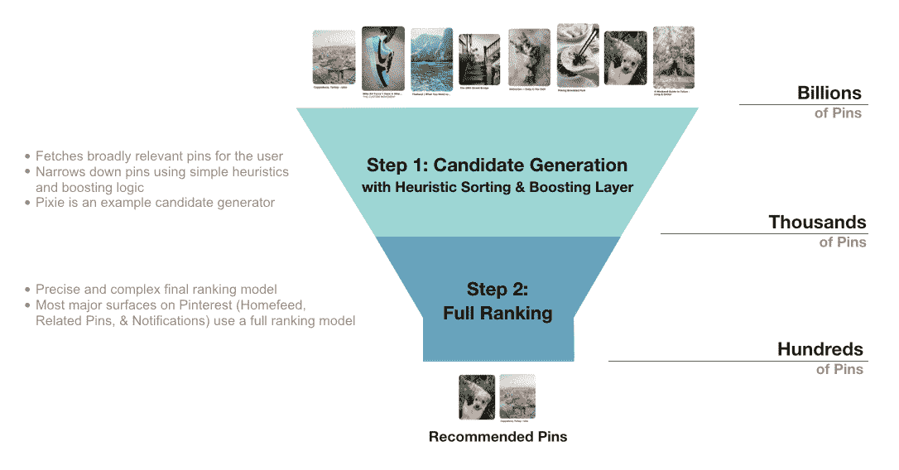
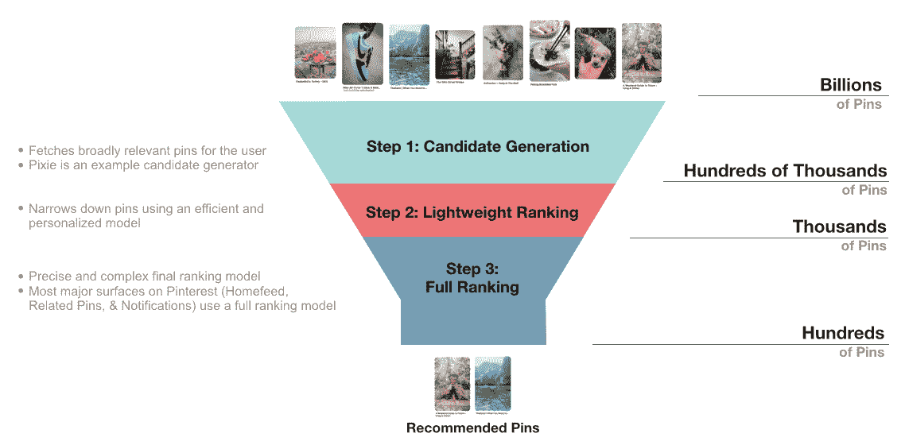
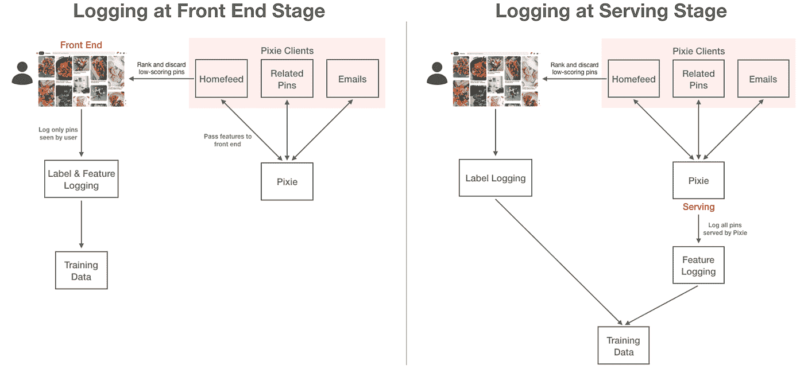
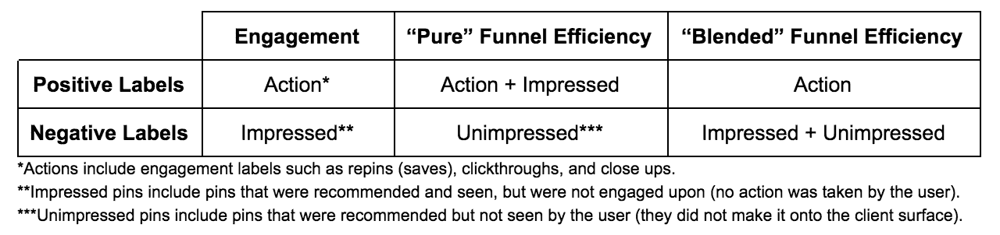

# 通过轻量级排名提高推荐的图钉的质量

> 原文：<https://medium.com/pinterest-engineering/improving-the-quality-of-recommended-pins-with-lightweight-ranking-8ff5477b20e3?source=collection_archive---------1----------------------->

Poorvi Bhargava |软件工程师，Homefeed 推荐，王森|软件工程师，Homefeed 推荐，廖骏伦|技术主管，Homefeed 推荐，张铎|工程经理，Homefeed 推荐

Pinterest 语料库由数十亿个 pin 组成，然而，每个 Pinner 在浏览其主页 feed 或其他推荐表面时，只能看到基于其兴趣的一小部分子集。我们如何向每个人提供这些建议？

# Pixie 简介:Pinterest 的一个关键推荐系统

Pixie 是 Pinterest 的主要推荐系统之一，用于获取相关 pin。Pixie 由 Pinterest 上所有引脚和电路板的二分图组成。从一个最近交互过的引脚开始，我们沿着图形执行多次随机遍历，为该引脚生成数千个相似的引脚。这些 pin 按“访问计数”排序，或在随机行走中被“访问”的次数。从 Pixie 获取 pin 后，它们被发送到 Pixie 的客户端进行进一步的个性化排序。

作为一个主要的推荐源，Pixie 每秒生成超过 7500 万个 pin，并为多个下游客户端提供支持，包括重要的表面，如主页馈送、推荐馈送、电子邮件通知、搜索和广告。

# Pixie 如何融入 Pinterest 推荐管道？

像其他推荐系统一样，我们使用两步方法来缩小数十亿个 pin 的范围，为 Pinner 选择最好的几个。

Figure 1\. Number of Pins at each stage of the current Recommendation Funnel

第一步，“候选生成”，是一个召回驱动的步骤，旨在有效地获取一组广泛相关的引脚。Pixie 就是这样一个候选发电机。该步骤使用最近的用户参与来制定代表 Pinner 兴趣的输入。input Pin 用于获取类似的 Pin，这些 Pin 基于简单的启发式算法(在 Pixie 的情况下，这是访问计数分数)快速评分，并针对特定的业务需求应用附加的提升逻辑。得分最高的大头针然后被传递到漏斗的下一个步骤。

第二步，或“完全排序”层，对从多个候选生成器中提取的所有推荐进行聚合和排序。它由一个精确而复杂的神经网络组成，使用用户、Pin 和上下文特征来准确预测 Pinner 与候选人互动的可能性。很大程度上由于模型的复杂性，这一步通常是非常昂贵和耗时的，所以我们在这一步对有限的数量进行排名。然后向用户显示排名最高的大头针。

# 让 Pixie 推荐更加个性化

尽管 Pixie 在 Pinterest 的多个主要产品表面取得了巨大成功，但它目前面临着几个挑战，这些挑战限制了它生成更多相关内容:

1.  Pixie 的“访问计数”分数纯粹根据图形结构对生成的 pin 进行排序；它不考虑任何用户偏好。在 Pinterest，我们建立了一系列代表用户兴趣和 pin 信息的功能，这些功能可能有助于改善个性化。
2.  特别的业务需求(例如本地内容的推广)不容易合并，需要添加到现有的增强逻辑网络中。

这两个挑战都可以通过用机器学习模型替换 Pixie 中现有的访问计数评分和提升层来优雅地解决。

然而，机器学习模型在生产中运行可能会非常昂贵和耗时。由于 Pixie 每秒推荐超过 7500 万个引脚，并且位于多个推荐面的关键路径上，因此添加模型不会显著增加 Pixie 的延迟是至关重要的。此外，由于 Pixie 候选生成之后是客户端上更彻底的完整排序步骤，因此我们可以使用更简单的模型，并牺牲一些精度来提高效率。这种类型的“轻量级”排名(与“重量级”全排名相比)通常在行业中建立，以改善推荐漏斗中早期的个性化。最后，由于 Pixie 为 Pinterest 的各种主要表面提供支持，因此记住设计应该灵活、可伸缩和可扩展，以支持整个公司的多种客户需求，这一点很重要。因此，Pixie 的这个轻量级排名模型的主要目标是:

1.  向用户推荐相关性和个性化更好的 pin，尤其是与现有的“访问计数”解决方案相比。
2.  构建一个高效的机器学习模型，支持每秒 7500 万个 pin 的评分。
3.  构建一个可伸缩和可扩展的多租户框架，可以轻松应用该框架来支持不同的 Pixie 客户端。
4.  增加灵活性，以便能够根据客户端不断变化的业务需求来强调特定类型的引脚。

Figure 2\. Recommendation Funnel after adding a Lightweight Ranking Step

# 构建多租户轻量级排名系统

在实践中，基于机器学习的推荐系统由多个关键组件组成，如训练数据管道和模型训练策略。在这里，我们将重点关注需要主要设计决策的组件，这些组件允许我们为 Pixie 构建一个多租户轻量级排名系统。

## 创建可扩展到多个客户端的训练数据集

机器学习模型的成功很大程度上依赖于训练数据。为了生成这些数据，我们将来自 Pinners 的标签与 Pin 和用户上下文功能的显式结合起来。

Figure 3\. Logging Pipeline Design: logging at the front end stage versus at the serving stage.

记录训练数据的一种常见做法是在“前端阶段”进行记录。这意味着我们将特征数据传递到前端，并且只存储用户看到的管脚的数据。在前端阶段进行日志记录的主要好处是节省存储空间，因为我们不需要存储任何用户看不到的(因此没有标记的)数据。绝大多数数据，尤其是轻量级评分级别的数据，是用户看不到的。

然而，由于该项目的主要设计目标之一是为多个客户端构建一个可扩展的管道，我们决定使用另一种方法，在“服务阶段”直接登录。这包括存储 Pixie 立即生成的所有候选图钉的特征数据，包括看不见的图钉的特征数据。这避免了每个客户端必须将特性传递给前端并建立自己的日志记录基础设施。此外，看不见的数据帮助我们定义轻量级排名特有的训练优化策略，如下所述。

## 如何训练和优化轻量级排名模型

因为轻量级排名的目标是有效地对大量瓶进行评分，所以我们从训练低复杂度的 XGBoost GBDT 模型开始。我们包括了每个客户端全排名器中最重要的用户和 pin 功能，但也包括了 Pixie 独有的功能，如图形和输入 Pin 功能。该功能集在所有 Pixie 客户端界面上共享。

由于我们的轻量级模型后面是更精确的全排序步骤，因此模型训练期间的主要设计选择是选择模型优化策略。全排名通常为预测用户参与度而优化。然而，因为在轻量级排名之后有一个额外的排名层，并且我们可以获得看不见的数据，所以我们也可以选择优化我们的模型，以便(a)通过称为模型提取的技术尝试明确地模仿完整排名器的结果，或者(b)通过提高“漏斗效率”来通过完整排名器。

模型提炼是指训练一个较小的“学生”模型，以尽可能准确地再现一个较大的“教师”模型的行为，但使用的参数较少。这涉及到从教师模型到学生模型的“提炼”知识。漏斗效率优化是一个探索较少，但相关的概念。它旨在最大化通过下游排序层的候选人数量。

我们将在未来的博客文章中探索模型的提炼，目前重点放在比较参与度和漏斗效率优化策略上。我们是如何实施这些战略的？因为我们的日志记录管道在服务阶段捕获数据，所以我们可以访问通过(已施加引脚)和未通过(未施加引脚)整个排序层的示例。我们设计了培训渠道，使我们能够根据我们的优化策略轻松定义正面和负面标签:

在实践中，我们看到这两种漏斗效率方法确实增加了通过推荐漏斗的 Pixie pins 的数量。然而,“纯粹的”漏斗效率方法在预测用户将对哪些大头针采取行动方面不太有效。这是因为，即使对于动作标签具有明显更高的训练权重，大量的印象标签和模型的低复杂性使得模型很难区分两种类型的正面标签。我们看到，“混合”漏斗效率方法显示了最有利的结果，甚至与针对参与度优化的模型相比也是如此。

此外，每个客户都有不同的业务需求。例如，主页 feed 可能希望最大化为给定人员保存的 pin，而通知可能希望最大化电子邮件中的点击。为了解决这些问题，我们为每个客户训练了不同的模型，并强调了与特定表面相关的训练权重。在实践中，我们看到，与原始的、严格的基于启发式的排序相比，这导致了对重要标签的更精细的控制和主要度量增益。

最后，诸如“局部性提升”的特别提升先前被应用于每个引脚的最终等级。为了匹配这种类型的提升的性能，我们不仅向模型添加了区域设置特性，还为我们的训练集中 pin 的区域设置与用户的区域设置相匹配的那些示例分配了“本地标签”。在实践中，我们看到这些标签显著提升了本地推荐，使我们能够替换以前的提升层。

# 视窗网际网路名称服务

## 对 Pixie 及其客户的影响

我们看到为 Pixie 的每个主要客户建立的模型取得了巨大的成功。在主页 feed 上，我们看到节省量增加了 1-2 %,在相关的 pin 上，我们看到在网站和 CTR 上花费的时间增加了 1%。对于 Pixie 支持的电子邮件通知，我们看到 CTR 增加了 6%,结果是每周活跃用户显著增加。拥有一个可扩展的管道，能够灵活地定义新的标签和优化策略，使我们能够干净地满足每个客户的动态业务需求。

## 对用户的影响:提高推荐质量

在用户方面，轻量级排名允许我们在漏斗的早期获取更多相关和个性化的推荐。下面就是这样一个例子。

Figure 4\. Comparing recommendations from old heuristic-based sorting versus those with lightweight ranking.

在图 4 的左侧，您可以看到，对于一个查看秘鲁彩虹山徒步旅行提示的用户，没有轻量级排名的推荐主要是一般旅行场景的壁纸图像，与提示、徒步旅行或秘鲁无关。在右侧，您会看到所有推荐的大头针都是关于秘鲁、徒步旅行提示或其他山区旅游目的地的，因此相关性更高。

# 未来方向

在开发这一模型的过程中，我们面临着一些反复出现的挑战:

1.  基础设施限制:由于 Pixie 的规模，高工作负载限制了我们添加新功能和使用更复杂的机器学习模型来提高性能的能力。
2.  模型分段:在一些客户端界面上，比如 Home Feed，我们有几个不同的轻量级排名模型。拥有多个模型会导致计算资源的浪费和单个表面上多余的开发工作。

为了应对这些挑战，我们计划在特定的表面上统一所有候选生成器(不仅仅是 Pixie)使用的服务框架和模型设计。通过将轻量级排序从单个候选生成器中移出，我们能够更广泛地共享特性，统一日志记录管道，并轻松地在所有模型上统一迭代。

我们计划进一步研究不同优化策略之间的性能差异，如模型提取，并试验更强大但成本更低的模型架构，如基于双塔嵌入的 DNN(灵感来自 [YouTube](https://static.googleusercontent.com/media/research.google.com/en//pubs/archive/45530.pdf) )。

**鸣谢**

*郑涛，尚雯婕，陈晨，张世元，杰伊·亚当斯，娜迪亚·法瓦兹*