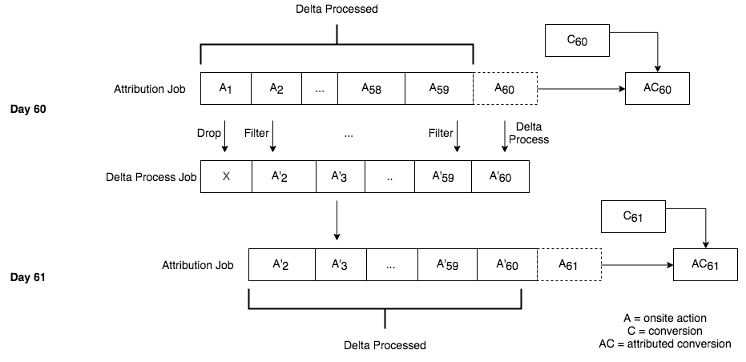
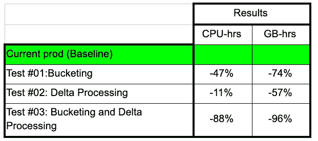

# 提高转化属性的 Spark 流水线的可扩展性

> 原文：<https://medium.com/pinterest-engineering/improving-the-scalability-of-a-spark-pipeline-for-conversion-attribution-5b3e2e16c53b?source=collection_archive---------3----------------------->

*Rohil Bhansali |软件工程师，商业&创造者*

许多 Pinners 带着规划的心态使用 Pinterest，并且经常有商业意图。广告商使用 Pinterest 来接触这些 Pinners，Pinterest 提供广告测量解决方案，根据 Pinners 在 Pinterest 上的行为与广告商的转化事件的关系来计算指标。为了大规模交付这些解决方案，我们使用 Spark 实现了一个数据管道。

由于我们平台上的 Pinners 和广告商数量持续快速增长，我们需要确保 Spark pipeline 能够远远超出其当前容量。我们很早就认识到，简单地添加更多计算资源并不是一个容易处理的扩展解决方案。2019 年 2 月，我们开始寻找经济地扩大我们管道的潜在方法，包括业务逻辑和利用新的 Spark 功能。我们确定了两种潜在的解决方案，并对它们进行了深入的概念验证测试。下面，您将看到我们考虑的解决方案的摘要以及我们的测试结果。

# **概述**

管道将来自广告商的数据(转化)和推广 pin 上的活动(动作)作为输入。由于我们允许将转换归因于 60 天前的操作，因此我们需要考虑 60 天的操作日志，这使得它成为一个潜在的非常昂贵的数据处理问题。分析当前管道的性能指标，主要的瓶颈是加载和移动操作，以准备将它们加入转换。因此，这里概述的大多数方法都旨在尽可能地降低这种洗牌的成本。

**每天水桶动作，避免重复洗牌**

如上所述，由于每天的转换都与前 60 天的操作相结合，因此在归属作业的 60 次运行过程中，任何一天的操作都会被打乱 60 次。如果这个数据集被混洗一次，并以不需要在随后的任何一天进行混洗的方式保存，我们可以显著改进这一点。这个过程被称为“分桶”

为此，我们利用了 Spark 最近实现的 bucketing API。转换属性管道实质上在两个大型数据集(转换和操作)上形成了一个连接，后者在连接操作的多次执行中被反复打乱。通过存储动作数据集，我们能够在 join 的调用中保持动作的混洗状态，从而消除重复的混洗工作。存储桶是在写入时定义的规范，包括所需的存储桶数量(numBuckets)和存储桶的关键字。在写入时，每个 Spark 执行器将它持有的数据按指定的键分成 numBuckets 组，并将它们写到文件中，从而创建 numBuckets 文件。

在概念验证中实施分桶时遇到的挑战包括:

1.确定要使用的最佳存储桶数量，同时认识到在 HDFS 上创建许多文件的存储成本。读取分桶数据时，桶的数量会限制读取数据的并行性。如果没有分桶，随着数据集的增长，可以随时调整随机并行度。但是，因为目的是减少改组的数量，分桶文件不打算被改组，因此在创建时就设置了它们的并行度。这在少量执行器的读取延迟/内存压力和 HDFS 的高文件基数之间造成了矛盾。(我们在 HDFS 上以 128MB 的块大小存储 bucket 文件，因此太多的小文件也意味着块未被充分利用，从而导致存储成本增加。)

起初，增加存储桶的数量似乎对生成的文件数量有倍增效应。因为每个执行程序都在编写 numBuckets 文件，所以产生的文件总数是(numBuckets)*(numExecutors)。这意味着我们必须减少写入程序的数量来控制文件的数量，尽管这会使写入时间变慢。这个问题的解决方法是按照最终的分桶规范对内存中的数据进行重新分区。这确保了每个执行器将写入互斥的桶，这意味着文件的数量=桶的数量，而不管写入者的数量。这使得读取和写入都相当快，同时保持文件数量在控制之下。

2.将分桶数据保存到 HDFS 路径而不是表中的 API 并不广泛可用(即 save <filepath>不支持分桶)，我们必须使用类似 appendMode 的变通方法，以便将分桶的数据写入同一个表的不同分区。此外，Spark 分桶数据的格式与 Hive 不兼容，这意味着我们将失去从 Hive 或 Presto 查询中间数据集进行调试的能力。但是，通过 Spark Shell 的 Spark SQL 仍然可以用于调试目的。我们希望在 Spark 中增加对这些特性的额外支持。</filepath>

3.Spark 在识别何时可以利用 bucketing 方面也非常脆弱。在联接之前对分桶数据集进行轻度处理会导致 Spark 使用普通的 SortMergeJoin，即使数据仍然分桶。

4.最后，需要进一步的研究来确定 numBuckets 的最佳参数。随着数据量的持续增长，我们将不断优化这一参数。

**应用 delta 过程——连接前过滤**

另一种降低 Spark 管道上移动动作数据集的成本的有效方法是在连接之前尽可能地减小它的大小。看看我们在管道期间执行的操作，有机会将一些过滤从后连接步骤移到前连接步骤。

Pinterest 的归因渠道目前采用了“最后一次接触”的归因模式，这意味着如果我们有多个可能归因于单一转化的行为，我们总是选择后者(假设它仍然发生在转化之前)。因此，对于在一天的所有转换之前必然发生的 59 天的操作，我们只需要维护最近的这种操作。我们可以每天应用这种过滤，并更新前 59 天的滑动快照，它与最近一天的操作一起用作最小化的操作数据集。

为了在第 N 天更新该快照，我们可以获取[第(N-60)天，第(N-1)天]增量处理的集合，并丢弃第(N-60)天的所有事件，然后在第 N 天添加之后重新处理剩余的集合，以获得新的 59d 增量处理的数据集。处理第 N+1 天时将使用该数据集。

请注意，为了将这种方法与存储区一起使用，我们必须确保快照在更新过程中不会被重新洗牌。这可以通过广播新一天的动作并执行左反连接来实现，以确保快照数据永远不会离开它第一次被加载的执行器。如果广播数据集变得太大，我们可以将其分块，然后依次应用左反连接。

**使用 ID join 过滤掉无属性动作**

在转换属性中，两个大型数据集被连接在一起，但是连接结果的基数相对于输入来说很小。因此，另一种积极减少混洗数据量的潜在方法是在 SortMergeJoin 中只连接最少数量的字段，这样连接结果就是引用完整输入中记录的唯一标识符列表。然后，这个列表可以在第二次连接中与完整的输入连接在一起，但是这次使用效率更高的 BroadcastJoin 来实现完整的连接结果。那么只有实际上被归因的动作才需要被洗牌。

这种方法导致更小的最大混洗，但是需要更多更小的连接和额外的处理步骤。内存小时数和 cpu 小时数最终没有得到有意义的运行时改进，因此没有进一步探索这种方法。

**采用顺序窗口处理**

在转换属性过程中，有一个称为属性窗口的参数，用于确定连接的转换-操作对是否保留在最终输出中。仅当两个时间戳之间的时间差小于给定的属性窗口时，才保留给定的对(例如，对于 7 天的窗口，动作不可能在转换之前超过 7 天发生)。如果我们找到一个适合小窗口的对，我们隐含地知道它将适合更大的窗口，因此我们不需要为任何更大的窗口重新分配转换。利用这种洞察力，我们可以首先将转换加入到最小支持窗口中的动作中。对于任何有属性的事件，我们可以将这一对添加到最终输出中。然后，所有其他事件被加入到下一个最小窗口中的动作，依此类推。这种方法可以减少一次混洗的最大数据量，因为每次连接都比一次连接所有数据的方法小。我没有进一步探讨这种方法，因为它与上面提到的 ID join 解决方案有相似的特征(即，较低的最大内存需求，但相应地增加了运行时)。此外，这个解决方案将引入一个复杂的执行计划，更难以排除故障。

测试分桶和增量处理的影响

在团队内部审查了这些选项后，我们决定将重点放在分桶和增量处理优化上，因为它们有积极的效果，而且它们可以一起实施。为了快速评估对此 Spark 管道应用分桶和增量处理的可行性和影响，我们构建并执行了作业的原型版本，结果是处理了相同数量的数据，同时显著降低了 CPU 和内存资源。这些结果证实了我们的假设，即结合分桶和增量处理可以为 Spark 管道带来巨大的生产率增益。

接下来，在生产 bucketing + delta 处理解决方案之前，我们将关注使用增加的数据大小而不是减少的资源进行更直接的负载测试。这篇文章涵盖了我们在一个月的工作中得出的优化，但它绝不是详尽的。如果你有关于如何编写更高性能的 Spark 管道的想法，我很乐意听听你的意见。否则，我们会让你知道实施这些想法的结果。感谢阅读！

## 感谢

这是 Pinterest 的一个合作项目。特别感谢以下团队成员: *Brent Bryan、Greg Sakorafis、Cole Rottweiler、Andrea Burbank、Eva Zhang、Deirdre 和 Aaron Yuen 对本项目的所有贡献。*