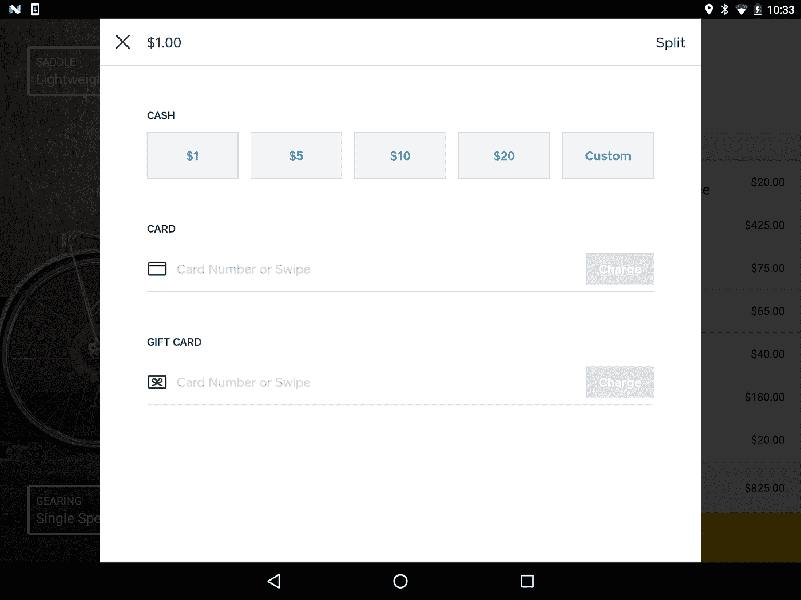

# 改善 Square Register API 支付体验

> 原文：<https://medium.com/square-corner-blog/improving-the-square-register-api-payment-experience-2ae13453da94?source=collection_archive---------2----------------------->

> 注意，我们已经行动了！如果您想继续了解 Square 的最新技术内容，请访问我们的新家[https://developer.squareup.com/blog](https://developer.squareup.com/blog)

我们最近在 Square Point of Sale iOS 和 Android 应用程序中引入了新功能，大大改善了使用 Register API 时的支付体验。

在 iOS 上，我们增加了让你的[方形非接触式&芯片读卡器](https://squareup.com/contactless-chip-reader)在后台保持连接的功能(注意:这在 Android 上已经有了)。在 Android 上，我们为注册 API 的用户提供了透明的背景。

只需更新您的 Square 销售点应用程序版本，即可利用这些改进。

## iOS —加速非接触式交易

一旦您或您的客户将非接触式和芯片卡读卡器配对并连接到 Square Point of Sale 应用程序，读卡器将在您切换应用程序的任何时候保持连接，并且您的应用程序是前台应用程序。这意味着，每当您启动交易，API 应用程序切换到 Square 应用程序时，读卡器不再需要重新连接才能开始处理支付。一旦应用程序发生切换，你会看到阅读器的绿灯亮起，表明它几乎可以立即接受支付。除了加快交易时间，这一更新还有一个额外的好处，即提高您的阅读器的电池寿命。

## Android——更加无缝的支付体验

当你的应用程序使用 Square Register API 启动交易时，支付流程现在有一个透明的背景覆盖在你的应用程序上。这为使用与 Register API 集成的应用的商家创造了更加无缝的体验，因为他们不再觉得每次处理支付时都要离开你的应用并进入一个新的环境。

这是使用我们的[自行车商店](/square-corner-blog/the-bikeshop-da7d52fc6317)示例应用程序后的样子:

## 我如何实现这一点？

您和您的客户要利用这些改进，唯一需要做的就是从苹果应用商店或 Google Play 更新到 Square Point of Sale 应用程序的最新版本。

我们希望听到您对 API 以及新的和改进的应用程序切换体验的反馈。请在 [@SquareDev](https://twitter.com/SquareDev) 告诉我们您的想法。

要了解更多关于我们 API 的信息，请访问我们的[开发者文档网站](https://docs.connect.squareup.com/)。