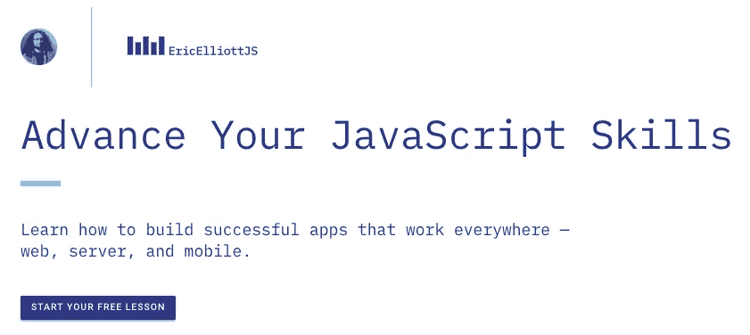

# 提高用户认证和安全性

> 原文：<https://medium.com/javascript-scene/improving-user-authentication-and-security-ddb60b1ef69b?source=collection_archive---------0----------------------->


Photo: [Brandon Bailey](https://www.flickr.com/photos/luxurydesigner/) — Midnight Cowboy (CC-BY-2.0)

管理用户认证和授权是一项非常严肃的责任，如果做错了，比未经授权访问您的应用程序要付出更大的代价。它还会危及用户隐私或导致财务损失或用户身份被盗。除非你是一家拥有庞大安全团队的大公司，否则你不会希望你的应用承担这种责任。

如今，大多数应用都是通过用户名和密码认证构建的，一旦用户登录，用户会话就可以做任何想做的事情，而无需重新验证用户的意图。

这种安全模式被打破的原因有很多:

仅使用密码的安全模式已经过时。如果你对此有任何疑问，请前往[haveibenpwned](https://haveibeenpwned.com/)并输入你的电子邮件地址。敏感数据在许多高调的数据泄露事件中被盗，影响到 Dropbox、Adobe、Disqus、Kickstarter、LinkedIn、Tumblr 等公司。如果数据库里有密码，它被盗只是时间问题。

**散列密码救不了你或你的用户。**一旦密码数据库被盗，黑客将巨大的分布式计算能力瞄准这些密码数据库，利用并行 GPU 或拥有成千上万节点的巨型[僵尸网络](https://www.bankinfosecurity.com/massive-botnet-attack-used-more-than-400000-iot-devices-a-12841)每秒尝试[数千亿次密码组合](https://www.zdnet.com/article/25-gpus-devour-password-hashes-at-up-to-348-billion-per-second/)，希望恢复明文用户名/密码对。

如果攻击者能够发现一个与你的数据库中存储的密码散列相同的密码，他们将采用该组合，并在诸如银行账户网站之类的东西上进行尝试。在许多情况下，即使是加盐的散列密码数据库也会每分钟左右放弃另一个有效的用户名/密码对。这意味着每年大约有 50 万个密码被泄露，而且这个数字每隔几年就会翻一番。2013 年我写过这个话题。现在，坏人破解密码的速度比以前快了 10 倍以上。

**用户会话被劫持。** [用户会话通常在认证后被劫持](https://www.owasp.org/index.php/Session_hijacking_attack)，使得攻击者能够利用该用户的应用资源。为了防止这种情况，您需要在每次请求时对用户进行重新认证，在用户名和密码领域，这将产生一种尴尬的用户体验。

# 升级身份验证

分散式应用程序最酷的特性之一是分散式安全模型。使用以太坊区块链生态系统，每个用户得到一个公钥和私钥对。每个请求都可以用用户的私钥签名，并用用户的公钥验证。这意味着每个请求都经过了唯一的身份验证，这将劫持的可能性降低到几乎为零。

劫机者需要代表用户签名的能力，但他们无法在不访问用户私钥的情况下做到这一点，而且数据可以使用硬件级安全性来保护。可以保护私钥不被访问互联网。我们不是通过网络发送私钥，而是将待签名的数据发送给私钥。用户授权签名，签名的请求得到验证和处理。如果签名无效，请求将被拒绝。

此外，这些密钥对可用于加密用户数据，以便只有拥有数据的用户才能读取数据。如果一个应用程序开发者选择让用户加密他们的数据，那么在没有用户许可的情况下，即使是应用程序也无法解密数据。有了这个安全模型，我们可以让用户控制自己的私人信息。

# 如何为用户获取密钥对

为了给你的应用增加额外的安全层，你需要你的所有用户使用加密钱包进行身份验证。直到最近，这意味着迫使你的用户下载额外的应用程序或浏览器插件，但由于像 [Fortmatic](https://fortmatic.com/) 这样的项目，现在可以在主流浏览器中直接将加密钱包体验集成到你的应用程序中，而无需扩展。

在[为](https://ericelliottjs.com/shotgun-postamp-episode-5-secure-user-authentication)[EricElliottJS.com](https://ericelliottjs.com/)成员拍摄的最新视频集《鸟枪中，我们走过了创建`useFortmatic`钩子来验证你的应用程序中的用户并为他们每个人设置一个密钥对的过程。让我们来看看我们想出的代码:

> 注意:这段代码与视频中的代码略有不同，以防止在初始化之前试图使用`fm`和`web3`API。在这个新版本中，获得它们的唯一方法是使用`web3Ready`承诺。

首先，我们使用`[useState](https://reactjs.org/docs/hooks-state.html)`钩子来跟踪状态。在这种情况下，是经过身份验证的用户钱包帐户列表。您将使用这些钱包来签署请求和处理交易。

我们使用的是一个`web3Ready`承诺，它是一个[引用](https://reactjs.org/docs/hooks-reference.html#useref)，总是指向同一个对象，即使在额外的渲染之后。我们在`web3`初始化之后解决这个承诺。这个承诺将通过初始化的`fm`和`web3`对象来解决，准备使用。在这个版本的代码中，`web3Ready`承诺是处理`fm`和`web3`对象的唯一方法。这有助于我们避免争用情况，在这些对象准备好使用之前，您试图调用`signIn`或`web3`方法。

我们用`[useEffect](https://reactjs.org/docs/hooks-reference.html#useeffect)`钩子自动初始化。在初始化过程中，我们使用 Fortmatic 检查用户的身份验证状态，如果用户已经通过身份验证，我们会自动将用户登录到我们的应用程序:

```
(await fm.user.isLoggedIn()) && signIn();
```

`useFortmatic`钩子的用户现在应该拥有了登录、注销、管理用户钱包账户和访问`web3` API 所需的一切。例如，调用组件可以使用如下代码:

```
 const {
    accounts, // an array of addresses
    signOut,  // a function to sign the user out
    signIn,   // a function to sign the user in `=> Promise`
    isSignedIn, // (accounts: [address]) => Boolean
    web3Ready,  // Promise
    web3IsInitialized // Boolean
  } = useFortmatic(
    'pk_live_248876B2BC93BD1A'
  ); // If you want, you can trigger the sign in dialog
  // automatically when your component mounts. We wrap
  // the signIn() call in another function to avoid returning
  // a promise to useEffect(), which makes React complain. useEffect(() => signIn(), []); // You can also listen for sign in and sign out
  // and handle it however you like (e.g., Redux action).
  useEffect(() => {
    // you can listen for auth status changes
    // and dispatch Redux actions here:
    console.log('accounts changed!', accounts);
  }, [accounts]);
```

> 注意:API 密匙不是秘密，但是你肯定需要得到你自己的。Fortmatic 要求您用 API 密钥注册您的授权域，如果您试图从未授权的域使用它，它将拒绝工作。

你可能已经注意到，如果浏览器有内置的 Web3 钱包，那么`useFortmatic`钩子不会后退。出于 UX 和用户隐私的原因，我们不会默认将应用程序暴露给用户的原生浏览器钱包。作为应用程序开发人员，您可以选择检测这种情况，如果您愿意，还可以向用户展示内置的钱包。例如，让用户从您的应用程序中访问他们的浏览器钱包资产。

# 结论

使用分散的安全模型可以通过给每个用户一个公钥/私钥对来提高用户的安全性。使用这种技术，他们可以签署每一笔交易，从而降低一些风险:

*   中间人和会话劫持攻击
*   密码数据库失窃
*   暴力破解密码的尝试

您还可以以有趣的方式使用这些密钥对:

*   用户对消息和请求进行签名，以证明消息来自有权访问用户私钥的人
*   加密数据，以便只有用户可以解锁
*   使用用户签名来授权操作和事务
*   需要多个用户签名才能访问共享资源

# 后续步骤

会员可以在 EricElliottJS.com[上](https://ericelliottjs.com/)观看新一集。如果你不是会员，现在是一个伟大的时间来看看你错过了什么！

[](https://ericelliottjs.com/premium-content/lesson-pure-functions)

[Start your free lesson on EricElliottJS.com](https://ericelliottjs.com/premium-content/lesson-pure-functions)

***Eric Elliott*** *是本书的作者，* [*【排版软件】*](https://leanpub.com/composingsoftware)*[*【编程 JavaScript 应用】*](https://www.amazon.com/Programming-JavaScript-Applications-Architecture-Libraries-dp-1491950293/dp/1491950293/ref=as_li_ss_tl?_encoding=UTF8&language=en_US&linkCode=ll1&linkId=06971c7a0f2b13309e5af242b2483609&me=&qid=&tag=eejs-20) *。作为*[*【EricElliottJS.com】*](https://ericelliottjs.com/)*和*[*devanywhere . io*](https://devanywhere.io/)*的联合创始人，他教授开发者必备的软件开发技能。他为加密项目组建开发团队并提供建议，为 Adobe Systems、****【Zumba Fitness、*** ***【华尔街日报、*******【ESPN、*******BBC、*** *以及包括******Usher、弗兰克·奥申、met********

**他和世界上最美丽的女人享受着与世隔绝的生活方式。**