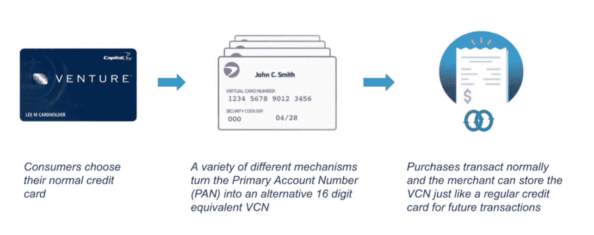

# 利用边缘机器学习改进虚拟卡号

> 原文：<https://medium.com/capital-one-tech/improving-virtual-card-numbers-with-edge-machine-learning-49b9f01b6c66?source=collection_archive---------2----------------------->

## *Eno 浏览器扩展如何在设备上使用 ML 读取 DOM 像素坐标&以获得更精确的 VCN 体验*

***机器学习工程高级总监、资深杰出机器学习工程师 Erik Mueller 和软件工程师 Jennifer Chu***

Capital One 的客户已经开始依赖我们的智能助手 Eno 来检查他们的银行余额、跟踪购买情况、在线支付账单，并主动监控他们的账户。这种大规模的个性化实时服务是我们经营方式的标志之一。另一个原因是我们不断寻求使用尖端技术来支持这些服务。

随着 Eno 从美国银行的第一个自然语言短信聊天机器人发展成为具有众多功能的多渠道解决方案，我们已经发现了使用机器学习来进一步改善 Eno 体验的机会。一个这样的机会出现在 Eno 的[虚拟卡号](https://www.capitalone.com/learn-grow/money-management/what-are-virtual-card-numbers/) (VCN)功能上。虚拟卡号是唯一的，对你购物的每个商家都是独立的信用卡号。它们允许您使用您的信用卡帐户与特定的商家进行交易，并且只与该商家进行交易，从而减少您的主信用卡号暴露于潜在的信用卡欺诈的风险。通过在 Eno 浏览器扩展中使用机器学习，我们是否可以更好地检测支付页面和定位支付字段，使我们的 VCNs 更加准确，使用起来更加顺畅？

# VCNs 如何改变持卡人体验

通过 Eno 使用虚拟卡号很简单。当 Capital One 的客户想要进行在线购买时，[Eno 浏览器扩展可以将一个唯一的虚拟卡号绑定到一个特定的商户](https://www.capitalone.com/tech/software-engineering/how-capital-ones-intelligent-assistant-is-making-online-shopping-easier-and-safer/)，以代替他们的实际信用卡号。从持卡人和商家的角度来看，使用 VCN 时几乎没有什么变化——VCN 的处理过程与使用印在实体卡上的实际卡号进行的交易一样无缝，持卡人获得的回报也是一样的。但是持卡人可以放心，VCN 将只对特定的商户起作用。如果这家特定的在线零售商存储了一个 VCN，并遇到了泄露 VCN 的情况，它就不能在其他地方使用，这与传统的信用卡号码不同。

VCN 流程的一切都旨在无缝地优先考虑客户信用卡信息的安全性。Eno 不仅能在支付页面自动创建 vcn 并在页面上填充(自动填充)，还能简化更新过期或丢失的信用卡信息的过程，以及管理订阅和自动收费和[打击欺诈](https://www.capitalone.com/tech/machine-learning/fighting-fraud-with-vcns-and-financial-transaction-embedding/)。

## 在 Eno 的 VCN 上使用机器学习的潜力

Eno 浏览器扩展使用规则、自动完成 x 模式和支付处理器模式来识别支付页面和字段。商业网站为他们的支付页面使用不同的 [HTML](https://html.spec.whatwg.org/) 标记，并且他们经常改变这些标记。因此，必须为每个商家网站或电子商务平台创建、监控和维护 Eno 的规则和模式。

自从我们的浏览器扩展在 2018 年推出以来，众多功能团队一直在努力改善客户体验。2020 年，一个这样的团队看到了一个机会，可以通过使用机器学习来自动识别支付字段，减少对规则的依赖和维护规则所涉及的人工劳动，从而扩展 Eno 浏览器扩展的[人工智能网络导航功能](https://arxiv.org/abs/2010.12844)。他们提议建立一个机器学习模型来识别支付页面和字段，以提高 Eno 的[精度和召回](https://en.wikipedia.org/wiki/Precision_and_recall)。毕竟，规则是脆弱的，维护起来很费时间。有了规则，我们只能建立我们可以手动扩展的良好体验，因为扩展我们的 VCN 能力以服务更多的商家将取决于为这些网站和平台建立规则。通过利用机器学习，他们相信我们可以支持更多的客户，提供更好的体验，同时减少规则维护中涉及的工程工作。

在一位有远见的产品负责人的领导下，这个九人团队主要由来自 [Capital One 技术开发项目](https://campus.capitalone.com/technology-program) (TDP)的工程师组成，比如 Jennifer。该计划是一个为期两年的轮换计划，面向希望在技术领域开始职业生涯的应届大学毕业生。Capital One 的技术开发人员是一流的初级工程师——聪明、精力充沛、对改变世界充满热情，并且不惧怕攻克新技术。这种对挑战和职业发展机会的渴望形成了团队的基础，因为许多工程师是在早期关于机器学习彻底改变 Eno VCN 的潜力的演示后加入的“志愿者”。Jennifer 本人最初在一个不同的 Eno 功能团队工作，但受到启发加入了这个项目，这样她就可以将她在统计学方面的硕士学位应用到一个有趣的数据科学挑战中。Jocelyn 等其他团队成员受到了从事令人兴奋的机器学习或特征工程挑战的机会的启发。

> 我是音乐和统计双修后通过 CODA 来到首都一号的，重点是机器学习。然后在 CODA，我为首都科技学院做了一个小的内部项目，使用自然语言处理。在 Eno 浏览器扩展上工作是令人惊讶的，因为我和我的朋友&家人可以去 Chrome 商店，使用我帮助建立的机器学习模型！
> 
> -软件工程师乔斯林·黄

# 毅力和团队合作在提高 Eno VCN 能力中的力量

因为这是一个功能工程团队，而不是一个机器学习团队，该团队与 Erik 一起制定了一个行动计划，以构建所需的 ML 功能。他当时的独特角色包括服务于 Eno 领导团队，开发 AI/ML 的创新应用，并通过与创建机器学习应用的团队合作，增加机器学习在 Capital One 的影响。利用他的专业知识帮助他们理解 ML 架构的优点，以及构建良好管理的模型所需的特定于 Capital One 的工具生态系统和治理需求。

Erik 首先花时间与他们的产品负责人和工程领导一起找出在规则和模式上添加机器学习的商业案例。然后开发衡量成功的标准，并在不同的方法上对更大的团队进行试验。这一切都遵循了一个[全面的流程](https://www.capitalone.com/tech/machine-learning/10-common-machine-learning-mistakes/)，因为为了机器学习而增加机器学习并不一定能帮助客户或业务。比如[有时候用规则](https://www.capitalone.com/tech/machine-learning/rules-vs-machine-learning/)比机器学习更好。然而，在这种情况下，埃里克和他的团队一致认为不是这样。

到了构建的时候，团队中的每个人都有特定的任务要完成，这发挥了他们的优势、工程背景和职业兴趣。团队的一部分专注于模型训练，另一部分专注于数据采样，另一部分专注于合规性和治理，还有一部分专注于重构代码库以允许新的功能。测试是普遍的，整个团队都参与进来。通过这种方式，整个特性——从收集度量标准到改进模型，再到为发布准备代码——都得到了开发。

> 我们通过分而治之建立了这个。在最初的几次尝试之后，团队将工作分成了单个工程师可以处理的部分。随着每个部分的进展，如果任何一个部分需要更广泛的支持，我们就互相更新和调整。这个项目真正向我展示了我在建筑和边缘领域的工作能力。为了将这个项目带给我们的客户，我必须做出许多实际的决定，关于我们如何以一种有效的、有弹性的方式运行和交付我们所构建的东西。我利用我所知道的关于可维护代码和自动化测试的一切，将它带入生产就绪状态；当我对其他工程师将来会如何改进代码形成一幅画面时，我就能够决定现在为他们设置表格的最佳方式。
> 
> -Njuguna Thande，软件工程师

# 使用机器学习、DOM 和像素坐标获得更精确的 VCN 体验

最终，团队选定了下面列出的模型。因为深度学习和深度神经网络需要大量的训练集，所以我们选择依靠[特征工程](https://en.wikipedia.org/wiki/Feature_engineering)，在 [TensorFlow](https://www.tensorflow.org/) 中实现两个[逻辑回归](https://en.wikipedia.org/wiki/Logistic_regression)模型来实现所需的能力。我们在 [Keras](https://keras.io/) 中训练模型，并在浏览器中的 [TensorFlow.js](https://www.tensorflow.org/js) 下服务训练好的模型运行。

*   **支付页面分类模型检测客户何时进入支付页面，以便弹出 Eno 浏览器扩展。**该模型将对应于网页的一组特征作为输入，并将该页面是否是付费页面(是或否)作为输出。这些特征是通过检查网页的[文档对象模型](https://dom.spec.whatwg.org/) (DOM)构建的。这些特性是基于出现在页面的<标题>和<标题>元素中以及这些元素附近的文本和 HTML 属性。为了确定某些文本是否在元素附近，我们使用 DOM 来访问浏览器在客户屏幕上呈现的文本和元素的像素坐标。我们使用 [tf-idf 加权](https://en.wikipedia.org/wiki/Tf%E2%80%93idf)，根据词频——词条在语料库中出现的次数——偏移文档频率——包含词条的语料库中的文档数，对每个词条(word 或 HTML 属性)进行加权。
*   **支付字段分类模型对支付页面中的输入字段进行分类，以便 Eno 浏览器扩展可以自动填写适当的支付信息。**该模型将对应于<输入>或<选择>元素的一组特征作为输入，并产生该元素是卡号字段、卡安全码字段还是有效期字段作为输出。这个模型使用 HTML 属性的< input >或< select >元素，以及基于像素坐标的元素附近的文本。

与使用规则和模式相比，在文本、HTML 属性和像素坐标上使用机器学习模型可以更可靠、更有弹性地识别支付页面和支付字段。使用这些模型，我们现在可以更准确地将这些自动填充功能扩展到更多的在线网站，使 VCNs 成为在线购物时更容易、更不容易出错的选择。

# 使用边缘机器学习保护客户数据

通过使用 [TensorFlow.js](https://www.tensorflow.org/js) ，一个可以直接在浏览器中运行的 Javascript 库，我们可以在边缘运行这个[机器学习模型——即在客户设备上而不是在服务器上——帮助保护客户信息的隐私并改善响应时间。Eno 浏览器扩展不必将信息传输到服务器来运行机器学习模型，模型就在浏览器内部运行。这提供了更低的延迟，也增加了隐私，因为信息不必传输到服务器。](https://www.microsoft.com/en-us/research/project/resource-efficient-ml-for-the-edge-and-endpoint-iot-devices/)[边缘工程](https://www.capitalone.com/tech/software-engineering/resiliency-at-the-edge/) [在 Capital One 并不是什么新鲜事，](https://www.capitalone.com/tech/software-engineering/designing-microexperiences-on-the-edge/)但将我们的使用扩展到机器学习领域，有助于我们通过更快、更准确地了解结账站点，提供新水平的便利和安全。

# Eno VCN 上边缘机器学习的未来

改善 Eno 浏览器扩展的 VCN 体验源于多个目标——使用边缘机器学习来改善 Eno 客户体验，创建更安全和防欺诈的在线购物方式，减少手动和脆弱的工作，以及帮助开发我们员工和功能团队的机器学习专业知识。

这种机器学习模型使得 Eno 浏览器扩展更加健壮，并且我们的 VCNs 使用起来更加容易和安全。但是我们的工作还没有完成。作为该功能的新项目负责人，Jennifer 和她的团队在 2022 年专注于数据收集和模型优化——这是持续改善和优化客户体验的两种方式——以及对机器学习功能的持续测试。

*披露声明:2021 首都一号。观点是作者个人的观点。除非本帖中另有说明，否则 Capital One 不隶属于所提及的任何公司，也不被这些公司认可。使用或展示的所有商标和其他知识产权是其各自所有者的财产。*

*最初发表于*[*【https://www.capitalone.com】*](http://www.capitalone.com/tech/machine-learning/edge-machine-learning-eno-virtual-card-numbers/)*。*