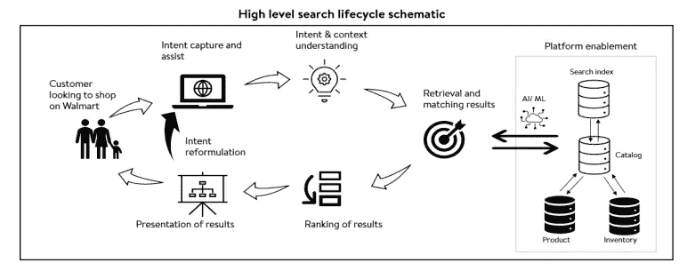
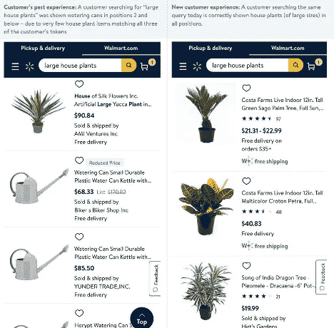
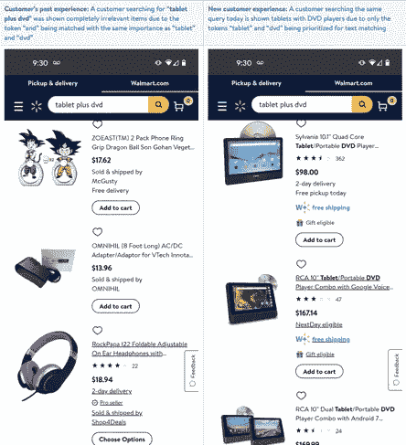
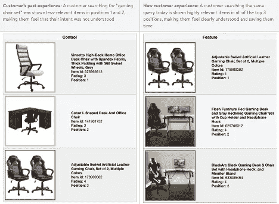

# 改进沃尔玛搜索，帮助我们的客户节省时间！

> 原文：<https://medium.com/walmartglobaltech/improving-walmart-search-to-help-our-customers-save-time-e9fcd1f03e94?source=collection_archive---------0----------------------->

Walmart.com 是美国最大的购物网站之一，有数百万游客前来购买食物、必需品、玩具和其他所有东西。客户积极地使用我们的搜索引擎来寻找他们需要的东西，我们也在不断改善客户的搜索和查找体验。在过去的 12 个月里，我们致力于帮助我们的客户为冗长、复杂和不常见的查询找到最相关的产品(我们称这一部分为“尾巴”)。

想象一下，你最后一次搜索一种非常健康的麦片(来自某个特定品牌)，一个非常特别的电视柜(有壁炉的)或者新的显卡(有特定的配置)。在多个电子商务平台上，这些类型的查询提供的结果并不理想。我们希望为客户解决这个问题，并帮助他们节省时间。

大约一年前，我们制定了一个雄心勃勃的目标来改善我们的尾段。尾部或不太常见的查询受到有限的流量和用户参与的影响，限制了我们在召回和排名系统中有效依赖这些类型信号的能力。因此，我们不得不在语言处理和深度学习领域寻求市场领先的战略和技术。

为了指导我们的流程，我们结合使用了人工或编辑评估、市场比较和客户研究来识别和优先考虑机会。在这种情况下，对我们的搜索系统进行全面分析有助于我们关注两个特定领域:

*   通过使用最新的机器学习(ML)技术来提高搜索召回率——调出之前没有显示的相关项目
*   使用 ML 和 AI(人工智能)增强搜索排名系统，将最相关的项目放在最靠前的搜索位置

在本帖中，我们将谈论上述两个机会，我们已经启动的具体项目和改进，以及我们对客户产生的影响。总的来说，我们已经将这些查询的搜索相关性提高了多个百分点，为数百万沃尔玛顾客节省了时间。

**实施和改进**

如上所述，我们发现的最大机会领域之一是提高搜索引擎召回生成系统的质量和完整性，目标是将新的和/或高度相关的项目引入我们的最终结果集。具体来说，我们专注于两个特定领域:

*   优化产品类型匹配逻辑(过滤和提升逻辑)
*   改善我们对查询中标记(单词)相对重要性的理解

此外，我们发现有机会改善我们的重新排名系统，以提高搜索相关性。由于我们认识到头部和尾部查询之间的基本结构差异，我们为这些查询类型开发了新的、单独的排名模型。

**优化产品类型匹配逻辑**

当我们建立沃尔玛搜索引擎时，我们专注于构成购物网站销售的重要部分的头部或顶部查询。这意味着所有搜索子系统都针对这些查询进行了优化。当我们分析尾部查询时，我们意识到我们严格的头部查询逻辑系统在应用于尾部时过滤了许多相关产品。产品类型或类别通常是产品搜索引擎的基石，正确理解这一点极其重要。因此，我们开始着手清理现有的产品类型匹配逻辑，并为产品类型开发更好的提升技术。

我们最近推出了以下变化，并看到搜索相关性提高了 1.5%以上。此外，在尾部空间，客户对我们产品的参与度大大提高。

*   取消严格的产品类型过滤，利用产品类型提升来提升召回集中的相关产品
*   增强用于查找更多相关条目的查询条目关联列表——我们扩展了列表并提高了质量标准

**改进查询术语和令牌权重**

尾部查询通常比头部查询更长更复杂。历史上，我们平等地对待查询中的所有标记(唯一的单词)。鉴于 tail 的性质，这种方法被认为是获得我们想要的结果质量的主要障碍。现在，我们为查询中的每个标记分配重要性分数，使我们能够更好地提取和理解客户的潜在意图。我们最近推出了第一个 ML 驱动的迭代模型来分配这些重要性分数。

我们花时间了解哪些单词或术语对查询和意图增加或减少了价值，以及这如何因上下文而异。例如，在“要订购的生日蛋糕”、“露得清产品”或“计算机打印机”的情况下，并不是所有的令牌都同等重要——特别是在产品搜索引擎的上下文中，“要订购”和“产品”和“计算机”可能是多余的。值得注意的是，在其他情况下，这些相同的标记可能会为查询增加有意义的值；例如“计算机配件”或“我商店中的产品”。随着我们第一个版本的推出，我们:

*   引入了查询词权重的预测
*   开始在检索中利用术语权重

我们看到搜索相关性提高了 4.8%，客户参与度和转化率也有所提升。

**改进排名系统提升经验**

我们还投资了排名系统，将最相关的产品放在搜索结果的最前面。我们在搜索系统中利用两个排名层(第一轮和第二轮排名)，并在这两个层上都投入了努力，以提高我们客户的搜索相关性。具体来说，我们最近推出了以下增强功能:

*   加强了第一轮排名中产品类型匹配的重要性
*   改进了重新排序器(或第二轮排序器),以更好地平衡相关性(项目-查询语义匹配)和参与度(项目-查询参与度)信号——新版本对这两种信号进行了更好的优化，并且包含了更多最相关和参与度最高的产品

总之，这些提升了超过 4.5%的搜索相关性，并显示了用户参与度的提高。

**未来和即将到来的事情**

当我们思考未来时，我们希望继续改善客户的搜索体验，监控和观察新的和趋势查询的参与度，并推出改进措施，使搜索更容易并节省客户的时间。我们面前还有更多机会，包括:

*   利用深度学习技术来增强查询理解系统，以理解显式和隐式意图，并更好地理解用户上下文和需求
*   使用新的和先进的技术改进召回引擎，以提出更相关和长尾的项目
*   使用机器学习在重新分级系统中开发新的特征和信号，并调整和优化现有的特征和信号，以向客户展示最相关和最受欢迎的产品

沃尔玛将继续成为数百万顾客的购物场所，我们的目标是继续让搜索变得更容易，并帮助我们的顾客节省时间。我们希望你喜欢阅读这篇文章。如果你有兴趣和我们一起工作，请查看我们的[招聘页面](https://careers.walmart.com/technology)，或者联系我，或者我在 LinkedIn 上的同事。

*合著*[*Sarabjeet Singh*](https://www.linkedin.com/in/iamsarabjeet)*和* [*Ciya 廖*](https://www.linkedin.com/in/ciya-liao-7724225/)

*本文展示的工作由来自、Mansurul Bhuiyan、Zhenrui Wang 和 Mikhail Radik 的数据科学家和产品经理组成的优秀团队领导。*