# 使用 Azure Redis 缓存提高您的 Web API 性能

> 原文：<https://medium.com/globant/improving-your-web-api-performance-with-azure-redis-cache-b7d1c3c24898?source=collection_archive---------0----------------------->

Image courtesy [Microsoft Azure Doc](https://docs.microsoft.com/en-us/learn/achievements/improve-api-performance-with-apim-caching-policy-social.png)

在本文中，我们将通过了解缓存的基础知识和一个使用 StackExchange 从 web API 调用 Azure Redis cache 的示例，了解如何使用 Azure Redis cache 提高 API 性能。Redis C#库。

为什么我们需要缓存？

我们先来了解一下为什么需要缓存？考虑一个例子，我们调用一个 API，它从数据库中找到用户的公共细节并返回。现在，如果我们多次调用同一个 API，那么它将增加网络和数据库调用，如果有的话，还会重新计算。为了避免这种数据库往返和重新计算，我们可以在某个地方用某个键保存响应并使用它。这个地方除了宝藏什么都没有。它可以在服务器端、客户端或单独的地方。

**什么是缓存策略？**

现在，如果我们开始将 API 的每个响应都保存到缓存中，这将增加缓存的大小，并再次影响性能。因此，为了避免这种情况，我们使用缓存策略，它只不过是确定缓存上相关数据的规则。有不同类型的缓存访问模式，如直写、回写和回写。我们还有缓存回收策略，如最近最少使用(LRU)、最少使用(LFU)、滑动窗口等。缓存策略要么基于位置，要么基于时间。

**缓存放在哪里？**

一旦我们决定使用什么策略，实现缓存的主要部分就是在哪里放置缓存**。**这里我们有三个选项:服务器端、客户端和独立/分布式。在本文中，我们使用第三种类型的带有 Redis 缓存的缓存**。**

**什么是 Redis？**

Redis 是开源内存数据结构存储，可用作缓存、二级数据库或消息传递代理。这是 NoSQL 和关键价值商店。它支持多种数据结构，如字符串、列表、集合等。它速度快，可扩展。

Twitter、Pinterest 和 Stack overflow 之类的应用程序使用 Redis 作为缓存。

**Azure Redis 缓存**

Azure Redis Cache 是微软基于开源 Redis 引擎的专用缓存服务。

**优点**

Azure Redis 缓存有许多优点，比如，与许多键值数据存储相比，它有相对丰富的数据类型集，并且缓存操作是原子的。

Azure 上的 Redis 也提供了对 SSL 的支持，如果我们通过公共网络连接到一个未注册的端点，那么我们的数据在传输时会被加密。

Redis 在所有地区都可用，包括美国政府和 Azure China，我们可以创建从 250 MEGS 到 120 GB 数据的缓存。

Azure Redis 缓存有三种方案:基本、标准和高级。基本层计划中没有 SLA，对于开发和测试目的，基本层很好，但对于大多数生产环境，建议使用标准层。

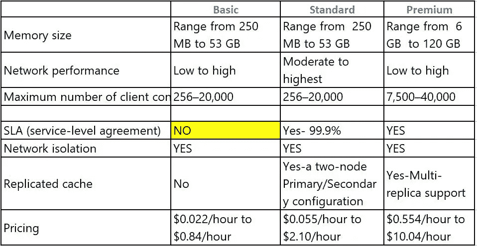

[在此参考更新的定价](https://azure.microsoft.com/en-in/pricing/details/cache/)

现在让我们看看如何在 API 调用中使用 Azure Redis。

**第 1 部分:在 Azure 门户中创建新的 Redis 缓存**

转到 Azure portal 搜索 Redis 缓存，然后单击新建，选择订阅、资源组 DSN 名称、位置和缓存类型。

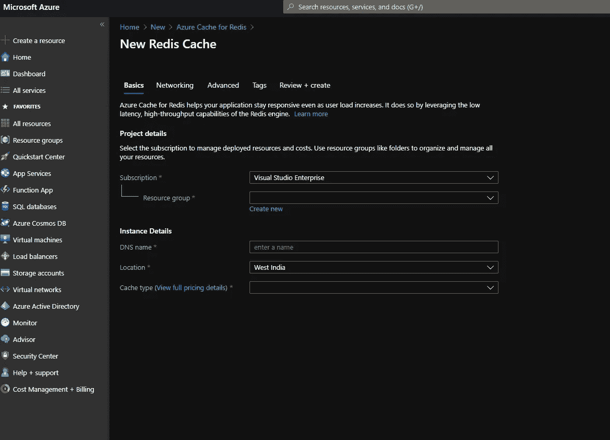

出于演示目的，我选择了 Basic。

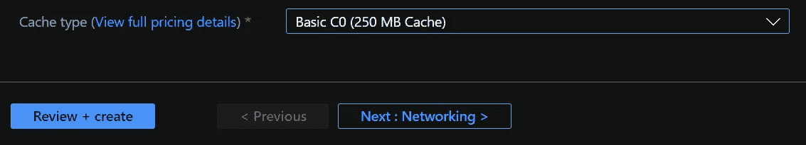

单击创建，创建需要一些时间。成功创建 Redis 缓存后，转到访问键并为其他用户复制主连接字符串。从代码连接到 Azure Redis 缓存需要主连接字符串。我们将在 **StackExchange 中看到它的使用。Redis** 很快。

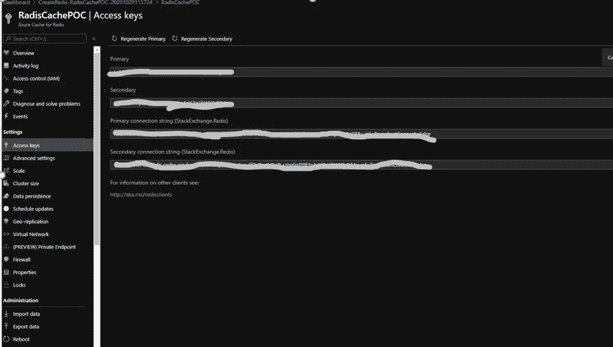

**第 2 部分:创建 API 项目并设置 Redis 缓存**

现在打开 Visual studio 代码，选择 web > Asp.net web 应用程序(。Net 框架)并创建。

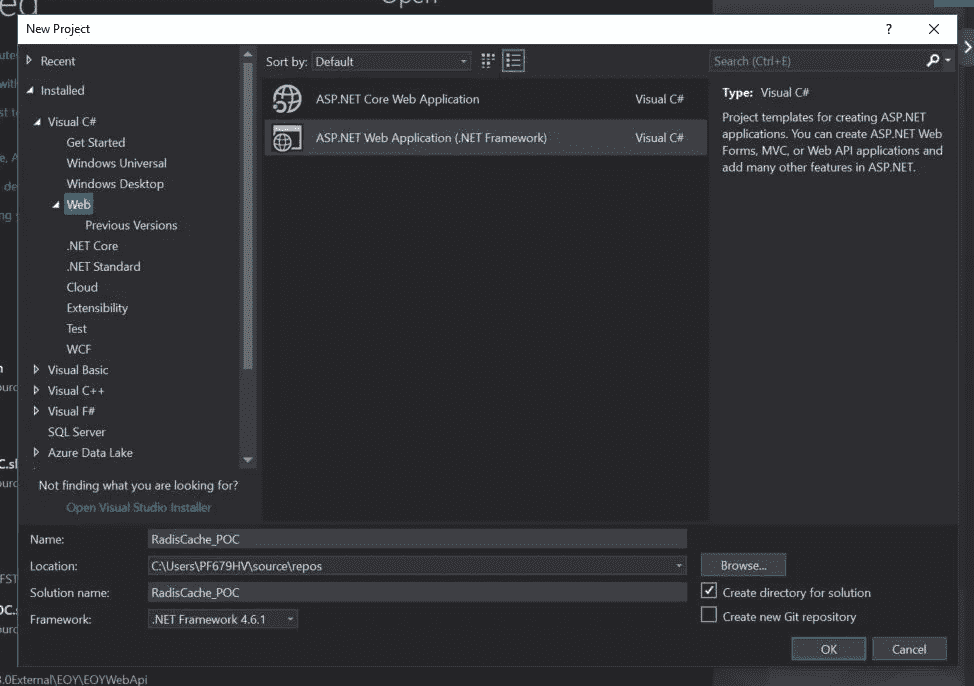

现在打开新创建项目的 web 配置，并添加一个带有复制的 Redis 缓存连接字符串的新键。

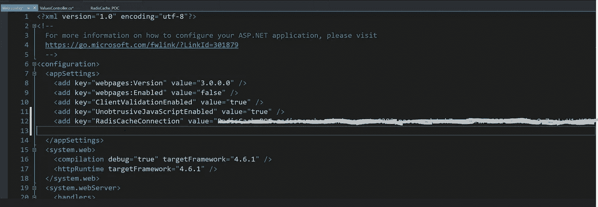

现在我们需要 Radis 缓存库与 Redis 缓存进行通信。对于点击项目并选择管理 NuGet 包

在 NuGet 中，搜索 StackExchange。Redis 并安装

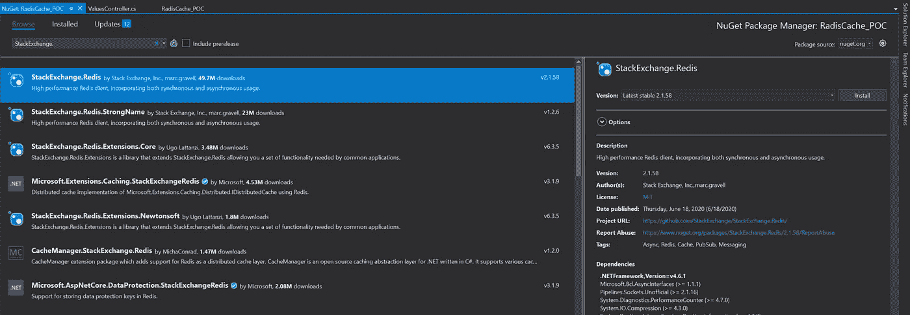

**第 3 部分:在 API 中使用 Redis 缓存**

最后，我们将在 API 中使用 Redis 缓存，首先我们需要连接到 Redis 缓存，为此我们需要创建连接。

在下面的代码片段中，你可以看到我已经在构造函数中连接到 Redis 缓存。然后，在 API 调用操作方法中，我使用连接对象来检查 Redis 缓存中是否存在数据，如果存在，则返回数据，否则创建结果，然后保存到缓存中供以后调用。这也被称为 [**缓存预留模式**](https://docs.microsoft.com/en-us/azure/architecture/patterns/cache-aside) 。这可以提高性能，也有助于保持一致性。

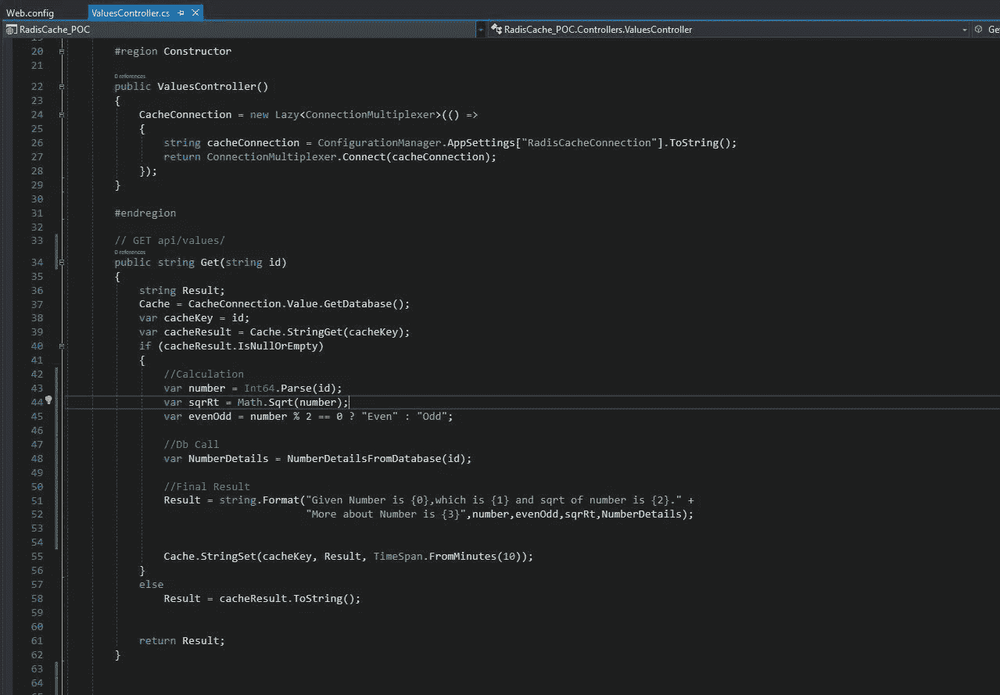

现在让我们检查一下 API 的性能

在上面代码片段中的 Get 调用中，我取了一个数字并对其进行了一些计算，还从数据库中检索了该数字的一些数据，然后创建并返回最终结果。

现在，第一次在缓存中没有数据，所以它将做计算和数据库部分，因此当我从邮递员点击 API 时，将需要 4.06 秒

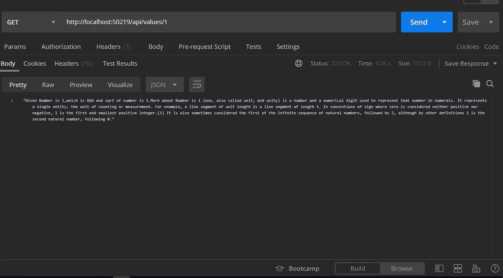

下一次，当我用相同的值点击相同的 API 时，它会在 Redis 缓存中找到结果，并且只需要 377 毫秒，因为它不需要任何计算和数据库调用。

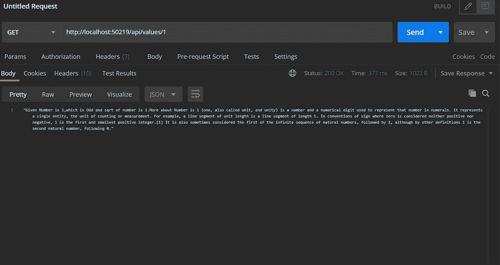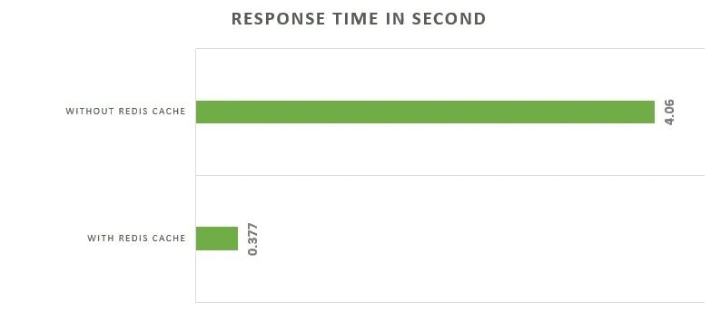

**收尾思路**

这就是当需要在缓存中存储数据时，如何在 API 调用中使用 Redis 缓存，以避免数据库调用并提高性能。我们还可以使用 Azure key vault 来保存连接字符串。也可以为 Redis 创建一个单独的服务类，它可以注入优化代码。

感谢阅读！快乐缓存！！