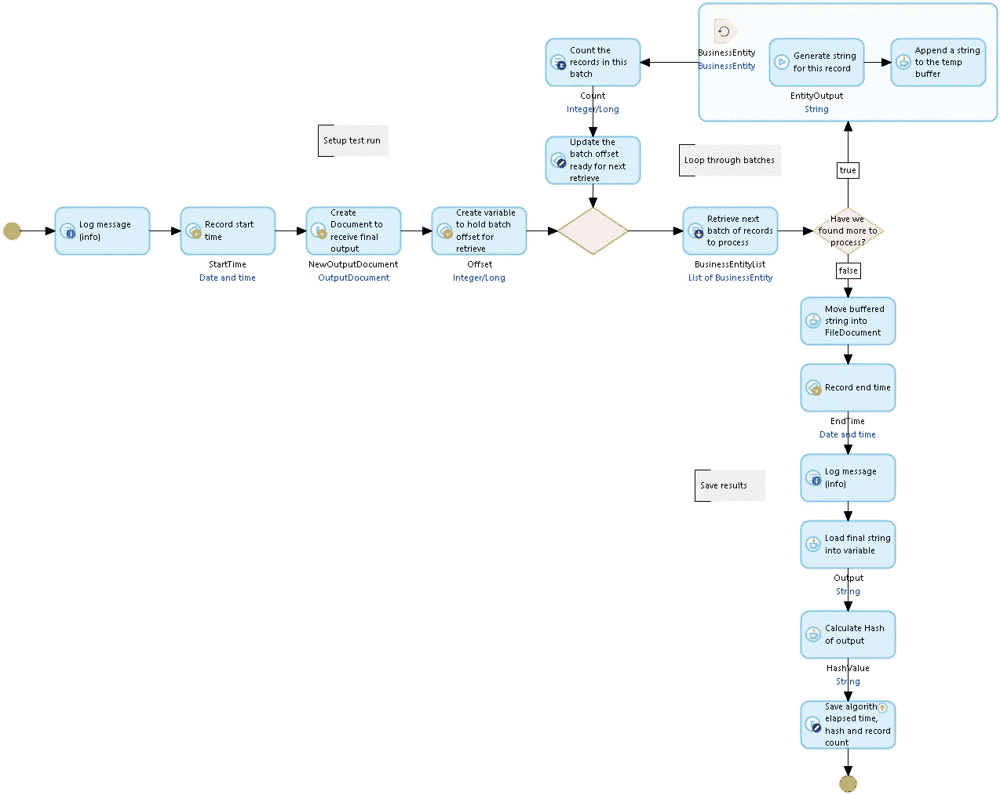

# 在 Mendix 中，一个字符串有多长？

> 原文：<https://medium.com/mendix/in-mendix-how-long-is-a-string-846b04d96770?source=collection_archive---------2----------------------->

## 这是我关于 Mendix 应用效率系列博客的第二篇。在这个系列的第一部分中(Mendix 中的[健康和效率)，我强调了一些可以提高低代码效率的简单方法。现在我将尝试解决一些更棘手的问题。](/p/86a02a4c70a3)

In Mendix how long is a String?

在过去的五年中，我不得不两次处理这样的需求:浏览所有的数据并从中构建一个文本文件。

第一个是在 Mendix 应用程序中生成一个表示一组数据的制表符分隔的文本文件。第二个要求从应用程序中内置的一组数据创建一个 Typescript 文件。这两个**都需要支持创建非常长的文本文件**，因为数据集可能非常大。

现在市场上有很棒的模块(例如 [CSV](https://marketplace.mendix.com/link/component/108605) 模块)可以帮助 CSV/TSV 文件的制作，但是更多的任意文本输出需要一个替代的解决方案。

# 测试练习

*为了收集统计数据进行比较，我使用了一个在****Mendix 9 . 15 . 1****中创建的应用程序，部署在一个* ***中型*** *环境(* ***最多 2 个 CPU，最大 2GB 内存，Postgres 数据库*** *)中，运行在一个* ***AWS EKS 私有 Mendix 云上***

*每次练习都是* ***运行五次*** *。在每组五个练习运行 t* ***之前，他停止并启动 app****以尽量减少可能的* ***缓存*** *对结果的影响。* ***最好和最差的结果被丢弃*** *和* ***其他三个结果被平均*** *。这些练习不一定要按照这里给出的顺序进行。*

*使用的 app 在 GitHub* [*这里*](https://github.com/Adrian-Preston/HowLongIsAString)

 [## GitHub-Adrian-Preston/howlongisatring:Mendix app 支持博文一个字符串有多长…

### 此时您不能执行该操作。您已使用另一个标签页或窗口登录。您已在另一个选项卡中注销，或者…

github.com](https://github.com/Adrian-Preston/HowLongIsAString) 

# 起点

我们有一个 Mendix 对象的列表，我们有一个微流，它将从这些对象中的一个生成我们想要的文本。为了简单起见，我将只处理一个数据实体，尽管在实际场景中可能会涉及到大量的对象树。 **OutputDocument 是 FileDocument 专门化，它接收字符串生成过程**的结果。

The Business Entity and Output Document in the domain model

The GetEntityToString microflow that generates the text for an instance of BusinessEntity

为了生成输出文件，我们以 2，500 条记录为一批提取数据记录，传递对象列表，并将为每个对象生成的文本附加到一个不断增长的集合字符串中。当列表用完时，我们累积的字符串被写入 OutputDocument。创建的 OutputDocument 还记录了使用的算法、处理的记录数量、运行测试花费的时间以及生成文件的散列。生成并保存散列，以便我们可以确认用于生成相同输出的所有方法都来自相同的源数据。

TheStartingPointBuildString microflow

# 让我们运行这个。

我用**的 25，000 条记录**和**的各 500 个字符的“随机”文本串**和随机整数值填充数据库，然后运行上面的微流。

这给了我们平均 78.81 秒的时间来构建字符串并将其保存到 FileDocument 中。现在让**将数据**的大小加倍到 **50，000 个**记录，并重新运行微流。我想我们可能期望它在 200 秒内完成。我们至少应该假设，尽管我们在键上有一个索引，但是随着记录量的增加，批量检索会变慢。

哦哇！所以平均时间是 334.05 秒。我不会尝试一个非常大的数据集，除非我有一两部电影可以看…

那么，为什么数据量翻倍会导致运行时间增加四倍呢？

嗯，如果不使用分析工具，我们无法完全确定，但是我们可以对主要原因做出明智的猜测。

TheStartingPointBuildString excerpt

Change Variable 操作将从 GetEntityToString 子微流返回的字符串附加到已经存储在输出变量中的先前结果。只不过它并不完全是这样。**在 Mendix 中，一个字符串是不可变的**，因此为了创建输出变量的新值， **Mendix 必须创建一个新的字符串**，该字符串由附加了 EntityOutput 副本的原始输出的副本**组成，并且保存该新字符串来代替先前的输出值，先前的输出值被丢弃。**

> 随着输出中的值变得越来越长，文本复制的数量增加，这个过程变得越来越耗费时间和资源。

因此，让我们尝试使用一些 Java 代码进行一点重新设计**,看看我们是否可以避免长字符串的重复复制，并降低执行时间。**

# 存储缓冲器

我们不是在 Mendix 变量字符串中构建长字符串，而是在一个缓冲区中构建字符串，该缓冲区存储在当前用户操作的上下文中，然后在最终存储区缓冲到 FileDocument 中。上下文只能从 Java 操作中访问，所以我们必须用 Java 来构建它。

我们使用的微流与原始微流非常相似，但它调用一个 Java 动作将下一个字符串追加到存储在上下文内存中的缓冲区，并调用另一个 Java 动作将完成的内容移入最后的 FileDocument。

MemoryBufferBuildString microflow

这两个 Java 动作看起来像这样。我们使用 ByteArrayOutputStream 来存储数据，然后将数据转换为 ByteArrayInputStream，将结果移动到 FileDocument 中。

AppendStringToMemoryBuffer Java action

MoveMemoryBufferToDocument Java action

## **那么当我们运行这个函数时，我们得到了什么？**

对于**的 25，000 条记录**，我们得到的平均值为 **1.90 秒**。

对于**的 50，000 条记录**，我们得到的平均值为 **2.94 秒**。

我想你会同意这是对原始算法的显著改进(334 秒对 3 秒)。这似乎表明我们的方向是正确的。

但是我们能进一步改进吗？虽然速度大大提高了，但我们在应用程序的内存缓冲区中存储了大量文本，最终可能会给 Mendix 运行时内存带来压力。

# 文件缓冲区

另一种方法可能会减轻潜在的内存使用问题，并且仍然比原来的方法执行得更好。这个版本的流程将生成的文本写入一个临时文件，这样我们就不必将它保存在 Mendix 运行时内存中。

这个选项更复杂，需要使用两个微流和两个 Java 动作。第一微流调用第一 Java 动作，第一 Java 动作调用第二微流，第二微流调用第二 Java 动作。其原因将在后面解释。

要启动 FileBufferBuildString 微流，需要进行一些设置，然后调用 BuildStringInFileBuffer Java 操作，最后将补充结果(散列、记录计数和时间)保存在文档中。

FileBufferBuildString microflow

BuildStringDocumentInFileBuffer Java 操作接受 FileDocument 和一个微流指针(该微流的可选参数)，在 Java 临时文件位置创建临时文件，将打开的文件详细信息存储在上下文内存中，然后调用指针中给出的微流。当微流返回时，它将临时文件的内容读入 FileDocument 并进行清理，删除文件和上下文对象。

BuildStringDocumentInFileBuffer Java Action

SUB_FileBufferBuildString 微流由 BuildStringDocumentInFileBuffer Java 操作调用。它运行读取记录批的循环，为每个记录生成字符串，然后调用 AppendStringToFileBuffer Java 操作来保存它们。

SUB_FileBufferBuildString microflow

AppendStringtoFileBuffer Java 操作从上下文中提取临时文件信息(由 BuildStringDocumentInFileBuffer 保存在那里),并将单个记录的字符串写入临时文件的末尾。

AppendStringToFileBuffer Java action

好的，所以这种安排(**微流调用-java 调用-微流调用-java** )有点复杂，可以被认为是晦涩的，并且违背了我在之前的博客文章中所说的(可读性与可维护性)，**，所以应该为后来的开发人员做好记录**。

这种方法有一个很好的理由——它是安全的。如果在这个过程中出现任何问题，第一个 Java 动作可以在返回到第一个微流之前清除临时文件和打开的文件描述符，因此应用程序作为一个整体受到损害的可能性较小。这篇博客附带的应用程序中还有一个替代方案(称为 TempStorage)——参见[GitHub 上的一个字符串有多长](https://github.com/Adrian-Preston/HowLongIsAString)*——*，它不使用微流和 Java 动作的嵌套，但确实要求调用者在出错时更加小心地清理。

那么结果如何呢？对于**25000 条记录**花费了 **1.23** 秒，对于**50000 条记录**花费了 **2.75 秒**。

*内存缓冲区*和*文件缓冲区*在性能上非常接近，但是我们现在可以看到，最初的*起点*算法是三个算法中性能最差的，在本练习中，我们不再需要使用它。我们能在另外两个中选择吗？

# 比赛结束了

在比较这些解决方案时，我提到内存使用是另一个因素，所以我也应该得到一些统计数据。为了提高清晰度，让我们使用更大的测试数据样本— **500，000 条记录**。

设置填充，然后重启应用程序，运行一次*内存缓冲*进程。在这个私有云上设置了 **Grafana** 之后，我们可以获得一些关于资源使用情况的信息:

哎哟！ ***内存缓冲区*** **不够强大**无法处理这种大小的作业，应用程序在 AppendStringToMemoryBuffer 中填充缓冲区时耗尽了内存。*文件缓冲*会做得更好吗？重新启动 app，运行 ***文件缓冲*** :

等等！因此*文件缓冲区*也失败了，但是在成功创建并填充 FileDocument 之后，在将生成的整个文件读取到一个字符串(CommunityCommons StringFromFile)以计算数据的哈希值的过程中，该缓冲区因内存不足而终止。文件太大，无法执行该操作。所以我禁用了读取字符串并调用散列操作(使用常数)的代码，重新运行这个过程，它工作了。

所以，是的，它完成了，我们似乎有一个赢家！

为了更好的测量，我建立了一个 **1，000，000 记录**数据集，并再次运行*文件缓冲区*，这也完成了。

# 您的里程可能会有所不同

当然，所有这些在现实世界中的表现取决于本文范围之外的许多因素，但我希望这有助于展示在特殊情况下，如何提高字符串生成的弹性和性能，以及一般情况下如何使用 Java 来提高性能。

在我的下一篇效率文章中，我计划展示如何利用内置的 Mendix 任务队列功能来改进一些冗长的操作。

# 感谢

我感谢阿扬·维斯的宝贵建议，感谢阿扬·兰默斯在这篇文章的顶部提到的很酷的 CSV 模块，我毫不羞耻地从那里借鉴了一些想法。

## 阅读更多

 [## Grafana:开放观察平台

### Grafana 是适用于所有数据库的开源分析和监控解决方案。

grafana.com](https://grafana.com/)  [## Java 操作

### 描述如何使用 Java 操作来扩展 Mendix 应用程序的功能。

docs.mendix.com](https://docs.mendix.com/refguide/java-actions/)  [## 检测并解决性能问题

### 描述可能的性能问题及其根本原因和解决方法。

docs.mendix.com](https://docs.mendix.com/howto/monitoring-troubleshooting/detect-and-resolve-performance-issues/) 

*来自发布者-*

如果你喜欢这篇文章，你可以在我们的 [*中页*](https://medium.com/mendix) *找到更多喜欢的。对于精彩的视频和直播会话，可以去*[*MxLive*](https://www.mendix.com/live/)*或者我们的社区*[*Youtube PAG*](https://www.youtube.com/c/MendixCommunity/community)*e .*

*对于希望入门的创客，您可以注册一个* [*免费账户*](https://signup.mendix.com/link/signup/?source=direct) *，并通过我们的* [*学院*](https://academy.mendix.com/link/home) *获得即时学习。*

*有兴趣加入我们的社区吗？加入我们的* [*松弛社区频道*](https://join.slack.com/t/mendixcommunity/shared_invite/zt-hwhwkcxu-~59ywyjqHlUHXmrw5heqpQ) *。*