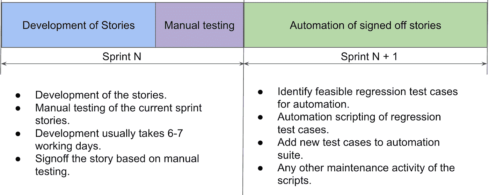
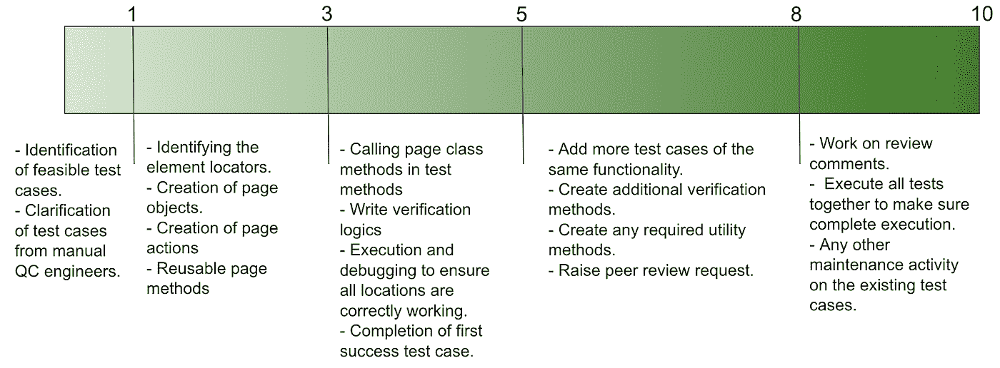
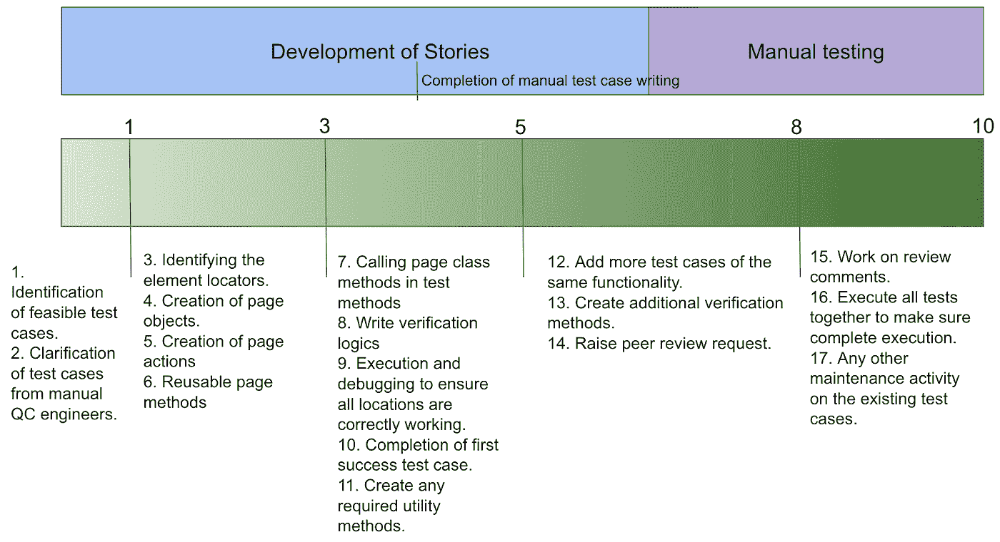
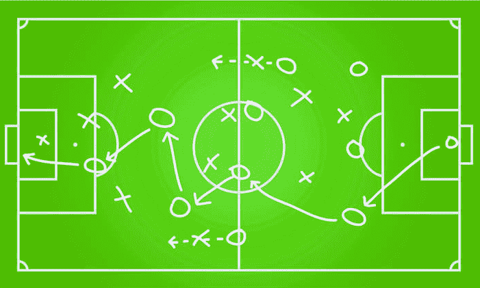
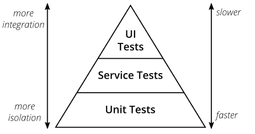
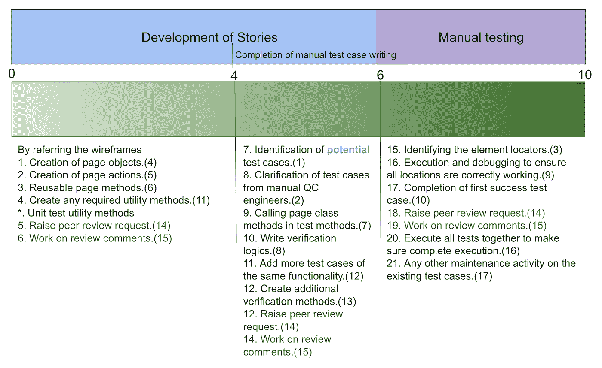
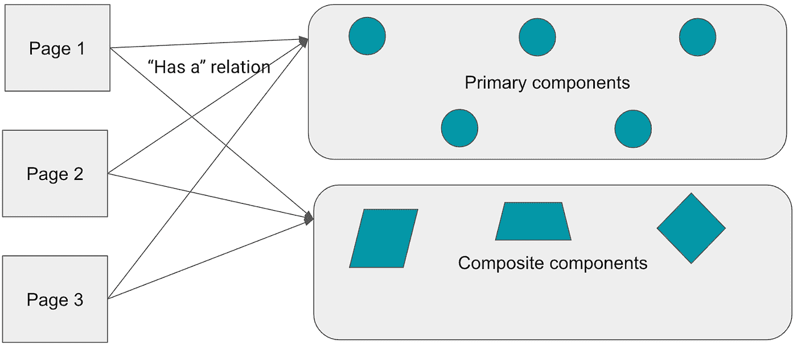
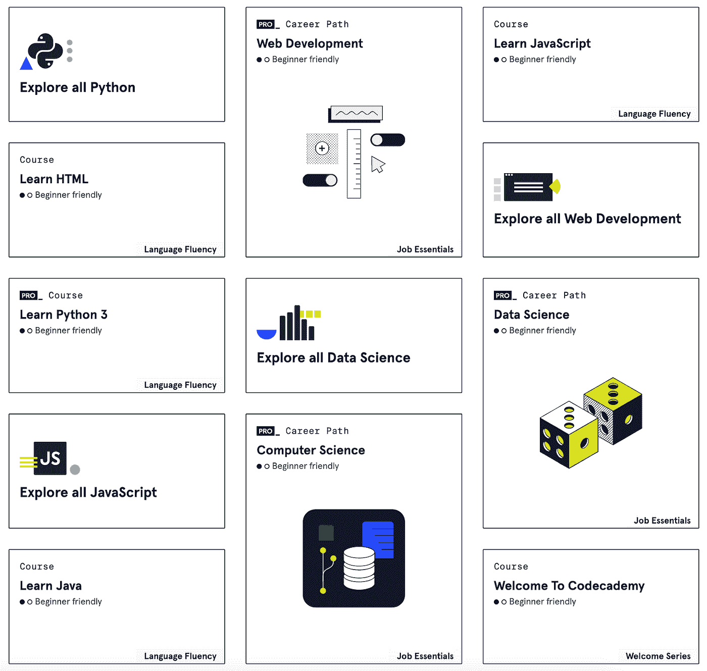
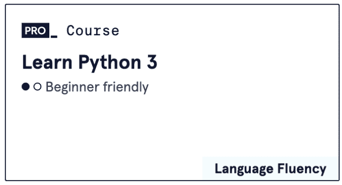
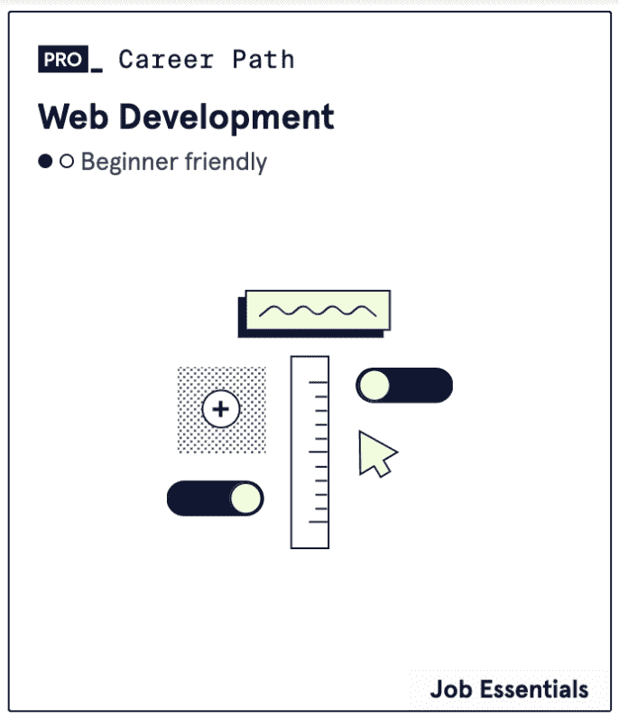

# 冲刺阶段测试自动化

> 原文：<https://medium.com/globant/in-sprint-test-automation-ff0d0af473?source=collection_archive---------0----------------------->

# 介绍

随着敏捷方法变得非常普遍，测试自动化在软件开发中也变得越来越重要。测试自动化在许多方面增强了软件开发。如果测试自动化以相同的开发周期完成，那么回归也可以在下一个 sprint 的第一次构建中执行。因此，我们将收到快速的反馈，每一个建设和质量将在检查始终。

UI 测试自动化通常需要相当多的时间和精力来编写脚本。它包括测试场景分析、编码、代码审查、执行和稳定。我们经常发现很难在特性开发的同一个冲刺阶段完成所有这些活动。因此，产品团队在 N+1 冲刺中决定测试自动化，其中 N 是特性开发的冲刺次数。由于 UI 测试自动化是自动化和维护成本最高的一种，让我们看看如何在相同的开发冲刺阶段实现 UI 测试自动化。

# 带有 next Sprint UI 测试自动化的常规 Sprint 模型

让我们来看一个 sprint 模型，在这个模型中，UI 测试自动化是在特性开发之后的 Sprint 中完成的。

如上表所示，在一个 Sprint 中对这些用户场景进行特性开发和手工测试，在下一个 Sprint 中对相同场景进行自动化测试。

# Sprint 内的自动化工作进度

让我们考虑一个敏捷项目，其中 Sprint 的节奏是 2 周。

# 冲刺测试自动化:挑战

因此，如果我们将上述自动化方法与开发 Sprint 对应起来，我们将会看到挑战。

在这里，如果我们观察上面的模型，我们会发现大多数测试自动化步骤都依赖于手工测试人员或者开发团队。

1.  前两个步骤被阻塞，因为在 sprint 开始时，手动测试用例还没有准备好。通常，手动创建测试用例需要 4-5 天。
2.  第三步受阻，因为开发团队尚未准备好页面。
3.  9 号和 10 号也是因为同样的原因被封。
4.  由于上述阻碍，剩余步骤无法执行。

所以自动化团队会被别人封杀，需要等待。

# 成功的关键因素

*   **敏捷团队游戏**

正如没有团队的支持，“梅西”一个人无法进球一样，质量是每个人的责任。如果团队决定进行测试自动化并从中获益，那么所有的涉众都需要为之努力。以下是一些关于如何计划这一活动的建议:

1.  设计团队应该准备好线框或模型屏幕，并在开发团队在开发冲刺阶段选择它们之前获得批准。
2.  BA 应该以一种可以在 Sprint 中开发的方式创建用户故事，给 QA 和自动化留出足够的时间来完成。
3.  开发团队不应该在冲刺的最后一天完成故事。
4.  测试自动化团队应该能够访问开发存储库，以便他们能够检出特性分支，并在本地部署以观察新元素和屏幕。
5.  手动测试工程师应该在 Sprint 的早期完成测试设计。
6.  测试自动化工程师应该足够精通在 Sprint 的早期开始自动化任务。

*   **策划**

围绕测试自动化的适当规划是成功的另一个关键标准。计划应该围绕自动化候选人的识别、自动化覆盖率、团队规模、开发人员与测试自动化工程师的比例。此外，测试工程师需要有一个合适的入职计划。大多数情况下，我们观察到当有相当多的功能准备好的时候，测试自动化工程师就加入了团队。所以团队已经积压了很多工作，所以永远无法在同一个 sprint 中实现测试自动化。

一个好的回归测试套件不仅仅是关于 UI 测试，还包括后端测试。自动化团队不应该试图自动化所有的 UI 测试用例。应根据以下 3 个参数选择自动化候选。

*   测试用例覆盖的业务重要性
*   我们需要多久测试一次这个场景
*   自动化可行性。

以上 3 个参数应该被认为是自动化测试用例选择的与门。因此测试满足所有条件，并且将被考虑自动化。

所以回归测试套件应该是 UI 和后端测试的良好组合，以确保良好的覆盖率。与后端测试相比，UI 测试的成本很高，在执行过程中需要更多的时间。

*   **国防部和国防部的必备规则**

当我们与其他团队讨论依赖性时，我们应该相应地在 DoR 和 DoD 中添加条款。下面的子句应该在那里。

**多尔:**

*   用户故事应附有最终的线框/VD。
*   完成该功能的所有 UI 组件都应该准备好了。

**国防部**

*   所有高价值(如 P1、P2)场景的自动化。
*   管道中所有自动化测试用例的执行。
*   现有自动化回归套件的完整运行。
*   **冲刺模式**

为了适应上面讨论的所有要点，我们需要 Sprint 中的自动化测试脚本流程。

在这个修改过的方法中，任务被分成三个部分，我们重新安排了上述传统 sprint 方法的步骤。括号中提到的数字是以前的步骤索引，因此传统方法的步骤 4 成为该方法的第一步。这有助于从 sprint 的第一天开始测试自动化任务。

在这里，我们认为最终的视觉设计，互动设计和线框准备就绪。第一部分是创建页面对象结构，带有定位器和相应页面动作的占位符。此外，如果需要任何新的实用程序，可以创建。这应该由领导进行审查和合并，以确保结构和实用程序是正确的。

在下一部分中，我们期望手动测试团队准备好手动测试用例。因此自动化团队可以开始识别潜在的自动化测试用例。经过筛选的测试可以编码。当页面对象准备就绪时，流程就可以完成了。此时，我们只能模拟测试，而不是实际执行。我们还没有添加定位器，该功能也没有准备好和部署。所有的代码都应该由负责人或相关团队成员进行审查和合并

在最后阶段，我们期望该特性至少在开发人员的本地分支中已经准备好，或者已经部署好进行测试。如果该特性具有本地分支，我们可以将它部署到本地主机中，并从应用程序中识别实际的定位器。一旦实际的定位器就位，测试就可以稳定地进行了。那么自动化工程师最需要解决的是在执行过程中观察到的问题。在几次执行之后，测试应该是稳定的。然后最后要审核合并。

在这种方法中，工程师不必等到应用程序开发完成后才开始自动化代码。

*   **自动化框架设计**

框架设计应该高效地支持上述 Sprint 策略。传统的页面对象模型设计使用了更多的定位器，因此，它减慢了开发速度。

在大多数情况下，UI 应用程序开发采用基于组件的方法。在这种方法中，开发人员创建小单元的 UI 元素，并在整个应用程序中重用它们。此外，它们组合 UI 元素来创建更复杂的可重用元素。

为了开发自动化框架，我们必须采用相同的方法。我们将创建主要元素的类型，然后组合这些元素来生成可重用的复合 UI 元素，而不是向页面添加元素。主元素可以是任何小的可重用 UI 元素。例如自定义按钮、选项按钮、标题等。

让我们用下面的例子来理解这个概念(参考: [codecademy](https://www.codecademy.com/catalog) )。

这里我们可以看到截图中的三种模式。这些模式如下

这些是我们的复合组件。只有文本被更改以生成类型的新元素。所以这三个将是我们的复合组件类。我们将向构造函数提供文本值，以根据需要生成每种类型的元素。

接下来，让我们确定主要元素。以下 Ui 元素是我们示例中的主要元素。

这些元素用于创建复合元素。这些将是我们主要元素的课程。复合元素类将拥有这些类的一个实例。

一旦我们准备好了主要和次要元素类，它们将被添加到页面类中以生成页面对象结构。

# 摘要

在 Sprints 中，如果我们正确地遵循上面的步骤，自动化是可以实现的。领导者必须承担主要责任，有效地推动团队努力。自动化工程师应该对框架及其组件有适当的了解。尽管测试自动化工程师需要投入大部分精力，但最终，这是一场团队游戏。项目团队的所有成员都需要相互支持才能成功。