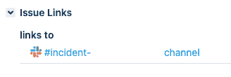

# 通过 Slack 实现自动化事件管理

> 原文：<https://medium.com/airbnb-engineering/incident-management-ae863dc5d47f?source=collection_archive---------0----------------------->

Airbnb 如何在复杂、快速发展的微服务世界中实现事件管理自动化。

弗拉德·瓦西里乌克

# 事故管理

突发事件是不可预见的事件，会扰乱正常的业务运营，在必须全天候运行的复杂系统中是不可避免的。这就是为什么做好准备并训练人们以及时和有组织的方式处理事件是很重要的。尽管每个事件都是独特的，但我们遵循相同的程序来检测、上报、管理和解决事件。

在 Airbnb，我们利用了一个[面向服务的基础设施](/airbnb-engineering/a-krispr-approach-to-kubernetes-infrastructure-a0741cff4e0c)，其中包含许多由小团队管理的互联服务。快速找出出现问题的服务，以及呼叫谁，对于及时解决事件至关重要。我们发现，我们的团队花了大量时间在 Slack、Pagerduty 和吉拉等应用程序之间切换，以引发事件、呼叫响应者并提供上下文。为了快速解决事件，我们开发了一个事件管理机器人，这是一个用于事件管理的集中式自动化工具。

# 事件管理 Slack bot

我们的目标是在 Slack 中集中事件管理。Airbnb 的每个人都熟悉并可以访问 Slack，很容易将人员和资源集中在一个事件通道中。此外，事件通道的作用类似于事件的时间线，这使得整理事后报告变得容易。

我们的要求如下:

*   在 Airbnb 的[面向服务的基础设施](/airbnb-engineering/a-krispr-approach-to-kubernetes-infrastructure-a0741cff4e0c)中运行，并得到我们团队的全力支持。
*   将所有工具中与事故相关的沟通标准化，如吉拉、Slack、PagerDuty。
*   在 Slack 中集中事件管理。
*   针对事件的单一进气漏斗，具有明确定义的步骤。
*   自动执行事件后任务，如安排会议和归档渠道。
*   提供事件时间表和指标。

我们决定构建自己的应用程序，以满足我们的确切规格，并允许我们轻松定制和进一步开发。我们也选择在 Golang 开发应用程序，因为那里有很好的社区，以及他们有据可查的 slack 库。

最后，我们决定使用聊天命令而不是斜线命令，这样发送给机器人的所有命令对 Slack 频道的成员都是可见的。

我们的事故管理机器人通过四个关键命令实现事故响应自动化:

*   **新事件<摘要> :** 创建吉拉票证并呼叫事件经理。
*   **新渠道<票据> :** 为打开的事件票据创建事件松弛渠道。
*   **寻呼<服务|用户> :** 直接寻呼传呼机服务或用户的呼叫。
*   **获取时间表:**为重要的聊天事件编制一份简明的时间表，用于事后分析。

# 事件响应生命周期

我们定义了事件的四个独立阶段:检测、沟通、上报和解决。机器人的每一个命令都可以自动完成通常在这些不同阶段需要协调的任务。

# 侦查

我们的大多数事故都是通过我们的[监控和警报工具](/airbnb-engineering/alerting-framework-at-airbnb-35ba48df894f)检测到的，尽管有时我们会从我们的团队成员或客户那里了解到事故。无论事件是如何被检测到的，对于有效的事件检测来说，所有事件都有一个单一的入口漏斗是至关重要的。我们的机器人通过提供“新事件”命令解决了这个问题。

## 新事件

该命令使用默认设置创建一个空白的 JIRA 票证，并询问用户是否想要呼叫事件管理器。

无论用户选择寻呼事件管理器，都会出现一个弹出窗口，要求用户提供更多信息。

这使我们能够快速上报事件，同时仍然允许事件响应者为事件管理者提供有价值的信息。这些字段在紧急情况下是可选的，如果需要，可以在以后填写。

# 沟通

另一个重要的第一步是建立沟通渠道，并向响应者提供尽可能多的背景信息。

## 新航道[吉拉船票]

该命令将可选的吉拉票证作为 URL 或密钥。如果没有提供，它将显示最近打开的 5 个事件票证供用户选择。然后使用吉拉票证密钥创建一个通道，以摘要作为标题，并邀请所有事故管理人员。

为了向所有被邀请的用户提供上下文，频道的主题被设置为吉拉机票链接以及吉拉机票摘要。此外，我们用一个链接更新了吉拉的机票，该链接指向新创建的 Slack 频道。

# 增加

您可能听说过 Log4j 安全漏洞[这是过去十年中最大、最严重的漏洞。在漏洞披露的 72 小时内，有报告称全球范围内对公司进行了 840，000 次攻击，这在接下来的周末变成了每分钟 100 次互联网范围的攻击。](https://nvd.nist.gov/vuln/detail/CVE-2021-44228)

在 Airbnb，我们有超过 1000 项微服务，由数百个小团队管理，这对我们来说是一个独特的挑战。我们必须识别所有易受攻击的服务，并迅速联系它们各自的所有者，以便快速缓解。这是我们的 Slack bot 真正闪光的地方，允许我们的事件经理快速联系服务所有者，并比以前更快地协调推出修复。在几分钟内，该机器人被用于呼叫 300 多个团队，以帮助评估影响和部署补丁。与手动寻呼这些团队相比，这相当于节省了 4 个小时，更不用说减少了处于易受攻击状态的时间。

## 第<shortcut name="" user="">页</shortcut>

可以给 page 命令一个服务快捷方式、服务名或一个 slack 用户。

首先，用户可以通过键入“页面列表”来查看快捷方式列表

每个快捷方式对应一个 page duty 服务 ID，该 ID 将在创建 page duty 事件时使用。通过编辑 YAML 文件，可以轻松定制快捷方式。

如果用户键入的服务名与任何快捷方式都不匹配，就会在 PagerDuty 服务目录中进行搜索，并显示结果供用户选择。

一旦用户选择了他们想要寻呼的服务，就会要求他们进行确认，并为该服务创建一个新的 PagerDuty 事件。

我们还允许在那些待命人员之外需要额外响应人员时，直接寻呼空闲用户。

一旦发送了寻呼命令，bot 就会在 PagerDuty 中用吉拉票据、摘要和 slack 通道创建一个新的事件，以便为待命人员提供上下文。呼叫待命人员后，机器人会宣布谁被呼叫，并邀请他们进入频道。

# 解决

一旦响应者确认没有进一步的用户影响并且知道了根本原因，就认为事件已经解决，团队进入事件后阶段。有效的事后审查和有效的[事后](https://www.atlassian.com/incident-management/postmortem)报告需要一个健全的时间表。

## 获取时间线

该命令将在事件频道中搜索所有标记有特定表情符号的聊天消息，该表情符号将该消息指定为时间线事件，并向用户发送一条已编译的时间线消息。

例如，我们使用📝表情符号指定聊天中的重要事件。由于事件正在发生，任何人都可以添加表情符号作为对重要聊天事件的反应。事件后,“获取时间线”命令会将这些聊天事件编译成一个易于复制粘贴的时间线，以便在事件后报告中使用。

## 事件回顾

在 Airbnb，我们每周都会召开行动后审查会议(AAR ),在会上我们会审查最近发生的严重事故、事故后报告，并确保提出和分配任何纠正措施。一旦跟踪事件的吉拉票证被更新为 AAR 会议日期，机器人将通知拥有吉拉票证的人会议的时间以及对他们的期望。

## 后续跟踪

通常，在我们[无可指责的事后分析过程](https://www.atlassian.com/incident-management/postmortem/blameless)中，纠正措施的标签被创建并分配给团队，以避免将来发生类似事件。为了鼓励快速解决问题，我们为这些罚单设定了严格的截止日期。我们的机器人将在截止日期前几天通过 Slack 发送一条警告消息，如果截止日期已过，则向分配给该票据的用户发送另一条消息。

## 存档事件通道

为了保持我们松弛的工作空间整洁，bot 会在事件的吉拉票证关闭 10 天后自动归档事件通道。

# 结果

自发布以来，我们的 bot 通过在 Slack 中自动化和集中化事件管理，为我们的事件经理和响应人员节省了许多时间。通过测量手动完成每项任务所需的平均时间，与机器人的自动化相比，我们确定到 2022 年为止估计节省了 44 小时的时间。

# 下一步是什么？

为了进一步简化我们对 Slack 事件的响应，我们计划增强与 PagerDuty 的集成。

目前，每次使用 page 命令时，都会创建一个新的 PagerDuty 事件。相反，我们计划将所有页面统一在一个 page duty 事件下，以利用 page duty 的事件指标，并为响应者提供更多上下文。

最后，在使用 bot 对 page duty 服务进行分页之后，我们无法看到 Slack 中 page duty 事件的状态。页面被确认了吗？待命没有回应吗？升级了吗？升级到谁了？我们计划构建自动化来跟踪 PagerDuty 事件，并向事件的渠道报告当前状态。这也将允许我们在寻呼服务之后记录在 PagerDuty 事件中采取的行动的时间表。

# 归因和感谢

*   [斯蒂芬](https://medium.com/u/af76cda83a53?source=post_page-----ae863dc5d47f--------------------------------):作为 Airbnb 事件管理团队的优秀合作伙伴，帮助定义事件管理机器人的功能路线图

所有产品名称、徽标和品牌都是其各自所有者的财产。本网站中使用的所有公司、产品和服务名称仅用于识别目的。使用这些名称、标志和品牌并不意味着认可。