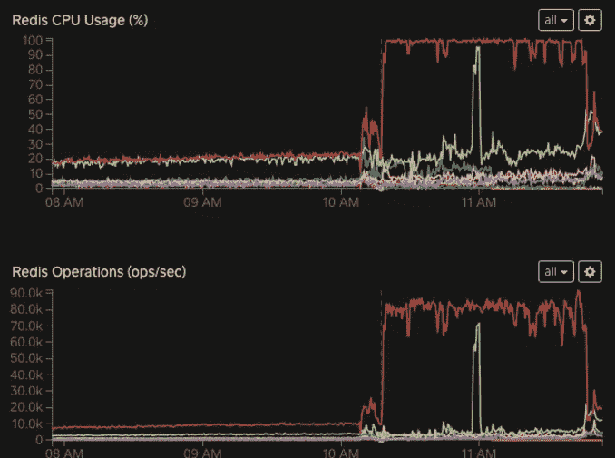

# 事件摘要:2017 年 3 月 16 日

> 原文：<https://medium.com/square-corner-blog/incident-summary-2017-03-16-2f65be39297?source=collection_archive---------1----------------------->

作者:埃里克·布尔歇、托比·雷耶茨和泽维尔·谢伊

> 注意，我们已经行动了！如果您想继续了解 Square 的最新技术内容，请访问我们在 https://developer.squareup.com/blog[的新家](https://developer.squareup.com/blog)

3 月 16 日，从太平洋时间上午 10:02 开始，Square 的服务基础设施出现了服务中断。Square 的大部分产品和服务都受到了此次中断的影响，包括支付处理、销售点、仪表盘、约会和工资单。太平洋时间上午 11 点 55 分，除了双因素身份验证代码的短信交付之外，所有服务都恢复了服务。太平洋时间下午 1 点 12 分短信恢复。

这份事后分析文档旨在传达此次中断的根本原因，记录我们为诊断和解决中断所采取的步骤，并分享我们正在采取的措施，以确保我们能够正确保护我们的客户免受未来类似服务中断的影响。

这是我们以工程为重点的时间表。请参见 https://www.issquareup.com[的高级概述。](https://www.issquareup.com)

## 事件摘要:2017 年 3 月 16 日警报-2791 大范围服务中断

根本原因:由于相邻服务中的错误，商家认证服务不可恢复地过载

影响:上午 10:02-11:55 所有商户服务中断；2FA 断电，直到下午 1:12

## 时间轴(太平洋)

发生了什么事？

**9:55** 我们开始在单个数据中心推出对“花名册”的更改，即处理客户身份的服务。

花名册(以及我们的其他关键系统)在多个数据中心中是主动-主动的。对于我们来说，全天连续部署是正常程序，总的来说，我们每天为生产部署各种服务超过 250 次。

10:02 我们的客户认证服务“Multipass”开始向 oncall 工程师报告超时。这项后端服务对 Square 的大多数核心产品服务至关重要。

**10:02 撞击开始**

花名册呼叫了一名待命工程师。

我们的外部监控通知我们 api.squareup.com 停机了。

**10:08 严重撞击开始**

来自 Square 的工程师们开始报告依赖于商家身份的服务正在经历失败。在这一点上，我们很清楚这是一次大停电。我们执行了一些标准操作程序:

1.  我们召集各个办公室的工程师开会。
2.  我们回滚了导致事件发生的所有软件更改。这是对任何影响客户的事件的不可协商的回应；我们的工程师接受过撤销事件发生前发生的任何变更的培训，无论该变更导致问题的可能性有多大。
3.  我们启动了我们的“危机小组”——一个跨职能的领导小组——以确保我们完整的灾难响应计划得到遵守。
4.  我们更新了 issquareup.com 网站，通知卖家网站中断，并继续每 15 分钟更新一次，直到我们完全解决问题

**10:23** 花名册完成回滚。我们认为这很有可能解决停机问题，因为 Multipass 依赖于花名册，花名册部署的时间与 Multipass 中问题的开始时间一致。不幸的是，这并没有解决停机问题。回顾过去的数据，花名册在此期间继续可用，按照设计在其他数据中心提供服务。

**10:25** 我们关闭了 Multipass，然后又打开了它。我们的理论是，花名册使 Multipass 进入一个糟糕的状态，重新启动它将恢复服务。这个理论被证明是错误的。

[Support] **11:10** 我们注意到我们的状态页面加载缓慢，并立即联系了我们的状态页面供应商。他们更新了他们的状态页面，解释说他们的数据库负载过重，并且正在积极解决问题。

[Engineering]**10:30–11:30**我们分成几个工作流程，分别是诊断、测试理论和调整系统中的可调参数。我们的工程师发现，Multipass 的 Redis 数据库的容量已经达到峰值，这是突然且出乎意料的:

我们使用 Redis [SLOWLOG](https://redis.io/commands/slowlog) 和 [MONITOR](https://redis.io/commands/monitor) 来确定哪些操作对 Redis 的打击最大。然后我们将它们追溯到 Multipass 中的特定代码路径，该路径重试 Redis [乐观事务](https://redis.io/topics/transactions)。我们确定重试次数的上限很高(500 ),没有导致有害反馈循环的回退，并开始着手修复。

尽管这很有希望，但我们的工程流程要求我们在确定解决方案之前不要停止探索。我们开始识别关键服务，并给予他们运行机器的完全访问权。Square 在其每台服务器上托管多种服务，并使用 [Linux cgroups](https://en.wikipedia.org/wiki/Cgroups) 将它们相互隔离。这限制了给定服务能够在机器上使用的 CPU 和内存量。这使得对我们的支付处理流程至关重要的服务在我们的计算资源上获得了最大可能的优先级。

到 **11:45** 时，我们的补丁已经编写、审查、构建和测试完毕。

**11:48 西海岸数据中心多通道部署能够减少 Redis 交易的重试次数。**

随着改进的展开，multipass-redis 立即恢复。付款开始正常流动！

[Support] **11:56** 我们的状态页面供应商告诉我们，他们已经发布了针对加载问题的修复程序。然而，我们的状态页面在很大一部分访问者遇到负载问题的时候运行正常。

**11:59 东海岸数据中心多通道部署。**

**12:00 日本数据中心多通道部署。**

**12:00 登录被备份。**

此时，我们开始测试我们的所有系统，以验证服务是否真正恢复。我们发现还有一个问题——在测试我们的注销/登录流程的过程中，我们发现双因素身份验证代码没有发送给启用了 2FA 的客户。这是由于登录我们系统的人数突然激增而导致的短信激增的结果。我们联系了我们的短信供应商，并努力消除发送短信的瓶颈。与他们一起，我们决定重新平衡我们的出站短信电话号码，以增加这里的容量。

**12:32** 我们开始向短信池添加新的短信号码。

我们从池中清除了旧号码。

在测试期间，一名工程师在大约 10 秒内收到了新的 2FA 代码。恢复正在进行中。

SMS 2FA 代码开始为每个人工作。

我们收集信息直到下午 4:30，在这一点上，我们举行了一次事后总结会议，讨论我们的应对措施中哪些做得好，哪些做得不好。总的来说，我们对问题进行分类的过程起到了预期的作用，但是这个问题的棘手本质意味着它们没有推动我们所习惯的快速解决。我们认为应用内消息传递的改进会让我们的客户受益。由于我们工作室目前的设置，我们经历了一些小的分流延迟。我们采取了几项行动，如下所列，我们相信这些行动将解决这些问题。粗体项目直接修正了停机的技术根本原因。未用粗体显示的项目是我们发现的提高系统弹性和流程效率的机会。

# **行动项目**

商户身份团队:

*   **确定单个数据中心名册中断是否加剧了多通道 Redis 重试，以及我们是否需要打破多通道和名册之间的其他依赖关系。**
*   **确定使用重试逻辑的其他领域，并对它们进行审计，以确保它们不会受到相同缺陷的攻击。**
*   审计集团限制，以确保我们对申请的限制是正确和合理的。

支付团队:

*   与相邻团队会面，重新确认服务之间的 SLA。
*   与 iOS/Android 销售点团队会面，讨论更有效的应用内断电消息。

基础设施团队:

*   根据停机情况编写 redis 操作手册，以指导 redis 故障排除。在大修期间，我们学到了一些关于应用程序与 Redis 交互的经验，记录这些经验将增加整个工程领域的知识。
*   为 SMS 问题设置第二次事后检查。我们觉得这里有更多值得探索和学习的地方。
*   为运营中心会议室配备随时可用的测试设备，以便在停电期间可以从运营中心更容易地评估客户体验。我们的标准操作程序，即工程师在停电期间使用他们自己的设备进行测试，在这次停电中被拉长了。专用测试站将使调试和验证过程更加简单。

支持团队:

*   跟踪状态页供应商以提高 issquareup.com 的可靠性。