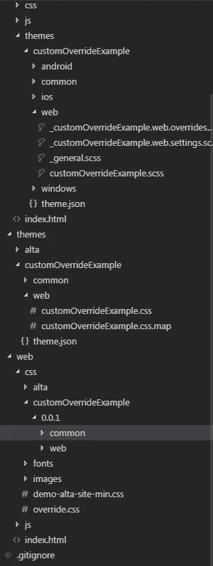
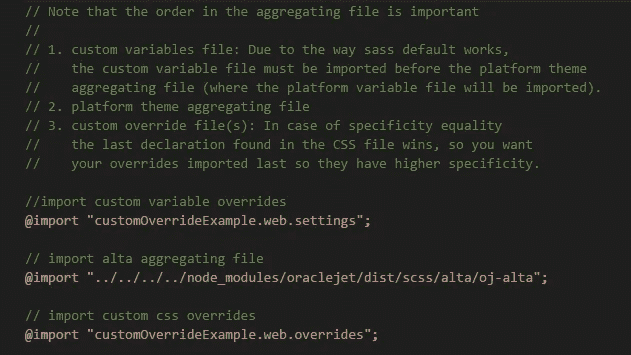
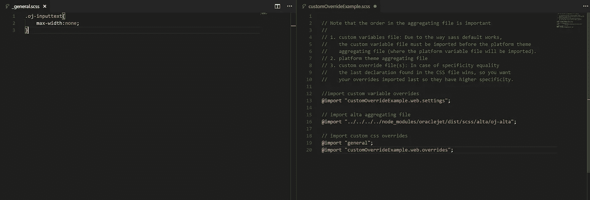
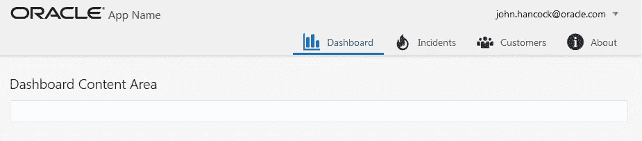

# 在 Oracle JET 主题中包含您的覆盖 SASS partials

> 原文：<https://medium.com/oracledevs/including-your-override-sass-partials-in-an-oracle-jet-theme-ee341150f1c7?source=collection_archive---------0----------------------->

当您开始一个新的 Oracle JET 项目时，系统会为您提供默认的“alta”主题，它看起来很棒！

如果你想改变应用程序的配色方案，你可以使用主题生成器创建一个自定义主题，这是**更好的**！

但是如果你想更进一步呢？我预测在大多数更复杂的用例中，您将需要。

JET 项目包括一个 **override.css** 文件，但只是一个 css 文件，而不是 SASS 文件。

我花了一些时间试图找出如何使用构建工具来代替使用一个 **override.scss** (并构建到我的 web 目录作为。但最终我决定更多地在我的应用程序中创建一个主题，并使用内置的 SASS 编译，它是 JET 主题化的一部分。

我没有使用 JET 主题构建器，我直接在我的应用程序中创建主题，只是使用主题构建器作为参考点。然而，使用主题构建器应该没有问题，Geertjan 有一个很好的博客介绍如何设置。

> **注意**:不使用主题构建器的一个好处是你可以随意命名主题——不仅仅是“myTheme”。

首先，确保安装了 SASS 并创建了一个主题:

```
yo oraclejet:add-sass
yo oraclejet:add-theme customOverrideExample
```

一旦完成，您将在目录中创建您的新主题:**src/themes/customoverridexample。**

要构建您的主题，请运行以下命令:

```
grunt build --theme=customOverrideExample
```

> 注意，在将 SASS 代码复制到**web/CSS/custom override example**目录之前，它会将您的 SASS 代码编译到**themes/custom override example**中。请记住这一点，因为您想要确保您总是从 **src/themes** 目录中编辑您的主题文件。

如果您希望为您的应用程序提供新主题，请运行以下命令:

```
grunt serve --theme=customOverrideExample
```



现在我们知道了主题服务的三步流程是如何工作的，让我们回到源代码并打开**customoverridexample . scss .**



**customOverrideExample.scss**

如果你想包含你的自定义 SASS，你可以看到主题导入了**customoverridexample . web . overrides**partial。这是一个包含自定义 SASS 的好地方，特别是如果你没有很多东西要覆盖的话……但是如果你正在构建一个大的、复杂的应用程序，你可能想要把它分解成单独的部分。

因此，对于这个示例，我将创建一个“通用”分部，其中我将覆盖我们在 alta 中看到的一个常见用例:ojInputText 上的 max width 属性。

移除此属性后，您可以使用 flex 类来适当地调整输入框的大小。



这是一个非常简单的例子，但是除了' **general** ' partial 之外，您的项目还可以包含每个视图的 partial，甚至是模块，这取决于您的应用程序的大小。


Before



After

最后一点——如果您正在为您的应用程序提供服务，并且您更新并保存了一个部分，那么您的更改将被自动获取，您的 SASS 将被重新处理。整洁！

DC