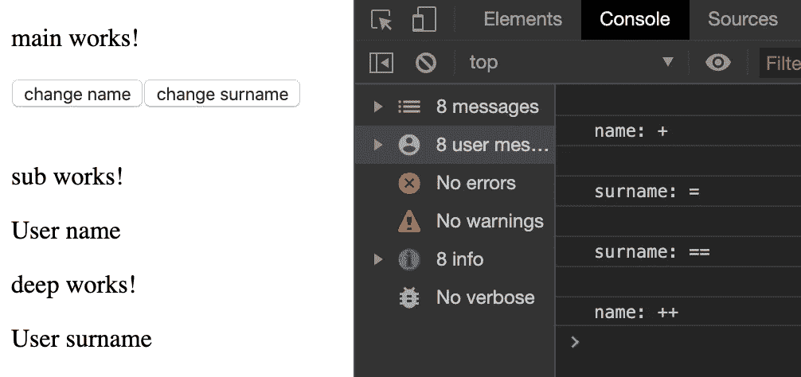

# 提高角度应用的性能。正确使用变更检测。

> 原文：<https://medium.com/quick-code/increase-performance-of-angular-application-use-change-detection-correctly-c43a9aad099?source=collection_archive---------0----------------------->

## 角度指南

## 角度性能

在我们开始讨论变化检测策略之前，我们需要讨论可变和不可变类型。

可变变量是一种可以改变的变量类型(对象、数组、函数)。不可变是一种类型，一旦对象被创建，其状态就不能被改变(字符串、数字、布尔)。

我们不能改变字符串值，每次当我们改变字符串值的时候，我们就产生了一个新的字符串。当我们处理对象时，我们可以改变任何属性。知道这一点很重要。

Example of mutable and immutable

**变化检测策略**

在 html 中我们可以写“ ，如果名字已经改变了我们必须显示出来，这是怎么发生的？角形中的每一个分量都有一个变化探测器，如果有什么东西发生了变化，变化探测器是知道它的。

有两种变化检测策略:默认和 onPush。

如果您没有在组件中设置更改检测策略，它将是“默认”的。

想象一下组件树，默认情况下，如果主组件发生变化，树中的每个内部组件都会被检查，它会比较以前的值和新值，如果它们不同，新值就会显示出来。

Default strategy

有时，并非所有组件都必须检查并显示新值。如果你的页面上有 5-10 个组件，这不会是一个大问题，但是如果你的树中有 50-100 个组件，这些检查将是一个巨大的时间浪费。当一个值改变时，这个循环将一遍又一遍地重复。

**OnPush 策略**

OnPush 策略的工作方式不同，如果输入对象上的链接发生了变化，它会通知组件。如果输入对象的属性被更改，树中的组件将不会得到通知。

OnPush strategy

我们来做一个小组件树。

Out component tree

我们有 3 个组件和 1 个输入对象。主组件->子组件->深度组件。在主要组件中我们有 2 个方法可以改变用户的姓名。

如果我们选择“默认”变化检测策略，当我们点击按钮时一切正常，树中的每个组件都会得到通知。

ChangeDetectionStrategy.Default

但是，当我们设置“OnPush”更改检测策略并开始单击按钮时，什么也没有发生，因为输入对象上的链接没有更改，我们只是更改了该对象的属性。

ChangeDetectionStrategy.OnPush

让我们创建另外两个改变名字和姓氏的方法，但是我们也将创建一个具有新属性的新对象。

Methods where we create a new object

现在它工作了，因为我们用一个新的物体代替了旧的物体。

Create a new object with changed properties

**ngdoccheck**

如果我们不想为输入对象创建一个新的副本，因为这个对象太大了，怎么办？解决方法之一是使用一个“ngDoCheck”方法。

当我们通过点击按钮来改变输入对象的属性时，我们触发了子组件的“ngDoCheck”方法。在这种方法中，我们需要手动检查变更。如果我们发现一个变化，我们需要告诉它 Angular，为此我们需要使用一个 ChangeDetectorRef 类。

‘ngDoCheck’ method

‘ngDoCheck’ result

如你所见，当我们更改“DeepComponent”的“ngDoCheck”姓氏时，没有调用它，因为在“SubComponent”中，我们没有处理这种情况，也没有调用“markForCheck”方法。此方法仅通知层次结构中子组件的更改。

此外，如果我们使用“setTimeout”方法或等待来自服务器的响应，则不会触发子组件中的方法“ngDoCheck”。为了处理这些情况，我们需要在“ChangeDetectorRef”类中使用“markForCheck”方法。

setTimeout methods

setTimeout result

“OnPush”策略的另一个解决方案是创建一个观察者服务，并在其上进行订阅。

现在我们知道了不同的变化检测策略，以及不同的策略如何提高我们的应用程序的性能。

如果你需要仔细看看项目[，这里有链接。](https://github.com/8Tesla8/change-detection)

*原载于 2020 年 1 月 19 日*[*【http://tomorrowmeannever.com】*](https://tomorrowmeannever.com/2020/01/19/increase-performance-of-angular-application-use-change-detection-correctly/)*。*