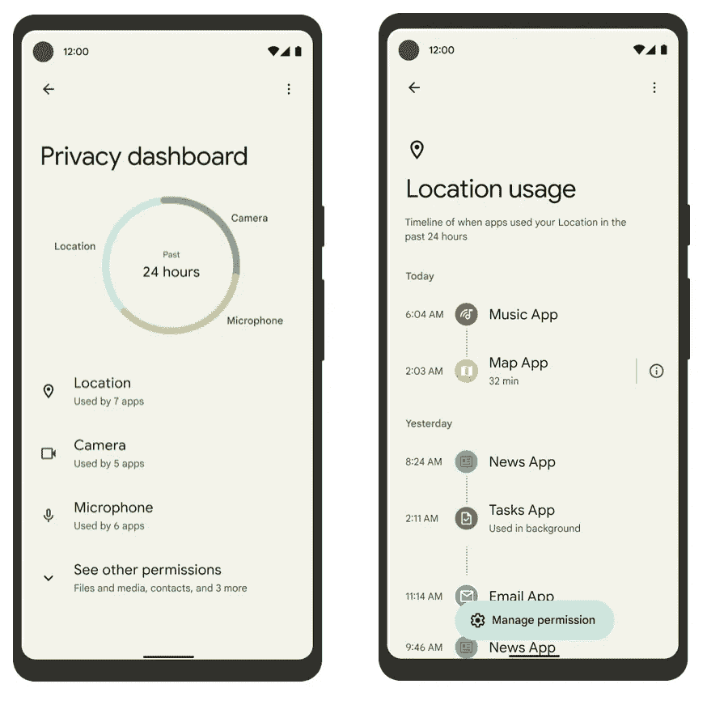
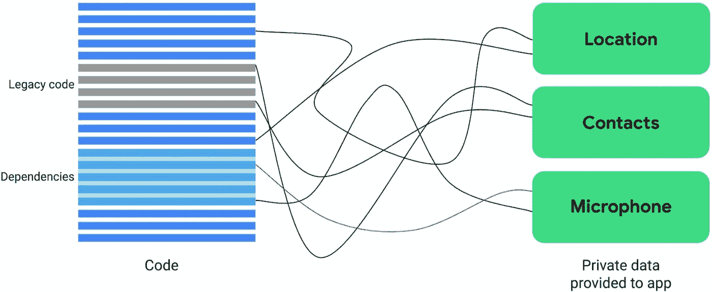

# 通过隐私控制面板提高用户透明度

> 原文：<https://medium.com/androiddevelopers/increasing-user-transparency-with-privacy-dashboard-23064f2d7ff6?source=collection_archive---------7----------------------->

Android 一直在寻求保护用户隐私。在 Android 12 中，该平台通过引入[隐私仪表板](https://developer.android.com/about/versions/12/features#privacy-dashboard)增加了透明度，该仪表板为用户提供了一个简单明了的时间轴视图，显示了过去 24 小时内访问位置、麦克风和摄像头的应用程序。用户可以确定访问发生的确切时间，并可以选择撤销应用程序的权限。

# 这对开发人员有何影响:

现在，用户可以更容易地查看他们设备上的应用程序正在使用哪些权限，所有开发人员都应该审查他们的代码并了解数据访问需求，包括第三方 SDK 中的数据访问需求，并且**确保所有访问都有合理的用例**。你可以通过[数据访问审计 API](https://developer.android.com/guide/topics/data/audit-access)跟踪正在使用的数据，还可以通过 Android 12 中新的[权限意图 API](https://developer.android.com/training/permissions/explaining-access#privacy-dashboard-show-rationale) 分享更多关于应用程序数据使用的上下文。

# 数据访问审计 API

Android 提供了[数据访问审计 API](https://developer.android.com/guide/topics/data/audit-access)，因此您可以更轻松地跟踪应用程序中的数据访问。此功能允许您将私人数据访问与应用程序中的特定用例相关联，例如“点咖啡”或“与朋友分享”这允许您跟踪预期和意外的数据访问。这个 API 允许你的应用程序使用 [AppOpsManager。OnOpNotedCallback](https://developer.android.com/reference/android/app/AppOpsManager.OnOpNotedCallback) ，它可以在每次应用程序访问私有数据时，或者每次库中的代码访问私有数据时，在回调中执行操作。

您可以在[文档](https://developer.android.com/guide/topics/data/audit-access)或[示例](https://github.com/android/permissions-samples/tree/master/DataAccessAuditingKotlin)中了解更多关于数据访问审计 API 的信息。

# 许可意图

当你确实需要请求许可时，许可意图 API 允许你向用户展示一个基本原理来证明你的应用访问位置、摄像头或麦克风信息的原因。你可以在隐私仪表盘屏幕或应用程序的权限屏幕上展示[的附加理由](https://developer.android.com/training/permissions/explaining-access#privacy-dashboard-show-rationale)。例如，您的应用程序可能需要访问相机来实现两项功能，如扫描条形码和拍摄食物照片。通过使用许可意图 API，您可以在隐私仪表板中指定每个位置访问的用例。

为了实现 intent for Privacy Dashboard，您的包需要为`[android.intent.action.VIEW_PERMISSION_USAGE_FOR_PERIOD](https://developer.android.com/reference/android/content/Intent?hl=ja#ACTION_VIEW_PERMISSION_USAGE_FOR_PERIOD)`定义一个带有 intent 过滤器的活动，并拥有`[android.permission.START_VIEW_PERMISSION_USAGE](https://developer.android.com/reference/android/Manifest.permission?hl=ko#START_VIEW_PERMISSION_USAGE)`权限。

为了实现权限设置的意图，您的包需要为`android.intent.action.VIEW_PERMISSION_USAGE`定义一个带有意图过滤器的活动，并拥有`android.permission.START_VIEW_PERMISSION_USAGE`权限。

对于这两种情况，如果您的应用程序面向 Android 12 或更高版本，您必须显式地[为 android:exported 属性](https://developer.android.com/about/versions/12/behavior-changes-12#exported)定义一个值。

# 最后

隐私仪表板通过提供透明度来保护用户的隐私。开发人员可以利用数据访问审计 API 来跟踪对他们的应用程序的数据访问，并利用许可意图 API 向用户提供证明。

编码快乐！