# Indexing Pada Database

> 原文：<https://medium.easyread.co/indexing-pada-database-f532e60520ee?source=collection_archive---------1----------------------->

## Apa itu indexing dan bagaimana penggunaannya?


Dalam dunia *software development* mungkin kita sudah cukup sering mendengar kata index. *Nah* , tapi kalau kalian masih belum pernah atau jarang mendengarnya maka artikel ini tepat untuk kalian.

# Disclaimer

Pada topik kali ini, kita akan membahas indexing pada database mySQL. Untuk storage enginenya sendiri kita akan bahas penggunaannya pada InnoDB. Biasanya konsepnya sama dengan database lain, tetapi mungkin cara implementasi dan termsnya saja yang berbeda-beda. Untuk jenis index sendiri mungkin masih ada beberapa yang tidak dibahas, kita akan fokus ke beberapa yang paling sering dipakai saja.

# Intro Boys

Sebelum lanjut ke pembahasan berikutnya, mungkin kita coba jelaskan apa itu index dan kenapa kita membutuhkan index pada database.

`**Kalau sudah pernah menggunakan index sebelumnya, mungkin bisa skip aja bagian ini bosku.**`

Kalau menurut kang wikipedi:

> **A database index** is a data structure that improves the speed of data retrieval operations on a database table at the cost of additional writes and storage space to maintain the index data structure.

Sedangkan menurut kang mySQL di dokumentasi resminya:

> **Indexes** are used to find rows with specific column values quickly

Dan jikalau kamu mencari penjelasan dari sumber lain, hasilnya pun pasti akan serupa. Kalau bahasa sederhananya ya `**untuk mempercepat hasil query.**` Atau bisa dibilang, data yang sudah di index adalah `**data yang sudah dikelompokkan dan sudah terurut.**` Kalau datanya sudah terurut, secara otamatis proses pencarian akan lebih cepat dari proses pencarian biasanya.

Mungkin untuk aplikasi sederhana atau yang melakukan pengolahan dataset yang cenderung kecil, tanpa menggunakan index hasilnya juga udah lumayan. Tidak perlu menggunakan index. Tetapi bagaimana kalau ternyata aplikasinya harus berinteraksi dengan database dataset yang cukup besar. Atau ternyata aplikasi kecil tadi akhirnya menjadi besar dan penggunanya semakin banyak dan data yang di olah juga bertambah banyak? Tentu saja aplikasi akan menjadi lambat (lelet).

*Nah,* disinilah index datang untuk menyelamatkan.


# How Index Works

Sebelum pembahasan lebih lanjut, ada baiknya kita mengetahui dulu cara kerja index secara garis besar, lalu kita akan melanjutkan ke pembahasan yang lebih dalam. Untuk lebih mudah memahami si index ini, kita dapat mencoba memahaminya dengan analogi berikut .

Pada suatu pagi yang cerah di sebuah klinik, ada seorang pasien (Tono) yang ingin berobat. Seperti biasa, perawat (Tini) akan menanyakan tentang data diri si Tono dan mencari berkasi si Tono di lemari yang menyimpan data pasien.

Karena data pasiennya ada sekitar 1000an, si Tini harus mencari data si Tono di data pasien satu persatu. Anggap saja untuk mencocokkan nama butuh waktu sekitar 1 detik. Jadi si ani butuh 16–17 menit hanya untuk nyari berkas saja kalau ternyata berkas Tono ada di urutan terakhir.

Untuk mengatasi hal ini, si Tini bisa melakukan pengelompokan data pasien berdasarkan abjad. Lalu mengurutkan data pasien berdasarkan nama. Kalau Tono datang lagi keesokan harinya, Tini bisa mencari langsung pada data yang sudah dikelompokkan di huruf `**T**` dan mencari nama `**Tono**` berdasarkan urutan. Karena berkas sudah terkelompok dan terurut, Tini hanya butuh beberapa detik saja untuk melakukan pencariannya.


# How Index Implemented

Untuk implementasi indexing, mySQL memiliki beberapa mekanisme. Yang paling sering digunakan adalah ***Btree (Balanced Tee)*** *,* ***RTREE*** *,* ***FULLTEXT*** dan ***HASH*** *.* Tapi yang akan kita bahas hanya *Btree* saja karena ini mekanisme yang paling populer dan paling sering digunakan.

Indexing menggunakan *Btree* bisa sangat cepat karena `**data index disimpan menggunakan data struktur *tree*, dan sudah *balance*.**` Jika datanya sudah balance maka database akan mampu mempercepat pencarian karena sudah bisa membatasi jumlah record yang harus dicari dan sudah tahu dimana record tersebut harus dicari.

Jika belum terbiasa dengan konsep *tree* , sederhananya struktur data *tree* akan mempunyai *root/parent node* atau element paling atas. Lalu punya *sub tree* atau anak dari *parentnya* tadi. *Sub tree* sebelah kiri akan menyimpan data yang lebih kecil dan disebelah kanan merupakan data yang lebih besar.

Jika contohnya parent adalah 100, maka jika punya anak dengan nilai 99 akan disimpan di sebelah kiri, dan jika punya anak dengan nilai 101 akan disimpan disebelah kanan. Mekanisme ini akan berlaku untuk keturunan dari substreenya tadi. Jadi dengan data struktur seperti ini, akan sangat mudah dan cepat untuk melakukan pencarian didalam pohon tersebut.

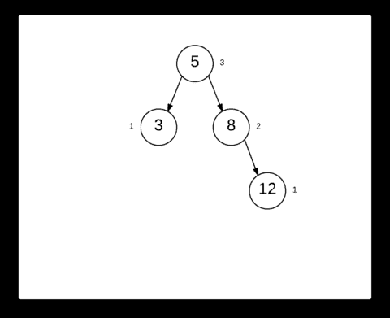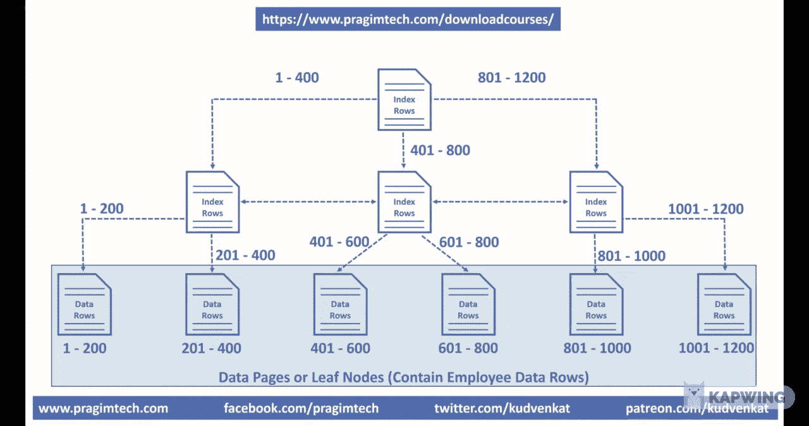

# Jenis-Jenis Index

Pada mySQL, index ada beberapa jenis. Akan kita bahas satu per satu. Sebagai contoh, kita akan menggunakan table *employee* dengan skema berikut:

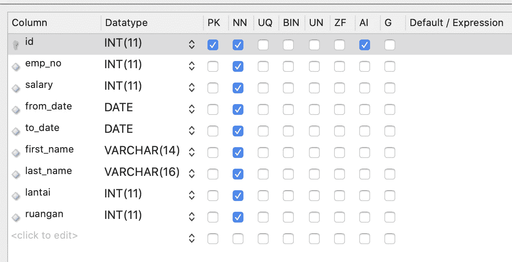

## Primary Index

Diambil dari dokumentasi resminya :

> Each `**InnoDB**` table has a special index called the clustered index that stores row data. Typically, the clustered index is synonymous with the primary key.

Sesuai dengan sebutannya, primary index adalah jenis `**index yang di buat menggunakan primary key pada table tersebut**.` Index ini akan di generate secara otomatis oleh system pada saat kita membuat table tersebut. Inilah yang membuat semua *query* yang menggunakan id pada where clause akan di eksekusi dengan sangat cepat.

Primary keys menggunakan `**clustered index**` **.** Disebut clustered karena actual row data disimpan bersamaan dengan keynya (disimpan pada *leaf* ). Jadi untuk read datanya pasti lebih cepat karena tidak perlu lagi get kemana-mana. Pada innoDB, clustered index merupakan si table itu sendiri, ini artinya si primary index adalah representasi dari si table itu sendiri. Karena inilah kita tidak bisa menghapus primary key index.

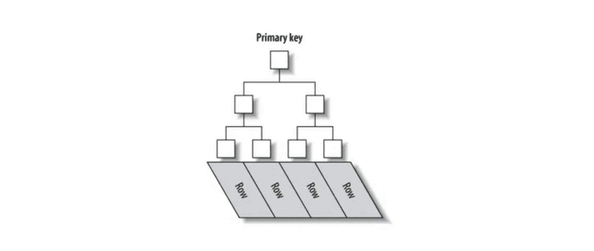

Karena setiap kali kita melakukan insert kedalam database, artinya kita melakukan insert kedalam primary index, hal inilah yang membuat disarankannya penggunaan integer auto increment pada primary key (bukan varchar), agar performa pada saat insert bisa cepat karena urutannya sudah pasti (auto increment).

Untuk table ini memiliki total data sebanyak : `**2.844.047 row**` sudah memakan size sekitar 200 MB.

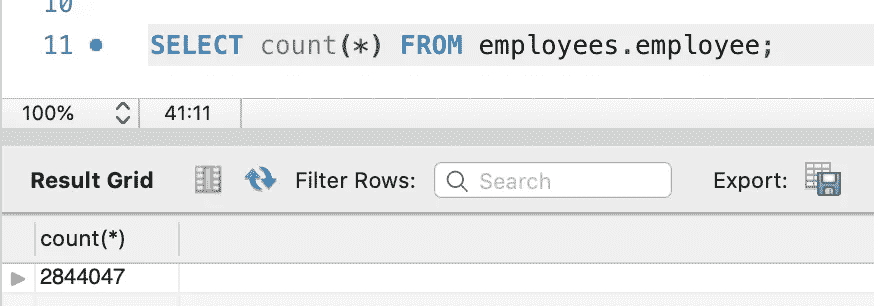

Jika kita melakukan query dengan menggunakan id pada where clausenya kita akan bisa mendapatkan hasil yang sangat cepat.

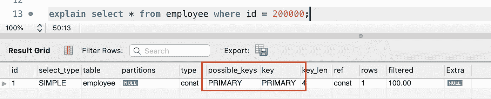

Perhatikan pada kotak merah, mySQL bisa mendeteksi dengan menggunakan query tersebut, index `**PRIMARY**` merupakan salah satu index yang available untuk digunakan dan pada saat eksekusinya, mySQL juga menggunakan index `**PRIMARY**` saat melakukan query. Dengan menggunakan index ini, mySQL tidak perlu melakukan pencarian terhadap 2jt data, hanya perlu mengevaluasi 1 row saja, sudah mendapatkan hasil yang diinginkan.

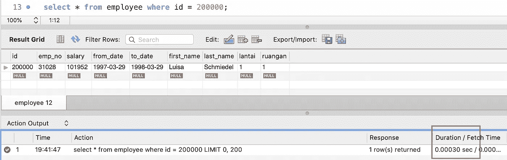

Dari sekitar 2jt row, mySQL bisa mengembalikan hasilnya dalam waktu 0.3ms saja.

## Secondary Index

Berbeda dengan primary index, secondary index adalah `**index yang harus dibuat secara manual**` . Index ini adalah semua index yang `**tidak menggunakan primary key sebagai key pada index nya**.`

Berbeda dengan primary index, secondary index tidak menyimpan row dari valuenya, tapi menyimpan si primary key pada leaf nya, dan menggunakan si primary key sebagai locator data nya.

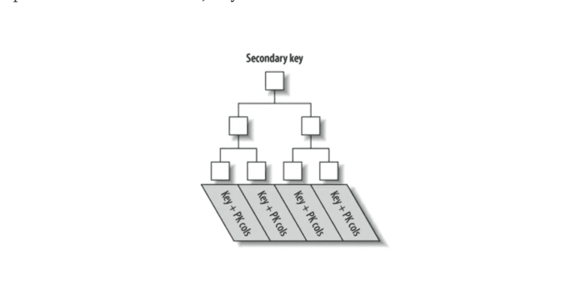

Ini akan menyebabkan kita butuh menduplikasi si primary key pada setiap secondary index. Karna duplikasi ini, maka sangat tidak disarankan kalau sebuah primary key itu varchar dan ukurannya besar, karna sudah pasti akan mempengaruhi storage si secondary index. Jadi jika melakukan akses data menggunakan secondary index, sebenarnya akan ada jump dari secondary index ke primary index dulu baru ke data aslinya.

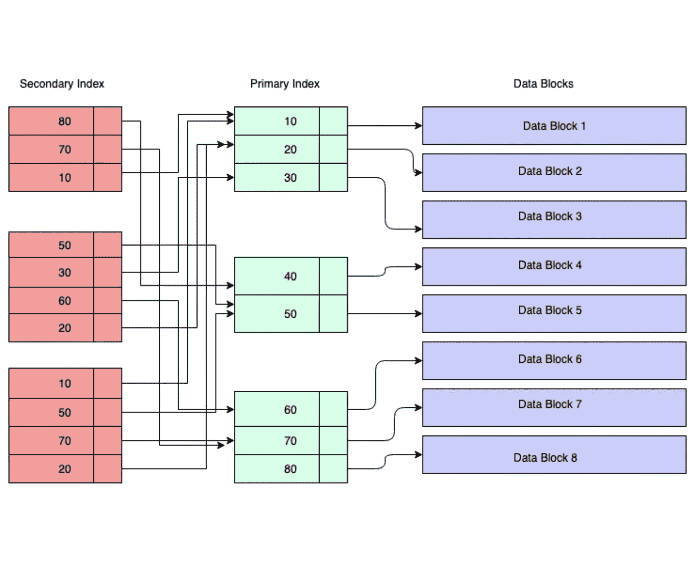

Biasanya index jenis ini digunakan karena adanya kebutuhan melakukan query secara terus menerus/cukup sering yang menggunakan spesifik column sebagai filternya. Misalnya query yang hanya menggunakan `**emp_no**` sebagai filternya karena kita ingin menampilkan data untuk 1 orang employee saja.
Maka butuh menambahkan `**emp_no**` pada where clause nya.

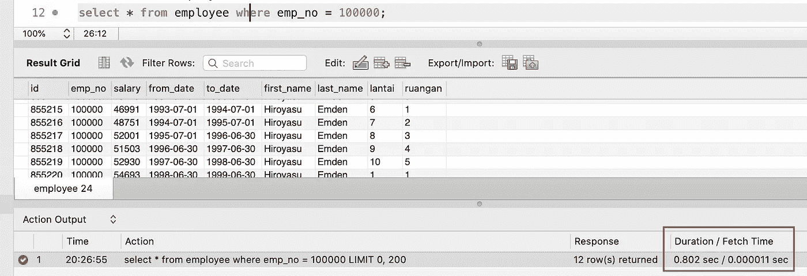

Saat kita mencari `**emp_no=100000,**` query time nya naik menjadi 802ms.

Karena query ini cukup sering digunakan pada aplikasi atau query secara manuan, kita butuh menambahkan index pada column `**emp_no**.` Untuk mempercepat query ini kita bisa menambahkan index baru pada column `**emp_no**` dengan query berikut:

```
ALTER TABLE `employees`.`employee` ADD INDEX `idx_emp_no` (`emp_no` ASC);
```

Setelah menambahkan index baru, lalu kita coba cek berapa storage yang dibutuhkan untuk 1 index yang baru kita tambahkan.

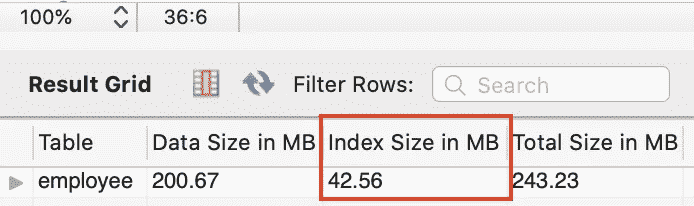

Untuk index yang baru saja kita buat memakan hampir 1/4 dari data aslinya. Sebagai catatan, pada (`emp_no` ASC), `**ASC**` ini menunjukkan bahwa data yang disimpan pada index sudah `**sorted secara ascending.**`

Itulah salah satu pertimbangan yang harus dipikirkan saat ingin membuat sebuah index baru. Karena cost nya yang cukup besar `,` penambahan index pada setiap column sangat tidak disarankan.

Setelah kita tambah lalu melakukan query ulang, kita akan mendapatkan hasil berikut.

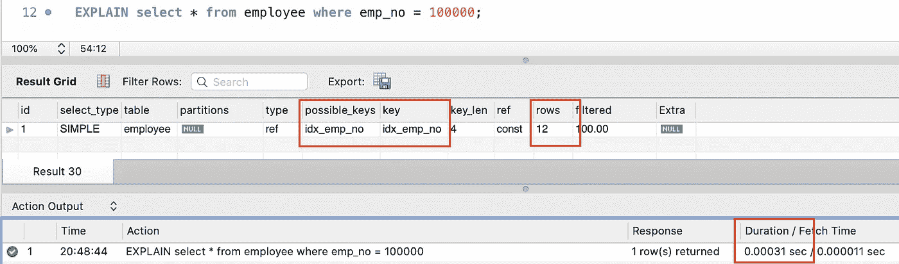

durasinya berubah dari `**0.802s**` menjadi `**0.000031sec(0.03ms).**`
Perlu diperhatikan juga pada bagian `**possible_keys**` dan `**key**` , index yang baru saja dibuat dipertimbangkan dan juga digunakan oleh mySQL saat melakukan query. Perlu diperhatikan juga pada bagian rows, mySQL hanya perlu melakukan pengecekan terhadap `**12 row**` saja, bukan lagi `**2jt rows**` untuk mendapatkan hasil yang diinginkan.

## Composite Index

Dibandingkan index lain, mungkin index ini adalah index yang paling sering digunakan. `**Index ini memperbolehkan kita menggunakan beberapa column sekaligus**` sebagai key (up to 16 keys). Index ini juga sering disebut sebagai ***Multi-column/Composite/Compound*** index.

Let’s say kita membuat sebuah index dengan kombinasi dari 4 column - `**col1**` , `**col2**` , `**col3**` , `**col4**` . Hal yang perlu diperhatikan adalah : `**urutan column pada index mempengaruhi bagaimana index menyimpan data dan mencari data**` . Dengan menggunakan composite index, kita bisa melakukan pencarian dengan index dengan where clause : `**col1**` , `(**col1**, **col2**)` , `(**col1**, **col2**, **col3**)` , `(**col1**, **col2**, **col3**, **col4**)` .

Kita boleh hanya menggunakan beberapa kolom saja pada index tersebut pada saat melakukan query, tapi syaratnya adalah, column yang ada pada urutan awal/sebelumnya pada waktu pembuatan index harus ikut digunakan. Misalnya jika ingin menggunakan index diatas, tapi hanya ingin menggunakan column `**col3**` pada where clause, kita harus menyertakan `**col1**` dan `**col2**` pada where clause agar index bisa digunakan. Jika ingin menggunakan `**col2**` saja, maka harus tetap menyertakan `**col1**` pada where clause agar index bisa digunakan.

Pada composite index, index key akan di construct berdasarkan gabungan dari column yang digunakan pada index tersebut. Misal index yang dibetuk dari gabungan `**(col1, col2, col3)**` akan membentuk key `**col1col2col3**.` Hal inilah yang menyebabkan `**pencarian menggunakan index ini harus selalu mengikut sertakan prefix urutan awal/sebelumnya dalam where clause nya.**`
Contoh jika melakukan pencarian pada : `**index(col1,col2)**`where col1 = “a” - > using index
where col2 = “b” - > not using index
where col1 = “a” and col2 = “b” - > using index

bisa diperhatikan bahwa untuk index (col1, col2), harus selalu menyertakan col1(prefix) dalam where clause nya agar index bisa mengenali karena key yang dibuat untuk index(col1,col2) adalah `**col1col2**` .

Jika kita callback lagi ke case kurir pada gedung di case sebelumnya, kita bisa membuat sebuah composite index untuk mempercepat query search yang sebelumnya :

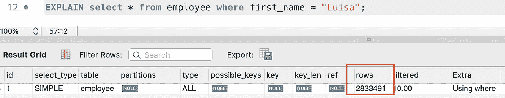

Kalau hanya menggunakan nama saja sebagai parameter, mySQL harus melakukan pencarian terhadap 2jt lebih resultset.

Pada tahap ini kita akan menambahkan index baru dengan kombinasi
lantai, ruangan. Harus diperhatikan bahwa `**lantai**` sebagai prefix `**harus selalu ada pada query**` agar index yang dibuat bisa digunakan.

```
ALTER TABLE `employees`.`employee` ADD INDEX `idx_lantai_ruangan` (`lantai` ASC, `ruangan` ASC);
```

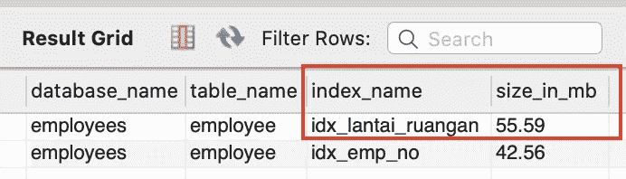

index yang baru dibuat ternyata memakan size yang lebih besar karna kita menggunakan gabungan lantai dan ruangan pada key nya.

Owh ya untuk menggenerate table diatas kalian bisa gunakan script berikut:

```
SELECT database_name, table_name, index_name,
ROUND(stat_value * @@innodb_page_size / 1024 / 1024, 2) size_in_mb
FROM mysql.innodb_index_stats
WHERE stat_name = ‘size’ AND index_name != ‘PRIMARY’
and table_name = “employee”
ORDER BY size_in_mb DESC;
```

Harus diperhatikan tentang cara kerja composite index adalah `**column yang digunakan akan di gabungkan lalu disimpan pada btree**.` Pada saat melakukan pencarian, `**parameter yang digunakan akan digabungkan dan dicocokkan untuk mencari data pada composite key pada index.**` Karena hal ini lah urutan parameter pada where clause akan mempengaruhi hasil pencarian.

Sekarang jika kita menambahkan `**lantai**` dan `**ruangan**` pada where clause, kita akan mempermudah si mySQL karena sudah memperkecil scope data yang harus di cari. Dari 2jt hanya sisa sekitar 500k saja.

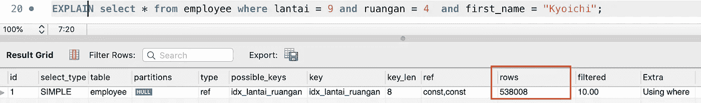

Untuk query diatas, mySQL masih memperbolehkan dan menggunakan `**idx_lantai_ruangan**` dalam pencariannya. Sedangkan jika menggunakan column yang sesuai dengan index yang sudah dibuat, misalnya querynya tidak sesuai dengan index seperti query dibawah, maka mySQL terpaksa melakukan full table scan lagi.

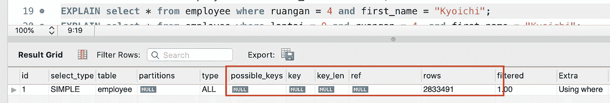

pada query tersebut, kita menggunakan parameter ruangan saja sebagai parameter di where clause diikutin first_name. Karena tidak sesuai urutan seperti pada urutan index pada saat dibuat, yang mana prefix lantai tidak digunakan, maka mySQL akan melakukan scan terhadap 2jt data. Tapi kalau query yang digunakan adalah `**lantai**` dan `**first_name**` maka index masih bisa dipakai karena masih mengikuti prefix dari index sebelumnya.

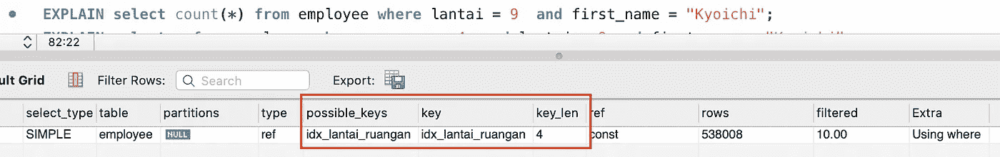

## Composite Index vs Multiple Secondary Index

Seletah melihat penggunaan composite index, ternyata fiturnya keren juga. Tapi ada batasan bahwa where clause nya harus sesuai dengan index yang digunakan. Cukup merepotkan memang. Kenapa tidak menggunakan secondary index aja? Buatin secondary index terhadap semua non primary column? hemm pertanyaan menarik.

Hal tersebut `**bisa dilakukan. Tetapi tidak boleh alias tidak disarankan.**` Tiap kali kita membuat sebuah index, sebenarnya costnya juga lumayan. Seperti yang ditunjukkan sebelumnya, 1 index bisa makan storage hampir 1/4 dari data table aslinya. Jangan sampai karena semua *query* ingin cepat, kita jadi membuat banyak index, yang jadinya bisa memakan storage berkali lipat dari ukuran table itu sendiri. Selain itu setiap kita melakukan operasi CRUD, si mySQL harus melakukan pengapdetan terhadap key ke semua index yang sudah ada.

## UNIQUE Key Index

Unique key index cukup berbeda dengan index yang lainnya. Index jenis ini digunakan untuk menjaga data integrity pada suatu table, dengan cara memastikan tidak ada data pada sebuah table yang dupicate entry, yang mengunakan satu atau beberapa non primary key column sebagai acuannya.

Misalnya pada table employee tadi, kita ingin memastikan kalau tidak boleh ada 1 `**emp_no**` dan `**from_date**` yang memiliki data yang sama. Yang artinya adalah tidak boleh ada employee yang mendapatkan gaji sebanyak 2 kali pada bulan yang sama. Maka kita bisa tambah index uniq berikut:

```
ALTER TABLE `employees`.`employee` 
ADD UNIQUE INDEX `uniq_emp_no_from_date` (`emp_no` ASC, `from_date` ASC);
```

Jadi jika ada yang ingin menambahkan row baru dengan menggunakan nomor `**emp_no**` dengan `**from_date**` yang sudah digunakan sebelumnya, system akan menolak karnena akan mendeteksinya sebagai duplicate entry.

# Index On Join Query

Untuk query dari satu table udah cukup jelas nih, kita bisa ngandalin si index buat speed up query execution timenya. Pertanyaannya untuk query yang ada joinannya gimana ?

Kalau query yang dilakukan membutuhkan join ke table lain, kita `**harus memastikan query tersebut menggunakan join column yang sudah di index supaya waktunya itu nggk lama.**` Kalau tanpa index mySQL bakalan butuh `**matching data satu persatu column joinan di table a dengan table joinan di table b.**` Misal pada table query berikut kita melakukan query dan menggunakan last_name sebagai join column, querynya pasti akan melakukan full table scan dan memakan waktu lama:

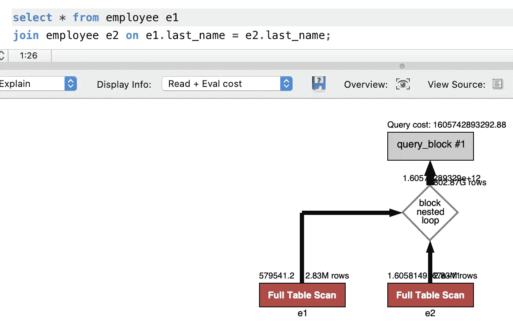

sedangkan kalau kita ganti join column menjadi id, querynya bakalan cepat dan index akan digunakan.

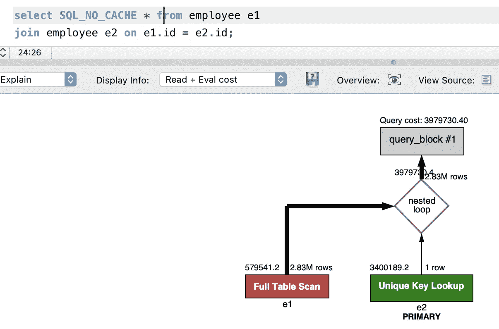

# Order, Limit & Grouping

Nah pertanyaannya, gimana nih kalau make order limit ama grouping ? Sama saja. `**Semuanya bakalan butuh index kalau mau proses lebih cepat**.` FYI, saat melakukan order, limit dan grouping, `**mySQL akan melakukan operasi tersebut setelah melakukan query.**` Namanya adalah `**File Sort.**` Sort yang dilakukan setelah query. `**Setelah melakukan fetch, data akan disimpan di buffer temp lalu di sort dan direturn hasilnya.**` Jadi saat melakukan `**limit**` **,** record yang di scan tetap aja banyak, lalu di limit setelah datanya di return.

Tapi kalau kalian melakukan operasi tersebut pada column yang sudah di index, hasilnya pasti lebih cepat daripada query yang biasanya

# Pros vs Cons

Setelah melakukan sedikit pembahasan diatas, kita bisa menyimpulkan beberapa pros dan cons yang akan kita dapatkan saat menggunakan index.

## Pros :

1.  Proses searching bisa jadi jauh lebih cepat.
2.  Penggunaan query yang harus menyesuaikan dengan index yang sudah ada
3.  Proses sorting, order dan grouping bisa menggunakan index
4.  Proses join bisa memanfaatkan index

## Cons :

1.  Cost mahal. Seperti yang dicontohkan sebelumnya satu index bisa memakan storage hampir 1/4 dari data aslinya. Makin banyak index, makin banyak data. Kalau storage untuk index sudah mendekati atau lebih besar dari data aslinya, mungkin harus dipertimbangkan untuk menggunakan search engine yang lain saja. Misalnya elasticsearch atau solr.
2.  Proses CRUD yang akan memakan waktu. Hal ini dikarenakan karena tiap proses tersebut memungkinkan pengupdetan pada tiap index.

# Points To Take

1.  Gunakan index dengan bijak karena jumlah index berbanding lurus dengan cost dan performance
2.  Lebih baik melakukan update pada existing index jika memungkinkan daripada harus membuat baru. Untuk menghindari cost storage tambahan.
3.  Selalu gunakan integer bukan varchar pada primary key, karena pengguanaan integer pada saat saat pencarian di index jauh lebih cepat dibandingkan varchar.
4.  Kalau sudah ada index pada column yang di cari, hasil dari query pada column itu sudah sorted. Tergantung dari indexnya apakah asc/desc
5.  Penggunaan query join yang benar akan mengurangi waktu pada pencarian.

Sekian yang bisa dibahas tentang index, sebenarnya masih banyak penjelasan yang sengaja di skip karena pembahasannya sudah cukup *advance* dan kurang cocok kalau di buat disini semua. Kalau rame mungkin kita coba buat.
Semoga bermanfaat. Skol.


# Reference:

1.  [Multiple-Column Indexes](https://dev.mysql.com/doc/refman/8.0/en/multiple-column-indexes.html)
2.  [Show Index](https://dev.mysql.com/doc/refman/8.0/en/show-index.html)
3.  [Create Index](https://dev.mysql.com/doc/refman/8.0/en/create-index.html)
4.  [An in-depth look at Database Indexing](https://www.freecodecamp.org/news/database-indexing-at-a-glance-bb50809d48bd/)
5.  [MySQL Indexing 101](https://stormanning.medium.com/mysql-indexing-101-660f3193dde1)