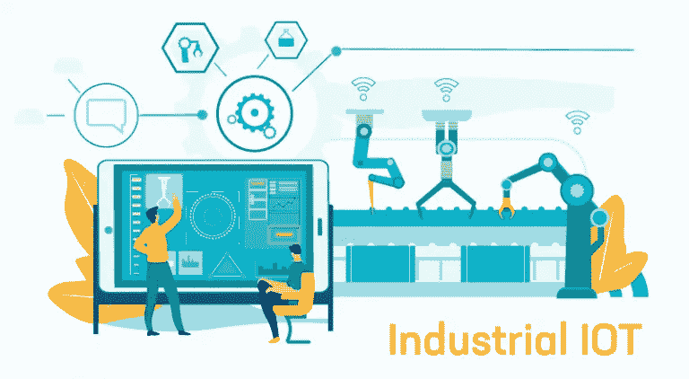

# 工业物联网(IIoT):更高的生产力。更高的投资回报率

> 原文：<https://medium.com/quick-code/industrial-iot-iiot-higher-productivity-higher-roi-94fe8ea15d6c?source=collection_archive---------1----------------------->

随着物联网(IoT)成为大多数组织的基石，我们周围的世界变得越来越智能，联系越来越紧密。

> Gartner 预测，到 2020 年，将会有更多的“互联物”。根据 Gartner 的数据，到 2021 年底，这个数字将超过 250 亿。(来源: [Gartner](https://www.gartner.com/en/newsroom/press-releases/2018-11-07-gartner-identifies-top-10-strategic-iot-technologies-and-trends) )

**利用物联网解决方案的一些顶级行业包括:-**

*   制造业
*   智能城市
*   卫生保健
*   运输
*   农业

虽然物联网正在扰乱许多行业，但制造业似乎是受益最大的行业之一。

> **根据** [**报告**](https://www.iottechnews.com/news/2019/jun/14/global-iot-spending-break-1-trillion-2023-fuelled-solid-consumer-and-commercial-adoption/) **显示，与其他行业相比，制造业在物联网开发上的投入最多。**

你知道原因吗？

这是因为，

物联网通过先进的传感器自动化、加速和简化制造流程，并为制造商提供实时信息。

制造业的 IoT 有了自己的概念；它有自己的名字:工业物联网。

工业物联网正在通过重新定义机器之间的交互方式来改变行业。

IIoT 是指物联网在工业领域和应用中的延伸和使用。许多人对 IIoT 和 IoT 感到困惑，因为它们都使用传感器来增强操作流程。

虽然看似相同，但它们在一般用法上是不同的。在了解它们的核心区别之前，我们先快速浏览一下工业物联网的基础知识。

# 什么是工业物联网？

工业物联网是一个用于描述机器对机器通信的术语，在机器对机器通信中，机器与其他机器、对象和基础设施进行交互，以产生数据。

通过使用数据分析和人工智能等技术，产生了大量数据，并对这些数据进行了处理和分析，从而产生了有意义的行动。它甚至利用智能传感器和执行器来改进制造过程并实时分析数据。

IIoT 的集成可以让行业更准确地了解他们的运营情况，并帮助他们更快、更准确地做出决策。

一些顶级公司，如 IBM Corporation、Intel、Schneider Electric SE、General Electric Company、Emerson Electric 等，正在实施工业物联网来改善和优化他们的业务运营。

有了上面的定义和解释，你可能已经有了工业物联网的大致思路。

但是它与物联网有什么不同呢？让我们找出它。

# 物联网与物联网:它们有什么不同？

*   IIoT 通常用于工业目的，如制造、供应链监控和管理系统，而 IoT 通常用于消费者使用，并依靠移动设备连接智能家居设备、智能汽车等。
*   物联网专注于个人的便利，如日常家庭流程自动化，而 IIoT 专注于运营的效率、监控和安全性。
*   由于 IIoT 是为处理关键机器而开发的，它使用精确的传感器、先进的控制和位置感知技术来跟踪操作。而物联网应用不需要大量的传感器；只有基本的可以跟踪和自动化的任务。
*   在 IIoT 中，机器故障和故障会造成紧急情况，而另一方面，IoT 在故障发生时具有低风险影响，不会造成紧急情况。

上述差异肯定会消除这两个术语之间的混淆。

为了给智能机器供电，IIoT 使用了可扩展的技术堆栈来优化机器的流程。

# 工业物联网(IIoT)背后使用了哪些技术？

IIoT 包括如下技术:

*   **信息物理系统**:集成计算、网络和其他物理过程。
*   **云计算**:按需提供计算机系统并负责数据存储
*   **边缘计算**:在网络边缘而非中央服务器处理数据。
*   **大数据**:捕获、管理和处理数据
*   **传感器**:检测并响应光信号的装置

# IIoT 的架构是什么样子的？它是如何工作的？

**IIoT 通常被认为是分层的模块化架构，其中:**

*   **设备层**位于堆栈的底部，通常由硬件组成，如 CPU、传感器或机器。
*   **网络层**由物理网络总线、云计算、wifi、聚合和传输数据到服务层的通信协议组成。
*   **服务层**由分析数据并将其转换为信息的应用程序组成。
*   **内容层**是堆栈的最顶层，由屏幕、平板电脑和智能眼镜等用户界面设备组成。

## 上述架构是如何工作的？

部署在物理层的传感器、致动器、控制器和其他硬件向边缘网关或物联网网关发送数据。

这些网关接收信息并将其传输到云应用服务器，在那里对数据进行处理和分析，并将进一步的数据发送到各种应用程序，以便进行更好的决策过程。

报告、分析、规划等高级应用程序。可通过智能手机访问，并为客户提供清晰的见解。

## 使用 IIoT 有什么好处？

IIoT 提高了生产率、效率、决策能力，降低了成本，并为组织提供了实时信息和运营优势。

**一些好处是:**

*   **减少机器停机时间**

当想到 IIOT 最明显的好处时，即兴表演机器故障排在首位。

制造业中很可能会发生计划外停机/机器故障，这会降低他们的整体生产力、客户服务，并影响整个业务。

***过去三年中，82%的公司都经历过计划外停机，这给公司造成了高达每小时 26 万美元的损失。***

如果制造业投资工业物联网(IIoT)，他们可以获得关于资产和生产流程的实时信息。

部署在每个点的专用传感器跟踪单个设备的所有参数，并获得整个操作的粒度可见性。实时机器数据的可用性使制造商能够对机器故障做出反应。

*   **轻松跟踪和监控商品**

追踪是工业物联网的另一个好处。制造商可以通过在产品和包装中使用物联网传感器，了解客户处理产品的方式。

供应商、制造商和客户可以使用智能跟踪工具来跟踪可能在运输过程中损坏的货物，跟踪整个供应链的位置、状态和条件。实时洞察可以帮助管理人员了解商品是否受损或存在风险，并可以立即采取措施进行修复。

*   **提供基于条件的警报**

部署在制造设备内部的传感器会根据特定条件(如特定温度或最小/最大振动范围)触发警报。

每当设备偏离其规定参数时，主动监控机器的物联网传感器就会发出警报。该警报有助于制造商节约能源，提高运行效率，并确保机器在其指定参数下运行。

*   **最大限度减少人为错误**

涉及人工操作时，很可能出现人为错误。这不仅会导致麻烦，还会导致严重的问题，如利润损失或任何紧急情况。

IIoT 应用可以减少和防止库存管理、运营管理和生产流程中的错误。有了 IIoT 应用，任务是自动化的，人工干预更少；公司可以提高质量，监控整个供应链的事件，并跟踪全球的库存。

# 国际劳工组织的关切

*   **连通性挑战**

如果您计划实施 IIoT 技术，您可能需要不间断的连接，而 100%的互联网连接很难实现。由于维护或其他原因，连接可能会在某个时间点丢失。企业需要确保使用升级的电缆和系统，以便不存在连接问题。

*   **安全**

[Gartner](https://www.gartner.com/imagesrv/books/iot/iotEbook_digital.pdf) 估计，到 2020 年，超过 25%的已确认企业攻击将涉及物联网连接系统，尽管其仅占不到 10%的 IT 安全预算。

安全挑战是最大的问题之一。连接到 IIoT 的每个新设备或组件都会增加安全风险。当公司实施各种 IIoT 解决方案时，它们容易受到漏洞、内部威胁和其他安全问题的影响。因此，企业必须抑制 IIoT 的想法

*   **数据存储**

企业面临的主要挑战之一是数据存储。如今，大多数公司使用技术来预测数据，而这些数据依赖于过去的活动。

工业物联网有助于收集大量数据，这些数据有助于预测未来的业务，但在使用 IIoT 之前，有必要使用数据的安全存储。

尽管存在一些问题，但实施 IIoT 肯定有助于简化业务运营。

IIoT 可用于各种领域。让我们看看在哪里:

# IIoT 应用

*   设备管理
*   生产流程监控
*   存货管理
*   物流和供应链优化
*   工业自动化
*   智能机器人
*   自动驾驶汽车
*   动力管理
*   智能城市应用
*   智能养殖和牲畜监控
*   能耗优化

然而，这个列表是无限的。但以上都是工业物联网的一些基础应用。

## 工业物联网是未来之路吗？

每个行业都希望跟随技术趋势并实施现代技术来简化其工作流程，工业物联网就是其中之一。

> **全球工业物联网网关市场** [**预测**](https://www.researchandmarkets.com/reports/4659396/global-industrial-iot-gateway-market-2019-2023) **在 2019 年至 2023 年期间将以 13.64%的复合年增长率(CAGR)增长。**

看着上面的统计数据，似乎拥抱工业物联网的企业将产生效率，改善运营，并提高产品质量。

你有什么想法？您是否计划为您的企业实施工业物联网？

**注**:这篇文章之前发表在我们的博客 [*这里*](https://www.spec-india.com/blog/industrial-iot-iiot/)