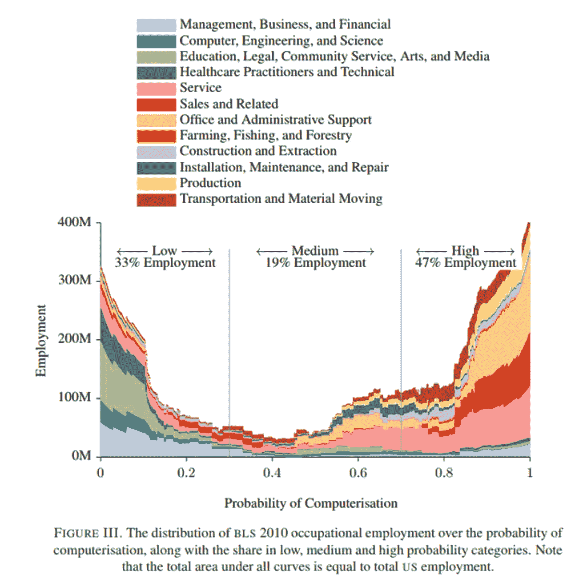
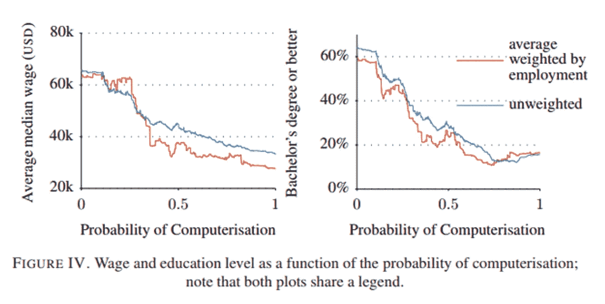

# 工业 4.0——由此带来的不利劳动力市场

> 原文：<https://medium.com/globant/industry-4-0-the-adverse-labor-market-because-of-it-105c9e21011f?source=collection_archive---------0----------------------->

在我不同的本科、专业或硕士学位课程的学术培训中，我遇到了一个反复出现的主题，它以一种相当臭名昭著和持续的方式产生差异和关注。这是对信息技术(或一般技术)对劳动力市场产生的威胁的恐惧，劳动力市场总是在变化中。

> 从几十年前开始(对于我们这些见证了它的人来说)，计算机摧毁打字机产生的工作的幽灵仍然存在，一方面，今天作为一个期望的场景，另一方面作为一个不期望的场景，称为工业 4.0；而且它似乎没有清楚地表明即将到来的事情对许多工作来说是有利的还是不利的。

今天有几篇文章讨论了这个话题，但是驱使我贡献我的观点的是，在许多情况下，这个话题是阴险的，并且以一种消极的方式表现了所期望的；当然，谁会认为像技术夺走工作这样的事实可以被视为一件积极的事情呢？…从我的角度来看，在许多情况下，的确如此。我想解释一下。

# 什么是工业 4.0？

工业 4.0 或第四次工业革命一词包括通过整合不同的技术或技巧，如沿整个链条的系统大规模集成，努力实现公司价值链的完全数字化；数据分析、物联网互联设备的使用、人工智能等。

该行业中这种新模式所包含的变化如下:

1.  **信息和通信技术在制造业和服务业中的整合:**
    流程自动化、更少的人工干预、系统、执行器、传感器和自动化设备的广泛使用正越来越多地在公司中实施。这有减少工作数量的直接影响。
2.  **制造企业转型为拥有强大 IT 背景的企业**
    现在，到处都需要信息技术领域……这与这样一个事实有关，例如，现在即使是厨房设备也可以拥有一个用户界面，为用户提供有价值的信息。机动车辆也不例外。50 年前，谁会想到汽车燃烧系统会需要一台计算机。或者该计算机随后也将控制车辆的制动、牵引、稳定性或悬挂；或者它最终会自己驾驶汽车？软件程序现在处于前所未有的环境中，不仅在不同的行业中必不可少，而且经常是不可或缺的。
3.  **新范式和新技术:**
    如今，营销流程包括社交网络分析。因为许多人在那里呆了很长时间。它已经成为一种社会范式，公司现在投资数百万，每个人都想在那里。这导致了人工智能等不同技术的创造和使用。
4.  **新的数字文化和生态系统:** 电子竞技、意见领袖和数字内容创作者；他们是新文化的成员，是已经成为我们生活一部分的生态系统的参与者。

# 让我们害怕的不利数据

这方面相当有代表性的研究显示了我们担心的数据。

牛津大学教授弗雷和奥斯本在他们的研究 ***“就业的未来:工作对计算机化有多敏感？”***([https://www . Oxford Martin . ox . AC . uk/downloads/academic/The _ Future _ of _ employment . pdf？link=mktw](https://www.oxfordmartin.ox.ac.uk/downloads/academic/The_Future_of_Employment.pdf?link=mktw) )展示了一个非常消极的未来(至少对美国劳动力市场而言)，美国 47%的工作岗位将在未来 25 年消失。

这项研究确实表明，这部分工作面临着被自动化的高风险；很大一部分模特、电话销售员、收银员、渔民等都会受到影响。虽然这可能是真的，但研究也显示(如附图所示),学术培训水平和收入水平与此相反。

换句话说，一个人的教育或学术专业化程度越高，这种情况发生的可能性就越小。这是该分析中的一个重要补充，因为它最终定义了尽管这些工作中有 47%存在潜在风险，但正是那些不太专业且需要基本知识水平的工作被要求从劳动力供应中移除，因为它们很容易自动化。这似乎证实了我们许多人所理解的技术出现的好处而不是坏处，因为这是一种有助于促进和加强工作活动的工具，而不是取消它。那些在培训中不挑战自己的人或那些抛开学术专业的人受到的影响最大。

在这种背景下，许多工作将停止接听电话，例如，技术将为他们(那些寻求专业化的人)创造机会，分析由自动语音应答人工智能系统服务的客户的行为。技术将成为使能因素，允许现在就战略性地参与解决方案，而不是以运营方式参与，从而为公司创造更多价值。从这个角度来看，技术不会夺走工作；这将改善和增强他们的能力；改造他们。这将使向专业化的飞跃成为可能。

同样的事情最终发生在打字机和计算机的最初例子上。计算及其各种衍生产品和服务现在是一个数十亿美元的产业。可能许多从事打字机相关职业的人受到了伤害；但我认为，如果我们从长远的角度来看，今天的平衡远不止是积极的。

所以，如果你愿意，你可以说，技术在不同行业的参与不一定是对劳动力市场的威胁，而是一个巨大的潜在机会。答案是远离对变化的天生恐惧，当然，去适应；要专业化。

至少对我来说，这就是进步。