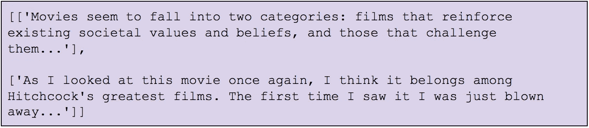
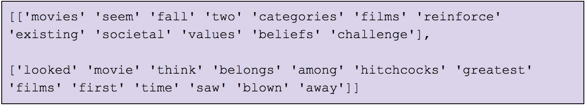
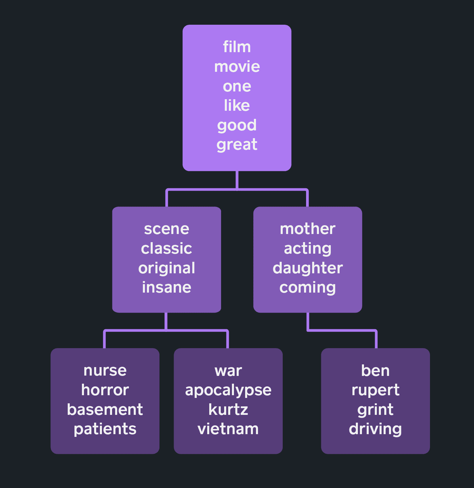
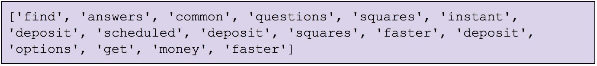
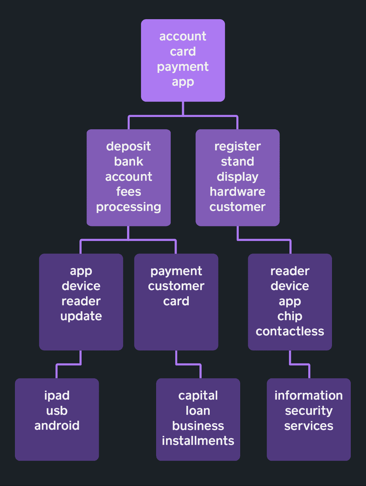
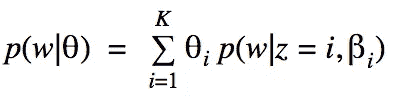

# 用 hLDA 推断标签层次结构

> 原文：<https://medium.com/square-corner-blog/inferring-label-hierarchies-with-hlda-2093d0413337?source=collection_archive---------1----------------------->

注意，我们已经行动了！如果您想继续了解 Square 的最新技术内容，请访问我们的新家[https://developer.squareup.com/blog](https://developer.squareup.com/blog)

## 问题:组织广场支持中心文章

在 Square，我们让业务快速启动并运行。我们还努力确保卖家的问题得到快速回答。当 Square 卖家遇到 Square 产品的问题时，第一道防线是 Square 的支持中心，该中心有数百篇文章可以帮助卖家找到他们问题的答案。

Square 的内容团队定期向支持中心添加文章。这套文章到目前为止一直是有机增长的；它们是根据卖家的需要编写和出版的，因此，它们没有任何特定的层次结构*先验*。

现在我们有数百篇文章涵盖了 Square 产品的所有主题，我们想知道是否有一种快速的方法来按主题组织和标记它们，以便我们可以跟踪文章组如何帮助卖家找到他们问题的答案。比如所有和广场资本有关的文章有多大帮助？如果我们能在小组层面上理解文章的表现，我们就能找出哪些主题的内容应该重点改进。

虽然支持中心有一些结构(如 Square Support 主页上的“[热门话题](https://squareup.com/help/us/en/)”下所示)，但组织和标记文章是一个手动过程。考虑到我们的库一直在变化，如果有一种自动化的方式来处理标签就好了。

我们决定给*主题建模*一个快速的尝试，看看我们能否找到支持中心文档之间的共性，让我们能够以一种明智的方式对它们进行分组和标记。

## hLDA:一种按主题层次对文档进行分组的模型

主题建模最常用的技术之一是潜在狄利克雷分配(LDA ),它是一种生成模型，将各个文档表示为主题的混合，其中文档中的每个单词都是由某个主题生成的。然而，LDA 有一些限制。必须事先选择主题的数量*，并且假设所有主题都具有扁平的层次结构。我们可以想象一个场景，让一个无监督的模型推断出主题的层次结构是很有用的。例如，我们可能希望将所有关于 Square 硬件的文章分组，然后在该组中，根据它们是关于磁条读卡器、芯片/非接触式读卡器、Square 寄存器还是其他 Square 硬件来组织文章。*

*[*分层 LDA*](http://www.cs.columbia.edu/~blei/papers/BleiGriffithsJordanTenenbaum2003.pdf) (hLDA)模型扩展了 LDA，以从文档语料库中推断主题的分层结构。我们有兴趣看看是否可以使用这种技术来自动组织 Square 的支持中心文章。*

*hLDA 使我们有可能假设我们的主题以树状结构排列，其中树有 *L* 级，每个节点是一个主题。对于 LDA，我们使用具有 *K* 随机混合比例的混合模型来选择主题(其中 *K* 是可能主题的数量)，由 K 维向量θ表示。使用 hLDA，我们在 *L* 级树中选择从根到叶的路径，从 L 维的 Dirichlet 分布中选择主题比例的向量θ，然后使用从根到叶的主题混合来生成组成每个文档的单词，使用混合比例θ。*

*这种方法的一个问题是，即使我们在 *L* 固定了树级别的数量，也有许多可能的树结构可供我们选择，因为我们没有在树的任何级别固定分支因子(每个节点的子节点数量)。不必先验地确定整个树结构*而代之以从数据中学习结构将是很好的。选择树形结构的一种方法是，在数据输入模型时，使用所谓的嵌套中餐馆流程(nCRP)建立一个层次结构。这是 [*中餐厅流程*](https://works.bepress.com/jim_pitman/1/) (CRP)的延伸；我们不会在这里详细讨论，但是当混合模型中混合成分的数量不确定时，CRP 是有用的。**

## *将 hLDA 应用于小数据集*

*我们用 IMDb [大型电影评论数据集](http://ai.stanford.edu/~amaas/data/sentiment/)的子集尝试了 hLDA，看看它是否给出了我们可能预期的结果。我们收集了 1000 条积极的电影评论，并使用 hLDA 的现有 [Python 实现](https://github.com/joewandy/hlda)对它们进行了分类。*

*我们的原始数据示例如下:*

**

*我们删除了停用词并进行标记，这样数据就变成了:*

**

*运行 hLDA 得到了以下(部分)结果:*

**

*Figure 1\. A sample of the representative words for a subset of nodes in a label tree that was learned via hLDA using positive IMDb movie reviews*

*我们的树的根包括像“电影”、“电影”和“伟大”这样的通用词，这似乎是一个合理的结果。通过检查根以下级别的两个节点中的单词，我们看到它们可能表明体裁上的分歧(“经典”和“疯狂”对“母亲”和“女儿”)。当我们重新检查我们现在标记的数据集时，我们看到至少有一篇关于“护士雪莉”(1978 年的恐怖电影)、“现代启示录”(关于越战的经典电影)和“驾驶课程”(鲁伯特·格林特主演的成人故事)的评论分别被分配到左边、中间和最右边。我们的模型的结果似乎有直观的意义。*

## *hLDA 在方形支撑件中的应用*

*然后，我们在 Square Support Center 文档集上运行该算法。*

*删除停用词和数字，然后进行标记，[这篇关于存款选项](https://squareup.com/help/us/en/article/5440-deposit-options-faqs) s 的常见问题解答文章变成了一篇文档，其中前几个词看起来像:*

**

*我们获得了一个分层的主题结构。我们举例说明了下面层次结构中的一小部分主题:*

**

*Figure 2\. A sample of the representative words for a subset of nodes in a label tree that was learned via hLDA using the Square Support Center corpus.*

*正如我们所料，涉及 Square 一般用途的单词，如*账户、*支付、*卡*，是我们根话题的代表。该算法已经发现了反映在树中的 Square 生态系统的一些不同方面。*

*我们还可以看到标签结构的整个从根到叶的路径，这有助于我们理解为什么某些文章会被分组到树上单独的叶子中，即使它们有相似的关键字。我们可以在树中看到两组硬件相关的主题——一组具有代表性的术语 *ipad、usb、*和 *android* ，另一组具有术语*信息、安全、*和*服务*。在它们的根到叶路径中，这些主题共享类似于*阅读器*和*设备*的术语，但是我们期望 *ipad、usb、*和 *android* 主题也与*更新*相关。[兼容方形非接触式和芯片式读卡器的设备](https://squareup.com/help/us/en/article/5584-devices-compatible-with-square-contactless-and-chip-card-reader) 在此主题之内。本文描述了哪些设备与 Square Stand 兼容，并建议安装 iOS 和 Square 应用程序的更新版本。同时，最右边的主题(如上所述)与硬件有关，但也与安全性有关；[隐私与安全](https://squareup.com/help/us/en/article/3796-privacy-and-security)和[安全数据加密](https://squareup.com/help/us/en/article/3797-secure-data-encryption)文章可以在这一页中找到。因此，即使一组文章共享几个关键词，拥有一个主题层次结构可以让我们以一种逻辑的方式将文章组彼此分开；在某种程度上，我们甚至可以通过沿着树根到树叶的路径来追踪模型用来分离文章的逻辑。*

*虽然上面的主题路径似乎是合理的，但我们也看到了数量惊人的没有多大意义的模型结果。例如，[编辑您的送货地址](https://squareup.com/help/us/en/article/3862-edit-your-shipping-address)与[方形发票的最佳实践](https://squareup.com/help/us/en/article/5749-best-practices-for-square-invoices)放在一起，而[更新您的纳税人识别号](https://squareup.com/help/us/en/article/5380-update-your-taxpayer-identification-number)与[存款选项常见问题](https://squareup.com/help/us/en/article/5440-deposit-options-faqs)放在一起。事实上，通过对模型输出的快速手动检查，我们看到该模型有大量错误的分类，并且肯定不能开箱即用。我们还看到，主题树可以从一个模型运行到下一个模型运行发生巨大的变化。*

*那么，hLDA 如何对我们有用呢？通过运行模型，我们可以使用它来开始注释我们的文章，然后与内容专家一起调整注释，直到它们符合我们自己对树应该是什么样子的预期。以我们支持中心的规模(几百篇文章)，这不是一个不合理的任务。*

## *分层主题建模:一些经验教训*

*从 Square 的支持中心数据中，我们可以看到 hLDA 在高层次上对文章进行了分类，但就其本身而言，它并不具备我们实际实现所需的准确性。我们可能会从构建第一轮模型中获得最大的投资回报，然后要求内容专家调整模型结果，直到我们有一个合理的标记文章层次结构。在构建该模型的过程中，我们提出了一些我们认为在考虑使用无监督模型来解决文档分类问题时会有用的一般性问题。*

***我们运行这种模式的目的是什么？在使用像 hLDA 这样的无监督学习技术对语料库中的文本进行分类之前，我们应该事先知道我们打算如何使用这些结果。假设我们想要使用来自 hLDA 的主题标签来可视化我们的语料库。或者说，我们希望使用主题作为监督学习模型的输入特征。在这些情况下，开箱即用运行 hLDA 可能就足够了。或者，假设我们想对大量文档进行一次分类，然后在可预见的将来使用该分类。并且说我们对我们的树结构应该是什么样子有一个强烈的先入之见。在这种情况下，我们可以使用 hLDA 首先在数据集中发现主题，然后请人类内容专家调整结果。***

*与手动标记相比，构建模型的投资回报率是多少？我们不会通过开箱即用运行无监督的 ML 算法来获得完美的结果。但我们也不想让内容专家从零开始手动标记数百篇文章。我们应该如何平衡花费在建模上的时间和花费在手工标记上的时间？这因用例而异，但一个明智的开始是运行一个快速的 hLDA 来启动我们的语料库组织，然后请内容专家构建这些结果。如果一天的建模可以节省一到两周的手工标记，那么我们已经在建模工作上取得了可观的 ROI。*

***层次聚类对我的语料库有意义吗？** hLDA 很复杂，只有在以下情况下才真正值得做:1)有理由相信数据集中存在潜在的层次结构，2)该层次结构可以以某种方式*使用*。即使是开箱即用的模型运行也需要开发人员的工作；有一些超参数需要优化，用户需要事先指定层次结构的深度。还要考虑语料库的结构:在我们的 IMDb 例子中，描述不同电影的词汇差异很大，我们的模型很容易挑出单部电影。然而，对于 Square 支持中心的文章，主题树会因运行而异。这表明 Square 的支持中心语料库不像 IMDb 电影评论那样模块化，我们可能需要依赖内容专家进行最终注释。*

## *使用标签层次结构*

*通过将 hLDA 应用于我们的支持中心数据，我们获得了对支持中心层次结构的估计，如果我们选择，我们可以通过人工重组和注释来改进。*

*一旦我们有了高质量的注释集，我们就可以用它们来回答许多关于数据集的有趣问题。我们的支持中心内的某些主题是代表过多还是代表不足(就文章数量而言)？某个主题的页面浏览量是否远远超过其他主题——也许这意味着我们需要我们的内容团队在未来额外关注这个主题？*

*假设我们想要预测某篇特定支持中心文章在下个月的页面浏览量。除了文本特征之外，我们还可以包括分类特征，指示文章属于哪个主题(在层次结构中的每一层)。*

*无论我们是使用 hLDA 来启动注释流程，还是手动完成所有标记，我们的支持中心文章上的注释都可以支持我们当前跟踪支持中心文章的工作，目标是确保支持中心尽可能快速有效地让 Square sellers 找到他们的答案。*

## *附录:LDA 简介*

*[LDA](https://www-cs.stanford.edu/people/ang/papers/jair03-lda.pdf) 的具体细节已经在[涵盖](http://brooksandrew.github.io/simpleblog/articles/latent-dirichlet-allocation-under-the-hood/)T4 井[其他地方](https://tedunderwood.com/2012/04/07/topic-modeling-made-just-simple-enough/)介绍过了，但是总的想法是存在一个未被注意到的主题集合，每个主题都频繁使用一小组单词。LDA 范式假设每个可观察的文档都由这些不可观察的主题组成。*

*LDA 将每个文档建模为以一定的概率从每个主题中抽取单词来创建。在学习阶段，它试图确定使用了哪些主题来生成文档。*

*更具体地说，我们可以假设我们有一个由文档语料库组成的数据集，其中每个文档是来自一组词汇的一组单词。我们还可以假设我们有一组单词分布(主题)，并且每个文档都是通过具有随机混合比例的混合模型生成的。如这里[所介绍的](http://www.cs.columbia.edu/~blei/papers/BleiGriffithsJordanTenenbaum2003.pdf)，任何单个单词的混合分布都可以用以下公式来描述*

**

*其中 *p* 是在给定 K 维向量θ的情况下画出单词 *w* 的概率，该向量表示特定于文档的随机混合比例， *z* 是对于 *z* 的每个值具有不同主题分布的多项式变量，β是一个矩阵(现在视为固定的)，其中β *ij* 表示特定单词 w *i* 在特定主题 z *内的概率当分布 p(θ|⍺)(其中⍺是全局参数)被选择为狄利克雷分布时，那么我们有效地运行 LDA 模型。**

*如前所述，LDA 有一些约束；主题的数量需要事先选择，我们在组内没有等级观念。对于我们使用 IMDb 电影评论构建的 hLDA 示例，可以认为根节点下面的层构成了一组“流派”组，每个叶子可能大致对应于一部特定的电影。LDA 可以按电影对评论进行分组，但我们丢失了类型分组。*

## *参考*

*布莱博士，Ng，A. Y .，&乔丹，M. I. (2003 年)。潜在狄利克雷分配。*机器学习研究杂志*， *3* (一月)，993–1022。*

*Frigyik，文学学士，Kapila，a .，& Gupta，M. R. (2010 年)。狄利克雷分布及相关过程介绍。*华盛顿大学电气工程系，u weetr-2010–0006*。*

*格里菲斯、T. L .、乔丹、M. I .、特南鲍姆、J. B .、布雷、D. M. (2004 年)。层次话题模型和嵌套中餐馆过程。在*神经信息处理系统的进展*(第 17-24 页)。*

*(2011 年 6 月)。学习用于情感分析的词向量。在*计算语言学协会第 49 届年会会议录:人类语言技术-第 1 卷*(第 142-150 页)。计算语言学协会。*

*皮特曼，J. (2002 年)。*组合随机过程*。加州大学伯克利分校统计系第 621 号技术报告，2002 年。圣面粉课程讲义。*

## *脚注*

*(1)CRP 与狄利克雷过程相关，因为 CRP 是一种特定的随机过程，而狄利克雷过程是一种随机过程，其中每个观察值是一个概率分布。CRP 可用于*构建*一个狄利克雷过程样本。[狄利克雷分布和相关过程简介](http://mayagupta.org/publications/FrigyikKapilaGuptaIntroToDirichlet.pdf)的第 5.1 节对此进行了详细描述。*