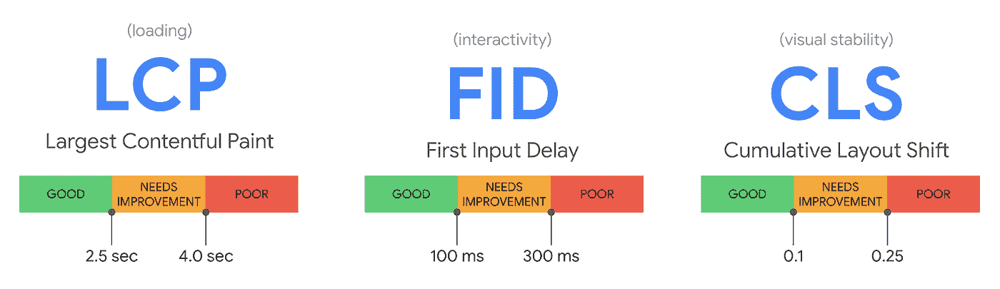

# 影响你 2021 年及以后的搜索引擎优化策略

> 原文：<https://medium.com/globant/influence-your-seo-strategy-for-2021-beyond-28ba291bd88f?source=collection_archive---------1----------------------->

SEO 专业人员的角色已经发生了巨大的变化，从一个能够在网站开发后实施他们的技能的人，变成了一个从网站构思开始，SEO 就发挥主要作用的人。

这篇文章包含了 SEO 中一些最被低估，甚至被忽视的实践的精髓，大多数专业人士现在必须考虑这些实践来提升他们的服务和结果。

**以下是你可以影响 2021 年及以后的 SEO 策略的五大方法。**

1.  **用户体验(UX)优化:**将 UX 视为任何 SEO 策略的重要组成部分。UX 设计将通过用户参与度指标直接影响你的 SEO 排名。通过花时间改进你的 UX 设计，你还会看到 SEO 排名的提高，品牌可信度的增加，以及更好的受众保留。

下图显示了谷歌测试你网站的[核心指标](https://developers.google.com/search/blog/2020/05/evaluating-page-experience):

[Core Vitals](https://developers.google.com/search/blog/2020/05/evaluating-page-experience) by Google

1.  最大含量涂料(LCP)
2.  第一输入延迟(FID)，以及
3.  累积布局偏移(CLS)

从技术的角度来看，你必须知道这些因素有助于网站的性能。

**2。语音搜索策略:**根据[NPR 和爱迪生研究公司的智能音频报告](https://www.nationalpublicmedia.com/uploads/2020/04/The-Smart-Audio-Report_Spring-2020.pdf)，6000 万(24%)美国成年人在家中拥有一个智能扬声器。

人们使用他们的数字助理——无论是手机还是台式机——或者语音助理设备进行搜索，就像他们在谷歌搜索栏中输入一样。

语音技术在以下领域占据主导地位:

*   语音搜索
*   声音制作
*   应用程序中的语音集成

语音战略是一个完全不用动手的选择，SEO 专业人士最好的开始方式是问:**你的品牌的内容如何能在语音搜索中显示出来？**

**3。优化可访问性:**作为一名 SEO 专业人员，优先确保你的品牌和内容对所有连接到数字世界的人都是可访问和可用的。不要让开发人员和设计人员对可访问性负责。残疾人也是消费者。这是一个很好的方法，通过服务一个你的大多数竞争对手可能会忽略的社区来主宰你的利基市场。众所周知，易访问性可以增加流量、销售额并降低跳出率。

作为一名 SEO 专业人员，你还需要了解关于可访问性的法律法规。例如，[欧洲无障碍法案](https://ec.europa.eu/social/main.jsp?catId=1202)于 2019 年出台。该法案涵盖计算机和操作系统、智能手机和电子商务平台等产品和服务。

易访问的网站有助于所有用户:

*   轻松浏览网站。
*   改善他们的体验。
*   找到他们正在寻找的信息。

德雀在 2020 年 3 月和 2020 年 4 月进行了调查。他们报告说 [62%](https://www.deque.com/covid-19-digital-accessibility-report/) 接受调查的无障碍从业者提到“新冠肺炎已经提高了无障碍对数字渠道的认识和影响。”

**4。关键词上的上下文——特色片段:**长格式内容或更好地称为基石内容被分解成逻辑子部分，以引人注目的图像为特色。即使你不相信基石内容在 SERPs 中受到任何特殊对待，长篇内容也能帮助你在一篇文章中涵盖更多相关的问题。

以下类型的搜索查询最常以特色片段的形式获得特色结果:

*   DIY 流程
*   健康
*   金融的
*   数学的
*   要求
*   状态
*   过渡期的

图像、视频、本地信息和购物相关的搜索查询通常没有答案框。

**5。本地化:**你的品牌的本地化对于扩大你对说当地语言的观众的影响力至关重要。

本地化的好处是:

*   **允许您锁定本地客户—当受众使用本地搜索引擎时扩大覆盖面**
*   **增强本地体验——如果网站或应用程序使用的语言是本地语言，访问者往往会在网站或应用程序上花费更多时间**
*   **建立可信度、声誉并促进国际增长——这确实提高了域名权威**

但是，你可能很清楚，搜索引擎优化的趋势是不断变化的。为了通过尽早采用这些变化而处于领先地位，您需要精通流行搜索引擎的最新更新，以及从哪里开始实现它们。

我所有可操作的 SEO 建议都是我们不再局限于页面内和页面外 SEO 的概念。我们正在走向一个相当技术性的角色，其中理解网站开发周期和 app 开发周期的概念是绝对必要的。这是我们的角色扩展的地方。