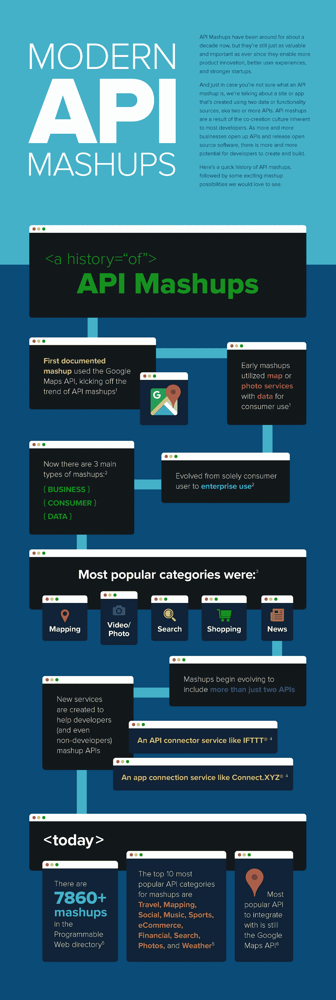
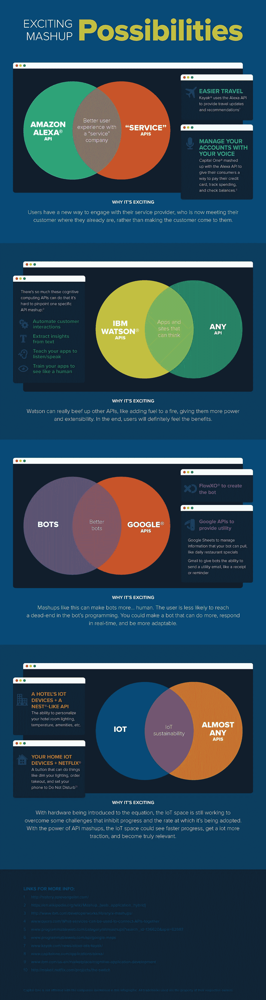

# 信息图——现代 API 混搭的历史

> 原文：<https://medium.com/capital-one-tech/infographic-a-history-of-modern-api-mashups-9476dad7685b?source=collection_archive---------4----------------------->

API Mashups 已经存在了大约十年，但是它们仍然和以前一样有价值和重要，因为它们支持更多的产品创新、更好的用户体验和更强大的创业公司。

以防你不确定什么是 API 混搭，我们讨论的是使用两个数据或功能源创建的站点或应用程序，也就是两个或更多 API。API 混搭是大多数开发人员固有的共同创造文化的结果。

随着越来越多的企业开放 API 和发布开源软件，开发者创造和构建的潜力越来越大。这里有一个 API 混搭的快速历史，然后是一些我们希望看到的激动人心的混搭可能性。

## 附加链接

*   [API 设计者的角色](https://developer.capitalone.com/blog-post/the-role-of-an-api-designer/)
*   [API 生活方式治理最佳实践](/capital-one-developers/api-lifecycle-governance-best-practices-56a1ebbb4f1b#.qjp4me1v8)

*声明:这些观点仅代表作者个人观点。除非本帖中另有说明，否则 Capital One 不属于所提及的任何公司，也不被其认可。使用或展示的所有商标和其他知识产权都是其各自所有者的所有权。本文为 2018 首都一。*