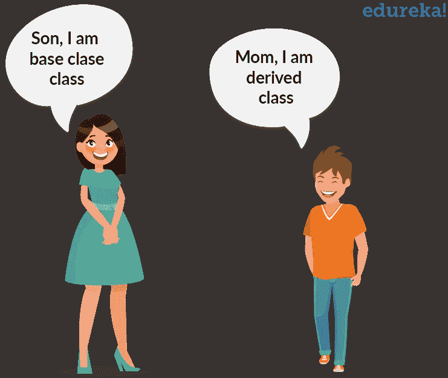
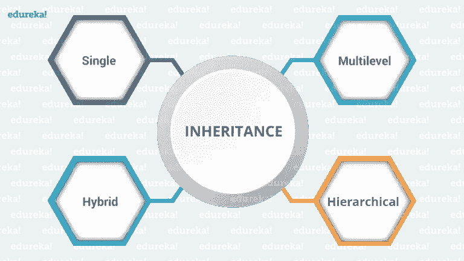
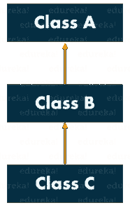
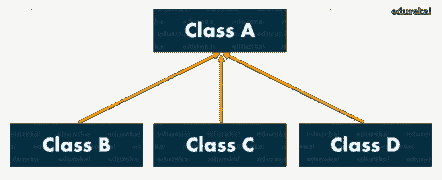
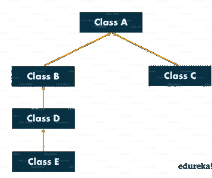
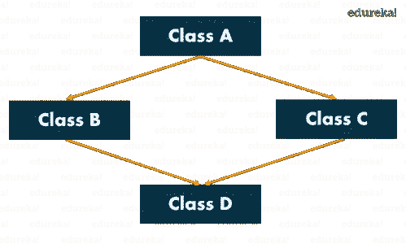

# 掌握 Java 中的继承并举例说明

> 原文：<https://medium.com/edureka/inheritance-in-java-f638d3ed559e?source=collection_archive---------1----------------------->


Inheritance in Java - Edureka

面向对象编程(或者更好地称为 OOPs)是 Java 的主要支柱之一，它充分利用了其强大的功能和易用性。要成为一名专业的 Java 开发人员，您必须对各种 Java OOPs 概念(如继承、抽象、封装和多态)有一个完美的控制。通过这篇文章，我将让你全面了解 OOPs 的一个最重要的概念，即 Java 中的继承，以及它是如何实现的。

以下是我将在本文中讨论的主题:

*   Java 中的继承介绍
*   Java 中的继承类型

1.  单一遗传
2.  多层次继承
3.  分层继承
4.  混合遗传

*   Java 中的继承规则

# Java 中的继承介绍

在面向对象程序设计中，计算机程序是以这样一种方式设计的，即一切都是一个相互作用的对象。继承是 Java OOPs 不可分割的一部分，它允许一个类的属性被另一个类继承。它基本上有助于重用代码，并在不同的类之间建立关系。



我们知道，孩子继承父母的财产。在 Java 中遵循类似的概念，我们有两个类:

1.父类(超类或基类)

2.子类(子类或派生类)

继承属性的类称为子类，而属性被继承的类称为父类。

**语法:**

现在，为了继承一个类，我们需要使用*扩展*关键字。在下面的例子中，类 Son 是子类，类 Mom 是父类。Son 类继承了 Mom 类的属性和方法。

```
class Son extends Mom
{
//your code
}
```

我们来看一个小程序，了解一下它的工作原理。在这个例子中，我们有一个基类教师和一个子类 Hadoop 教师。由于 HadoopTeacher 类扩展了基类的属性，我们不需要在子类中声明这些属性和方法。

```
class Teacher{
String designation = "Teacher";
String collegeName = "Edureka";
void does(){
System.out.println("Teaching");
}
}
public class HadoopTeacher extends Teacher{
String mainSubject = "Spark";
public static void main(String args[]){
HadoopTeacher obj = new HadoopTeacher();
System.out.println(obj.collegeName);
System.out.println(obj.designation);
System.out.println(obj.mainSubject);
obj.does();
}
}
```

**输出:**

爱德华卡

教师

火花

教学

现在让我们进一步看看 Java 支持的各种类型的继承。

# Java 中的继承类型

下图描绘了继承的类型:



## 单一遗传

在单一继承中，一个类继承另一个类的属性。它使派生类能够从单个父类继承属性和行为。反过来，这将支持代码的可重用性，并为现有的代码添加新的特性。


这里，A 类是你的父类，B 类是你的子类，继承了父类的属性和行为。类似的概念在下面的代码中表示:

```
class Animal{
void eat(){System.out.println(“eating”);}
}
class Dog extends Animal{
void bark(){System.out.println(“barking”);}
}
class TestInheritance{
public static void main(String args[]){
Dog d=new Dog();
d.bark();
d.eat();
}
}
```

## 多层次继承

当一个类从另一个类派生的类派生时，即一个类具有一个以上的父类但在不同的级别，这种类型的继承称为多级继承。



如果我们讨论流程图，B 类继承 A 类的属性和行为，C 类继承 B 类的属性。这里 A 是 B 的父类，B 类是 C 的父类。所以在这种情况下，C 类隐式继承 A 类和 B 类的属性和方法。这就是多级继承。

```
class Animal{
void eat(){System.out.println(“eating…”);}
}
class Dog extends Animal{
void bark(){System.out.println(“barking…”);}
}
class Puppy extends Dog{
void weep(){System.out.println(“weeping…”);}
}
class TestInheritance2{
public static void main(String args[]){
Puppy d=new Puppy();
d.weep();
d.bark();
d.eat();
}
}
```

## 分层继承

当一个类有不止一个子类(子类)时，或者换句话说，不止一个子类有相同的父类，那么这种继承称为**层次**。



在上面的流程图中，B 类和 C 类是继承自父类(即 a 类)的子类

```
class Animal{
void eat(){System.out.println(“eating…”);}
}
class Dog extends Animal{
void bark(){System.out.println(“barking…”);}
}
class Cat extends Animal{
void meow(){System.out.println(“meowing…”);}
}
class TestInheritance3{
public static void main(String args[]){
Cat c=new Cat();
c.meow();
c.eat();
}
}
```

## 混合遗传

混合遗传是两种或两种以上类型遗传的结合。



现在我们知道了什么是继承及其各种类型，让我们更进一步，看看继承类时应该考虑的一些重要规则。

# Java 中的继承规则

## 规则 Java 中不允许多重继承。



多重继承指的是一个子类试图扩展多个父类的过程。在上图中，A 类是 B 类和 C 类的父类，它们由 d 类进一步扩展。这导致了菱形问题。为什么？假设在类 B 和 C 中都有一个方法 show()，但是功能不同。当 D 类扩展 B 类和 C 类时，它会自动继承 B 类和 C 类的特性，包括 show()方法。现在，当您试图调用类 B 的 show()时，编译器会弄不清要调用哪个 show()(要么从类 B 调用，要么从类 C 调用)。因此，它会导致歧义。

***例如:***

```
class Demo1
{
//code here
}
class Demo2
{
//code here
}
class Demo3 extends Demo1, Demo2
{
//code here
}
class Launch
{
public static void main(String args[])
{
//code here
}
}
```

在上面的代码中，Demo3 是一个试图继承两个父类 Demo1 和 Demo2 的子类。这是不允许的，因为它会导致菱形问题和歧义。

> *注意:Java 不支持多重继承，但是您仍然可以使用接口来实现它。*

## 规则 Java 中不允许循环继承。

它是一种继承类型，在这种类型中，类扩展自己并形成自己的循环。现在想一想，如果一个类以任何方式扩展自己，如果它在用户定义的类中形成循环，那么还有机会扩展 Object 类。这就是 Java 中不允许它的原因。

***例如:***

```
class Demo1 extends Demo2
{
//code here
}
class Demo2 extends Demo1
{
//code here
}
```

在上面的代码中，两个类都试图继承对方的字符，这是不允许的，因为这会导致歧义。

## 规则 3:私有成员不能被继承。

***例如:***

```
class You
{
private int an;
private int pw;
You{
an =111;
pw= 222;
}
}
class Friend extends You
{
void change Data()
{
an =8888;
pw=9999;
}
}
void disp()
{
System.out.println(an);
System.out.println(pw);
}
}
class Launch
{
public static void main(String args[])
{
Friend f = new Friend();
f.change.Data();
f.disp();
}
}
```

当你执行上面的代码时，猜猜会发生什么，你认为私有变量 *an* 和 *pw* 会被继承吗？绝对不行。它保持不变，因为它们特定于特定的类。

## 规则 Java 中不能继承构造函数。

构造函数不能被继承，因为子类总是有不同的名字。

```
class A {
   A();}

class B extends A{
   B();}
```

你只能做:

```
B b = new B(); // and not new A()
```

相反，方法是以“相同的名称”继承的，并且可以使用。尽管如此，您仍然可以在 B 的实现中使用构造函数:

```
**class** B **extends** A{
B() { **super**(); }
}
```

## 规则 5:在 Java 中，我们给子对象分配父引用。

父对象是对恰好是父对象的子类型的对象的引用，即子对象。*为什么用这个？*嗯，简而言之，它防止你的代码与单个类紧密耦合。因为引用是父类的，所以它可以保存它的任何子类对象，即，它可以引用它的任何子类。

它具有以下优点

1.  动态方法调度允许 Java 支持方法的覆盖，这是运行时多态性的核心。
2.  它允许一个类指定对它的所有派生方法通用的方法，同时允许子类定义一些或所有这些方法的具体实现。
3.  它还允许子类添加其特定的方法子类来定义一些特定的实现。

假设您将 getEmployeeDetails 添加到父类，如以下代码所示:

```
public String getEmployeeDetails() {
    return "Name: " + name;
}
```

我们可以在 Child 中覆盖该方法以提供更多的细节。

```
@Override
public String getEmployeeDetails() {
    return "Name: " + name + " Salary: " + salary;
}
```

现在，您可以编写一行代码来获取任何可用的详细信息，无论该对象是父对象还是子对象，如下所示:

```
parent.getEmployeeDetails();
```

然后检查以下代码:

```
Parent parent = new Parent();
parent.name = 1;
Child child = new Child();
child.name = 2;
child.salary = 2000;
Parent[] employees = new Parent[] { parent, child };
for (Parent employee : employees) {
    employee.getEmployeeDetails();
}
```

这将导致以下输出:

```
Name: 1 
Name: 2 Salary: 2000
```

这里我们使用了一个子类作为父类引用。它有一个子类所特有的特殊行为，但是如果我们调用 getEmployeeDetails()，我们可以忽略功能差异，而专注于父类和子类是如何相似的。

## 规则 6:由于构造函数中存在 super()，所以构造函数会被执行。

正如您已经知道的，构造函数不会被继承，但是会因为 super()关键字而被执行。“super()”用于引用扩展类。默认情况下，它将引用对象类。Object 中的构造函数不执行任何操作。如果一个构造函数没有显式调用超类构造函数，那么 Java 编译器默认会插入一个对超类的无参数构造函数的调用。

这就把我们带到了“Java 中的继承”这篇文章的结尾。希望，你发现它信息丰富，有助于增加你的知识价值。

如果你想查看更多关于人工智能、DevOps、道德黑客等市场最热门技术的文章，你可以参考 Edureka 的官方网站。

请留意本系列中的其他文章，它们将解释 Java 的各个方面。

> 1.[面向对象编程](/edureka/object-oriented-programming-b29cfd50eca0)
> 
> 2. [Java 教程](/edureka/java-tutorial-bbdd28a2acd7)
> 
> 3.[Java 中的多态性](/edureka/polymorphism-in-java-9559e3641b9b)
> 
> 4.[Java 中的抽象](/edureka/java-abstraction-d2d790c09037)
> 
> 5. [Java 字符串](/edureka/java-string-68e5d0ca331f)
> 
> 6. [Java 数组](/edureka/java-array-tutorial-50299ef85e5)
> 
> 7. [Java 集合](/edureka/java-collections-6d50b013aef8)
> 
> 8. [Java 线程](/edureka/java-thread-bfb08e4eb691)
> 
> 9.[Java servlet 简介](/edureka/java-servlets-62f583d69c7e)
> 
> 10. [Servlet 和 JSP 教程](/edureka/servlet-and-jsp-tutorial-ef2e2ab9ee2a)
> 
> 11.[Java 中的异常处理](/edureka/java-exception-handling-7bd07435508c)
> 
> 12.[高级 Java 教程](/edureka/advanced-java-tutorial-f6ebac5175ec)
> 
> 13. [Java 面试问题](/edureka/java-interview-questions-1d59b9c53973)
> 
> 14. [Java 程序](/edureka/java-programs-1e3220df2e76)
> 
> 15.[科特林 vs Java](/edureka/kotlin-vs-java-4f8653f38c04)
> 
> 16.[依赖注入使用 Spring Boot](/edureka/what-is-dependency-injection-5006b53af782)
> 
> 17.[Java 中的可比](/edureka/comparable-in-java-e9cfa7be7ff7)
> 
> 18.[十大 Java 框架](/edureka/java-frameworks-5d52f3211f39)
> 
> 19. [Java 反射 API](/edureka/java-reflection-api-d38f3f5513fc)
> 
> 20.[Java 中的 30 大模式](/edureka/pattern-programs-in-java-f33186c711c8)
> 
> 21.[核心 Java 备忘单](/edureka/java-cheat-sheet-3ad4d174012c)
> 
> 22.[Java 中的套接字编程](/edureka/socket-programming-in-java-f09b82facd0)
> 
> 23. [Java OOP 备忘单](/edureka/java-oop-cheat-sheet-9c6ebb5e1175)
> 
> 24.[Java 中的注释](/edureka/annotations-in-java-9847d531d2bb)
> 
> 25.[Java 中的图书管理系统项目](/edureka/library-management-system-project-in-java-b003acba7f17)
> 
> 26.[Java 中的树](/edureka/java-binary-tree-caede8dfada5)
> 
> 27.[Java 中的机器学习](/edureka/machine-learning-in-java-db872998f368)
> 
> 28.[Java 中的顶级数据结构&算法](/edureka/data-structures-algorithms-in-java-d27e915db1c5)
> 
> 29. [Java 开发者技能](/edureka/java-developer-skills-83983e3d3b92)
> 
> 30.[前 55 个 Servlet 面试问题](/edureka/servlet-interview-questions-266b8fbb4b2d)
> 
> 31. [](/edureka/java-exception-handling-7bd07435508c) [顶级 Java 项目](/edureka/java-projects-db51097281e3)
> 
> 32. [Java 字符串备忘单](/edureka/java-string-cheat-sheet-9a91a6b46540)
> 
> 33.[Java 中的嵌套类](/edureka/nested-classes-java-f1987805e7e3)
> 
> 34. [Java 集合面试问答](/edureka/java-collections-interview-questions-162c5d7ef078)
> 
> 35.[Java 中如何处理死锁？](/edureka/deadlock-in-java-5d1e4f0338d5)
> 
> 36.[你需要知道的 50 大 Java 集合面试问题](/edureka/java-collections-interview-questions-6d20f552773e)
> 
> 37.[Java 中的字符串池是什么概念？](/edureka/java-string-pool-5b5b3b327bdf)
> 
> 38.[C、C++和 Java 有什么区别？](/edureka/difference-between-c-cpp-and-java-625c4e91fb95)
> 
> 39.[Java 中的回文——如何检查一个数字或字符串？](/edureka/palindrome-in-java-5d116eb8755a)
> 
> 40.[你需要知道的顶级 MVC 面试问答](/edureka/mvc-interview-questions-cd568f6d7c2e)
> 
> 41.[Java 编程语言的十大应用](/edureka/applications-of-java-11e64f9588b0)
> 
> 42.[Java 中的死锁](/edureka/deadlock-in-java-5d1e4f0338d5)
> 
> 43.[Java 中的平方和平方根](/edureka/java-sqrt-method-59354a700571)
> 
> 44.[Java 中的类型转换](/edureka/type-casting-in-java-ac4cd7e0bbe1)
> 
> 45.[Java 中的运算符及其类型](/edureka/operators-in-java-fd05a7445c0a)
> 
> 46.[Java 中的析构函数](/edureka/destructor-in-java-21cc46ed48fc)
> 
> 47.[Java 中的二分搜索法](/edureka/binary-search-in-java-cf40e927a8d3)
> 
> 48.[Java 中的 MVC 架构](/edureka/mvc-architecture-in-java-a85952ae2684)
> 
> 49. [Hibernate 面试问答](/edureka/hibernate-interview-questions-78b45ec5cce8)

*原载于 2018 年 12 月 20 日 www.edureka.co*[](https://www.edureka.co/blog/inheritance-in-java/)**。**